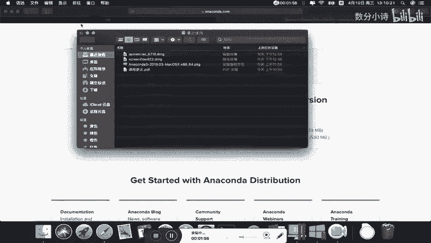
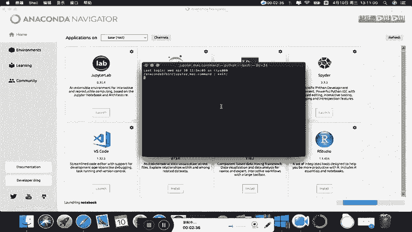
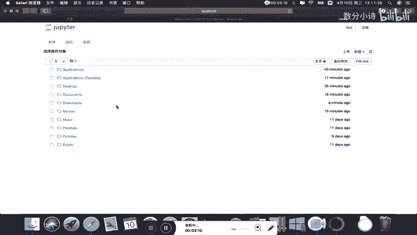
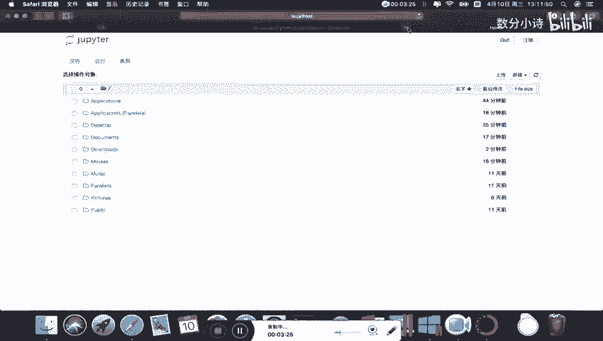

# Python金融量化：P2：02：Mac系统下安装Anaconda步骤 🍎


在本节课中，我们将学习如何在Mac操作系统上安装Anaconda，并配置Jupyter Notebook的工作环境。

---

## 安装Anaconda


上一节我们介绍了课程的整体框架，本节中我们来看看如何在Mac系统上安装Anaconda。

首先，打开浏览器。

在百度或Google中搜索“Anaconda”。

打开Anaconda官方网站。

官方网站上有一个“Download”按钮，点击它。


页面下滑，找到macOS版本，直接点击“Download”即可开始下载。

我已经提前下载好了安装包。大家下载下来的安装包与我这里的是一样的。

打开下载好的安装包。

建议在安装过程中不要调整任何默认的安装设置。

打开安装包需要一些时间，请耐心等待。

整个安装过程大约需要10到20分钟，具体时间取决于Mac电脑的配置。

在安装过程中，尽量不要中断或重启电脑，以免增加不必要的麻烦。

点击“继续”安装。

需要点击“同意”许可协议。

不建议更改安装位置，直接点击“安装”。


此时需要输入电脑密码。

之后会进入一段等待期，大约5到10分钟。

安装完成后，点击“继续”。



这样Anaconda就安装成功了。

点击“关闭”。

安装包可以保留，也可以移到废纸篓。


---

## 启动Jupyter Notebook

我们已经成功安装了Anaconda，接下来看看如何在Mac系统下使用Jupyter Notebook。

打开“启动台”。



会发现Anaconda已经安装好，其中包含“Navigator”。

打开Anaconda Navigator。

Anaconda Navigator窗口内包含许多工具。

直接点击“Launch”即可启动Jupyter。

这是在Anaconda窗口下自带的启动方式。

启动Jupyter后，会进入一个网页页面。

这里需要介绍的是，在Mac系统下启动Jupyter，其默认工作路径是系统盘。



页面上显示的是系统盘下的常用文件夹，例如“Desktop”（桌面）、“Documents”（文档）、“Downloads”（下载）。


这些只不过是将中文文件夹名转换成了英文，与“访达”中的文档、应用程序、桌面等是对应的。

---

## 通过终端修改工作路径并启动Jupyter

除了通过Navigator，还有另一种更灵活的方式启动Jupyter Notebook。



因为安装Anaconda时已自动安装了Jupyter Notebook。

打开“终端”应用程序。

在终端里，直接输入 `jupyter notebook` 命令即可启动。

但这里，我将教大家如何修改工作路径。

首先，使用 `ls` 命令查看当前路径下的文件。

```
ls
```

我们发现有一个“Documents”文件夹。

之后，我们可以新建一个名为“jupyter_working_path”的文件夹作为工作路径。

当前我们在系统盘根目录下。

现在，使用 `cd` 命令移动到“Documents”目录。

```
cd Documents
```

此时，再看一下Documents里面的内容，使用 `ls` 命令。

```
ls
```

假设Documents里有三个文件夹。

现在，我们想移动到新建的“jupyter_working_path”文件夹里。如果该文件夹不存在，可以使用 `mkdir` 命令创建它。

```
mkdir jupyter_working_path
cd jupyter_working_path
```

移动到该位置后，再次使用 `ls` 查看，文件夹是空的。

```
ls
```

现在，我们在这个位置启动Jupyter Notebook。

```
jupyter notebook
```

此时启动的Jupyter Notebook，其默认工作路径就是我们当前的“jupyter_working_path”文件夹。

之后，大家可以在这里新建文件夹，或者将课程提供的“data”数据文件夹复制粘贴到这个位置。


假设大家把“data”文件夹复制过来了。

那么这里就会有我们的数据文件夹，在后续引用文件时，就可以使用相对路径。关于相对路径和绝对路径，我们会在上课时详细介绍。Windows和Mac系统在这方面的操作是相同的。

在后续学习中，大家需要知道如何调整工作路径并启动Jupyter Notebook。

输入命令后，Jupyter Notebook就会启动。

这样就打开了Jupyter Notebook。

可以看到我刚刚提到的“data”文件夹。如果大家复制了课程数据，那么点开“data”就是上课要用到的数据。

---

## 安装Jupyter Notebook扩展插件

以上是Anaconda的安装过程。关于在Mac系统环境下安装Jupyter Notebook扩展插件，其步骤与Windows系统下基本一致。

大家可以参考相关代码，操作步骤与Windows下展示的是一致的。

因此，在安装NB extensions时，只需按照代码一步一步操作，即可完成安装。

在Mac中，打开终端的方法是：先打开“启动台”，找到“其他”文件夹，里面就有“终端”应用程序，点击即可打开。

要关闭Jupyter Notebook服务，可以在运行它的终端窗口中按 `Control + C`。

关闭服务后，就可以在终端中运行安装插件的相关代码了。

安装完成后，其他选项与Windows中是一样的。在此不再赘述。


---

本节课中我们一起学习了在Mac系统上安装Anaconda的完整步骤，包括通过图形界面和终端两种方式启动并配置Jupyter Notebook的工作路径，为后续的金融量化分析准备好了编程环境。