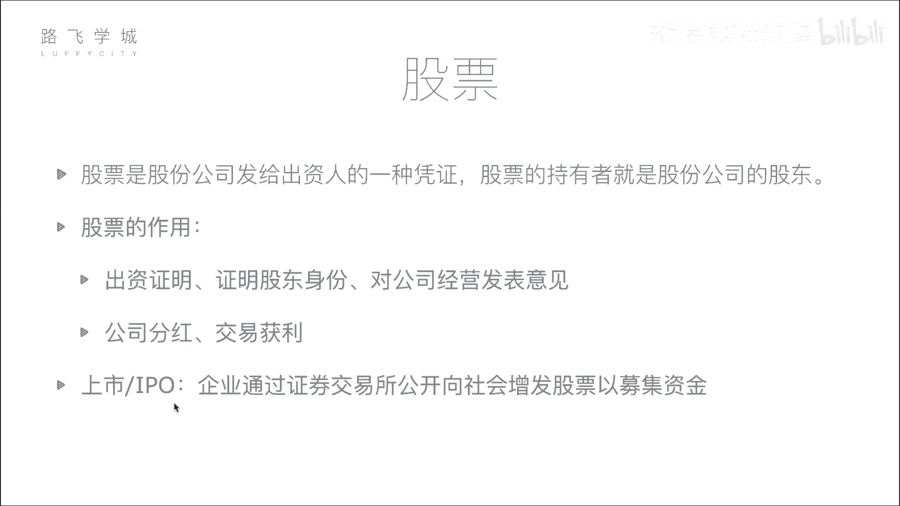
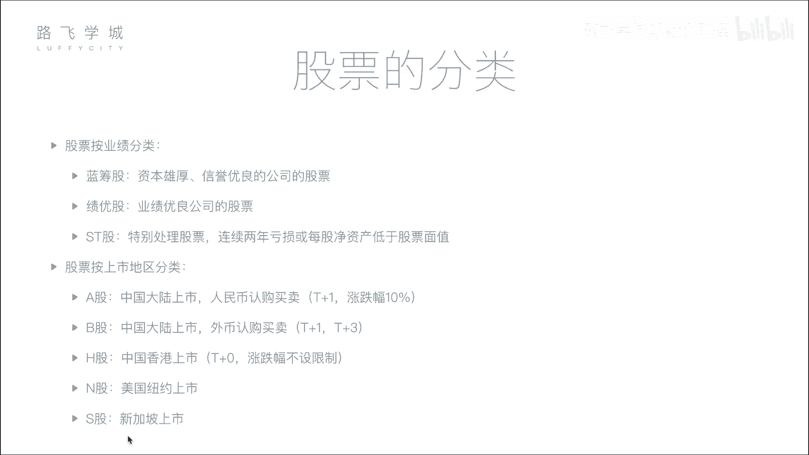

# 金融量化分析：P2：02：股票基本知识与分类 📈

在本节课中，我们将要学习股票的基础概念、核心作用以及常见的分类方式。理解这些知识是进行金融量化分析的第一步。

## 股票的定义

股票是股份公司发给出资人的一种凭证。股票的持有者就是股份公司的股东。

为了更形象地解释，我们可以设想一个场景：一位创业者需要资金来运营公司，但他自己资金不足。这时，投资者可以为他提供资金。作为交换，创业者不是给投资者打欠条（那将构成借贷关系），而是给予投资者公司的股票。股票代表了投资者对公司出资的证明，也代表了其股东身份。

例如，假设一家初创公司由创业者本人和四位投资者共同出资建立，每人出资1亿元，公司总市值即为5亿元。那么，每位出资人将获得公司20%的股票。这体现了按出资比例分配股权的原则。当然，现实中也可能存在技术入股等特殊情况。

## 股票的作用

股票的核心作用主要体现在两个方面。

### 股东身份与权利

持有股票意味着你是公司的股东。这不仅是出资的证明，也赋予了你参与公司重大决策的权利，例如在股东大会上投票。

### 获利途径

对于投资者而言，持有股票主要有两种获利方式：

1.  **公司分红**：当公司盈利时，可能会将部分利润以现金形式分配给股东。例如，若公司年净利润为5000万元，持有20%股份的股东可获得1000万元的分红。
2.  **交易获利（资本利得）**：投资者可以在二级市场（如证券交易所）买卖股票。如果公司价值增长，股价上涨，投资者卖出股票即可赚取差价。例如，初始投资1亿元获得20%股份，当公司市值从5亿增长到50亿时，这部分股份价值变为10亿元。此时卖出部分股份即可实现“套现”。

对于资金量较小的普通股民，其获利逻辑与上述完全一致，只是参与公司经营决策的权利通常非常有限。他们主要通过低买高卖获取价差收益，或享受公司分红。

## 公司上市与IPO

上一节我们介绍了股票的基本作用，本节中我们来看看公司如何向公众发行股票，即“上市”。

所谓上市，就是企业通过证券交易所，首次公开向全社会投资者增发股票，以募集资金的过程。公司不能随意向公众募集资金，那属于非法集资。上市需要满足严格的条件，并向证监会提交申请，经审核批准后方可进行。

上市对公司的主要吸引力在于能够面向更广阔的公众市场募集巨额资金。如果说向少数富人融资是“找几个金主”，那么上市就像是“在一个人山人海的大集市上向所有人吆喝”，潜在的融资规模巨大。

**IPO** 即首次公开募股，特指公司第一次上市并发行股票的行为。

## 股票的分类

了解股票的不同分类方式，有助于我们后续进行更有针对性的分析。

### 按业绩分类

根据公司的经营业绩，股票通常分为以下三类：

*   **蓝筹股**：指资本雄厚、信誉优良的大型公司股票。例如中国的“中石油”、“中石化”。名称来源于赌场中价值最高的蓝色筹码。
*   **绩优股**：指业绩优良公司的股票。它们可能规模不及蓝筹股，但盈利增长稳定且表现突出。例如“贵州茅台”。
*   **ST股**：中文为“特别处理股票”。如果公司连续两年亏损，或每股净资产低于股票面值，其股票名称前会被加上“ST”标记，以警示投资者该公司存在较高风险。

### 按上市地区分类

根据公司上市交易的地理位置和交易货币，股票可分为：

*   **A股**：在中国大陆（上海、深圳证券交易所）上市，以人民币认购和交易的股票。
*   **B股**：同样在中国大陆上市，但以外币（如美元、港币）认购和交易的股票。
*   **H股**：在中国香港上市的公司股票。
*   **N股**：在美国纽约上市的公司股票。
*   **S股**：在新加坡上市的公司股票。

### 主要股市交易规则简介

不同市场的交易规则差异显著，这对于量化策略设计至关重要。

以下是几个主要市场的关键规则对比：

| 市场 | 涨跌幅限制 | 交易制度 (T+N) | 备注 |
| :--- | :--- | :--- | :--- |
| **A股** | 有 (通常为±10%) | T+1 | 今日买入，下一交易日方可卖出。旨在抑制过度投机。 |
| **B股** | 有 (通常为±10%) | T+1 (交易) & T+3 (资金交收) | 卖出股票后，资金需3个交易日方可提现。 |
| **H股 (港股)** | 无 | T+0 | 当日可多次买卖同一只股票。 |
| **N股 (美股)** | 无 (但有熔断机制) | T+0 | 交易灵活，波动可能更为剧烈。 |

**规则解释**：
*   **涨跌幅限制**：中国A股设立此规则主要是为了在股市早期保护投资者，防止股价在单日内剧烈波动导致重大损失，维护市场稳定。
*   **T+N制度**：`T`代表交易发生日。`T+0`意味着当天买卖，资金和股票实时交割；`T+1`意味着当天买入的股票，需等到下一个交易日才能卖出。

## 总结

本节课中我们一起学习了股票的核心概念。我们明确了股票是股东身份的凭证，其获利途径包括分红和交易价差。我们了解了公司通过IPO上市向公众融资的过程。最后，我们掌握了股票按业绩和上市地区的分类方法，并对比了A股、B股、港股、美股等主要市场在涨跌幅限制和T+N交易制度上的关键差异，这些规则是后续构建量化交易模型时必须考虑的基础。