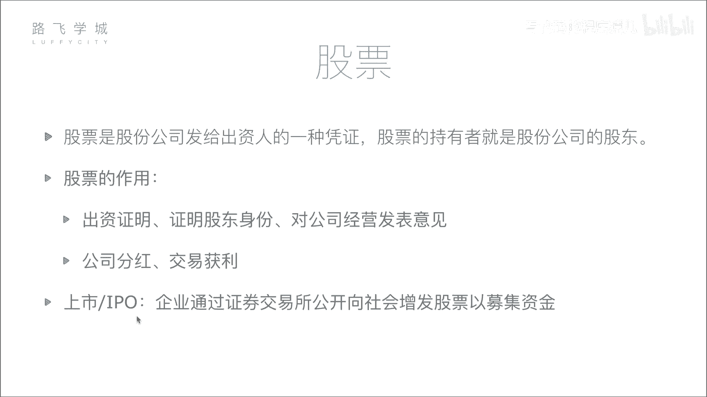
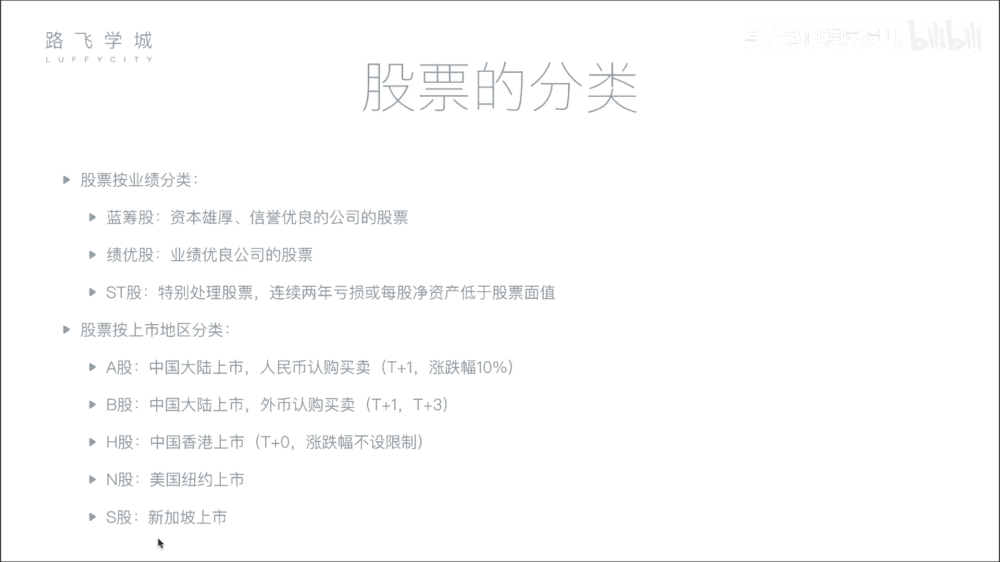

# Python金融量化：P2：02股票基本知识与分类 📈

## 概述
在本节课中，我们将要学习股票的基本概念、作用以及常见的分类方式。理解这些基础知识是进行后续股票数据分析与量化交易的前提。

## 股票的定义与作用

股票是股份公司发给出资人的一种凭证。股票的持有者就是股份公司的股东。

形象地解释，假设有人创办一家公司需要资金，而投资者看好这家公司。投资者将资金投入公司，公司则向投资者发行股票作为凭证。例如，一家公司初始市值为5亿，由五位出资人各出资1亿成立，那么每位出资人将获得公司20%的股票。

股票的作用主要有两点：
1.  **股东身份与权利证明**：持有股票意味着你是公司的股东，拥有相应的权利，例如参与股东大会并行使投票权。
2.  **获取收益**：作为股东，可以通过两种主要方式获利：
    *   **公司分红**：当公司盈利时，股东有权根据持股比例获得利润分红。
    *   **交易获利**：股东可以在证券交易所将股票转让给他人。通过低买高卖，赚取差价。

对于广大普通股民而言，主要通过第二种方式——在二级市场买卖股票来获取收益。

## 公司上市与IPO

公司不能随意向公众募集资金。所谓“上市”，是指企业通过证券交易所，首次公开向公众发行股票以募集资金。

公司需要达到一定条件（如持续盈利、信息披露规范等），并经过证监会审核批准后，才能在证券交易所挂牌交易。上市后，公司的股票就可以被所有符合条件的投资者公开买卖。

**IPO** 即首次公开募股，指的就是公司第一次向社会公众公开发行股票的行为。

## 股票的分类

了解股票的分类有助于我们更好地筛选和分析投资标的。以下是两种常见的分类方式。

### 按公司业绩分类
根据公司的经营业绩和财务状况，股票可以分为以下几类：

*   **蓝筹股**：指资本雄厚、信誉优良的公司的股票。通常是在行业内占据重要支配地位、业绩稳定的大型企业，例如许多大型国有企业。名称源于赌场中价值最高的蓝色筹码。
*   **绩优股**：指业绩优良公司的股票。这类公司可能规模不是最大，但具有稳定的盈利能力和成长性，例如一些消费、医药行业的龙头公司。
*   **ST股**：中文为“特别处理股票”。如果公司连续两年亏损，或每股净资产低于股票面值，其股票名称前会被加上“ST”标记，以警示投资者该公司存在较高风险。

### 按上市地区分类
根据公司股票上市交易的地理位置和交易货币，主要分为：

*   **A股**：在中国大陆的上海或深圳证券交易所上市，以人民币认购和交易的股票。这是中国内地投资者主要参与的股票市场。
*   **B股**：同样在中国大陆的上海（美元）或深圳（港币）证券交易所上市，但以外币认购和交易的股票。
*   **H股**：指在中国香港交易所上市的中国内地公司股票。
*   **N股**：指在美国纽约交易所上市的外国公司股票。
*   **S股**：指在新加坡交易所上市的外国公司股票。

## 不同市场的交易规则

不同股票市场有不同的交易规则，这对于量化策略的设计至关重要。以下是几个关键规则：

*   **A股涨跌幅限制**：为保护投资者，防止股价剧烈波动，A股设有每日涨跌幅限制（通常为10%，科创板、创业板等另有规定）。公式表示为：
    `今日最高价 <= 昨日收盘价 * (1 + 10%)`
    `今日最低价 >= 昨日收盘价 * (1 - 10%)`
*   **A股T+1交割制度**：投资者当日买入的股票，在下一个交易日（T+1）才可卖出。这是为了减少市场的过度投机行为。
*   **港股/美股T+0交易**：在这些市场，投资者当日买入的股票可以当日卖出，允许日内多次交易。
*   **B股的交收日**：B股市场实行T+1交割（股票）和T+3交收（资金），即卖出股票后，资金需要3个交易日才能到账并提现。

## 总结
本节课我们一起学习了股票的核心知识。我们明确了股票是股东权的证明，其收益来源于分红和交易价差。我们了解了公司需要通过严格的审核才能上市公开募股（IPO）。同时，我们掌握了股票按业绩（蓝筹股、绩优股、ST股）和按上市地（A股、B股、H股等）的分类方法，并对比了不同市场（如A股的涨跌停和T+1制度）的关键交易规则。这些概念是构建金融量化分析框架的基石。