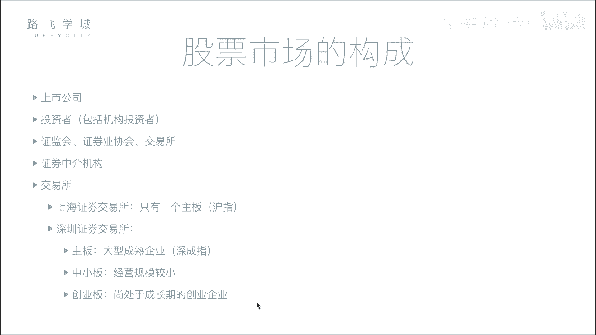
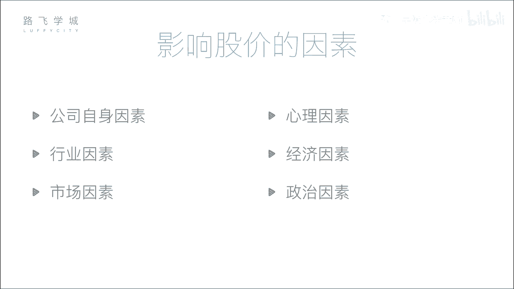

# 金融量化分析：P2：03 股票市场构成 🏛️

在本节课中，我们将要学习股票市场的构成。了解市场中有哪些参与者以及他们各自扮演的角色，是进行金融量化分析的基础。我们将从公司和投资者开始，逐步介绍监管机构、交易所和中介机构，最后解释股票市场的板块与大盘指数。

## 公司和投资者

上一节我们介绍了股票的分类，本节中我们来看看股票市场的构成。首先，市场中有两个核心角色：公司和投资者。

*   **公司**：需要融资的一方。
*   **投资者**：提供资金的一方。

公司通过上市向投资者融资，投资者则通过购买股票进行投资。但是，公司和投资者不能直接进行交易，以避免潜在的暗箱操作。

## 监管与服务机构

为了保证市场的公平和秩序，需要一系列监管和服务机构。以下是主要的机构及其作用：

*   **证监会**：证券行业的监管机构。公司上市需要向证监会提交材料，由证监会审核公司是否存在违法行为（如欺诈、洗钱等）。证监会有权决定公司能否上市或将其退市。
*   **证券业协会**：作用相对较弱，是一个行业自律组织。例如，证券从业资格考试通常由其主办。
*   **交易所**：提供股票集中交易的场所。在中国，主要指上海证券交易所和深圳证券交易所。早期投资者需要亲自去交易所交易，现在则通过网络连接到交易所的系统进行。
*   **证券中介机构（券商）**：个人投资者不能直接去交易所买卖股票，必须通过券商。券商在交易所有交易席位，投资者通过券商开发的软件（如各券商APP或同花顺）下达交易指令，券商再通过其席位将指令传递给交易所执行。

## 交易所与板块

中国有两个主要的证券交易所，每个交易所下又分为不同的板块，以适应不同规模和发展阶段的企业。

*   **上海证券交易所**：主要设有**主板**。
*   **深圳证券交易所**：设有三个板块：
    *   **主板**
    *   **中小板**：为规模较小的公司提供融资渠道。
    *   **创业板**：为成长性高、处于创业阶段的公司提供融资渠道。上市条件相对主板更宽松，例如要求公司连续几年达到一定净利润即可。

## 大盘指数

对于每一个板块，我们常用一个“大盘指数”来概括其整体表现。指数反映了该板块内所有股票的综合走势，是判断市场整体向好或向坏的重要指标。

例如，将板块内众多股票的价格变动打包计算，形成一个趋势图，这个趋势就代表了整个“大盘”的行情。

以下是各主要板块对应的指数名称：

*   **上海主板**：**沪指**（上证指数）
*   **深圳主板**：**深成指**
*   **深圳中小板**：**中小板指**
*   **深圳创业板**：**创业板指**

---

本节课中我们一起学习了股票市场的构成。我们认识了市场中的核心参与者——公司与投资者，了解了维护市场秩序的监管机构（证监会、证券业协会），知道了股票交易的实际场所——交易所及其不同板块（主板、中小板、创业板），并明白了个人投资者需要通过券商进行交易。最后，我们学习了用大盘指数来观察市场整体趋势的方法。理解这些基本构成，是后续进行股票数据分析和量化策略开发的重要前提。