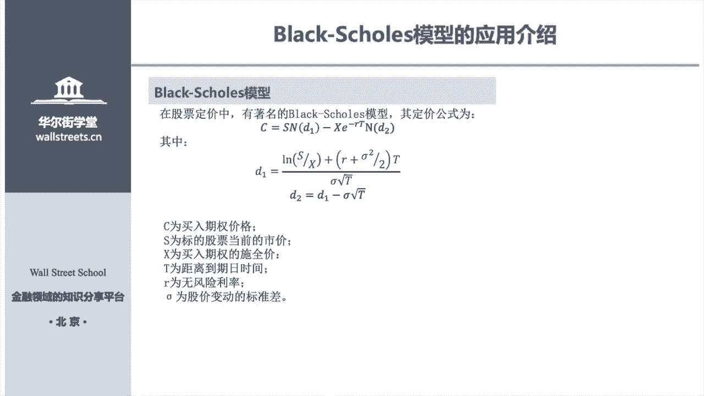
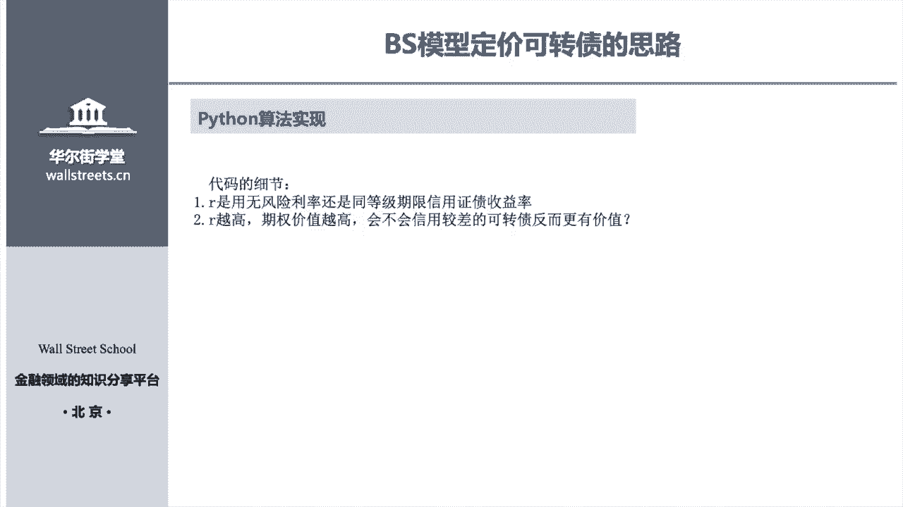
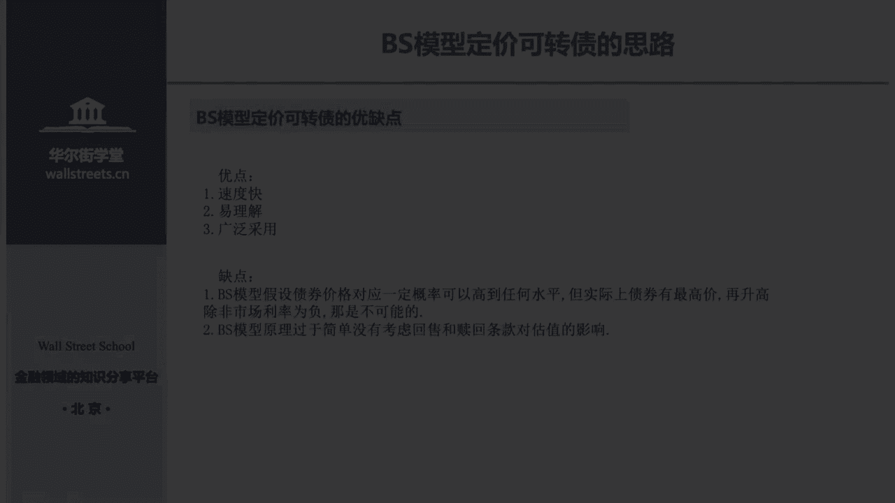
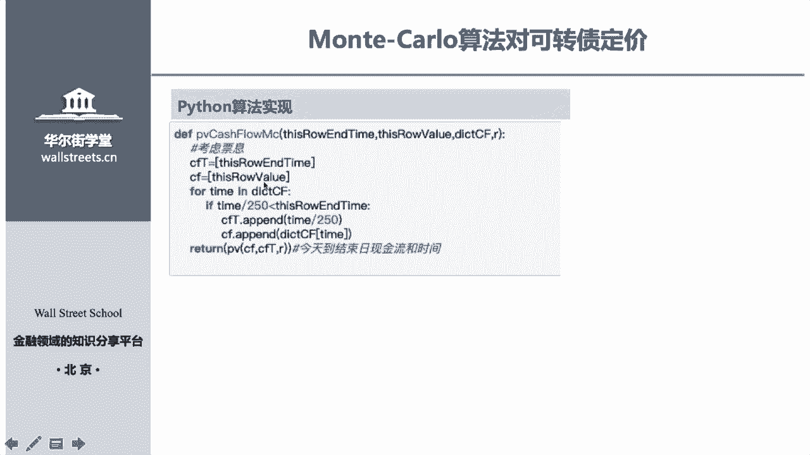
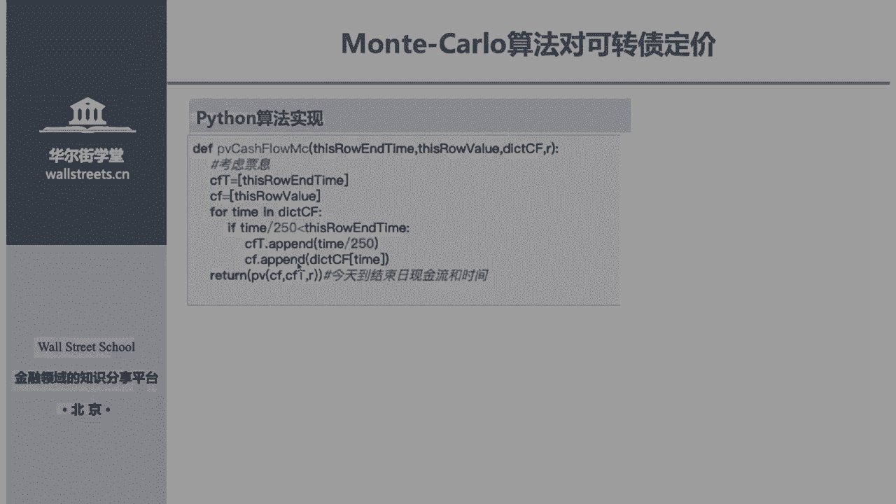
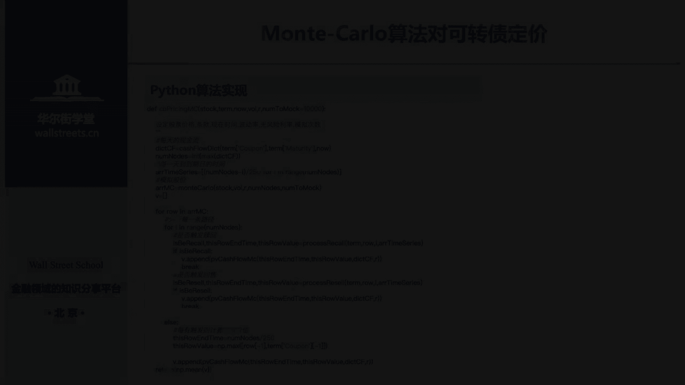
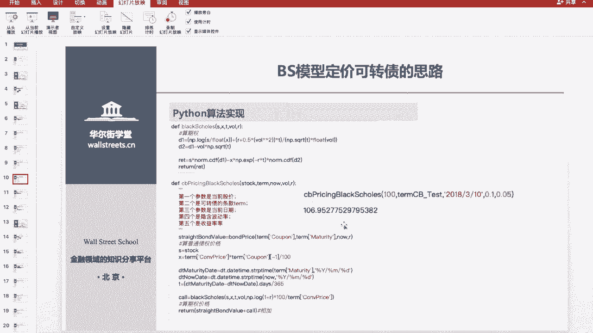
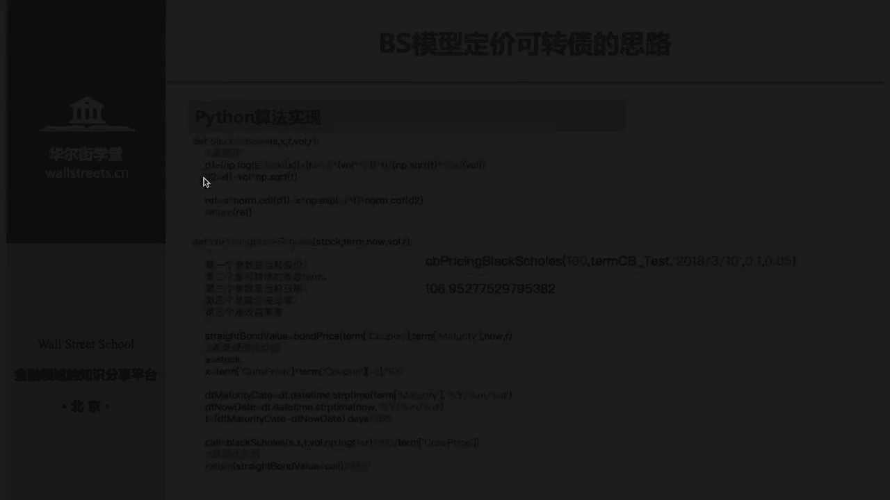
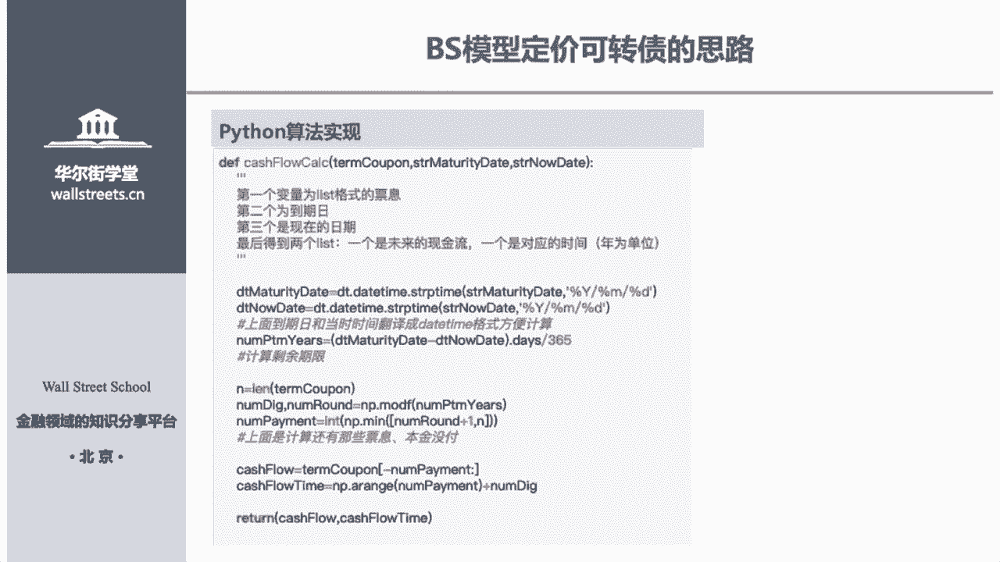

# Python金融量化：P20：03 可转债定价 💹


在本节课中，我们将学习可转债定价的两种核心模型：布莱克-斯科尔斯（B-S）模型和蒙特卡洛模拟模型。我们将理解其背后的金融逻辑，并用Python代码实现定价过程。

## 概述 📋

可转债是一种兼具债券和股票期权特性的金融工具。其定价的核心思路是将其价值拆分为普通债券部分和嵌入的转股期权部分。本节课将首先介绍经典的B-S期权定价模型如何应用于可转债，然后探讨更复杂、能考虑赎回与回售条款的蒙特卡洛模拟方法。

---

## B-S模型定价可转债 💡

上一节我们概述了可转债定价的基本思想。本节中，我们来看看如何运用著名的布莱克-斯科尔斯（B-S）模型进行定价。



### 核心逻辑：债券 + 期权


可转债可以看作一个**普通债券**加上一个**认购期权**（允许债券持有人将债券转换为股票）。因此，可转债的理论价格等于这两部分价值之和：

**可转债价格 = 普通债券现值 + 认购期权价值**

B-S模型正是用来计算那个“认购期权价值”的。

### B-S期权定价公式

B-S模型为欧式看涨期权定价提供了经典公式。对于可转债中的转股期权，其价值 `C` 可表示为：

`C = S * N(d1) - X * e^(-rT) * N(d2)`

其中：
*   `S`: 标的股票当前价格
*   `X`: 期权的行权价（即可转债的转股价）
*   `r`: 无风险利率
*   `T`: 期权到期时间（年）
*   `N()`: 标准正态分布的累积分布函数
*   `d1` 和 `d2` 是中间变量，计算公式为：

`d1 = (ln(S/X) + (r + σ^2/2) * T) / (σ * sqrt(T))`
`d2 = d1 - σ * sqrt(T)`

*   `σ`: 标的股票价格的波动率

### 算法实现步骤

以下是使用B-S模型为可转债定价的核心步骤：

1.  **计算债券部分现值**：将可转债未来产生的利息和本金现金流，以合适的折现率折现到当前时点。
2.  **计算期权部分价值**：利用B-S公式，输入股票现价、转股价、无风险利率、波动率和剩余期限，计算出期权的理论价值。
3.  **加总得到可转债价格**：将第一步的债券现值与第二步的期权价值相加。

### Python代码实现要点

我们将通过几个关键函数来实现上述步骤。

首先，我们需要导入必要的库：
```python
import numpy as np
from scipy.stats import norm
from datetime import datetime
```

**1. 处理现金流函数**
这个函数的目的是从合同约定的现金流中，筛选出未来尚未派发的现金流及其发生时间。
```python
def get_future_cashflows(cashflows, maturity_date, current_date):
    """
    计算未来现金流及对应时间。
    cashflows: 合同约定的现金流列表
    maturity_date: 到期日
    current_date: 当前日期
    """
    # 计算剩余年限
    time_to_maturity = (maturity_date - current_date).days / 365.0

    # 拆分整数部分（已过付息期数）和小数部分（下一付息日时间比例）
    periods_passed, fraction = np.modf(time_to_maturity * 2) # 假设每年付息两次
    periods_passed = int(periods_passed)

    # 确定未来还有多少期现金流
    future_periods = min(len(cashflows), periods_passed)

    # 获取未来现金流列表
    future_cf = cashflows[future_periods:]

    # 计算未来现金流发生的时间点（年）
    future_times = [fraction + i*0.5 for i in range(len(future_cf))] # 假设每半年付息

    return future_cf, future_times
```

**2. 债券现值计算函数**
此函数利用现金流折现法计算普通债券部分的价值。
```python
def bond_pv(cashflows, times, discount_rate):
    """
    计算债券现值。
    cashflows: 未来现金流列表
    times: 现金流对应的时间列表（年）
    discount_rate: 折现率
    """
    pv = 0
    for cf, t in zip(cashflows, times):
        pv += cf * np.exp(-discount_rate * t) # 连续复利折现
    return pv
```

**3. B-S期权定价函数**
此函数直接实现B-S公式，计算看涨期权价值。
```python
def bs_call_option_price(S, X, T, r, sigma):
    """
    计算欧式看涨期权价格的B-S公式。
    """
    d1 = (np.log(S / X) + (r + 0.5 * sigma**2) * T) / (sigma * np.sqrt(T))
    d2 = d1 - sigma * np.sqrt(T)

    call_price = S * norm.cdf(d1) - X * np.exp(-r * T) * norm.cdf(d2)
    return call_price
```

**4. 可转债定价主函数**
最后，我们组合以上函数，计算可转债的总价值。
```python
def convertible_bond_price_bs(S, X, T, r, sigma, bond_cashflows, maturity_date, current_date, bond_yield):
    """
    使用B-S模型计算可转债价格。
    bond_yield: 用于折现债券现金流的收益率
    """
    # 1. 计算债券部分现值
    future_cf, future_times = get_future_cashflows(bond_cashflows, maturity_date, current_date)
    bond_value = bond_pv(future_cf, future_times, bond_yield)

    # 2. 计算期权部分价值
    option_value = bs_call_option_price(S, X, T, r, sigma)

    # 3. 加总
    cb_price = bond_value + option_value
    return cb_price
```
通过调用主函数并输入相应参数（如股票价格、转股价、波动率等），即可得到基于B-S模型的可转债理论价格。





### B-S模型优缺点总结

**优点：**
*   **计算速度快**，公式明确。
*   **易于理解和实现**，逻辑清晰。
*   **应用广泛**，是金融市场期权定价的基准模型之一。

**缺点：**
*   假设利率恒定，且股价服从对数正态分布，可能与市场实际情况不符。
*   **未考虑可转债特有的赎回（Call）和回售（Put）条款**，这些条款会显著影响其价值。

---

## 蒙特卡洛模拟定价可转债 🔄

上一节我们介绍了B-S模型，但它忽略了赎回和回售条款。本节中，我们来看看蒙特卡洛模拟如何通过模拟大量可能的股价路径，来更全面地为可转债定价。

### 核心思路：模拟路径，条件定价

蒙特卡洛模拟通过随机过程生成标的股票价格在未来大量可能的变化路径（例如1万条）。对于每一条路径：
1.  检查在存续期内是否触发了**赎回条款**（如股价连续多日高于转股价的130%）或**回售条款**（如股价连续多日低于转股价的70%）。
2.  如果触发，则在该触发点按照条款约定（如被公司赎回或被投资者回售）结算该路径的价值，并将其折现回当前。
3.  如果未触发任何条款，则持有至到期，在到期日比较“债券本金+利息”与“转股价值”，选择价值更高的一方作为该路径的结局，并折现回当前。
4.  将所有模拟路径的折现价值求平均，作为可转债的理论价格。

### 股价路径模拟

股票价格通常使用几何布朗运动来模拟，下一时刻的价格 `S(t+Δt)` 由当前价格 `S(t)` 决定：

`S(t+Δt) = S(t) * exp( (r - 0.5*σ^2)*Δt + σ * sqrt(Δt) * Z )`

其中 `Z` 是一个服从标准正态分布的随机数。

### 算法实现步骤

以下是蒙特卡洛模拟定价的核心步骤：

1.  **生成股价路径**：利用上述公式，模拟从当前到期权到期日之间的股价走势，生成大量（如1万条）路径。
2.  **定义条款触发检查函数**：编写函数判断每条路径上是否、以及何时触发赎回或回售条款。
3.  **路径价值计算**：对每条路径，根据触发检查结果，计算其最终现金流（可能是触发时结算，也可能是到期时结算），并将其折现到当前。
4.  **计算平均价格**：对所有路径的折现价值取平均值，得到可转债的估计价格。

### Python代码实现要点

首先导入扩展库，并设定模拟参数：
```python
import numpy as np
from scipy.stats import norm
import time

# 模拟参数
num_paths = 10000  # 模拟路径数
steps_per_year = 250  # 每年交易天数
T = 5.5  # 剩余年限（年）
dt = T / steps_per_year  # 时间步长
```

**1. 股价路径生成函数**
```python
def generate_stock_paths(S0, r, sigma, T, num_paths, steps):
    """
    生成蒙特卡洛模拟股价路径。
    S0: 初始股价
    steps: 总步数
    """
    dt = T / steps
    # 初始化路径矩阵 [路径数, 时间步数+1]
    paths = np.zeros((num_paths, steps + 1))
    paths[:, 0] = S0

    # 生成随机数并计算路径
    for t in range(1, steps + 1):
        Z = np.random.standard_normal(num_paths)  # 随机数
        paths[:, t] = paths[:, t-1] * np.exp((r - 0.5 * sigma**2) * dt + sigma * np.sqrt(dt) * Z)
    return paths
```

**2. 条款触发检查函数（以赎回为例）**
我们需要检查每条路径上，是否在任意连续30个交易日中，有至少15日收盘价不低于转股价的130%。
```python
def check_call_condition(path, conversion_price, call_barrier=1.3):
    """
    检查单条路径是否触发赎回条款。
    返回: (是否触发, 触发时间索引)
    """
    trigger_price = conversion_price * call_barrier
    # 判断每日股价是否超过触发价
    above_barrier = path >= trigger_price

    # 滑动窗口检查连续30日中是否有15日达标
    window_size = 30
    trigger_days = 15
    for i in range(len(path) - window_size + 1):
        if np.sum(above_barrier[i:i+window_size]) >= trigger_days:
            return True, i + window_size  # 触发日索引
    return False, None
```
回售条款的检查函数逻辑类似，只是判断条件变为股价低于某个阈值。





**3. 单条路径价值计算函数**
这是最核心的函数，它综合处理债券利息、条款触发和到期结算。
```python
def path_pv(path, conversion_price, face_value, coupon_schedule, r, call_condition, put_condition):
    """
    计算单条模拟路径的现值。
    coupon_schedule: 付息时间表
    """
    # 初始化现值为债券利息的现值
    pv = pv_of_coupons(coupon_schedule, r)

    # 检查是否触发赎回
    is_called, call_day = check_call_condition(path, conversion_price, call_condition)
    # 检查是否触发回售
    is_put, put_day = check_put_condition(path, conversion_price, put_condition)

    # 处理触发逻辑（假设赎回优先于回售）
    if is_called:
        # 赎回日价值通常是面值+应计利息，或转股价值，取高者
        redemption_value = max(face_value, path[call_day] / conversion_price * face_value)
        # 折现回当前
        pv += redemption_value * np.exp(-r * (call_day * dt))
        return pv
    elif is_put:
        # 回售日价值通常是约定的回售价
        put_price = face_value * 1.03  # 假设回售价格是103元
        pv += put_price * np.exp(-r * (put_day * dt))
        return pv
    else:
        # 未触发，持有到期
        # 到期价值 = max(到期本息和, 转股价值)
        maturity_value = max(face_value + last_coupon, path[-1] / conversion_price * face_value)
        pv += maturity_value * np.exp(-r * T)
        return pv
```



**4. 主模拟函数**
最后，我们整合所有步骤，进行大规模模拟并取平均。
```python
def convertible_bond_price_mc(S0, conversion_price, face_value, r, sigma, T, coupon_schedule, num_paths=10000):
    """
    蒙特卡洛模拟定价可转债。
    """
    start_time = time.time()
    steps = int(T * steps_per_year)

    # 1. 生成股价路径
    stock_paths = generate_stock_paths(S0, r, sigma, T, num_paths, steps)

    # 2. 计算每条路径的现值
    pvs = []
    for i in range(num_paths):
        path_value = path_pv(stock_paths[i], conversion_price, face_value, coupon_schedule, r, call_condition, put_condition)
        pvs.append(path_value)

    # 3. 计算平均价格
    mc_price = np.mean(pvs)

    end_time = time.time()
    print(f"蒙特卡洛模拟价格: {mc_price:.2f}")
    print(f"模拟耗时: {end_time - start_time:.2f} 秒")
    return mc_price
```
运行此函数，我们得到一个考虑了复杂条款的可转债理论价格。通常，蒙特卡洛模拟的结果会比B-S模型更贴近包含复杂条款的真实情况，但计算时间也显著更长。

---

## 总结 🎯

本节课中，我们一起学习了两种为可转债定价的重要模型：

1.  **布莱克-斯科尔斯（B-S）模型**：其核心是将可转债价值拆分为**普通债券现值**和**转股期权价值**。我们使用B-S公式计算期权部分，并与债券部分加总。这种方法**计算高效、易于理解**，但**未考虑赎回和回售条款**。



2.  **蒙特卡洛模拟模型**：其核心是通过随机过程**模拟大量可能的未来股价路径**。对每条路径，根据是否触发**赎回或回售条款**来计算其最终价值并折现，最后对所有路径的价值**取平均值**。这种方法**能处理复杂条款**，更贴近现实，但**计算量较大**。





两种方法各有适用场景：B-S模型适用于快速估算和理论分析；而蒙特卡洛模拟则用于需要对含权条款进行精确评估的场合。理解这两种方法的原理与实现，是进行可转债分析与量化投资的重要基础。