# Python金融量化投资分析与股票交易：P20：19 Series小结 📝

在本节课中，我们将对Pandas库中的第一个核心数据结构——Series对象进行总结。我们将回顾其核心特性、关键操作以及数据处理方法，帮助你巩固对Series的理解。

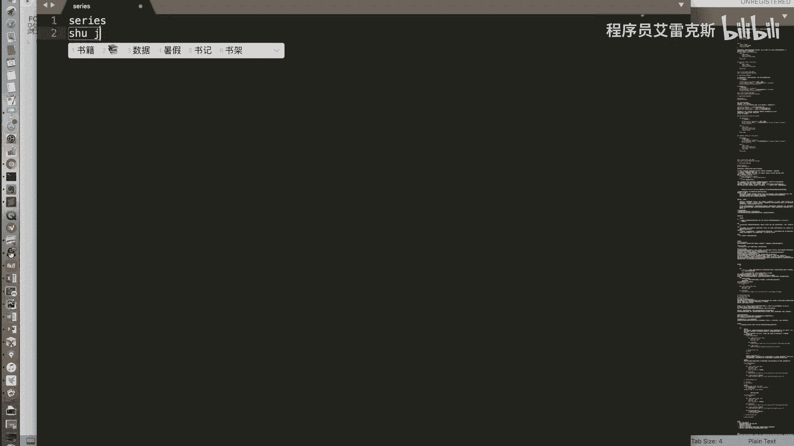

## 概述

Series是Pandas库中一种一维的、带标签的数组对象。它结合了Python字典和NumPy数组的特性，是进行金融数据分析和处理的基础。

## Series的核心特性

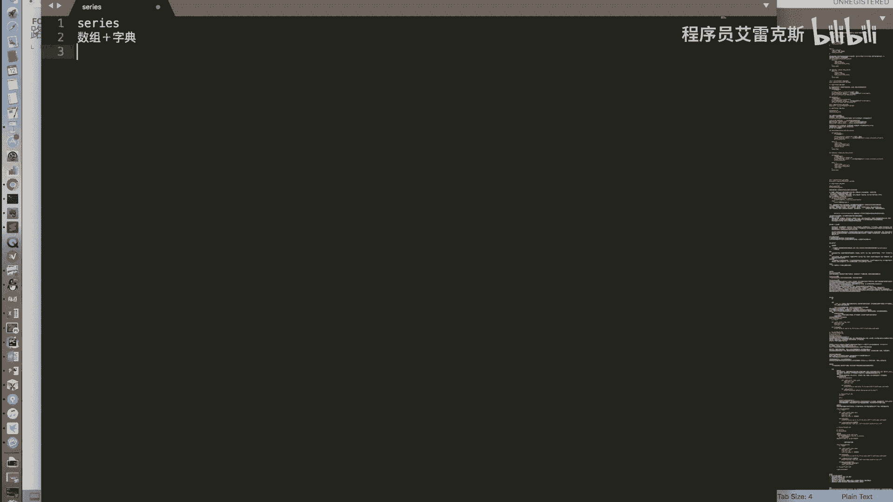

上一节我们介绍了Series的基本操作，本节中我们来系统总结其核心概念。

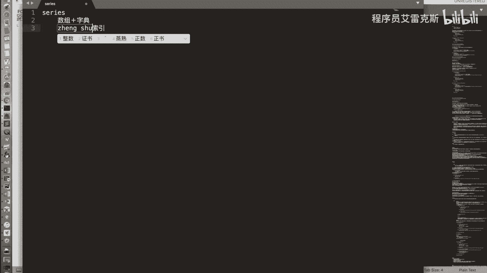

Series是字典与数组的集合体。它支持通过**下标**（位置）和**标签**（索引）两种方式进行数据访问。

## Series支持的操作

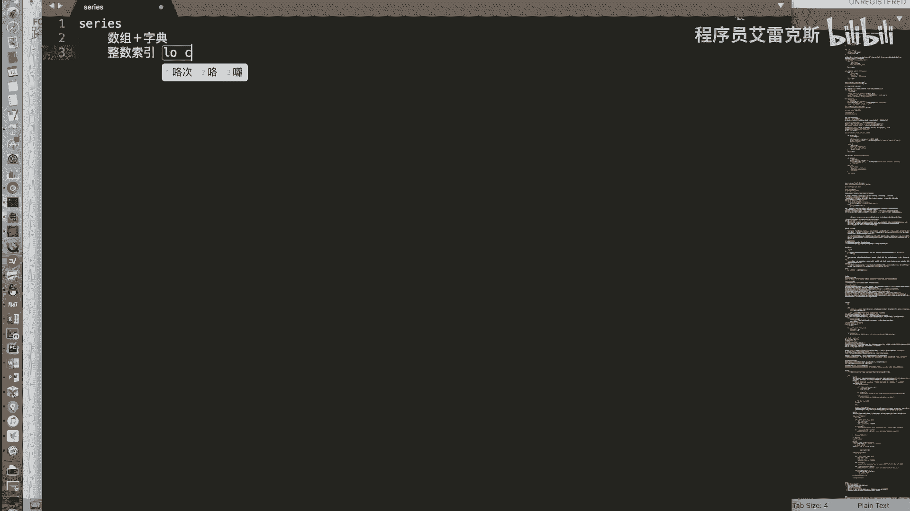

以下是Series支持的主要操作，这些操作体现了其数组与字典的双重特性。

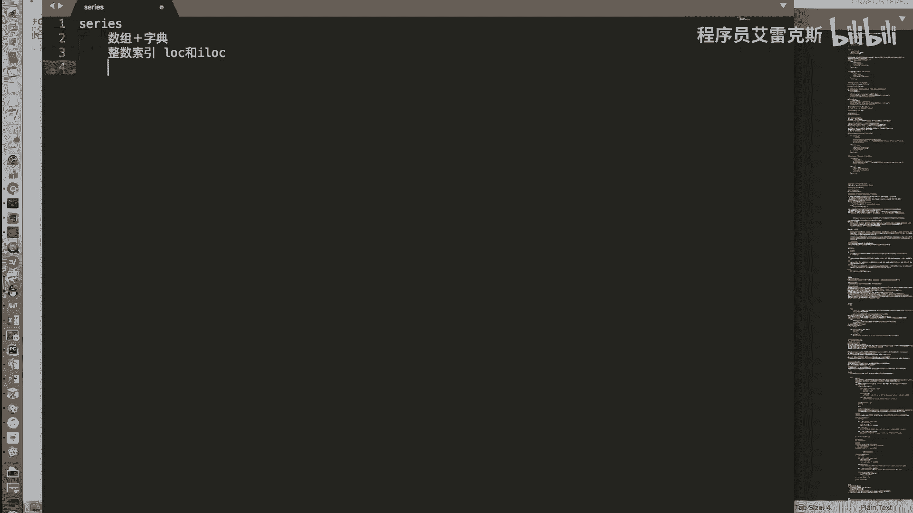

*   **数组式操作**：
    *   按下标进行索引和切片。
    *   使用布尔值进行索引。
    *   两个Series对象之间可以进行加减乘除等运算。
    *   Series与一个标量数字之间也可以进行运算。
*   **字典式操作**：
    *   按标签进行索引。
    *   支持 `in` 操作来检查标签是否存在。

## 整数索引的歧义与解决方法

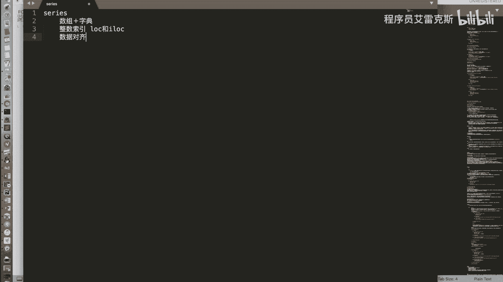

当Series的索引为整数时，使用中括号 `[]` 进行索引可能会产生歧义，因为它既可能被解释为按下标访问，也可能被解释为按标签访问。

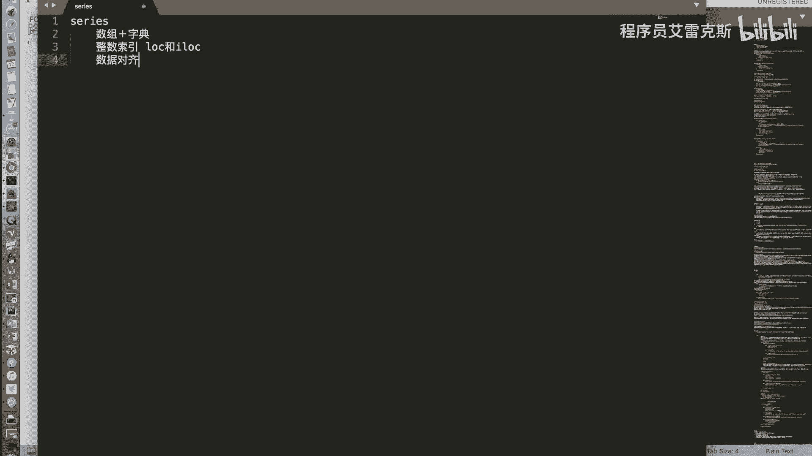

为了解决这个问题，我们引入了两个重要的属性：`.iloc` 和 `.loc`。
*   **`.iloc`**：明确指定按**整数位置**（下标）进行索引。代码示例：`series.iloc[0]`
*   **`.loc`**：明确指定按**索引标签**进行索引。代码示例：`series.loc[‘label’]`

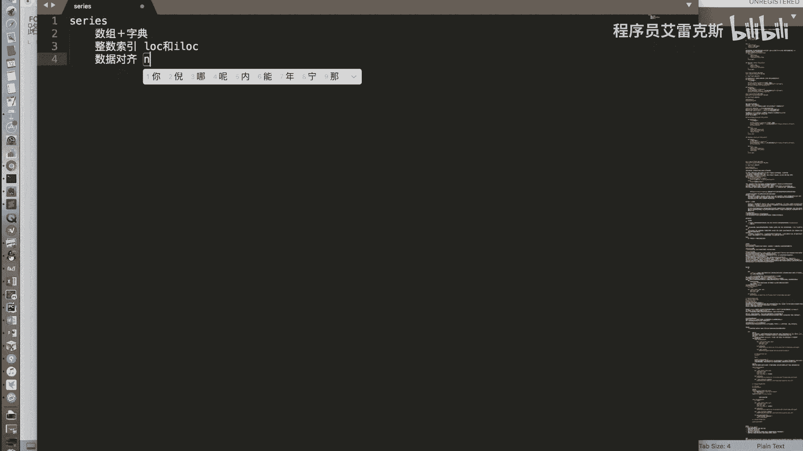

## 数据对齐

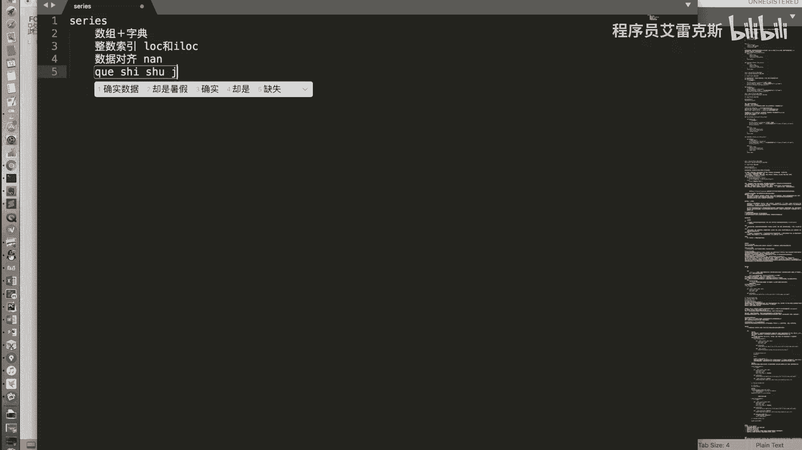

在上一节我们介绍了索引，本节中我们来看看数据对齐。当两个Series对象进行运算（如加减乘除）时，Pandas会按照它们的**标签自动对齐**数据，然后对相同标签的值进行计算。

如果某个标签只存在于其中一个Series中，那么运算结果在该标签位置上的值将是缺失值，在Pandas中用 `NaN`（Not a Number）表示。

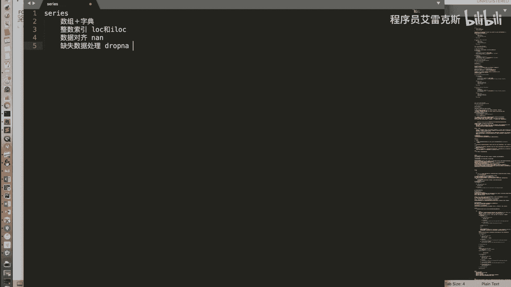

## 缺失数据处理

在数据对齐过程中，常常会产生缺失数据（NaN）。Pandas提供了两种主要方法来处理缺失值。

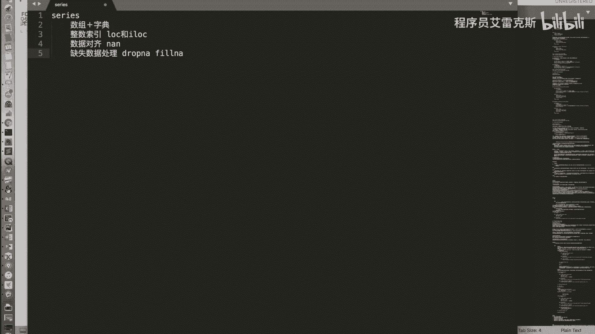

以下是处理缺失数据的两种常用方法：
1.  **删除缺失值**：使用 `dropna()` 函数直接移除包含NaN的行。
2.  **填充缺失值**：使用 `fillna(value)` 函数，将NaN位置填充为指定的值（例如 `0` 或平均值）。

## 总结

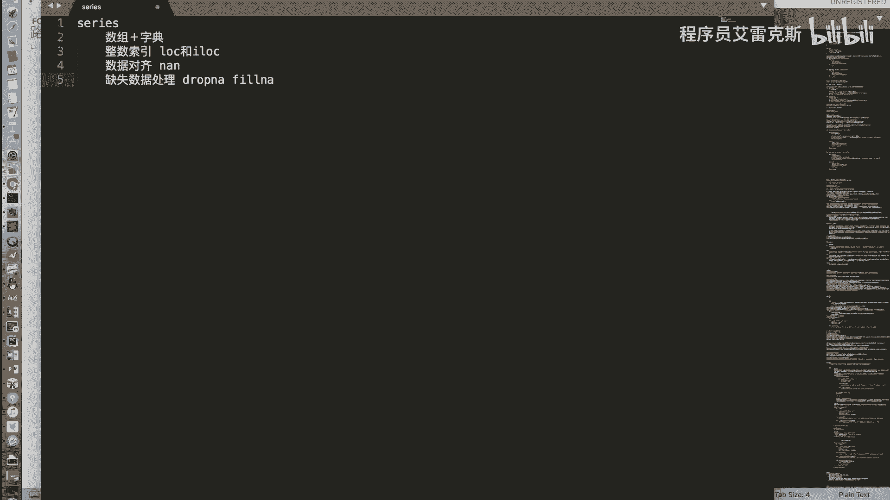

本节课中我们一起学习了Pandas Series对象的全面总结。我们回顾了其作为“带标签的数组”的核心特性，明确了通过 `.iloc` 和 `.loc` 解决整数索引歧义的方法，理解了数据对齐的机制，并掌握了处理缺失数据的两种基本策略。除了这些Pandas特有的功能，Series也继承了NumPy数组的众多特性，如布尔索引和花式索引，使其成为进行高效数据分析的强大工具。