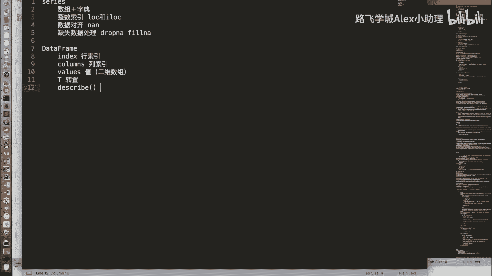
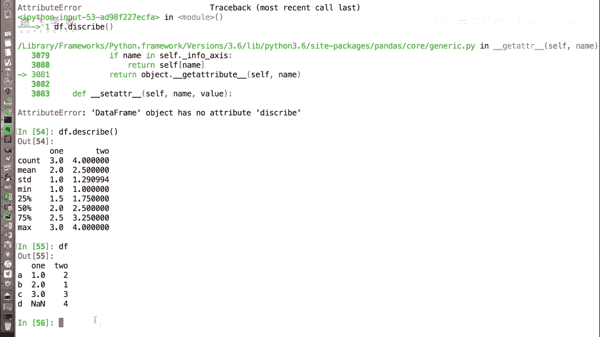

# Python金融量化：P20：DataFrame常用属性 📊

在本节课中，我们将学习Pandas中`DataFrame`对象的一些常用属性。这些属性可以帮助我们快速查看和了解数据的基本结构，例如行索引、列索引、数据值以及一些统计摘要。

---

## 行索引与数据值

上一节我们介绍了`DataFrame`对象的创建方式，本节中我们来看看它的基本属性。与`Series`对象类似，`DataFrame`也有`index`和`values`属性。

*   `index`属性用于获取`DataFrame`的行索引。
*   `values`属性用于获取`DataFrame`中的数据值。

以下是这两个属性的示例：

```python
import pandas as pd
import numpy as np

# 创建一个示例DataFrame
data = {'one': [1, 2, np.nan, 4], 'two': [5, 6, 7, 8]}
df = pd.DataFrame(data, index=['A', 'B', 'C', 'D'])

print("行索引：")
print(df.index)
# 输出：Index(['A', 'B', 'C', 'D'], dtype='object')

print("\n数据值：")
print(df.values)
# 输出：一个二维数组
# [[ 1.  5.]
#  [ 2.  6.]
#  [nan  7.]
#  [ 4.  8.]]
```

需要注意的是，`DataFrame`的`values`属性返回的是一个**二维数组**，这与`Series`返回一维数组不同。

---

## 转置与列索引

由于`DataFrame`是二维数据结构，它还具有`Series`所没有的属性。

*   `T`属性用于获取`DataFrame`的转置，即行与列互换。
*   `columns`属性用于获取`DataFrame`的列索引。

以下是这两个属性的示例：

```python
print("原始DataFrame：")
print(df)

print("\n转置后的DataFrame：")
print(df.T)
# 行索引A, B, C, D变成了列索引
# 列索引one, two变成了行索引

print("\n列索引：")
print(df.columns)
# 输出：Index(['one', 'two'], dtype='object')
```

**注意**：在转置操作中，如果某一列同时包含整数和浮点数（例如因为存在`np.nan`这个特殊的浮点值），Pandas会统一将该列的数据类型提升为浮点数（`float`），以确保数据类型的一致性。如果需要转换数据类型，可以使用`.astype()`方法。

---

## 数据描述统计

`DataFrame`提供了一个非常实用的`.describe()`方法，可以快速生成数据各列的统计摘要。

以下是`.describe()`方法的示例：

```python
print("数据描述统计：")
print(df.describe())
```


`.describe()`方法默认返回数值型列的以下统计信息：
*   **count**: 非空值的数量
*   **mean**: 平均值
*   **std**: 标准差
*   **min**: 最小值
*   **25%**: 第一四分位数 (Q1)
*   **50%**: 中位数 (Q2)
*   **75%**: 第三四分位数 (Q3)
*   **max**: 最大值

这些统计量有助于我们快速把握数据的分布情况。

---



## 总结

本节课中我们一起学习了`DataFrame`的几个核心属性与方法：
1.  **`df.index`**：获取行索引。
2.  **`df.values`**：获取数据值（返回二维数组）。
3.  **`df.T`**：获取转置，即行列互换。
4.  **`df.columns`**：获取列索引。
5.  **`df.describe()`**：获取各列的描述性统计摘要。



掌握这些属性是进行数据查看和初步分析的基础。下一节，我们将开始学习如何对`DataFrame`进行数据筛选。