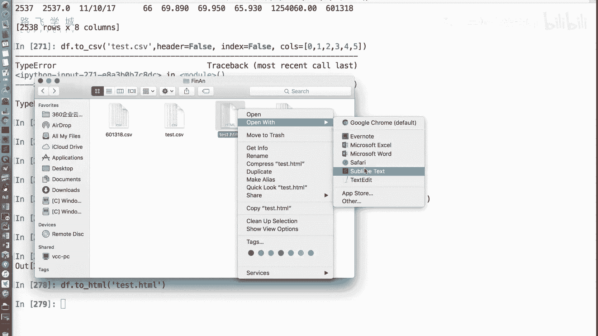
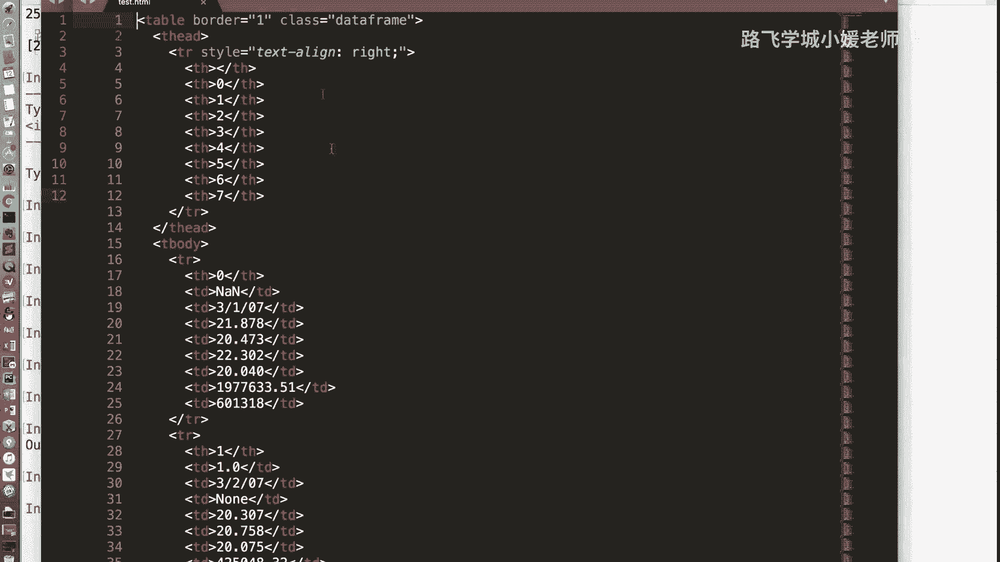
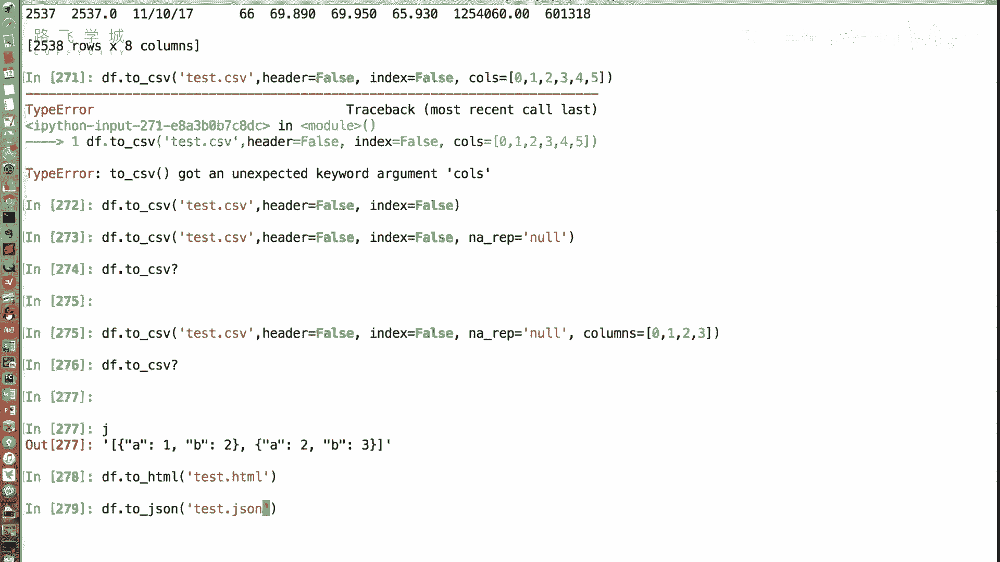
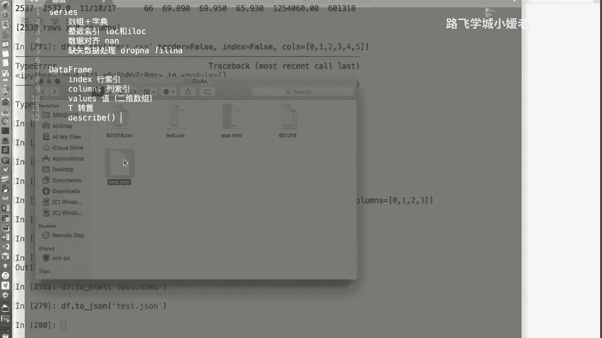
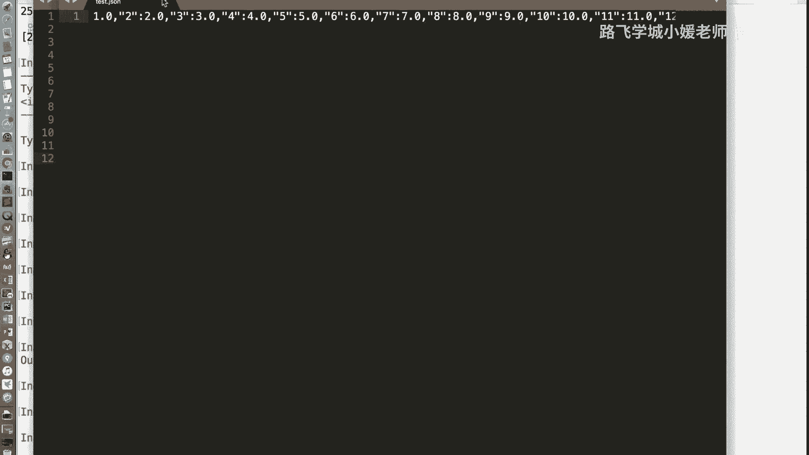
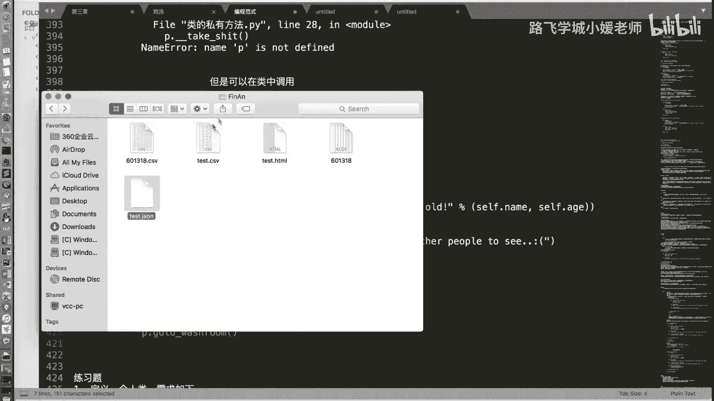
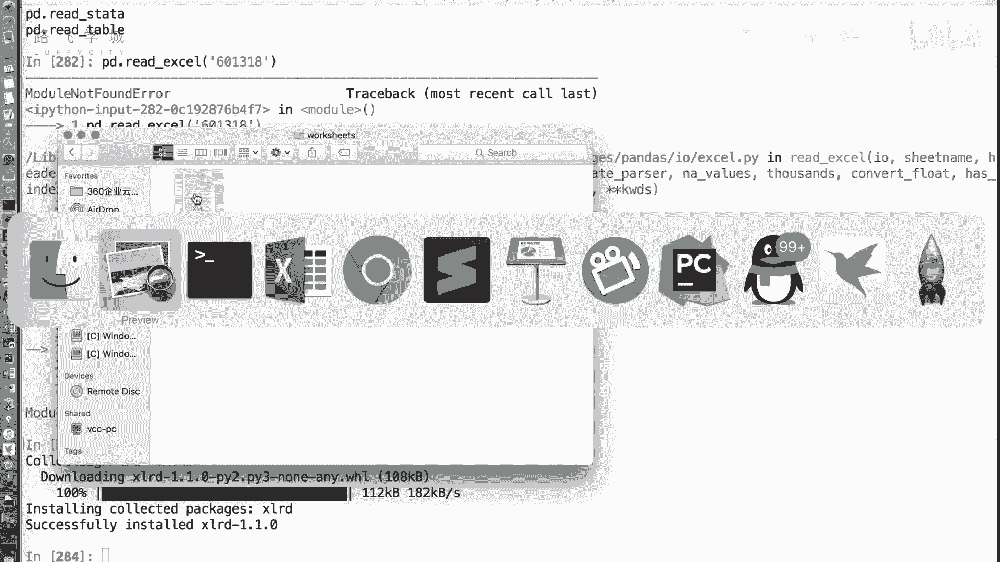
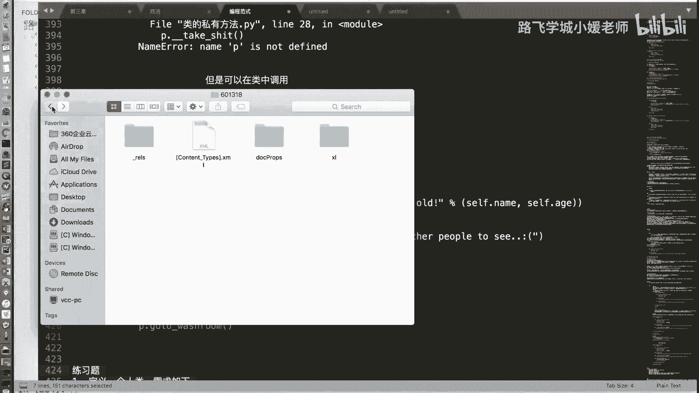
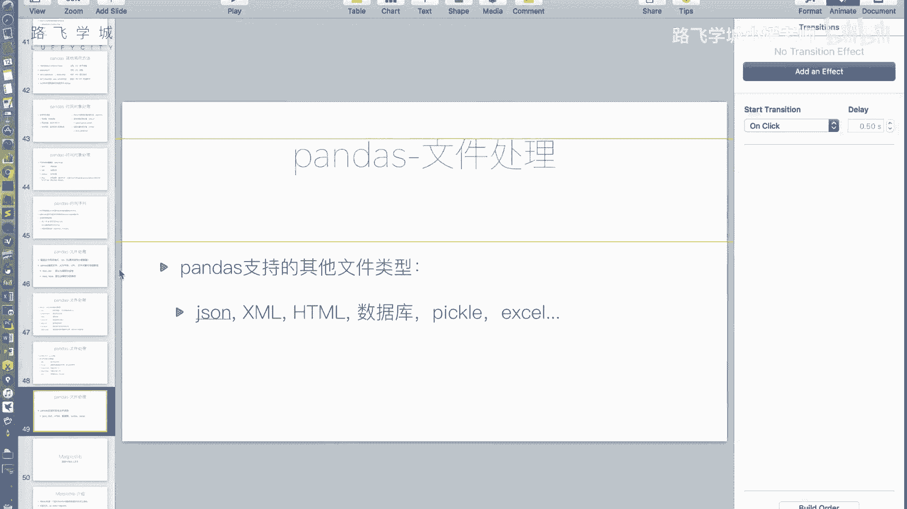

# Python金融量化：P20：文件操作3与pandas收尾 📊

在本节课中，我们将深入学习pandas库中`to_csv`方法的各种参数，并了解pandas如何支持多种文件格式的读写操作。最后，我们将对pandas的核心内容进行总结。

## 写入CSV文件的参数详解

上一节我们介绍了`read_csv`函数用于读取文件，本节中我们来看看`to_csv`函数用于写入文件时的具体参数。

`to_csv`函数用于将DataFrame对象写入到CSV文件中，它包含多个重要参数来控制输出格式。

以下是`to_csv`方法的关键参数说明：

*   **`sep`参数**：与`read_csv`的`sep`参数功能相同，用于指定写入文件时使用的分隔符。默认值是逗号（`,`）。
*   **`na_rep`参数**：此参数与`read_csv`中的`na_values`参数作用相反。`na_values`用于指定哪些字符串应被解释为缺失值（NaN），而`na_rep`则用于指定将DataFrame中的缺失值（NaN）写入文件时替换成什么字符串。默认情况下，缺失值会被替换为空字符串。
*   **`header`参数**：当设置为`False`时，不将列名（表头）写入文件的第一行。
*   **`index`参数**：当设置为`False`时，不将行索引写入文件的一列。
*   **`columns`参数**：可以传入一个列表，用于指定只输出哪些列到文件中。列表中的元素可以是列的编号或列名。

## 参数使用演示

让我们通过一个简单的例子来演示这些参数的使用。

```python
# 假设df是一个已有的DataFrame对象
# 将第0行第0列的值设置为NaN
df.iloc[0, 0] = np.nan

# 将DataFrame写入CSV文件，并应用参数
df.to_csv('test.csv', sep=',', header=False, index=False, columns=[0, 1, 2, 3, 4, 5], na_rep='NULL')
```

执行上述代码后，生成的`test.csv`文件将不包含表头和行索引，仅包含前六列数据，并且所有的NaN值都会被替换为字符串“NULL”。

## 支持的其他文件格式





除了CSV文件，pandas库还支持读写多种其他格式的数据文件。





pandas提供了丰富的方法来读写不同格式的文件，例如JSON、HTML、Excel以及数据库等。





以下是pandas支持的部分文件格式读写方法：

*   **JSON格式**：使用`to_json()`和`read_json()`方法。
*   **HTML格式**：使用`to_html()`和`read_html()`方法。`to_html()`会将DataFrame转换为一个HTML表格。
*   **Excel格式**：使用`to_excel()`和`read_excel()`方法。注意，读写Excel文件需要额外安装`openpyxl`或`xlrd`库。
*   **其他格式**：如Pickle、SQL数据库等，均有对应的`to_`和`read_`方法。

例如，将DataFrame保存为Excel文件：
```python
df.to_excel('output.xlsx')
```
读取Excel文件：
```python
df_from_excel = pd.read_excel('output.xlsx')
```
需要注意的是，首次使用`read_excel`时可能会提示缺少`xlrd`模块，需要使用`pip install xlrd`命令进行安装。

## 探索更多功能

对于其他格式的读写操作，其使用方式类似。大家可以在Jupyter Notebook或IPython环境中，通过输入`pd.read_`后按Tab键查看所有支持的读取函数，或使用`df.to_`查看所有支持的写入方法。对任一方法使用`?`（如`pd.read_json?`）可以查看其详细的参数说明和示例。





## pandas核心内容总结 🎯

本节课中我们一起学习了pandas文件操作的进阶知识，并至此完成了pandas核心库的模块介绍。

我们来回顾一下关于pandas所学的主要内容：



*   **两大核心对象**：我们讲解了`Series`和`DataFrame`对象。`Series`主要用于处理一维数据，而`DataFrame`用于处理二维表格数据。
*   **索引与切片**：详细介绍了如何使用`.loc`（基于标签）和`.iloc`（基于整数位置）进行数据索引和切片。对于`DataFrame`，建议使用`df.loc[行索引, 列索引]`的格式，而非连续使用两个方括号。
*   **数据对齐与运算**：`Series`或`DataFrame`对象进行运算时，会按照行和列的标签自动对齐。未对齐的位置会产生缺失值（NaN）。
*   **缺失值处理**：当数据中出现缺失值（NaN）时，我们可以使用`dropna()`方法删除包含缺失值的行或列，或者使用`fillna()`方法用特定值填充缺失值。
*   **其他功能**：我们还介绍了pandas对时间序列的支持以及多种文件格式的读写操作。

关于pandas这个核心库的模块介绍就到这里。后续请大家务必完成相关的练习题，以巩固所学知识，确保学习效果。

**本节课中我们一起学习了`to_csv`方法参数的详细用法、pandas对多种文件格式的读写支持，并对整个pandas章节的核心知识点进行了系统性的总结。**