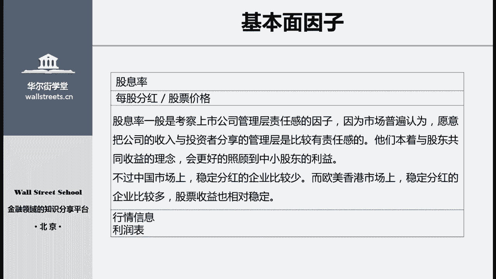

# 股票量化基本面投资：P21：04 股票量化基本面投资

## 概述
在本节课中，我们将要学习量化基本面投资的整体框架、估值分析模型的种类以及基本面因子的构成。我们将从传统投资与量化投资的对比入手，逐步深入到量化模型的核心概念与具体应用。

## 量化投资的整体分析框架

上一节我们介绍了课程的整体目标，本节中我们来看看量化投资的基本分析框架。量化投资是实现投资目标的一种手段，其根本目的仍是分享公司股票长期上涨的收益。量化方法旨在帮助投资者更精确、更方便地为股票定价，或判断其价值是否合理。

说到基本面投资，价值投资方法是最传统、最经典的股票投资方法。当前A股市场上，大部分股票类基金的投资经理仍在使用传统方法进行基本面分析和投资。

以下是传统股票基金经理选择股票的典型步骤：

首先，对市场上所有股票进行初步筛选。例如，按市值分为大盘股与小盘股，按交易场所分为主板、中小板和创业板股票，或按行业分为银行、证券、汽车等。进行这样的分类，一方面是因为许多股票产品本身就有选股范围限制（如专门投资互联网产业的基金），另一方面是因为传统基金经理通常有自己擅长的板块和行业。

其次，对筛选后剩余的股票进行财务状况初步分析。通常使用一些估值指标进行筛选，例如剔除市盈率过高的股票或净利润为负的股票，以确保剩余标的是相对优质的股票。

最后，对符合要求的几百只股票进行详细分析研究。基金经理和分析师会阅读其财务报表，详细了解公司的经营状况等。

那么，量化基金经理如何进行基本面选股呢？以下是量化选股的步骤：

首先，构建基本面因子。这些因子用于反映企业的经营状况、财务状况或行业竞争地位等，需要尽可能完整地反映企业某方面的真实状况。因子通常根据基金经理的个人经验和对市场的判断来构建和选取，之后会进行一系列复杂测试以确保其有效性。

其次，根据市值、行业等特殊情况对因子进行调整，并构建量化分析模型，将各个因子纳入模型中。调整是必要的，因为许多因子的效果因行业而异。例如，净利润率指标在制造业和互联网行业中的作用完全不同。

最后，将企业的相关信息输入构建好的量化模型中，并随着市场进展不断更新信息。模型会给出交易信号，投资者据此进行交易。

## 传统与量化基本面选股的区别

我们知道了传统和量化基本面选股在步骤和方法上存在很大不同。具体区别体现在量化基本面选股的几个特点上。

首先，两者面对的信息输入基本相同，都来自市场公开信息，包括行业数据、财务数据、行情信息等。区别在于对信息的分析方法不同。

传统基本面分析关注的是公司本身，而量化基本面分析关注的是选股模型，包括如何选取有效指标构建阿尔法因子，以及如何将这些因子组装成完整的选股模型。例如，传统投资者会重点分析目标公司的预期收入增长，并根据公司未来经营状况、近期大事件、管理层能力等预测财务数据。量化分析也会考虑收入增长，但更关注选取何种指标来量化公司的成长能力，而非预测具体的收入增长数值。

其次，传统基本面分析更关注深度，而量化投资更关注广度。传统投资者通常只关注少数几十只股票，需要对每家公司进行深入调研和预测，并据此形成交易判断。量化投资则建立统一模型，尽可能对市场上所有股票进行统一分析和判断。量化投资者更关注整个市场、某个行业或板块的变化，很少关注具体某家公司的发展状况。

第三，传统股票分析模型更关注预期，而量化投资模型更关注规律。传统投资者更喜欢关注公司未来的“大图景”或“故事”，例如管理层在年报中描述的收购计划及其对未来垄断优势和收益增长的预期。他们可能通过参加股东会或实地调研来更精准地预测公司未来成长。量化投资者则更关注历史数据及其隐含的规律，倾向于通过挖掘历史数据寻找普遍有效的规律，这种规律最好对整个行业或全市场都有效。

最后，传统基本面投资者的持仓通常更为集中，会有少数几个重仓股；而量化投资者的持仓更加分散，很少会有重仓股。这一特点非常明显。市场上的公募或私募基金，如果投资经理是传统基本面分析者，他更倾向于在行业中只持有一两家特别喜欢的公司。量化投资者则可能持有行业中的所有公司，只是在持仓市值上有所区分。

## 量化投资中的估值分析模型

之前的部分，我们从宏观层面介绍了量化投资与传统投资基本面模型的区别。那么在这一部分，我们再来具体介绍一下量化投资中的估值分析模型分为哪些种类。

股票的量化基本面模型主要分为两大类。

第一大类是因子模型，其主要应用在多因子策略上。这类模型的关注点不再是单只股票，而是各个因子。例如，一个多因子策略的基金经理在盘后需要考虑的是：今天市场因子带来的超额收益率是多少？规模因子带来的超额收益率是多少？某个行业因子的收益率是否达到预期？分析对象是各种不同种类的因子。这一部分是我们后面几节课的重点，将留到后面详细讨论。

第二大类是定价模型。定价模型实际上是传统股票基本面投资策略与量化方法的一种结合，即使用量化手段将传统的股票分析方法规模化和模型化。在这种定价模型中，主要包括两种方法：

第一种是相对估值法。相对估值通过横向对比（与其他公司）和纵向对比（与自身历史），来判断一家公司的股票相对于另一家是高估还是低估。这种方法通常用于两家公司股价之间的对比，无法告诉你某家公司当前是否是一个好的买入或卖出时机，因为它不涉及公司的绝对价值，只涉及相对高低。因此，它主要应用于多空交易和指数增强策略。多空交易是指买入低估的公司，同时卖空高估的公司。指数增强策略的目标是跑赢某个指数（如沪深300），通过买入指数成分股中低估的股票，并卖出或空仓高估的股票来实现超额收益。

第二种是绝对估值法。绝对估值法使用各种定价模型（如现金流折现法或剩余收益模型）对一家企业的绝对价值进行定价。例如，通过复杂模型计算出某企业的市值应为3亿元，若其发行了1亿股股票，则每股价格应为3元。这种方法主要应用于择时策略和做空策略。择时策略用于判断资金何时买入或卖出股票：当股票实际价格低于其绝对估值时买入，当实际价格高出很多时卖出。做空策略在国内应用较少（因为融券标的少），但在港股和美股市场应用广泛。例如，著名的做空机构浑水集团就使用绝对估值模型，结合高科技手段（如卫星图像分析）对公司进行定价和做空。

在量化基本面策略中，主要就是这两大类模型：因子模型和定价模型。本系列课程后续将主要讲解因子模型及其下的多因子策略。定价模型非常复杂，在此暂不展开。

## 基本面因子的六个维度

既然要讲解因子模型，我们这一部分自然要开始探讨基本面因子具体有哪些。下面我们来看一下分析一家公司基本面时需要考虑的六个维度及其包含的因子。

我们的股票基本面分析模型就是由这些因子组成的。接下来，我将首先详细介绍估值维度中的五个具体因子。对于剩下的财务维度及其因子，我不会再一一详细介绍，而是在后面的代码编写课程中，具体讲解如何使用代码计算这些财务因子。

以下是基本面分析的六个维度：

第一个维度是估值因子。它包括市盈率、市净率、市销率、企业估值倍数和股息率这五个主要因子。估值因子主要体现市场及外部对企业的综合估值判断，包含了市场整体情绪、大盘近期涨跌情绪以及外界对公司的综合性判断，因此都是一些最综合性的指标。

第二个维度是盈利因子。它包括资本收益率、资产回报率、主营业务毛利率、主营业务利润率以及净利润率这几个主要指标。无论投资哪个行业，对盈利能力指标的关注都必不可少。这些盈利因子直接帮助我们判断公司的业绩和内在价值。

第三个维度是成长因子。成长因子主要包括主营业务收入的同比增长率、净利润的增长率、总资产增长率以及固定资产占比。这些因子的分析主要用于预测公司的扩张能力、经营能力、未来发展趋势和发展速度，以及公司规模扩大、利润和所有者权益增加的幅度。一家公司的成长能力往往难以精确测量，但这些指标仍能帮助我们进行一定程度的判断。

第四个维度是经营因子。它包括存货周转率、应收账款周转率、总资产周转率和固定资产周转率这四个指标。它主要反映企业将资产转化成销售额或现金的效率，即经营能力。经营能力对企业的短期偿债能力影响非常大。

第五个维度是债务因子。它包括流动比率、速动比率、现金比率这三个短期偿债能力因子，以及资产负债率、产权比例、利息保障倍数这三个长期债务因子。即使一家企业盈利能力很强、成长前景看好，如果没有足够现金偿还短期债务，也会面临清算破产的风险。因此，债务因子综合反映了一家企业的经营风险大小。

第六个维度是现金流因子。它主要包括单位主营业务的现金净流入、债务保障率以及自由现金率这三个现金流因子。它能更直接地展示企业当前的运营状况，同时，反映现金流的指标受会计准则影响较小，被操纵的可能性也小，因此能更真实地反映企业的财务状况。

## 估值因子详解

什么是估值因子？估值因子是一种计算方便、简单易懂、逻辑直接的基本面因子，因此在基本面投资模型中使用最为广泛。由于其内在逻辑简单，根据使用指标的不同，衍生出了非常丰富的指标体系。

估值因子是从不同角度反映企业价值的因子，其特点都是从外部观察企业，反映当前市场对企业价值的认识，因此这类估值因子统称为外部估值因子。还有另一类内部估值因子，是使用财务指标对企业进行估值。

企业的估值模型一般需要包括以下五个估值因子：
1.  **市盈率**：从盈利角度出发估算企业价值。
2.  **市净率**：从资产角度出发估算企业价值。
3.  **市销率**：从企业的主营业务收入能力出发。
4.  **企业价值倍数**：从企业能够带来的综合收益角度出发。
5.  **股息率**：从管理层的责任角度出发估算企业价值。

估值因子与其他财务因子相比比较特殊。一方面，估值因子反映企业的整体经营状况，而其他财务因子只反映部分经营状况（如盈利能力、现金流状况）。另一方面，估值因子是外界对企业的定价，因此还会受到市场整体情绪的影响，而其他财务因子仅受企业经营状况影响。

在实际构建股票模型时，任何一个估值因子都可以单独使用，尤其是PE、PB、PS指标使用最为广泛。这与财务因子不同，财务因子很少单独使用，而是作为一个整体来综合反映企业的内部财务状况。

以下是五个估值因子的详细介绍：

**1. 市盈率**
市盈率的计算公式是：`市盈率 = 每股价格 / 每股税后收益`。
该指标的含义是：假设税后收益稳定在当前水平，公司需要经过多少年的积累才能达到当前的股价。经过多年使用，市盈率指标衍生出不同形式，包括EPS（每股收益，市盈率的倒数）、静态市盈率、动态市盈率、预测市盈率等。这些变体主要在分母（每股税后收益）的选择上有所调整，反映了对公司近期表现的不同敏感程度。基于市盈率的选股策略很常见，例如要求市盈率低于特定数值才将股票纳入选股范围。

**2. 市净率**
市净率的计算公式是：`市净率 = 每股价格 / 每股净资产`。
这是一个广泛用于公司分析的价值衡量指标，由于不涉及公司具体财务状况，具有良好稳定性。资产存在公允价值（净资产价值）和市场价值（股价）两种价格。市净率衡量了这两种价值之间的区别大小，也可以理解为安全边际。著名价值投资者巴菲特就倾向于投资市净率（安全边际）低于0.8的公司。

**3. 市销率**
市销率的计算公式是：`市销率 = 市场价值 / 主营业务收入`。
这是一种类似于衡量流量的方法，看公司的市值是主营业务收入的多少倍。该指标在VC和PE领域，以及投资新兴产业公司（如互联网公司）时应用广泛。因为这些公司可能尚未盈利或净资产较少，传统估值指标不适用，常使用市销率或类似指标（如市值除以日活跃用户数）。

**4. 企业价值倍数**
企业价值倍数的计算公式是：`企业价值倍数 = (市场价值 - 负债) / 息税折旧摊销前利润`。
该因子与市盈率类似，也是对比公司市场价值与盈利能力，但在计算时考虑了企业负债状况和净利润相关的个性因素，因此是一个更加综合的估值指标。在机构投资者中，其使用越来越广泛。

**5. 股息率**
股息率的计算公式是：`股息率 = 每股分红 / 股票价格`。
股息率因子常用于考察上市公司管理层的责任感。市场普遍认为，愿意与投资者分享公司收入的管理层更有责任感，能更好地照顾中小股东利益。在A股市场，稳定分红的企业相对较少，因此该因子使用广泛性较低；而在欧美市场，稳定分红的企业较多，该因子应用也更广泛。

## 总结
本节课中，我们一起学习了量化基本面投资的整体框架，对比了传统投资与量化投资在基本面选股上的区别。我们详细介绍了量化投资中的两大类模型：因子模型和定价模型，并深入探讨了基本面因子的六个维度，特别是对估值维度的五个核心因子（市盈率、市净率、市销率、企业价值倍数、股息率）进行了公式和逻辑上的解析。理解这些基础概念和模型，是构建有效量化选股策略的第一步。