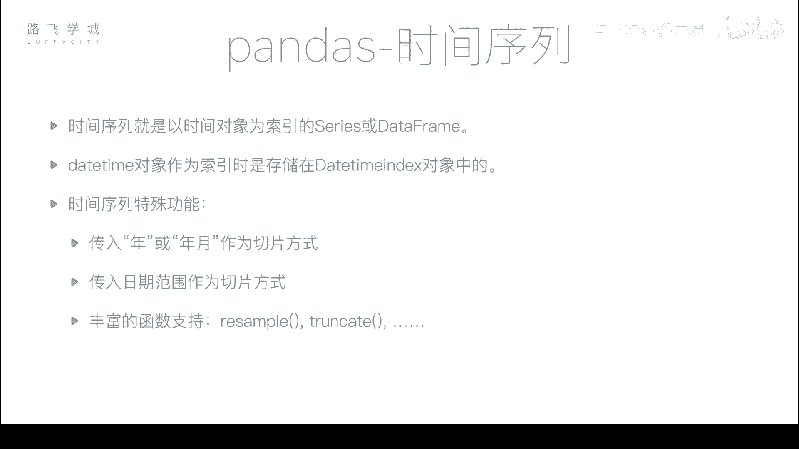
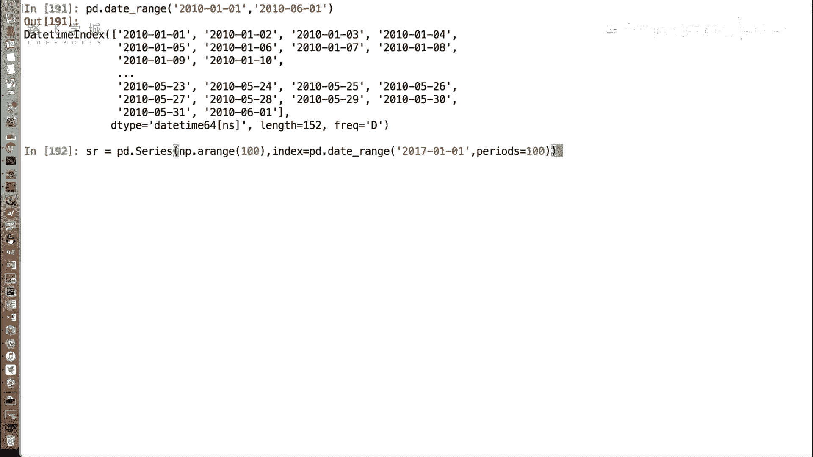
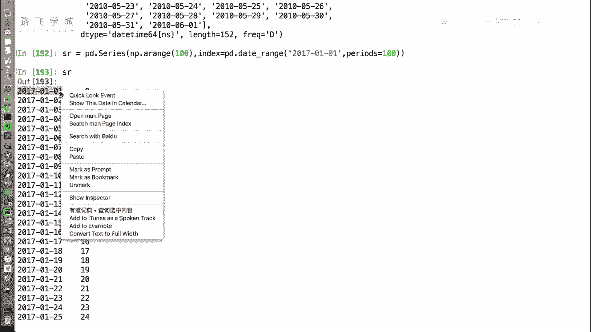
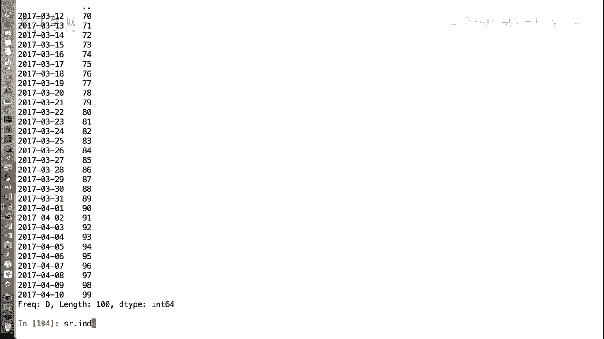
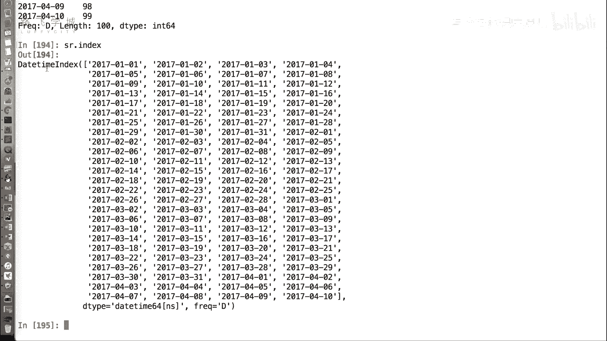
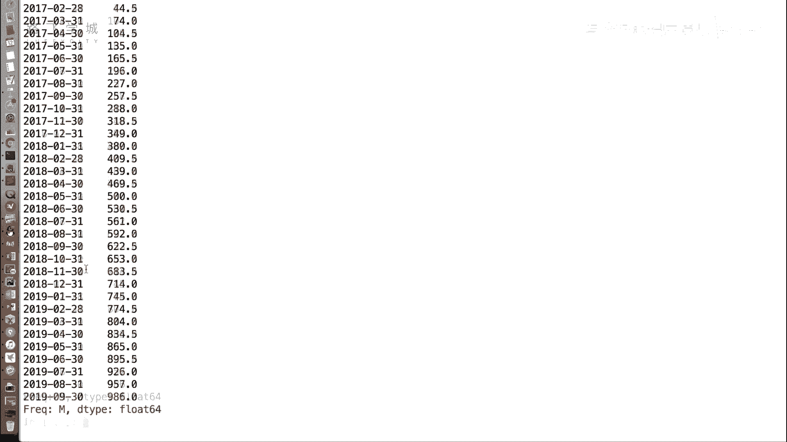
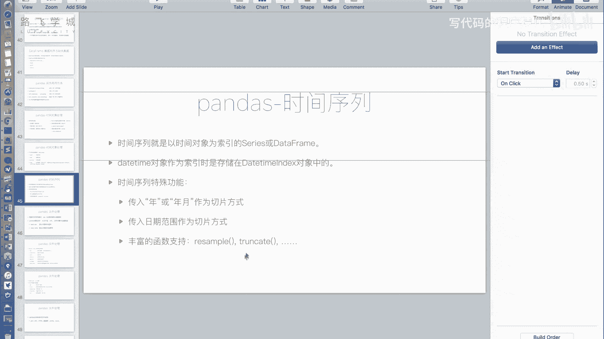
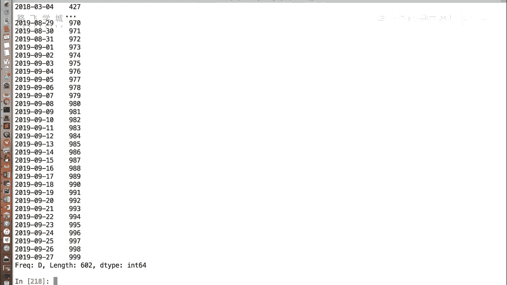
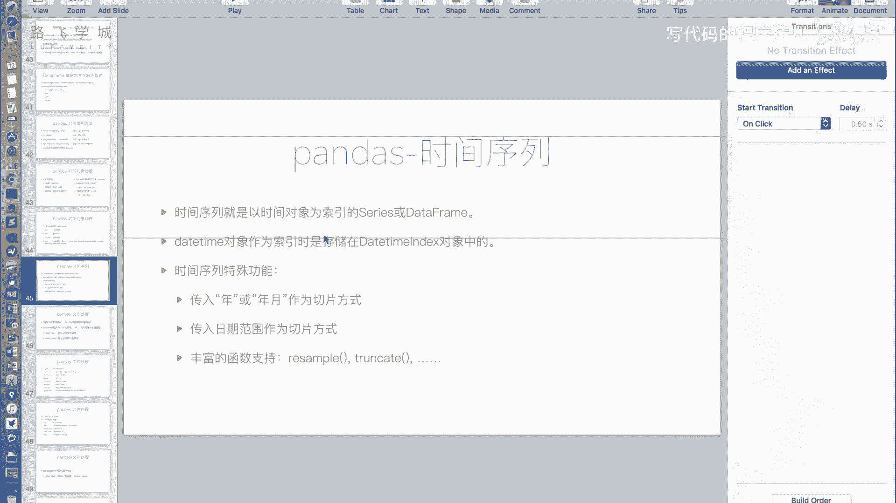

# Python金融量化：P21：时间序列 📅

在本节课中，我们将学习如何利用Pandas的时间对象来构建时间序列。时间序列是以时间对象作为索引的Series或DataFrame，它在金融数据分析中至关重要。我们将探讨如何创建时间序列，以及利用其特性进行高效的数据切片和重采样。



---

## 创建时间序列

上一节我们介绍了Pandas中生成时间对象的函数。本节中我们来看看如何用它们来构建时间序列。

我们可以使用`pd.date_range`函数生成一个`DatetimeIndex`，并将其作为Series或DataFrame的索引。

```python
import pandas as pd
import numpy as np



# 创建一个Series，其索引为时间序列
sr = pd.Series(
    np.arange(100),  # 生成0到99的数值作为数据
    index=pd.date_range('2017-01-01', periods=100)  # 生成100天的时间索引
)
print(sr)
```


运行上述代码，可以看到索引显示为日期字符串，但其实际类型是`DatetimeIndex`。



```python
print(type(sr.index))  # 输出：<class 'pandas.core.indexes.datetimes.DatetimeIndex'>
```



现在，`sr`就是一个以时间为索引的时间序列。



---

## 时间序列的切片操作

成为时间序列后，一个直观的好处是我们可以方便地按时间范围选取数据。

以下是几种常见的切片方式：

*   **按年月切片**：可以只传入年份和月份来选取该月所有数据。
    ```python
    # 选取2017年4月的数据
    sr['2017-04']
    ```

*   **按年切片**：只传入年份，选取该年所有数据。
    ```python
    # 选取2017年所有数据
    sr['2017']
    ```

*   **按日期范围切片**：可以传入一个精确的日期范围。
    ```python
    # 选取2017年12月25日到2018年2月1日的数据
    sr['2017-12-25':'2018-02-01']
    ```

这些操作非常灵活，即使传入的是字符串格式的日期，Pandas也能正确识别。

---

## 时间序列的重采样

除了切片，时间序列还支持强大的重采样功能。`resample`函数可以将数据按照新的时间频率（如天、周、月）进行聚合。

以下是`resample`函数的使用示例：

*   **按周求和**：将数据按周分组，并计算每周的和。
    ```python
    # 按周重采样并求和
    sr.resample('W').sum()
    ```

*   **按月求平均值**：将数据按月分组，并计算每月的平均值。
    ```python
    # 按月重采样并求平均值
    sr.resample('M').mean()
    ```



`resample`的参数与`date_range`的频率参数一致，如`'D'`（日）、`'W'`（周）、`'M'`（月）等，这使得时间维度的数据聚合变得极其简便。

---

## 其他辅助函数



时间序列还有一些其他函数，例如`truncate`。它可以截取指定日期之前或之后的数据。

```python
# 截取2018年2月3日之后的数据
sr.truncate(before='2018-02-03')

# 截取2018年2月3日之前的数据
sr.truncate(after='2018-02-03')
```



不过，由于切片操作已经非常强大和直观，`truncate`函数在实际中使用频率相对较低。

---



本节课中我们一起学习了Pandas时间序列的核心概念和操作。我们掌握了如何创建以时间为索引的Series，并利用其特性进行灵活的数据切片和高效的重采样分析。这些功能是进行金融时间序列数据分析的基础，能够极大地提升数据处理的效率和便捷性。