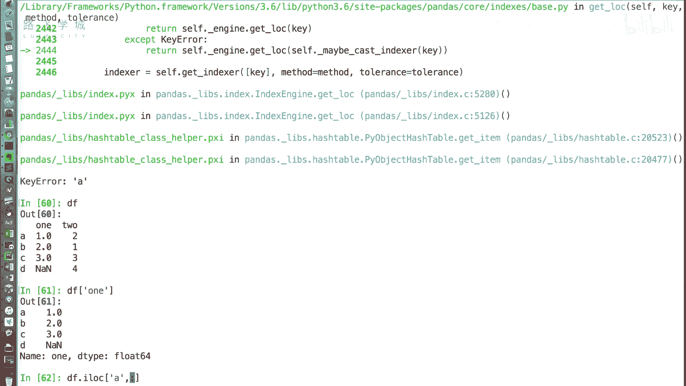
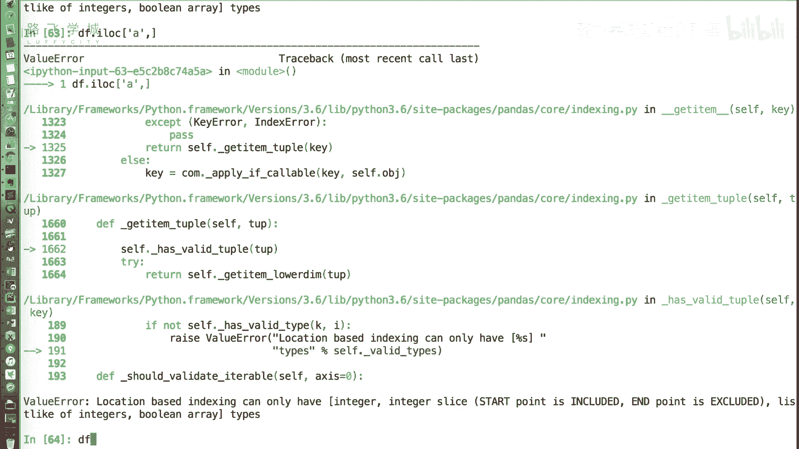
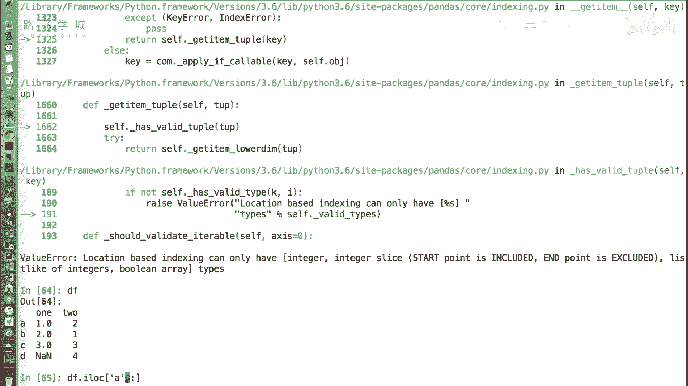
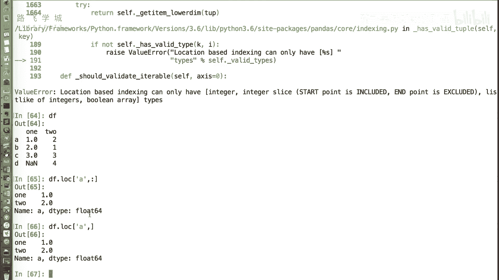
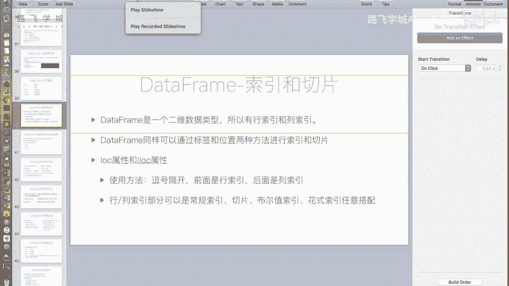
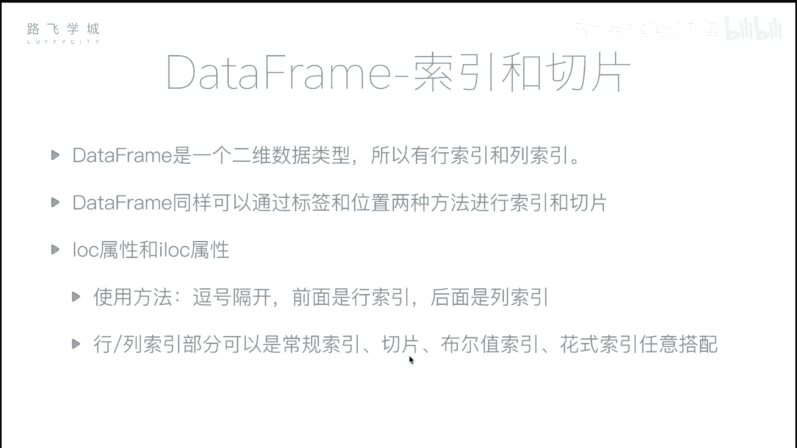
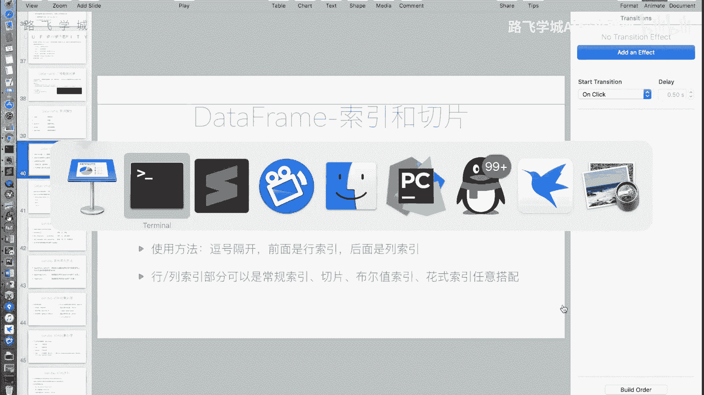
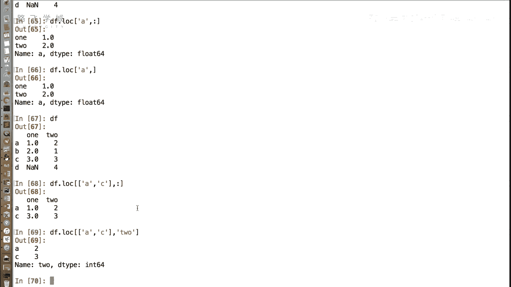
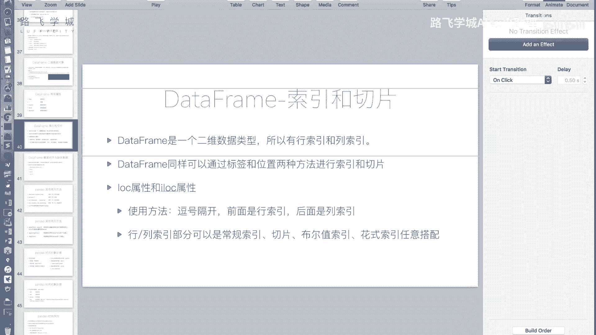

# Python金融量化：P21：DataFrame索引和切片 📊

在本节课中，我们将要学习如何从Pandas的DataFrame对象中获取数据。DataFrame是一个二维表格型数据结构，理解其索引和切片操作是进行数据分析的基础。我们将重点介绍使用`.loc`和`.iloc`属性进行数据访问的正确方法。

上一节我们介绍了DataFrame的一些常用属性，本节中我们来看看如何获取DataFrame中的具体数值。

## 索引基础：使用中括号

和Series对象类似，DataFrame也可以通过中括号`[]`来获取值。但需要注意的是，使用中括号时，默认是先传递列索引，再选择行索引。这与二维数组（先选行，再选列）的访问顺序不同，更类似于数据库查询中先选择列（`SELECT`）的逻辑。

例如，假设有一个DataFrame `df`，要获取列`‘one’`和行`‘A’`交叉处的值，可以写作：
```python
df['one']['A']
```
然而，当行索引也是整数时，这种连续使用中括号的方式容易产生混淆和错误，因此并不推荐。

## 推荐方法：使用 `.loc` 和 `.iloc`

为了避免混淆，我们建议根据索引类型（标签或位置）明确使用`.loc`或`.iloc`属性，并且避免连续使用两个中括号。

以下是这两种属性的核心区别：
*   **`.loc`**：基于**标签**进行索引。
*   **`.iloc`**：基于**整数位置**进行索引。

它们的通用语法是：
```python
df.loc[行索引, 列索引]
df.iloc[行位置, 列位置]
```
使用逗号分隔行和列，顺序是**先行后列**，这与常规的二维数组思维一致。



### 使用 `.loc` 获取单个值

要更安全地获取之前例子中的值（标签`‘A’`行，`‘one’`列），应使用：
```python
df.loc['A', 'one']
```





### 使用 `.loc` 获取整行或整列

如果想获取某一整行或整列的数据，可以结合切片操作。

以下是获取整行`‘A’`所有数据的示例：
```python
df.loc['A', :]  # 冒号`:`表示选取所有列
```
如果想获取整列`‘one’`的所有数据，则更简单：
```python
df['one']  # 这将返回一个Series对象
```





### 使用 `.iloc` 按位置访问

`.iloc`的用法与`.loc`类似，但传入的是整数位置。例如，获取第一行（位置0）、第二列（位置1）的数据：
```python
df.iloc[0, 1]
```



## 灵活的切片与索引组合



DataFrame的索引功能非常强大，允许在行和列部分混合使用多种索引方式。

在行索引和列索引的部分，你可以使用：
*   单个标签或位置。
*   切片（如 `‘A’:‘C’` 或 `0:2`）。
*   布尔值索引（用于条件过滤）。
*   花式索引（传递一个索引列表）。

这些方式可以任意搭配，实现灵活的数据选取。



以下是几个组合示例：
*   **选择指定的多行和某一列**：
    ```python
    df.loc[['A', 'C'], 'two']  # 选取A行和C行，以及‘two’列
    ```
*   **选择指定的行和多列切片**：
    ```python
    df.loc[['A', 'B'], 'one':'three']  # 选取A行和B行，以及从‘one’到‘three’的列
    ```
*   **使用`.iloc`进行类似的位置选择**：
    ```python
    df.iloc[[0, 2], 1:3]  # 选取第1、3行，以及第2到第3列（不包含第4列）
    ```



本节课中我们一起学习了DataFrame的核心数据访问方法。我们明确了使用`.loc`（基于标签）和`.iloc`（基于位置）是比连续中括号更清晰、更安全的做法。通过行、列索引的灵活组合，包括单个值、切片、布尔索引和花式索引，我们可以高效精准地从DataFrame中提取出所需的任何数据子集，为后续的数据清洗和分析打下坚实基础。