# Python金融量化分析：P21：Matplotlib介绍 📊

在本节课中，我们将要学习Python三大数据分析工具包中的最后一个——Matplotlib。这是一个用于数据可视化的强大工具包，能够帮助我们绘制各种图表，使数据分析结果更加直观。

---

## 什么是Matplotlib？🤔

Matplotlib是一个强大的Python绘图和数据可视化工具包。简而言之，它是用来画图的。在金融分析或数据分析中，我们通常需要将数据（如股票价格）以图表形式展示，这比查看一堆表格数据要直观得多。

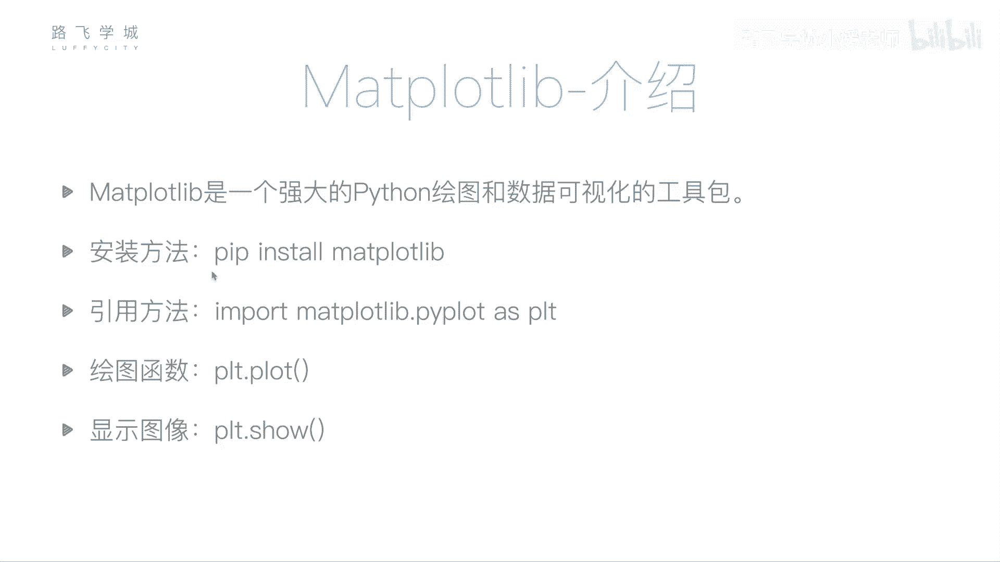

安装Matplotlib的方法依然是使用pip命令。

```bash
pip install matplotlib
```

---

## 如何使用Matplotlib？🛠️

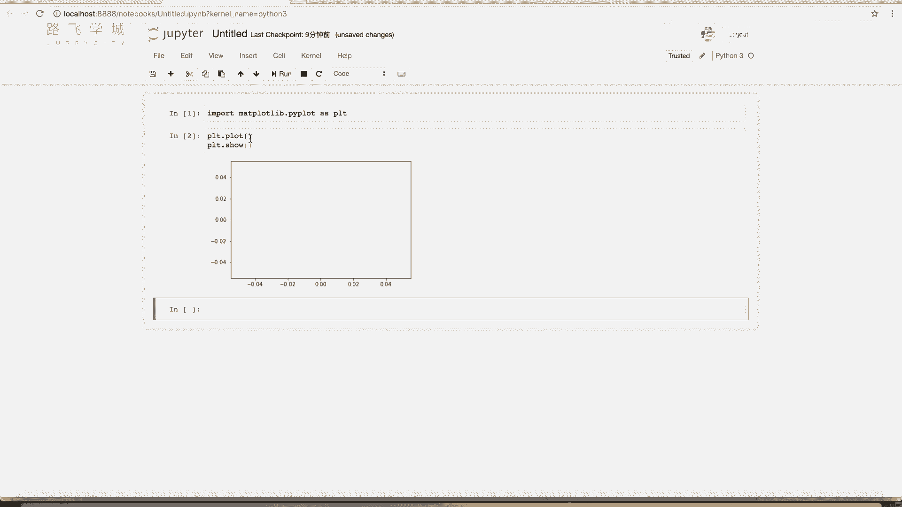

我们将主要使用Jupyter Notebook进行演示。引入Matplotlib时，通常导入其子模块`pyplot`，并简写为`plt`。

```python
import matplotlib.pyplot as plt
```

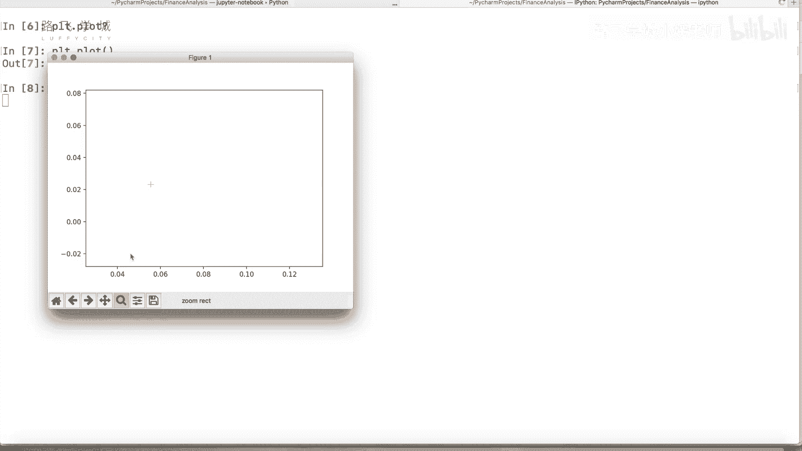

`plt.plot()`函数用于绘图，`plt.show()`函数用于展示图形。如果直接运行以下代码，会得到一个空白的图像框。


```python
plt.plot()
plt.show()
```

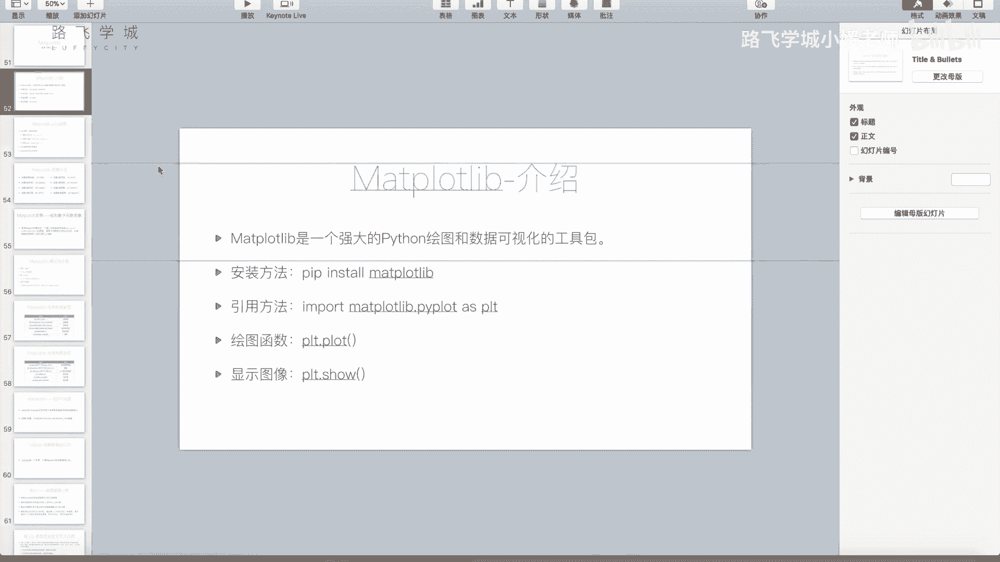

在命令行或某些IDE中运行，`plt.show()`会弹出一个独立的图形窗口，你可以对其进行拖动、缩放等操作。

---

## 绘制折线图 📈

`plt.plot()`函数最基本的功能是绘制折线图。它需要传入两个参数：X轴坐标列表和Y轴坐标列表。

例如，传入两个列表`[1, 2, 3, 4]`和`[2, 4, 6, 8]`，程序会将点(1,2)、(2,4)、(3,6)、(4,8)连接起来，形成一条直线。

```python
plt.plot([1, 2, 3, 4], [2, 4, 6, 8])
plt.show()
```

如果修改Y轴数据，例如改为`[2, 3, 1, 4]`，则会得到一条折线。

```python
plt.plot([1, 2, 3, 4], [2, 3, 1, 4])
plt.show()
```

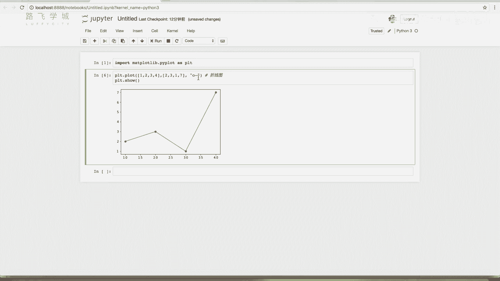

除了列表，也可以传入NumPy数组作为参数。

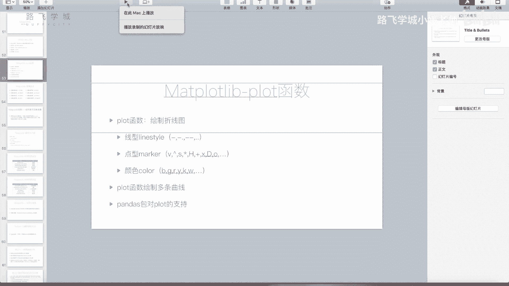

---

## 自定义图表样式 🎨

`plt.plot()`函数还有第三个可选参数，它是一个格式字符串，用于控制折线图的线条样式、标记点形状和颜色。

以下是格式字符串的构成部分：
*   **线条样式 (linestyle)**：控制线条是实线、虚线还是点线。
*   **标记点样式 (marker)**：控制数据点的显示形状。
*   **颜色 (color)**：控制线条和标记点的颜色。


例如，`‘o’`表示只显示圆点，不显示连线。`‘-o’`表示显示实线并将数据点标记为圆点。


```python
plt.plot([1, 2, 3, 4], [2, 4, 6, 8], ‘-o’)
plt.show()
```

你也可以使用关键字参数来分别指定这些属性，这样代码可读性更高。

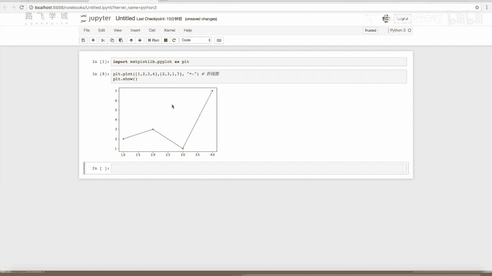

```python
plt.plot([1, 2, 3, 4], [2, 4, 6, 8], color=‘red’, linestyle=‘--’, marker=‘v’)
plt.show()
```

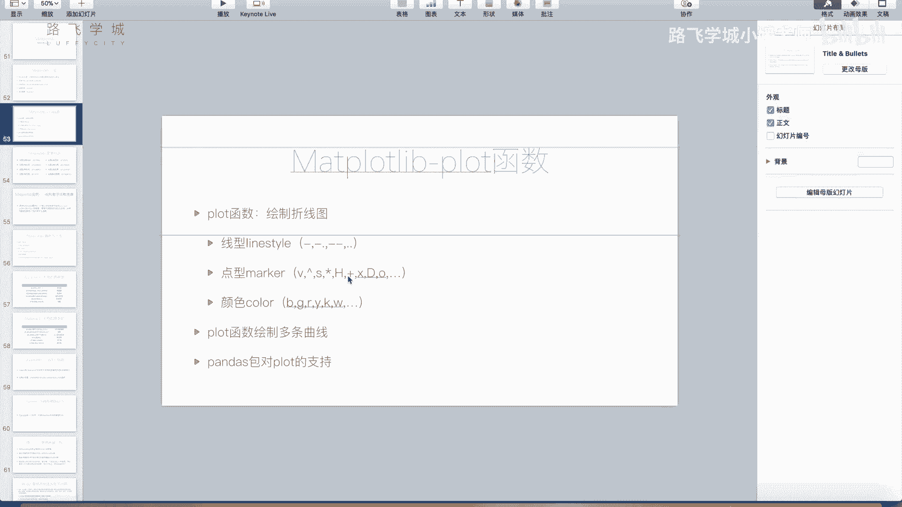

以下是常见的样式选项：

**线条样式示例：**
*   `‘-‘`：实线
*   `‘--‘`：虚线
*   `‘:’`：点线

**标记点样式示例：**
*   `‘o’`：圆点
*   `‘v’`：倒三角形
*   `‘^’`：正三角形
*   `‘*’`：五角星
*   `‘+’`：加号
*   `‘x’`：叉号
*   `‘d’`：菱形
*   `‘h’`：六边形

**颜色简写示例：**
*   `‘b’`：蓝色
*   `‘g’`：绿色
*   `‘r’`：红色
*   `‘y’`：黄色
*   `‘k’`：黑色
*   `‘w’`：白色

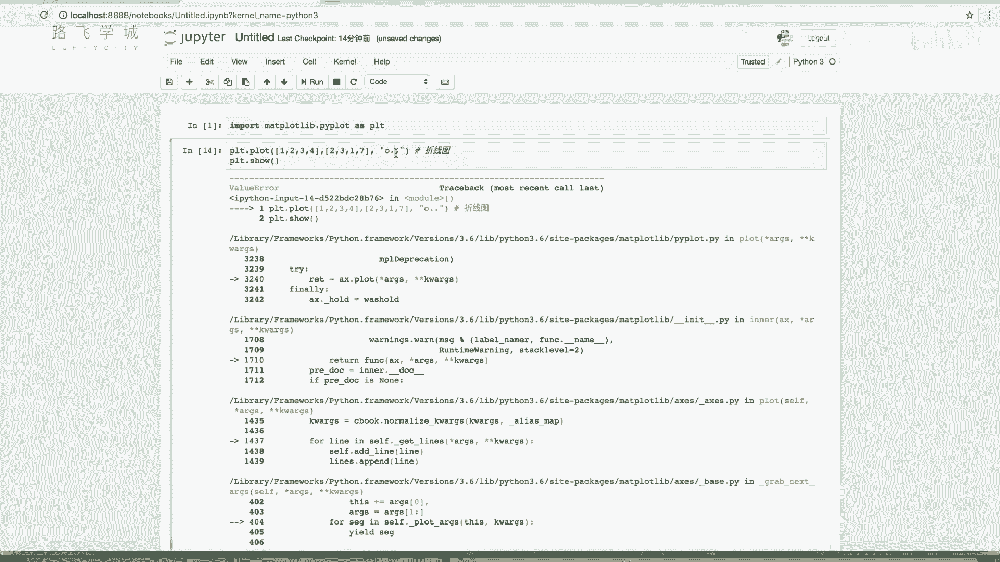

更多详细的样式选项可以参考Matplotlib的官方文档或使用`help(plt.plot)`命令查看。

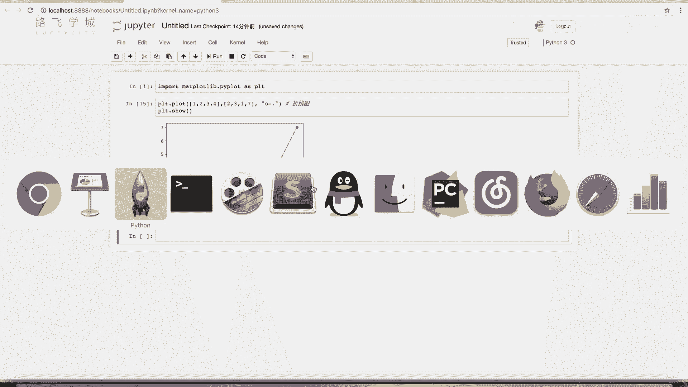

---

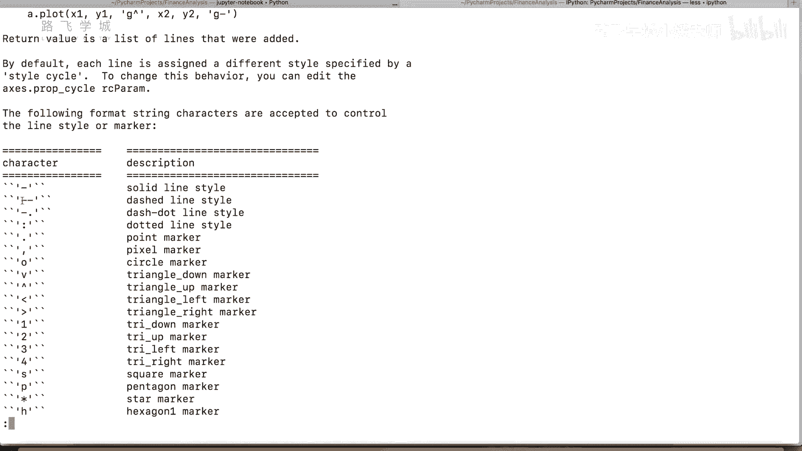

## 高级功能 🚀

上一节我们介绍了如何绘制一条基本的折线图。本节中，我们来看看一些更复杂的使用场景。

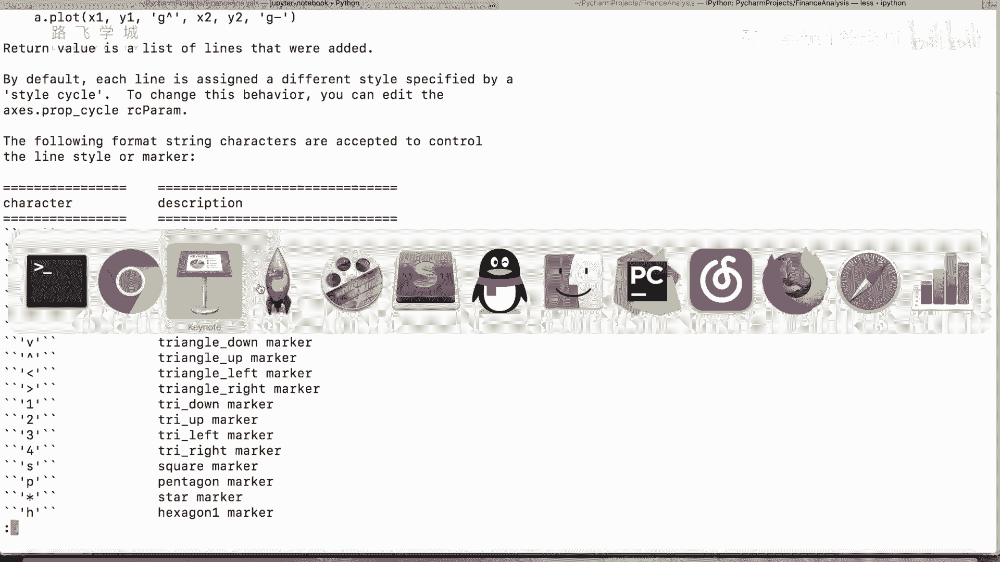

### 在同一图形中绘制多条线

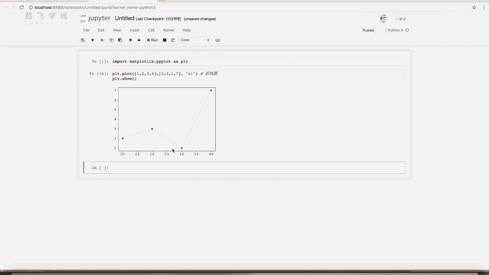

要在一个图形中绘制多条线，只需多次调用`plt.plot()`函数，最后执行一次`plt.show()`即可。

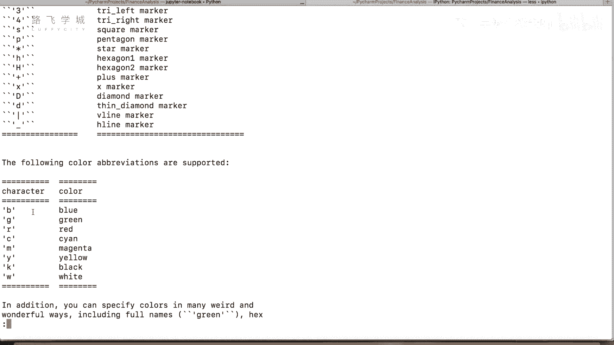

```python
# 绘制第一条线
plt.plot([1, 2, 3, 4], [1, 4, 9, 16], ‘r-^’, label=‘Line 1’)
# 绘制第二条线
plt.plot([1, 2, 3, 4], [2, 5, 10, 17], ‘b--o’, label=‘Line 2’)

plt.legend() # 显示图例
plt.show()
```

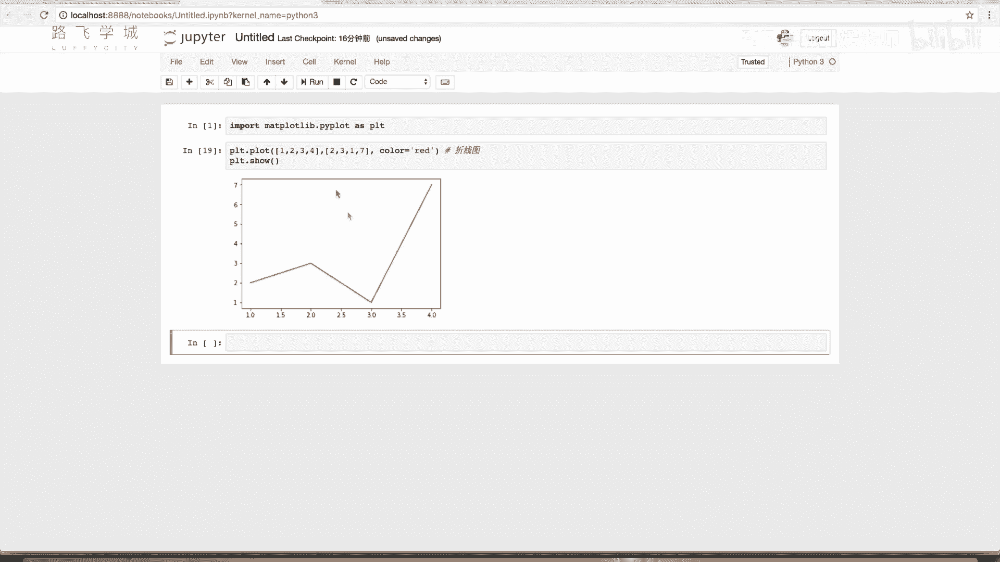

通过`label`参数为每条线命名，并使用`plt.legend()`函数可以显示图例，方便区分不同的数据系列。


---

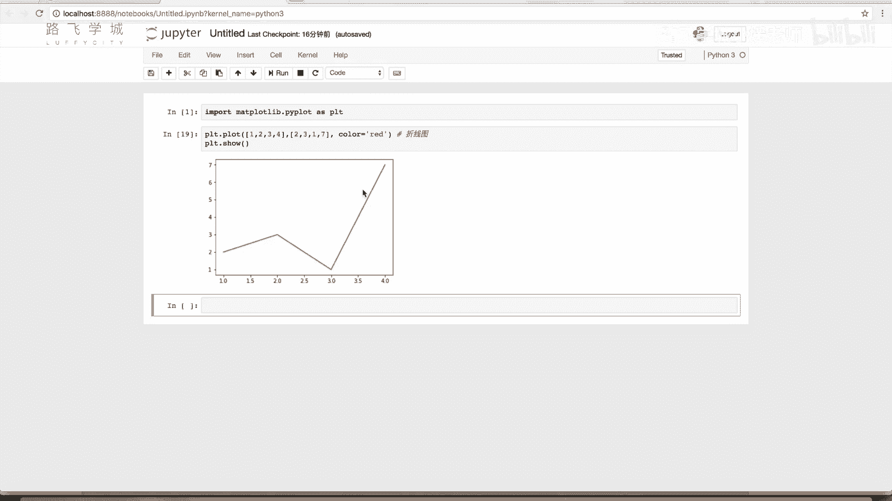

## 总结 📝

本节课中，我们一起学习了Matplotlib的基本使用方法。我们了解了Matplotlib是一个用于数据可视化的工具包，学会了如何使用`plt.plot()`和`plt.show()`函数绘制基础的折线图，并掌握了如何通过格式字符串或关键字参数来自定义图表的线条、标记点和颜色。最后，我们还学习了如何在同一张图中绘制多条线并添加图例。掌握这些基础是进行更复杂金融数据图表分析的第一步。