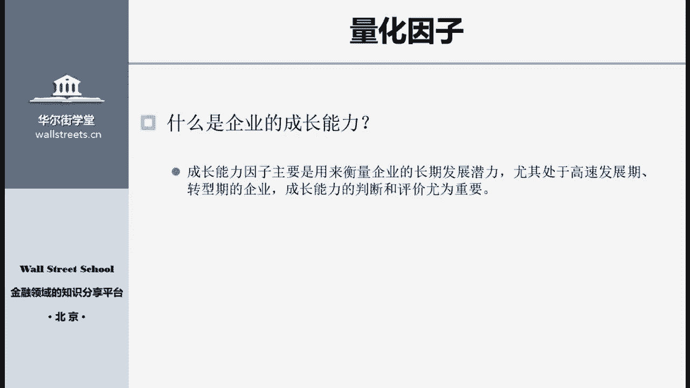
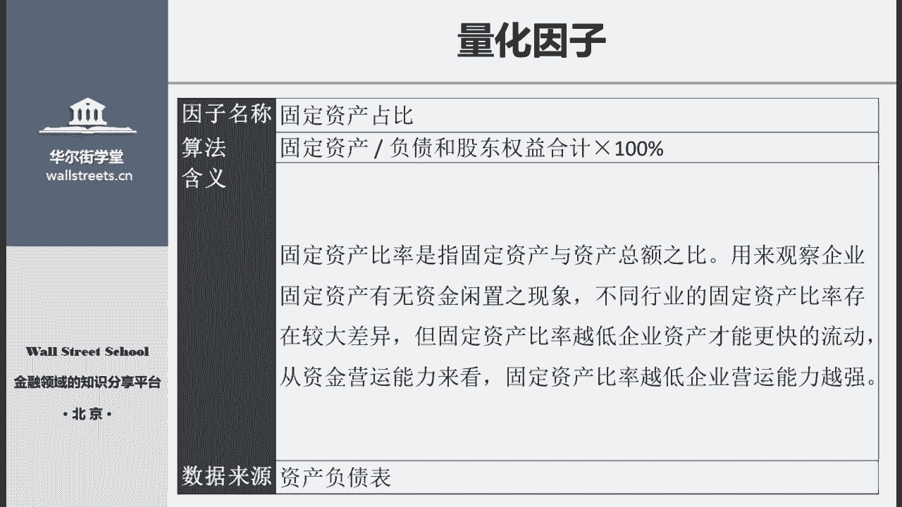
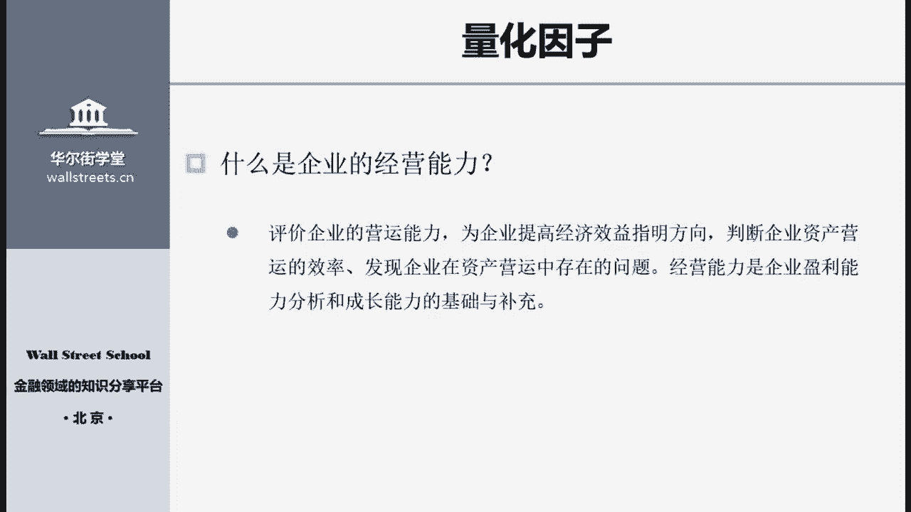
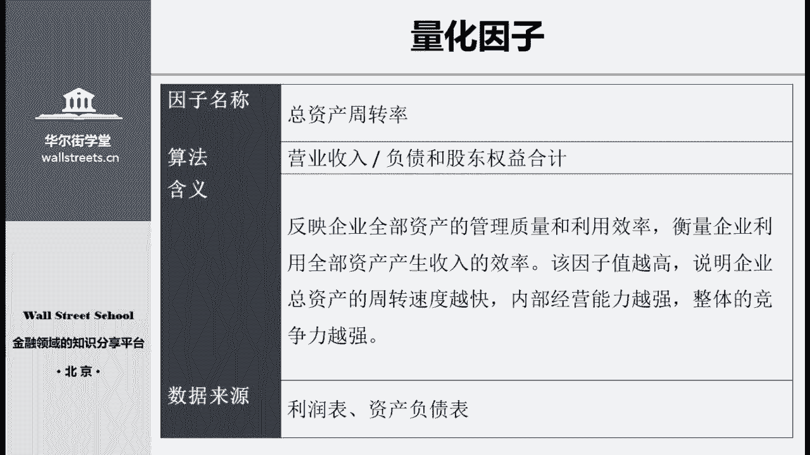
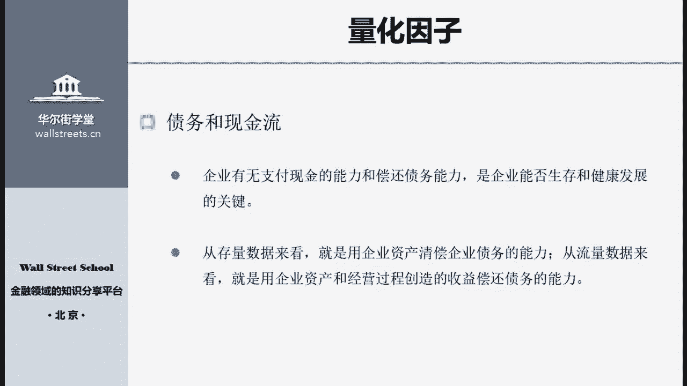
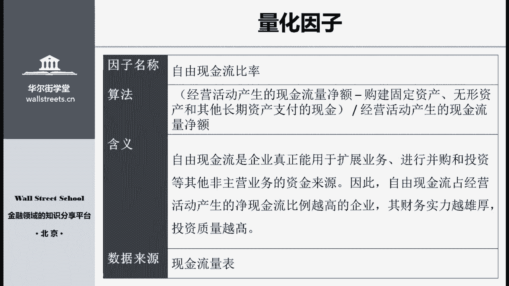
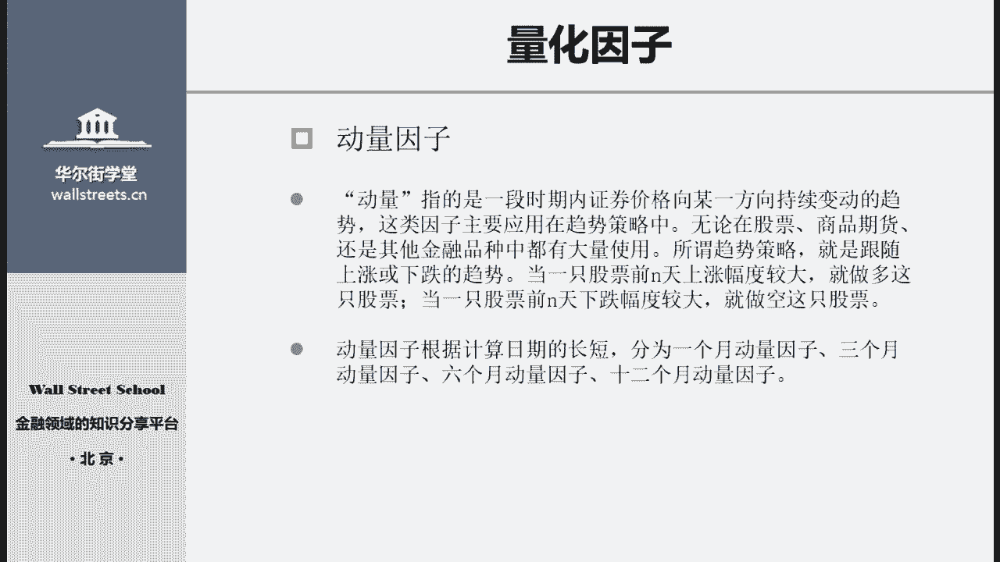
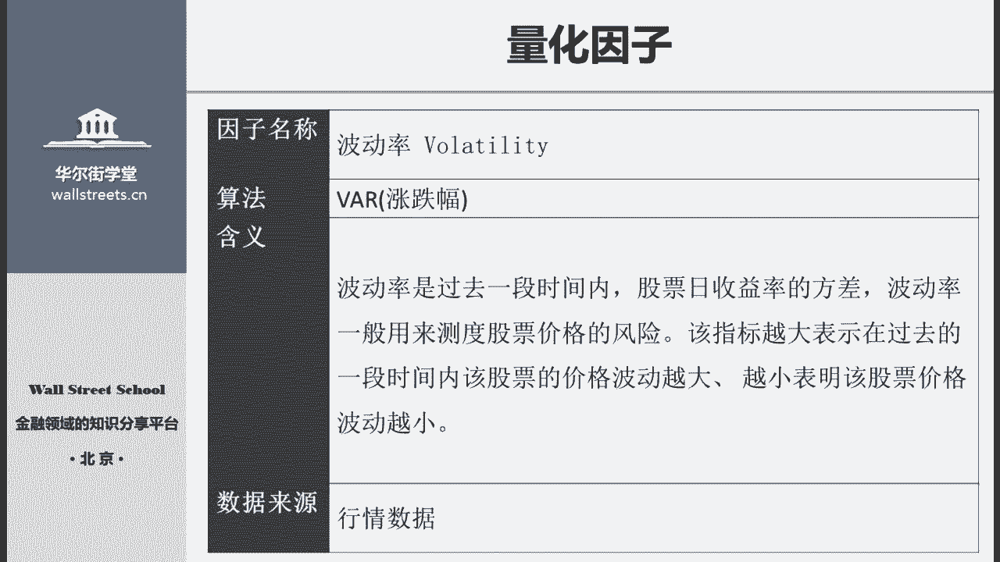

# Python金融量化：P22：05 量化因子

## 概述
在本节课中，我们将学习量化投资中两类核心因子：基本面因子与技术面因子。我们将详细介绍盈利能力、成长能力、经营能力、债务与现金流等基本面因子，以及动量、换手率、波动率等技术面因子的定义、计算方法和应用场景。

---

## 基本面因子：盈利能力

上一节我们介绍了估值因子，本节中我们来看看基本面因子中的盈利能力因子。企业的盈利能力指其赚取利润的能力。

从外部看，利润是股票价格上涨的根基，也是投资者收益的来源。从内部看，盈利能力是管理层经营业绩和管理能力的集中表现。因此，盈利能力分析十分重要，盈利因子是量化策略中判断企业价值的重要部分。

以下是五个常用的盈利能力因子：

1.  **资本收益率**
    *   **公式**：`ROE = 净利润 / 股东权益合计`
    *   该因子衡量公司运用自有资本（股东权益）获取收益的效率。值越大，说明资本利用效率越高。但需注意，ROE未考虑债务杠杆的影响，应结合其他因子综合使用。

2.  **资产回报率**
    *   **公式**：`ROA = 净利润 / (负债合计 + 股东权益合计)`
    *   该因子综合衡量公司利用全部资产（包括自有资本和债务资本）获取回报的效率。ROA越高，整体盈利能力越强。

3.  **主营业务毛利率**
    *   **公式**：`毛利率 = (营业收入 - 营业成本) / 营业收入`
    *   该因子反映公司产品的竞争力和初始获利能力，以及公司对原材料的利用效率。毛利率显著高于同行，通常意味着公司有较强的议价能力或品牌效应。

4.  **主营业务利润率**
    *   该因子在毛利率基础上，进一步扣除其他内部成本，直接反映企业主营业务的盈利能力。

5.  **净利润率**
    *   **公式**：`净利润率 = 净利润 / 营业收入`
    *   该因子直接、简单地衡量企业将销售额转化为最终利润的能力，非常直观和常见。

---

## 基本面因子：成长能力

了解盈利能力后，我们进一步探讨成长能力因子。成长能力主要衡量企业长期的发展潜力，对于处于高速发展期或转型期的企业尤为重要。

例如，一些互联网公司当期可能亏损，但因将大量收入投入研发或扩张，未来盈利潜力巨大，其高估值便源于优秀的成长能力。

以下是两个常用的成长能力因子：

1.  **营业收入同比增长率**
    *   **公式**：`增长率 = (当期营业收入 - 上期营业收入) / 上期营业收入 * 100%`
    *   该因子检验公司挣钱能力是否提高。对于成长型企业，即使暂时亏损，营业收入也常保持高速增长。

2.  **固定资产占比**
    *   **公式**：`固定资产占比 = 固定资产 / (负债合计 + 股东权益合计) * 100%`
    *   该比率反映企业资产中固定资产的比重。比率增大可能意味着企业在扩张，但也可能意味着资金被大量占用。分析时需结合行业特性，重资产行业该比率通常较高。

---

## 基本面因子：经营能力

接下来我们介绍经营能力因子。经营能力是从内部评价企业运营效率的指标，分析相对复杂，需要结合行业特性。

以下是三个常用的经营能力因子：

1.  **存货周转率**
    *   **公式**：`存货周转率 = 营业收入 / 平均存货`
    *   该因子反映存货周转速度和销售能力。周转率越高，通常说明销售能力越强、运营越顺畅。分析时需进行同行业对比。

2.  **应收账款周转率**
    *   **公式**：`应收账款周转率 = 营业收入 / 平均应收账款`
    *   该因子代表企业应收账款变现的速度和效率。周转率高，说明回款快，资金使用效率高，对企业发展有利。

3.  **总资产周转率**
    *   **公式**：`总资产周转率 = 营业收入 / (负债合计 + 股东权益合计)`
    *   该因子反映企业全部资产的管理质量和利用效率，衡量企业利用所有资产产生收入的效率。值越高，说明资产周转速度越快，经营能力越强。

---

## 基本面因子：债务与现金流能力

前面介绍的因子主要衡量企业的价值创造能力。而债务与现金流因子则主要衡量企业面临的风险以及持续经营的能力。

即使企业盈利和成长能力优秀，若现金流断裂或无法偿还债务，仍可能破产。因此，这类因子关乎企业的生存底线。

以下是四个相关的因子：

1.  **流动比率**
    *   **公式**：`流动比率 = 流动资产合计 / 流动负债合计`
    *   该因子衡量企业的短期偿债能力，即一年内到期的债务有多少资产可以用于偿还。比率越高，短期违约风险越小。

2.  **资产负债率**
    *   **公式**：`资产负债率 = 总负债 / 总资产`
    *   该因子反映企业的债务杠杆水平。比率上升意味着风险增加，但也可能伴随着获取更高收益的能力。需结合盈利和现金流情况综合判断。

3.  **利息保障倍数**
    *   **公式**：`利息保障倍数 = 息税前利润 / 利息费用`
    *   该因子衡量企业偿付借款利息的能力。倍数越高，说明企业通过日常经营利润覆盖利息支出的能力越强。

4.  **自由现金流比率**
    *   **公式**：`自由现金流比率 = (经营活动现金流量净额 - 资本支出) / 经营活动现金流量净额`
    *   该因子计算企业经营活动产生的现金中，有多少可自由支配用于拓展、并购或投资。比率越高，企业财务实力越雄厚。

---

## 技术面因子

以上我们详细介绍了各类基本面因子。接下来，我们看看另一大类因子：技术面因子。

技术面因子主要由技术分析得来，侧重于分析股价本身的变动趋势和市场交易行为，如价格、成交量等。它们不直接衡量企业价值，但可用于间接判断股价未来的短期变动趋势。技术面因子种类繁多，我们主要介绍实践中较为有效的量价因子。

以下是四个常用的技术面因子：

1.  **动量因子**
    *   **公式（以一个月动量为例）**：`一个月动量 = (当前收盘价 - 一个月前收盘价) / 一个月前收盘价`
    *   动量指股价向某一方向持续变动的趋势。根据计算周期分为一个月、三个月等。不同周期的动量因子可能适用于趋势策略或反转策略，需通过历史数据回测验证。

2.  **换手率**
    *   **公式**：`换手率 = 一定时期内成交量 / 流动股股数`
    *   该因子反映股票流动性强弱和交易活跃程度。换手率高说明股票受关注度高，其趋势持续性可能更强。

3.  **波动率**
    *   **公式**：`波动率 = 过去一段时间内日收益率的标准差`
    *   该因子衡量股票价格波动的剧烈程度，代表股票的风险度。波动率大，说明价格起伏大，趋势持续性可能较弱；波动率小，则趋势可能更稳定。

---

## 总结
本节课我们一起学习了量化投资中的核心因子。我们详细介绍了基本面因子中的**盈利能力**、**成长能力**、**经营能力**、**债务与现金流能力**四大类共十多个具体因子及其计算公式。随后，我们介绍了技术面因子中的**动量**、**换手率**、**波动率**等因子。基本面因子主要用于判断企业的长期价值，而技术面因子则辅助判断短期的交易时机。理解这些因子的含义和计算方法是构建量化策略的基础，在后续课程中，我们将学习如何使用代码实际计算和运用这些因子。