# Python金融量化投资分析与股票交易：P22：Series小结 📊

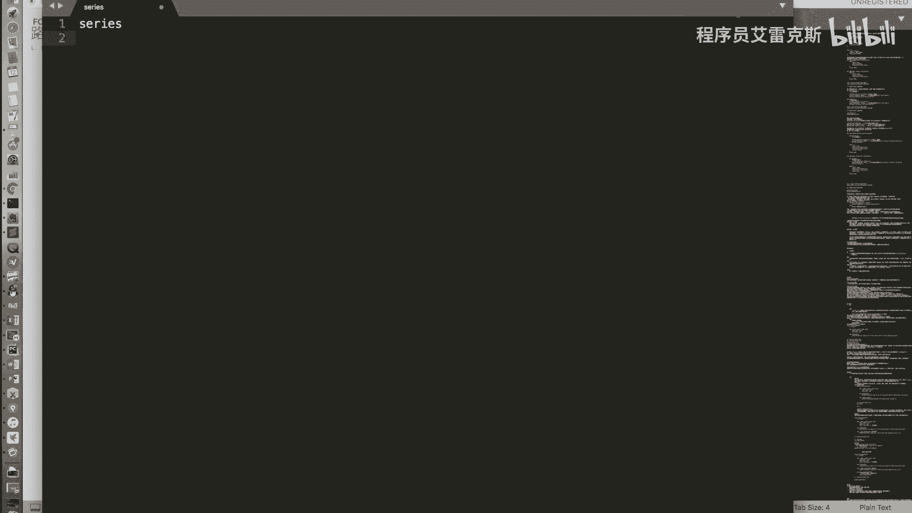

在本节课中，我们将对Pandas库中的第一个核心数据结构——Series进行总结。我们将回顾其核心特性、关键操作以及数据处理方法，帮助初学者巩固对Series对象的理解。

## Series的本质：字典与数组的集合体

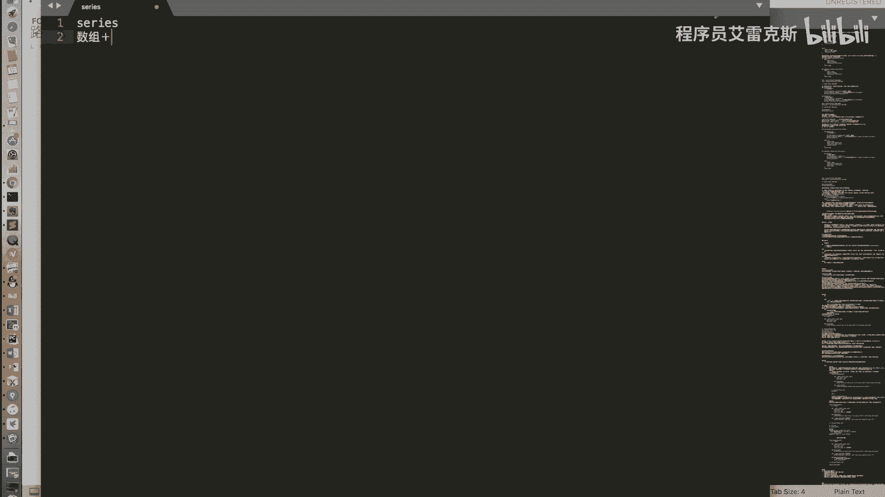

上一节我们介绍了Series的基本操作，本节中我们来看看如何总结它的核心特性。Series是一个结合了字典（键值对）和数组（有序序列）特性的数据结构。它既可以通过类似数组的整数下标进行访问，也可以通过类似字典的标签（索引）进行访问。

以下是Series的核心特性：

*   **字典特性**：支持通过标签（索引）访问值，并支持`in`操作来检查标签是否存在。
*   **数组特性**：支持通过整数下标进行索引、切片、布尔值索引等操作。

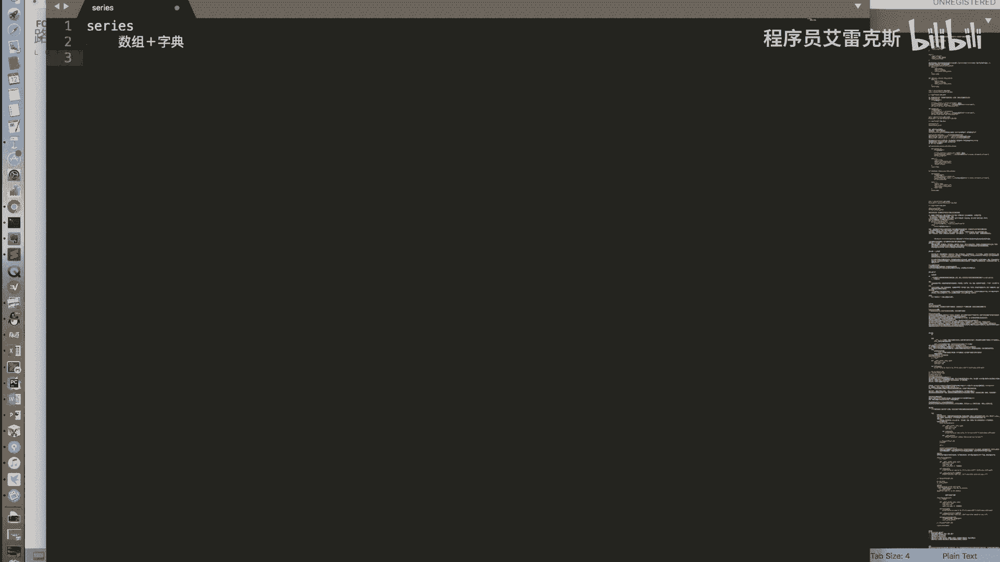

## 整数索引的歧义与解决方案

当Series的索引为整数时，使用中括号`[]`进行访问可能会产生歧义：Python可能将其解释为基于位置的数组下标，也可能解释为基于标签的字典键。

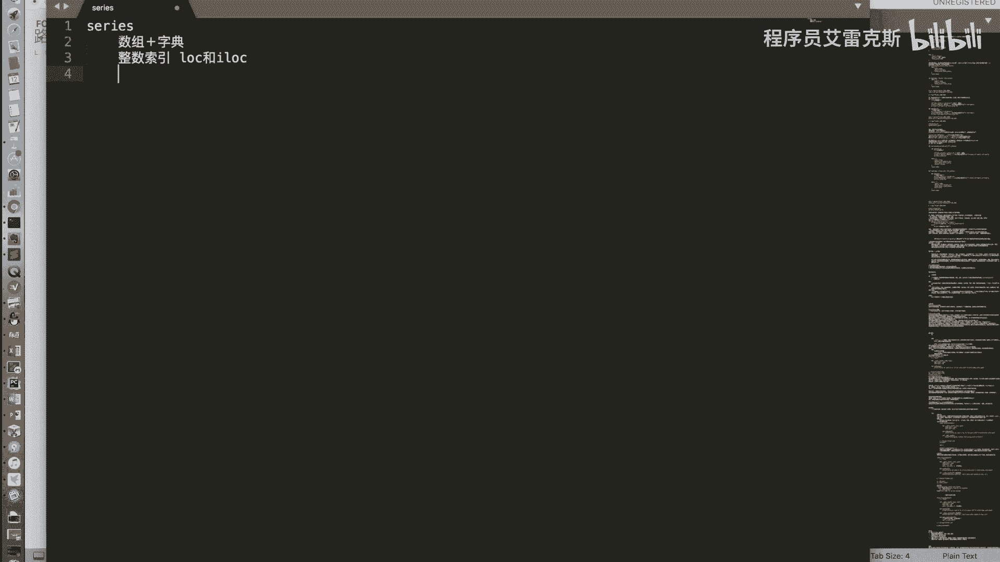

为了解决这个问题，我们引入了两个重要的属性来明确指定访问方式：

*   **`.iloc`**：用于**纯基于整数位置**的索引。例如，`series.iloc[0]`总是获取第一个元素。
*   **`.loc`**：用于**基于标签**的索引。例如，`series.loc[5]`是获取索引标签为`5`的值，而不是第六个元素。

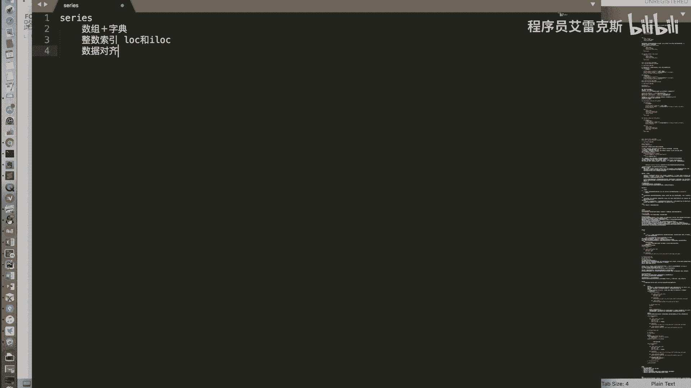

## 数据对齐与缺失值处理

在上一部分我们解决了索引问题，接下来我们探讨Series运算中的一个重要概念：数据对齐。当两个Series对象进行加减乘除等运算时，Pandas会按照它们的**标签**进行自动对齐，然后对标签匹配的值进行运算。

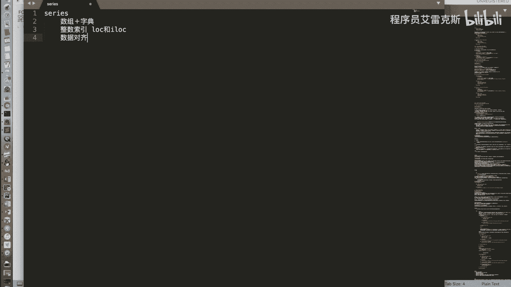

数据对齐可能导致缺失值的产生。例如，如果一个Series有标签`A`，而另一个没有，那么在结果中，标签`A`对应的值就会成为缺失值（NaN）。

以下是处理缺失数据的两种常用方法：

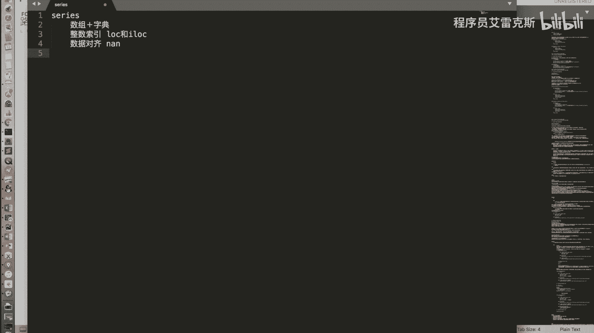

*   **删除缺失值**：使用`.dropna()`函数可以删除所有包含NaN的行。
*   **填充缺失值**：使用`.fillna(value)`函数可以将所有NaN位置填充为指定的值（例如`0`或平均值）。

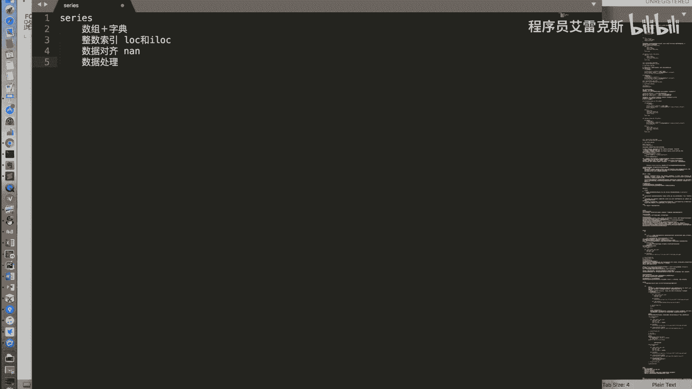

## Series的功能继承

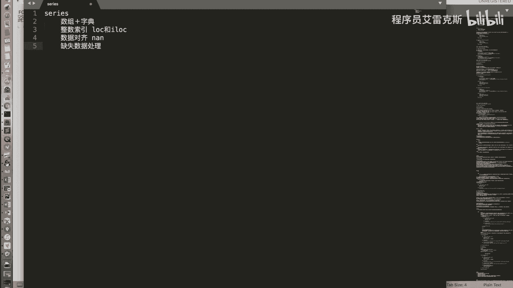

除了我们介绍的这些Pandas特有功能（如数据对齐、`.iloc`/`.loc`），Series对象还继承了其底层NumPy数组的众多强大功能。

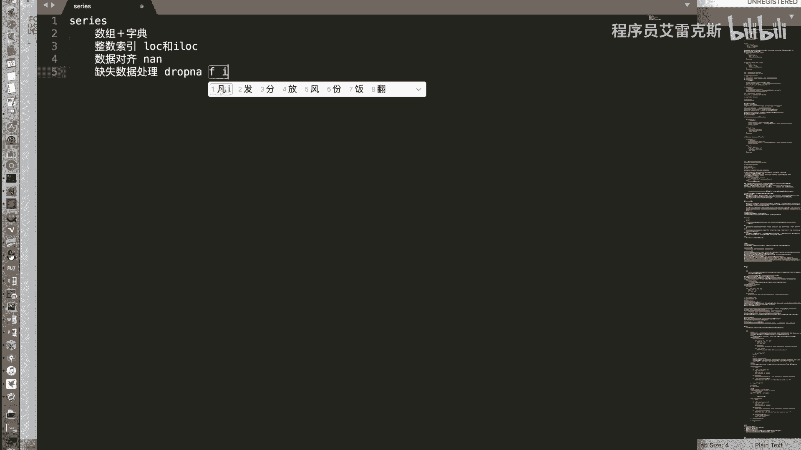

以下是它从NumPy继承的部分功能：

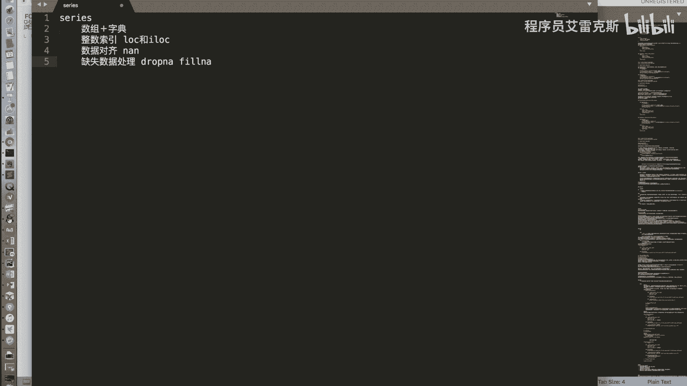

*   **布尔型索引**：通过一个布尔值数组来筛选数据。
*   **向量化运算**：支持两个Series之间或Series与标量之间的逐元素运算（如加减乘除）。
*   **通用函数（ufunc）**：支持NumPy的数学函数，如`np.sqrt(series)`会对每个元素求平方根。

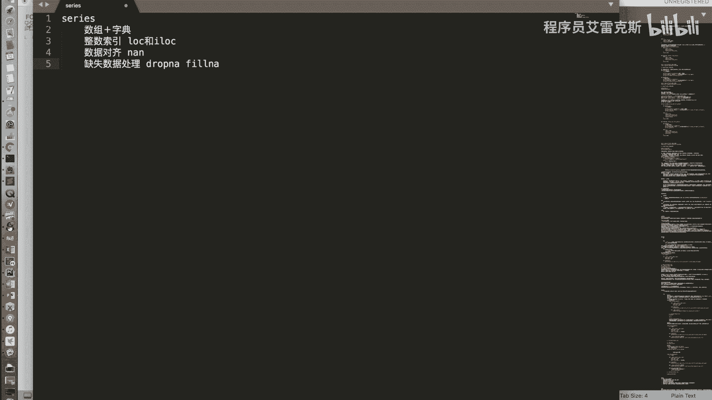

## 总结

本节课中我们一起学习了Pandas Series对象的全面总结。我们明确了Series是字典和数组的混合体，理解了整数索引的歧义并通过`.iloc`和`.loc`属性解决。我们还掌握了数据对齐的规则及其导致的缺失值问题，并学会了使用`.dropna()`和`.fillna()`进行处理。最后，我们了解到Series的强大功能很大程度上源于其对NumPy数组功能的继承。掌握Series是后续学习更复杂的DataFrame对象的基础。