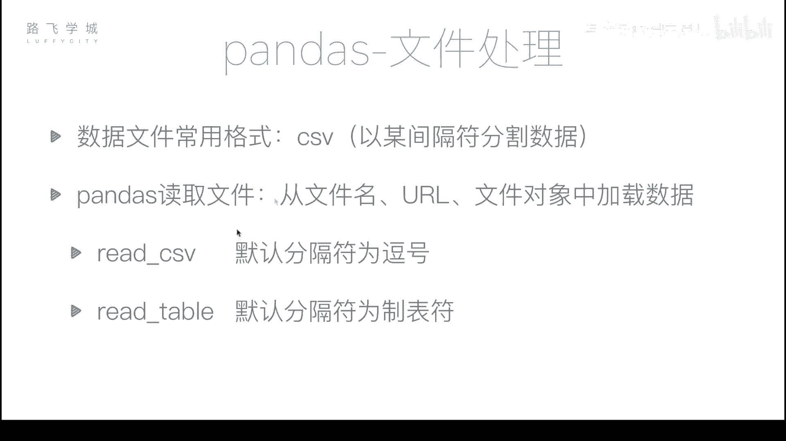
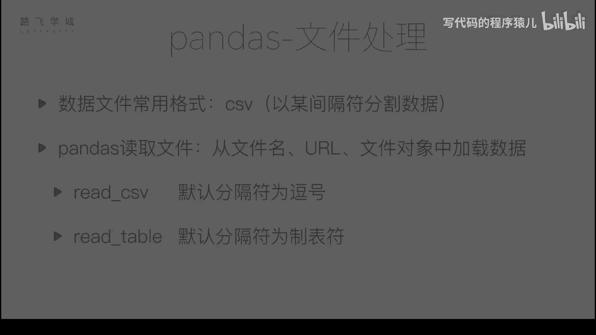
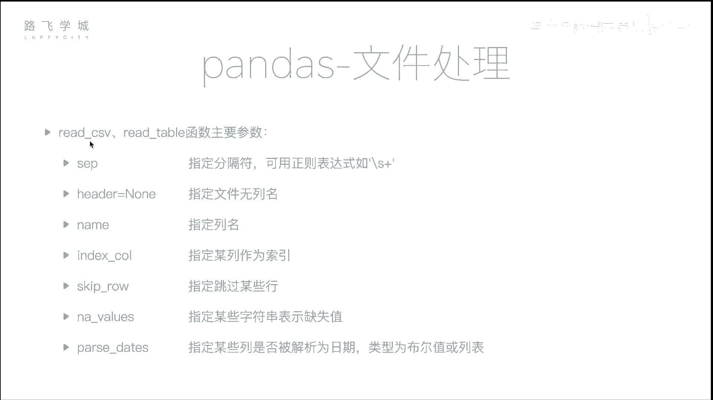

# Python金融量化：P22：文件读取 📂

在本节课中，我们将学习如何使用Pandas库读取外部文件数据。这是数据分析中至关重要的一步，因为真实世界的数据通常存储在文件中，而非手动输入。

## 概述

到目前为止，我们已经学习了Pandas的多种功能，包括灵活的数据操作、数据对齐、缺失数据处理和时间序列等。最后一部分是文件处理。在日常编程中，我们通常不会手动输入数据来创建DataFrame对象，真实数据一般存储在文件中。因此，我们需要学习如何从文件中读取数据以及如何将数据写入文件。





## CSV文件格式

最常用的数据文件格式是CSV。CSV文件本质上是一个文本文件，其中每一行由逗号分隔。两个逗号之间的部分相当于Excel表格中的一个单元格，存储一个数据点。

`read_csv`函数可以将CSV文件的内容读取到Pandas中。

## 读取CSV文件

以下是一个示例文件，它包含了某支股票从2007年3月1日到2017年11月10日的行情数据。文件包含的列有：序号、时间、开盘价、收盘价、最高价、最低价、成交量和股票代码。

```python
import pandas as pd
df = pd.read_csv(‘stock_data.csv’)
```

执行上述代码后，数据被成功读取。但存在几个问题需要处理。

## 指定行索引

默认情况下，Pandas会为数据创建一个从0开始的整数索引。但有时我们希望使用数据中的某一列作为行索引。

可以使用`index_col`参数来指定哪一列作为索引。该参数可以接受列的位置编号（如0, 1, 2...）或列名。

```python
# 使用第一列（位置0）作为索引
df = pd.read_csv(‘stock_data.csv’, index_col=0)

# 使用‘date’列作为索引
df = pd.read_csv(‘stock_data.csv’, index_col=‘date’)
```

## 解析日期列

当使用日期列作为索引时，Pandas默认将其读取为字符串。为了进行时间序列分析，我们需要将其转换为时间对象。

`parse_dates`参数可以实现这一功能。它可以接受一个布尔值或一个列表。

```python
# 将所有可解析为日期的列转换为时间对象
df = pd.read_csv(‘stock_data.csv’, parse_dates=True)

# 仅将‘date’列转换为时间对象
df = pd.read_csv(‘stock_data.csv’, parse_dates=[‘date’])
```

转换后，`df.index`的类型将变为`DatetimeIndex`。

## 处理无列名的文件

如果CSV文件的第一行不是列名，而是数据本身，Pandas会默认将第一行解释为列名。这会导致数据错位。

`header`参数可以解决这个问题。将其设置为`None`，Pandas将自动生成列名（0, 1, 2...）。我们也可以使用`names`参数手动指定列名。

```python
# 文件无列名，自动生成
df = pd.read_csv(‘stock_data.csv’, header=None)

# 文件无列名，手动指定列名
column_names = [‘a’, ‘b’, ‘c’, ‘d’, ‘e’, ‘f’, ‘g’, ‘h’]
df = pd.read_csv(‘stock_data.csv’, header=None, names=column_names)
```

## `read_table`函数

除了`read_csv`，Pandas还提供了`read_table`函数。两者的主要区别在于默认分隔符：`read_csv`默认使用逗号，而`read_table`默认使用制表符（`\t`）。

两个函数都支持`sep`参数来指定分隔符，可以是字符（如冒号、空格）或正则表达式。

```python
# 使用read_table读取以制表符分隔的文件
df = pd.read_table(‘stock_data.tsv’)

# 指定分隔符为任意长度的空白字符（正则表达式）
df = pd.read_csv(‘stock_data.txt’, sep=‘\s+’)
```

## 其他常用参数

以下是`read_csv`和`read_table`函数中其他一些有用的参数：

*   **`skiprows`**: 跳过文件开头的指定行数。可以是一个整数（如3）或一个行号列表（如[1, 2, 3]）。
    ```python
    df = pd.read_csv(‘stock_data.csv’, skiprows=[1, 2, 3])
    ```

*   **`na_values`**: 指定哪些字符串应被解释为缺失值（NaN）。这对于处理非标准缺失值标记（如“N/A”、“NULL”、“-”）非常有用。
    ```python
    df = pd.read_csv(‘stock_data.csv’, na_values=[‘N/A’, ‘NULL’, ‘-’])
    ```

## 总结

本节课我们一起学习了如何使用Pandas读取外部文件数据。我们重点介绍了`read_csv`和`read_table`函数，并详细讲解了以下核心参数：
*   `index_col`: 指定行索引列。
*   `parse_dates`: 将列解析为日期时间对象。
*   `header` 和 `names`: 处理无列名文件。
*   `sep`: 指定分隔符。
*   `skiprows`: 跳过指定行。
*   `na_values`: 自定义缺失值标识。



掌握这些参数能帮助我们高效、准确地从各种格式的文件中加载数据，为后续的金融量化分析打下坚实的基础。