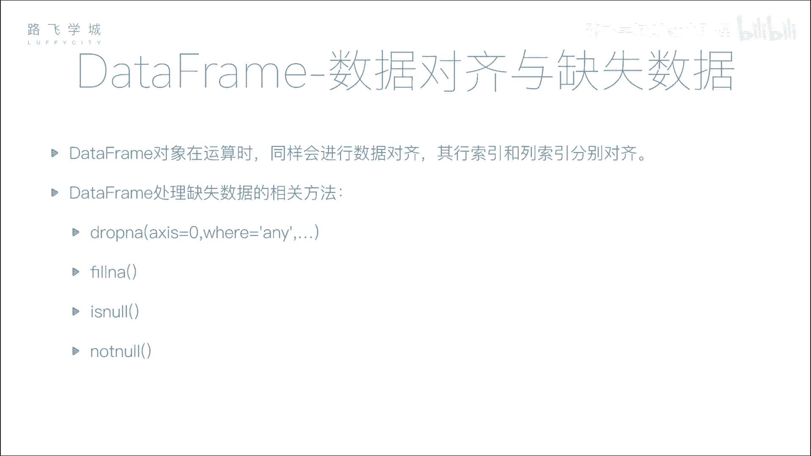
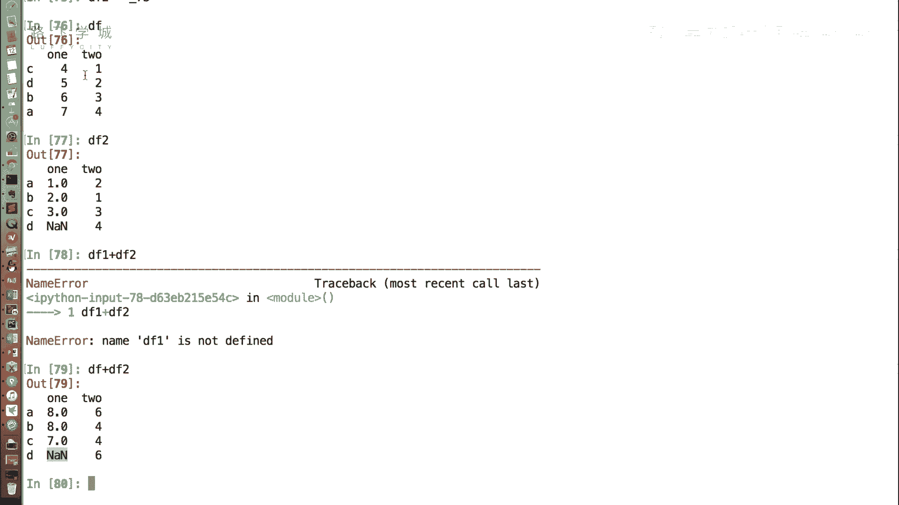
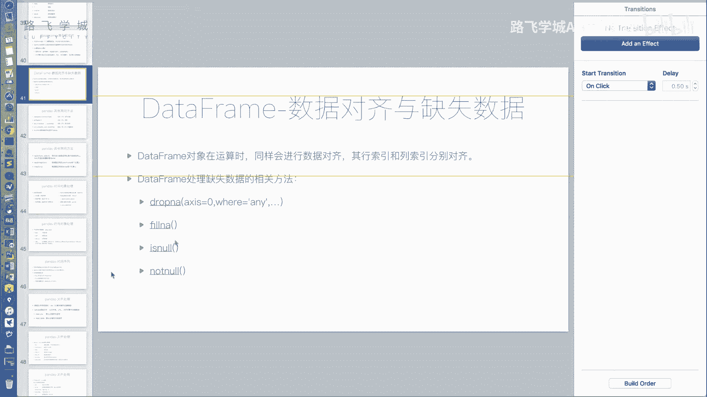
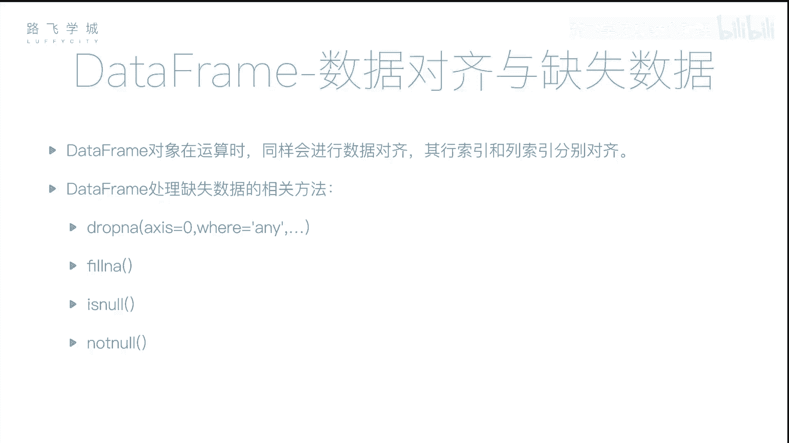
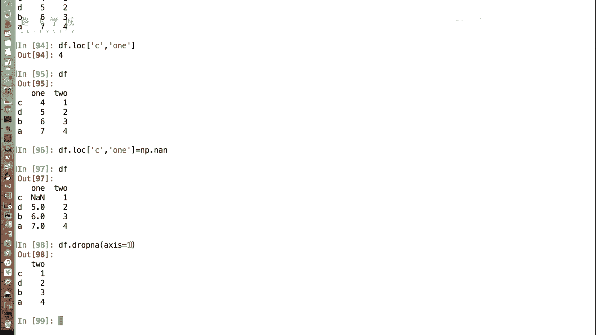
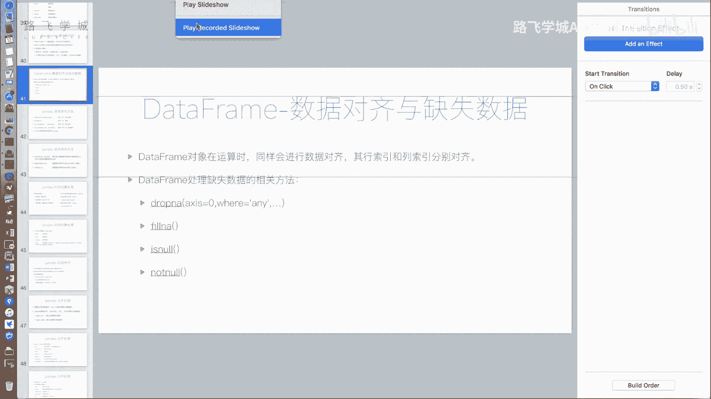
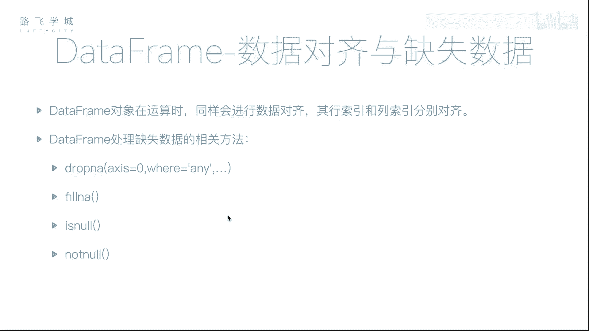

# Python金融量化：P22：DataFrame数据对齐与缺失数据处理 📊

在本节课中，我们将要学习`DataFrame`对象的数据对齐机制以及如何处理其中的缺失数据。`DataFrame`作为二维数据结构，其对齐和处理方式与`Series`有相似之处，但也存在一些重要的区别。



## 数据对齐机制 🔄

和`Series`对象一样，`DataFrame`也涉及数据对齐。由于`DataFrame`拥有行索引和列索引两个维度，因此需要按照这两个索引分别进行对齐。

例如，我们有两个`DataFrame`对象`df1`和`df2`，它们的行索引顺序不同。当执行`df1 + df2`操作时，Pandas会根据行索引和列索引自动对齐数据，然后进行计算。如果某个位置在其中一个`DataFrame`中是缺失值（NaN），那么运算结果在该位置也会是NaN。

```python
# 示例：DataFrame数据对齐
import pandas as pd
import numpy as np



df1 = pd.DataFrame({'A': [1, 2, 3], 'B': [4, 5, 6]}, index=['a', 'b', 'c'])
df2 = pd.DataFrame({'A': [7, 8, 9], 'B': [10, 11, 12]}, index=['b', 'c', 'a'])



result = df1 + df2
print(result)
```



## 缺失数据处理 🧹

`DataFrame`处理缺失数据的方法与`Series`对象大部分相似，但也存在关键的不同点。

### 填充缺失值

使用`fillna()`方法可以将缺失值填充为指定的值，这与`Series`的操作一致。

```python
# 示例：填充缺失值为0
df2_filled = df2.fillna(0)
```

### 删除缺失值

删除缺失值的主要方法是`dropna()`。这里是与`Series`处理方式不同的核心。

默认情况下，`df.dropna()`会删除**任何包含缺失值（NaN）的行**。这在某些情况下可能过于严格，因为我们可能希望只删除整行都是缺失值的记录。

`dropna()`方法有两个重要参数：
*   `how`： 决定删除行的条件。
*   `axis`： 决定是按行操作还是按列操作。

以下是`dropna()`方法参数的具体说明：

*   **`how=‘any’` (默认值)**： 如果某一行中**有任何**一个值是缺失值，则删除该整行。
*   **`how=‘all’`**： 只有当某一行中**所有**的值都是缺失值时，才删除该行。
*   **`axis`参数**： 默认为`axis=0`，表示按行操作。如果设置为`axis=1`，则方法会按列操作，即删除包含缺失值的列。

```python
# 创建一个包含缺失值的DataFrame
df = pd.DataFrame({
    'one': pd.Series([1., 2., 3.], index=['a', 'b', 'c']),
    'two': pd.Series([1., 2., np.nan, 4.], index=['a', 'b', 'c', 'd']),
    'three': pd.Series([np.nan, 6., 7., 8.], index=['a', 'b', 'c', 'd'])
})
print("原始DataFrame:")
print(df)

# 默认删除任何包含NaN的行
print("\n默认dropna() (how='any'):")
print(df.dropna())

# 只删除全部为NaN的行
print("\ndropna(how='all'):")
print(df.dropna(how='all'))

# 删除任何包含NaN的列
print("\ndropna(axis=1):")
print(df.dropna(axis=1))
```



## 总结 📝



本节课中我们一起学习了`DataFrame`的两个重要特性：数据对齐和缺失数据处理。

1.  **数据对齐**：`DataFrame`在进行运算时会根据行索引和列索引自动对齐数据，未对齐的位置会产生缺失值。
2.  **缺失数据处理**：
    *   使用`fillna(value)`可以填充缺失值。
    *   使用`dropna()`可以删除缺失值，其关键参数`how`和`axis`提供了灵活的删除策略。
        *   `how=‘any’`（默认）删除包含任何缺失值的行/列。
        *   `how=‘all’`仅删除全部为缺失值的行/列。
        *   `axis=0`（默认）按行操作，`axis=1`按列操作。



理解并熟练运用这些方法，是进行数据清洗、保证分析结果准确性的基础。