# Python金融量化：P22：plot函数周边

## 概述
在本节课中，我们将深入学习Matplotlib库中`plot`函数的周边功能。上一节我们介绍了`plot`函数的基本用法，本节中我们来看看如何绘制多条曲线，以及如何为图表添加标题、坐标轴标签、刻度、图例等元素，使图表更加完整和专业。

## 绘制多条曲线
在实际应用中，我们经常需要在一个图表中展示多条数据线，例如比较多只股票的价格趋势或不同技术指标线。实现这一目标非常简单，只需多次调用`plot`函数即可。

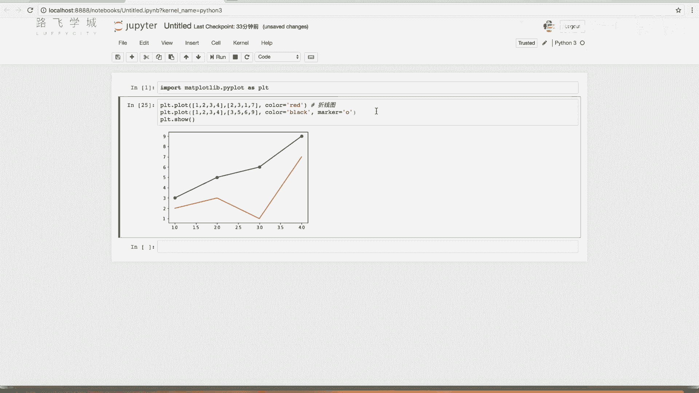

以下是具体步骤：
1.  调用第一个`plot`函数绘制第一条曲线。
2.  调用第二个`plot`函数绘制第二条曲线。
3.  调用`plt.show()`函数显示包含所有曲线的图表。

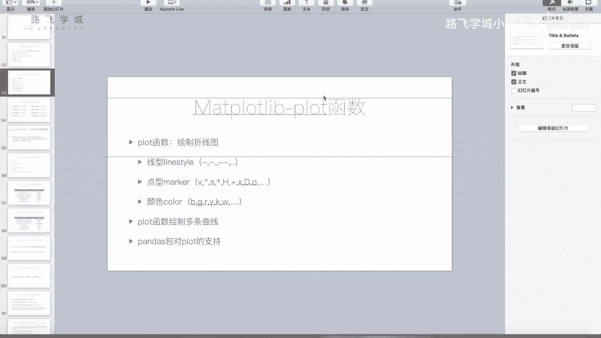

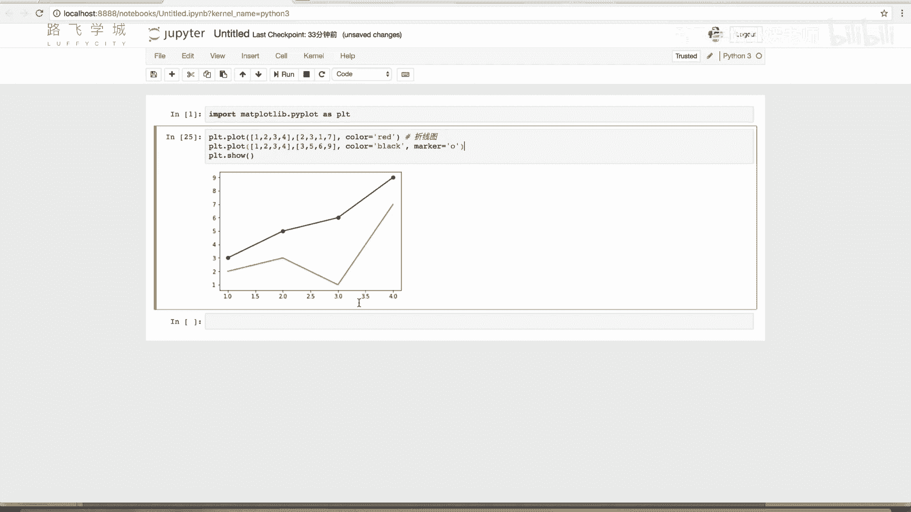

**代码示例：**
```python
import matplotlib.pyplot as plt

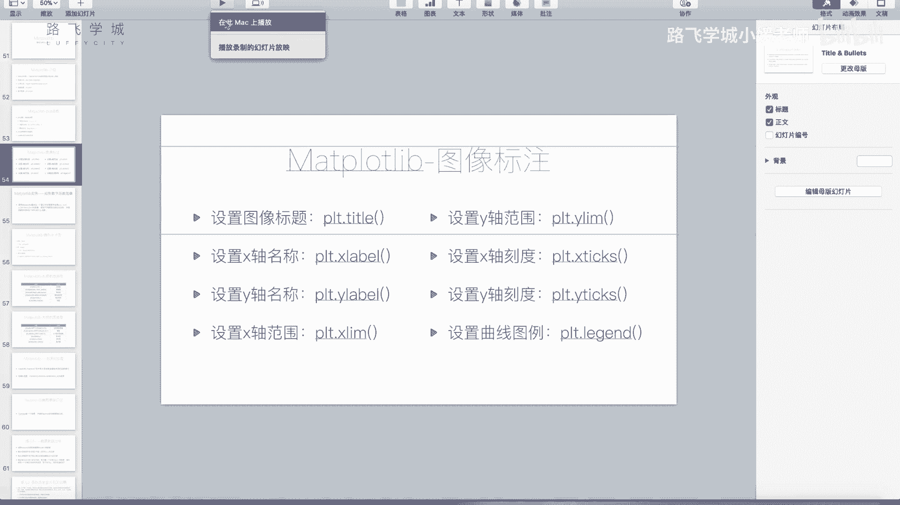

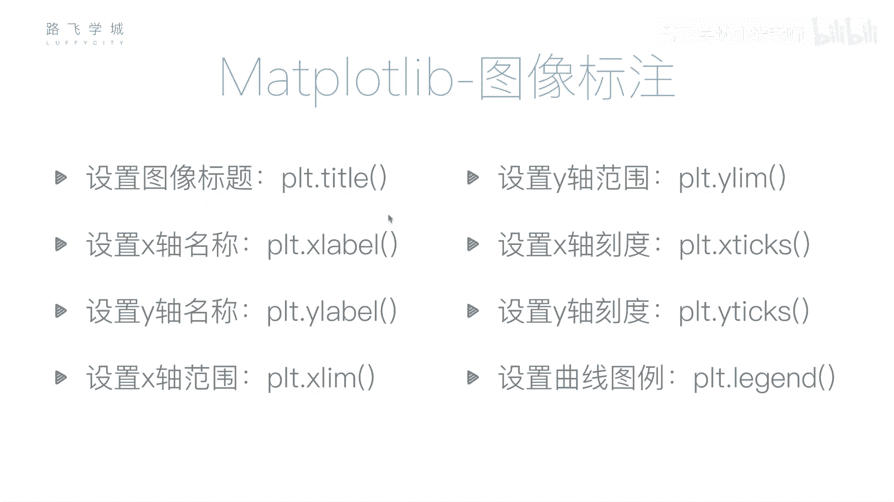

# 绘制第一条曲线
plt.plot([1, 2, 3, 4], [1, 4, 9, 16], 'ro-', label='Line A')
# 绘制第二条曲线
plt.plot([1, 2, 3, 4], [2, 5, 10, 17], 'bo--', label='Line B')

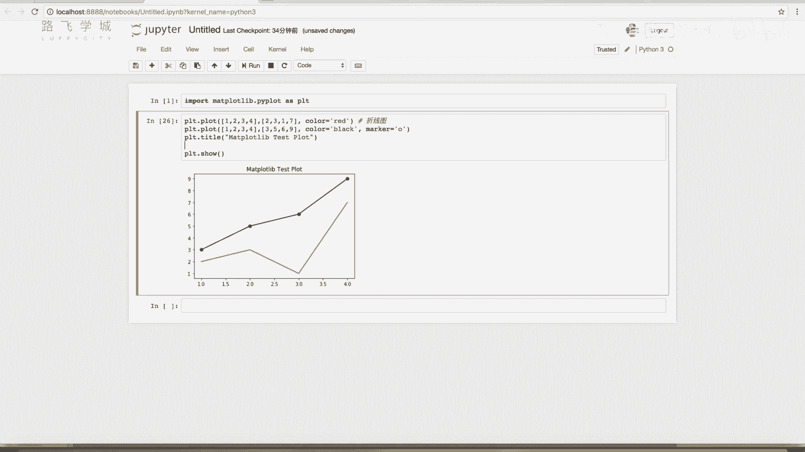

plt.show()
```
Matplotlib库的特性是，在调用`plt.show()`之前，所有调用过的`plot`函数绘制的曲线都会被保存在同一个图表中。因此，调用几次`plot`，图表中就会有几条线。

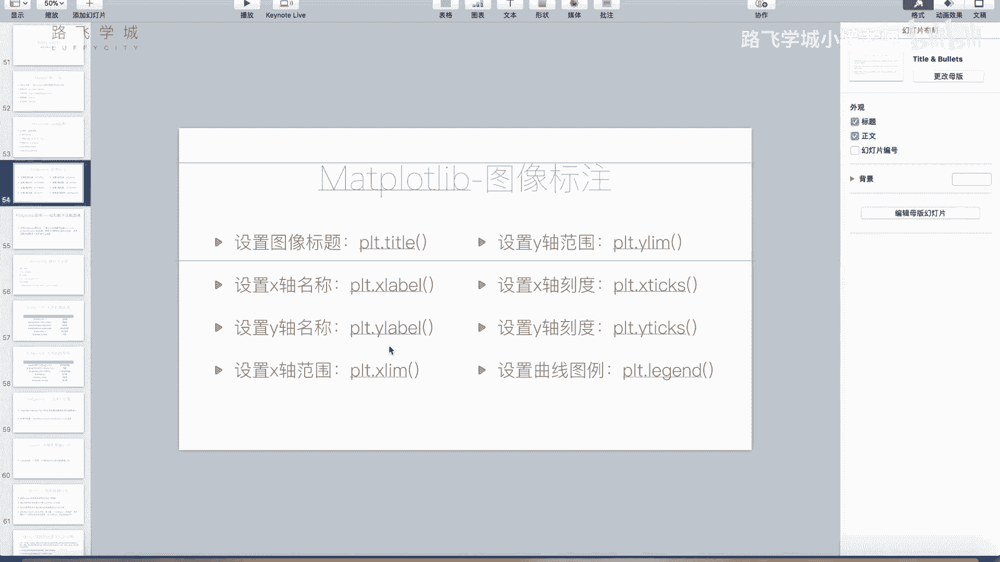

## 设置图表标题与坐标轴标签
一个完整的图表通常包含标题、X轴标签和Y轴标签，用以说明图表的主题和各坐标轴代表的含义。

以下是相关函数：
*   `plt.title()`: 设置图表标题。
*   `plt.xlabel()`: 设置X轴标签。
*   `plt.ylabel()`: 设置Y轴标签。

这些函数需要在`plt.show()`之前调用，顺序没有严格要求。

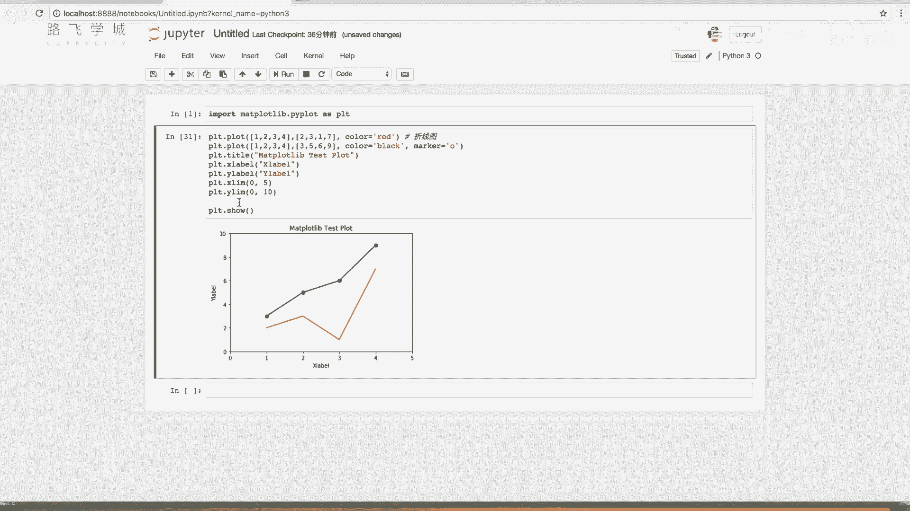

**代码示例：**
```python
plt.title('Matplotlib Test Plot')
plt.xlabel('X Label')
plt.ylabel('Y Label')
plt.show()
```

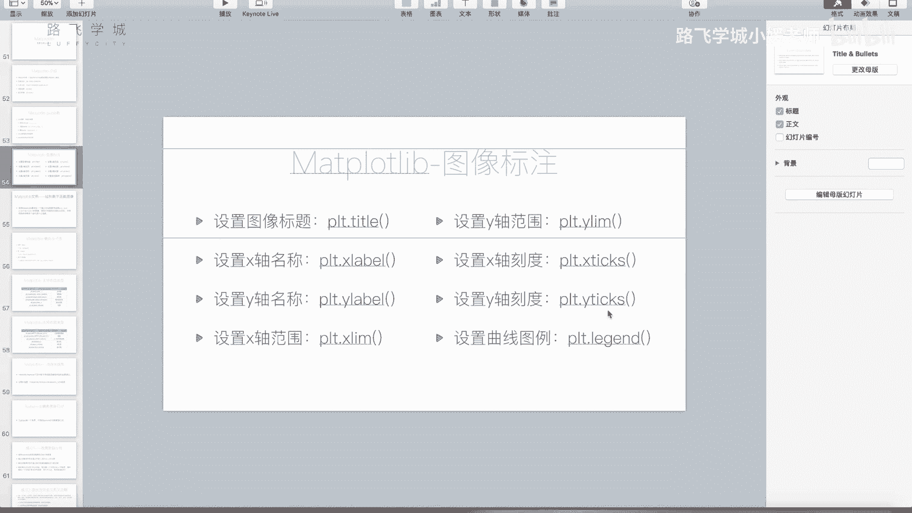

## 设置坐标轴范围
默认情况下，Matplotlib会自动调整坐标轴范围，以恰好容纳所有数据点。但有时我们需要手动设定显示范围。

以下是相关函数：
*   `plt.xlim(min, max)`: 设置X轴的显示范围。
*   `plt.ylim(min, max)`: 设置Y轴的显示范围。

**代码示例：**
```python
# 设置X轴显示范围为0到5
plt.xlim(0, 5)
# 设置Y轴显示范围为0到20
plt.ylim(0, 20)
plt.show()
```

## 设置坐标轴刻度
刻度是坐标轴上的标记点。我们可以自定义刻度的位置和显示的标签。

以下是相关函数：
*   `plt.xticks(ticks, labels)`: 设置X轴刻度。`ticks`参数为刻度位置列表，`labels`参数为对应位置的标签列表（可选）。
*   `plt.yticks(ticks, labels)`: 设置Y轴刻度。

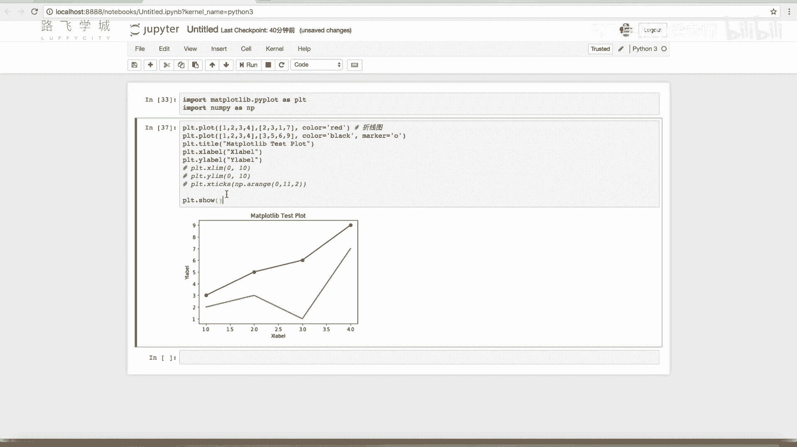

**代码示例：**
```python
import numpy as np

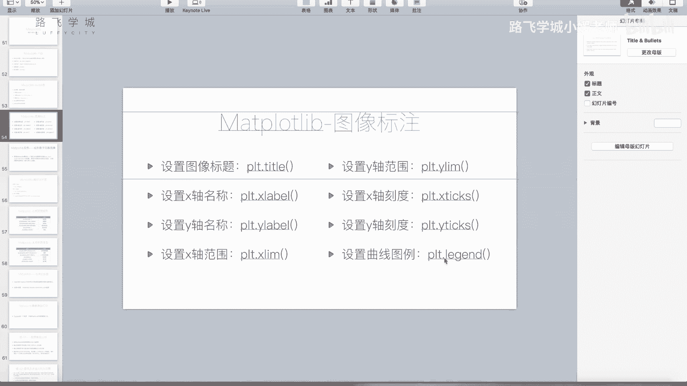

# 设置X轴刻度位置为0, 2, 4, 6, 8, 10
plt.xticks(np.arange(0, 11, 2))
# 设置X轴刻度位置，并指定自定义标签
plt.xticks([0, 1, 2, 3, 4], ['A', 'B', 'C', 'D', 'E'])
plt.show()
```

## 添加图例
当图表中有多条曲线时，需要图例来说明每条线代表的数据系列。添加图例最直接的方法是在调用`plot`函数时，通过`label`参数为每条线指定一个标签，然后调用`plt.legend()`函数显示图例。

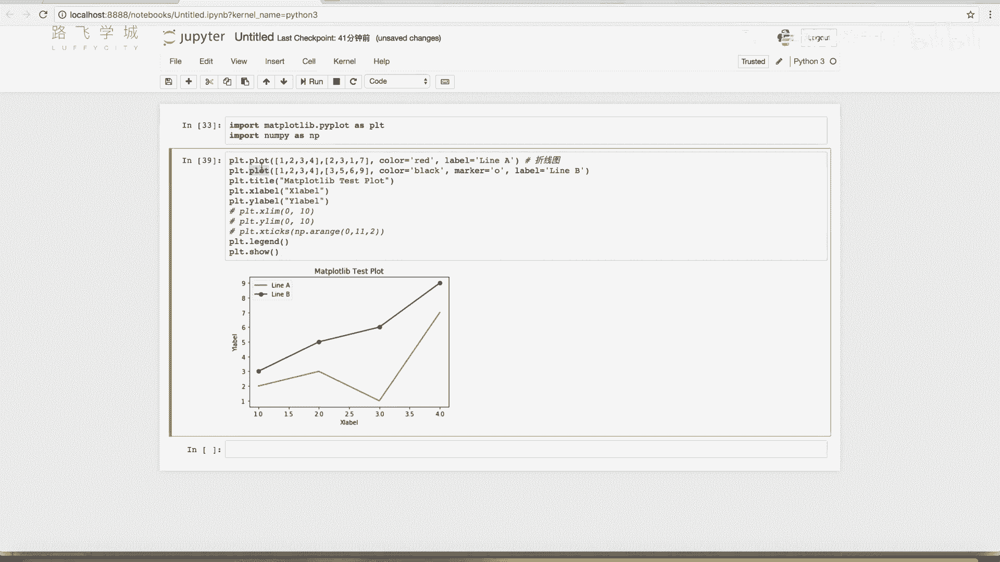

**代码示例：**
```python
# 绘制第一条线并设置标签
plt.plot([1, 2, 3, 4], [1, 4, 9, 16], label='Line A')
# 绘制第二条线并设置标签
plt.plot([1, 2, 3, 4], [2, 5, 10, 17], label='Line B')

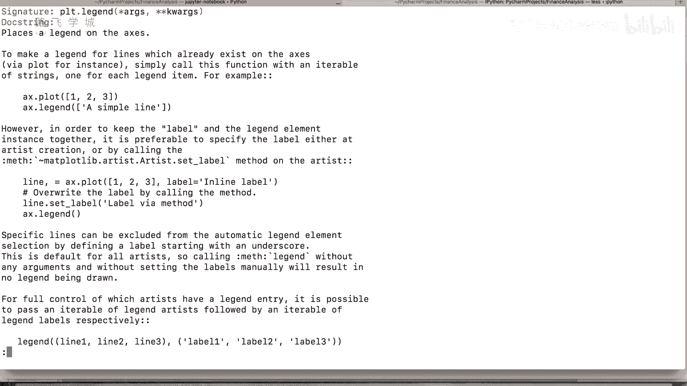

# 显示图例
plt.legend()
plt.show()
```
`plt.legend()`函数还有其他用法，例如手动传入标签列表，但上述方法最为直观和常用。

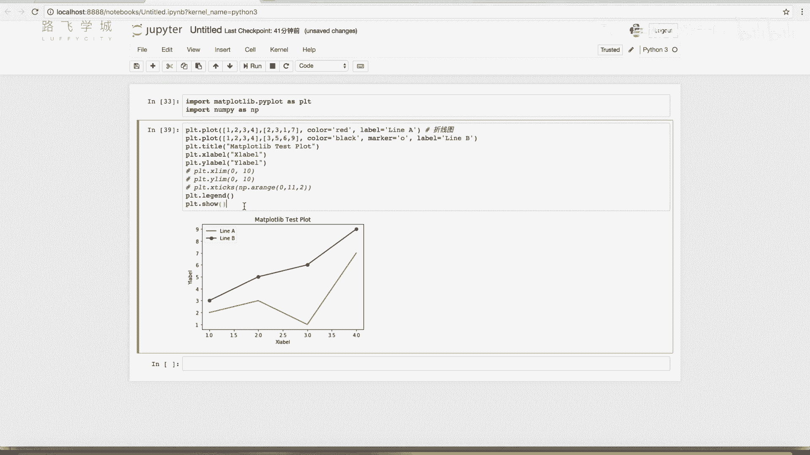

## 总结
本节课中我们一起学习了`plot`函数的周边设置功能。我们掌握了如何在一个图表中绘制多条曲线，以及如何使用`title`、`xlabel`、`ylabel`、`xlim`、`ylim`、`xticks`/`yticks`和`legend`等函数来完善图表，使其信息更清晰、更专业。这些是进行数据可视化时必不可少的基础技能。