# Python金融量化：P23：06 因子分析实战 💻


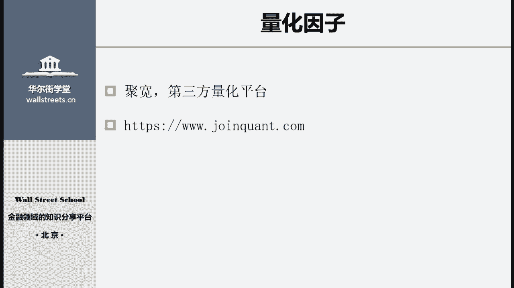


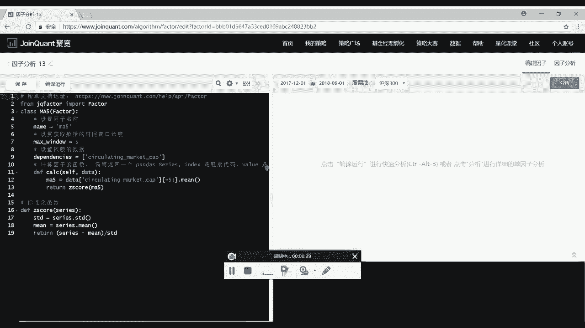

在本节课中，我们将学习如何使用Python和聚宽平台进行量化因子的构建、分析与处理。课程内容分为两部分：首先介绍聚宽平台的基本情况，然后通过一个实战案例——构建“营业收入同比增长率”因子，详细讲解因子编写的完整流程，包括数据获取、因子计算、标准化和中性化处理。

## 聚宽平台简介 📊

上一节我们介绍了量化分析的基本概念，本节中我们来看看一个实用的工具平台。市面上常用的免费量化平台主要有三个：聚宽、优矿和米筐。这三个平台均使用Python语言，数据库和编程体验相似。本教程选择聚宽平台进行演示，但其代码逻辑同样适用于其他平台。

聚宽平台的网址已在上方PPT中列出，注册账号后即可开始使用。

## 因子构建与分析实战 🛠️

现在，我们进入代码实战部分，目标是使用Python和聚宽平台构建并分析一个基本面因子。

### 1. 进入因子分析模块

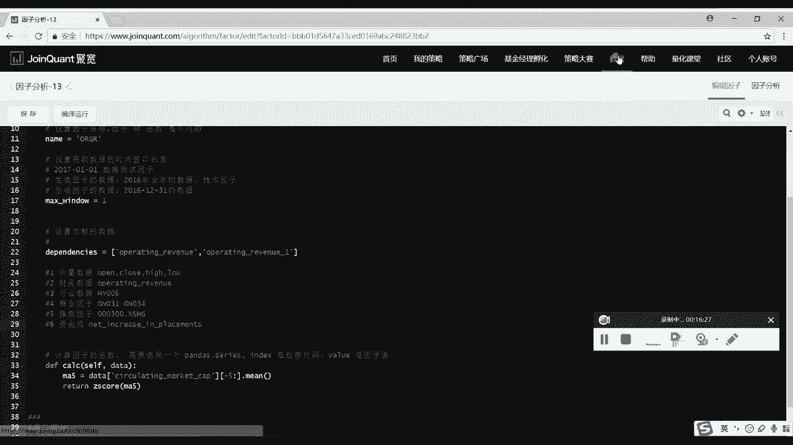

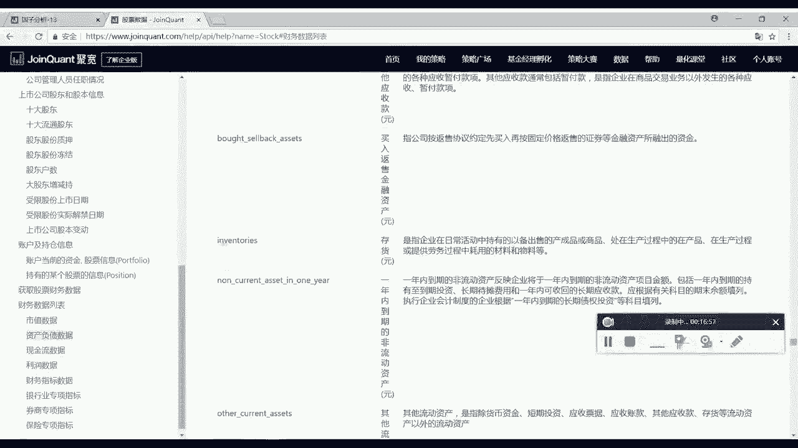

首先，我们需要在聚宽平台中进入“单因子分析”模块，并新建一个因子。

### 2. 代码结构解析

聚宽因子分析模块的代码主要分为三部分：
*   **第一部分**：导入第三方库。
*   **第二部分**：编写因子算法和构建逻辑的核心区域。
*   **第三部分**：放置标准化、中性化等数据处理函数的区域。

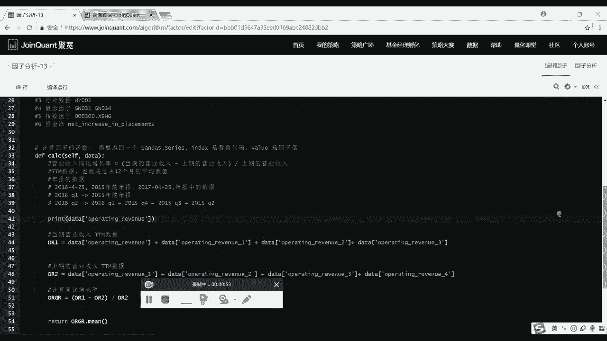

以下是核心代码区域的详细解析：

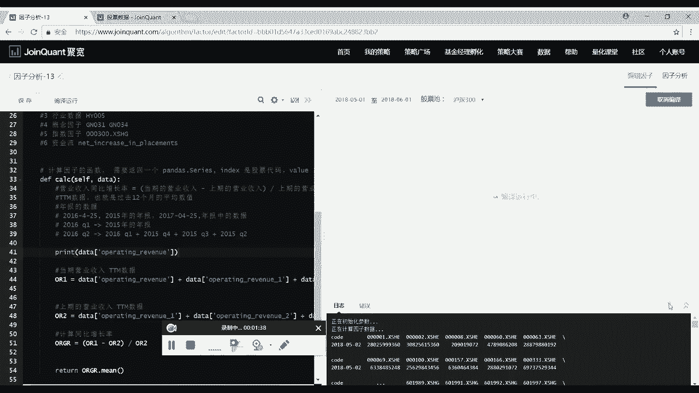

#### 2.1 定义因子类
我们首先需要定义一个继承自聚宽`Factor`库的类。类名（函数名）和因子名最好不同，以避免后续策略编写时的混淆。
```python
class ORGR_1(Factor): # 类名，例如 ORGR_1
    name = ‘ORGR‘ # 因子名，例如 ORGR
```
*   `class ORGR_1(Factor)`: 定义一个名为`ORGR_1`的类，它继承自`Factor`类，从而可以使用聚宽提供的因子分析功能。
*   `name = ‘ORGR‘`: 设置该因子的名称为`ORGR`。

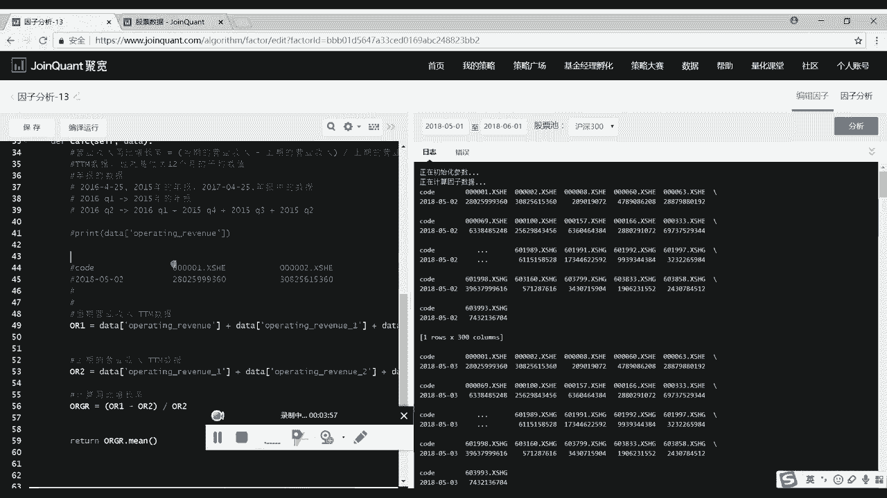

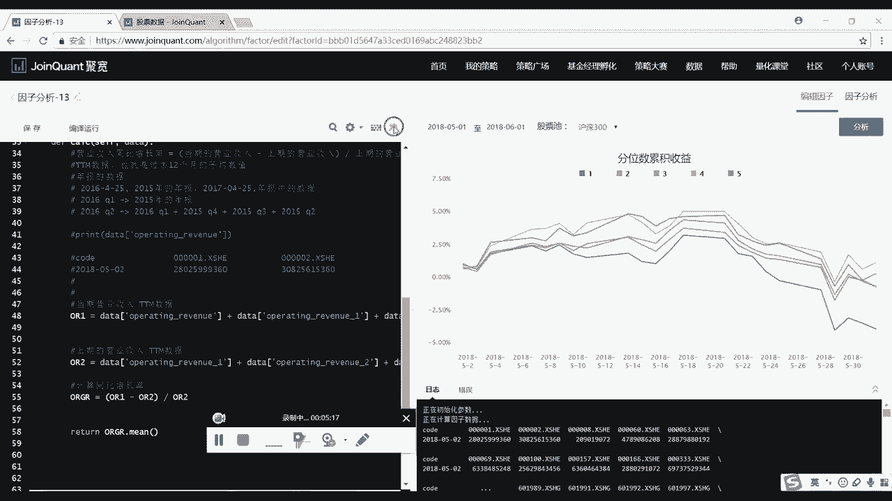

#### 2.2 设置数据窗口
我们需要指定获取数据的时间窗口长度。对于大部分基本面因子，通常只需要获取最新一期的数据。
```python
    max_window = 1
```
`max_window = 1`表示获取过去1个交易日（或报告期）的数据。

#### 2.3 声明所需数据
我们必须明确告诉平台需要哪些数据来计算因子。对于“营业收入同比增长率”，我们需要当期和上一期的营业收入数据。
```python
    dependencies = [‘operating_revenue‘, ‘operating_revenue_1‘]
```
`dependencies`列表中声明了所需数据字段。`operating_revenue`代表当期营业收入，`operating_revenue_1`代表上一期营业收入。平台数据库提供价量、财务、行业、概念、指数、资金流等多类数据。

#### 2.4 编写因子计算逻辑
在`calc`函数中，我们实现因子的具体计算。对于财务因子，通常使用TTM（过去12个月滚动）数据以保持时效性。
```python
    def calc(self, data):
        # 计算当期营业收入TTM (OR1)
        OR1 = data[‘operating_revenue‘] + data[‘operating_revenue_1‘] + data[‘operating_revenue_2‘] + data[‘operating_revenue_3‘]
        # 计算上期营业收入TTM (OR2)
        OR2 = data[‘operating_revenue_1‘] + data[‘operating_revenue_2‘] + data[‘operating_revenue_3‘] + data[‘operating_revenue_4‘]
        # 计算同比增长率因子
        ORGR = (OR1 - OR2) / OR2
        return ORGR
```
*   `data[‘operating_revenue‘]`: 获取当季营业收入数据。
*   `OR1`: 通过累加最近四个季度的收入，得到当期营业收入TTM。
*   `OR2`: 通过累加之前四个季度的收入，得到上期营业收入TTM。
*   `ORGR = (OR1 - OR2) / OR2`: 计算营业收入同比增长率。
*   `return ORGR`: 返回计算出的因子值。

运行此代码后，平台会输出因子分析结果，包括各分位（如一分位代表因子值最大的股票组合）的净值曲线和绩效指标。

### 3. 因子值处理

一个完整的因子分析流程还需要对原始因子值进行后续处理，主要是标准化和中性化。

#### 3.1 标准化处理
标准化旨在消除不同因子之间量纲（单位）的差异，使它们可以放在一起公平比较。常用方法是Z-Score标准化。
```python
def standardize(series):
    std = series.std() # 计算标准差
    mean = series.mean() # 计算平均值
    z_score = (series - mean) / std # 计算Z-Score
    return z_score
```
公式为：`Z = (X - μ) / σ`，其中`X`为原始值，`μ`为均值，`σ`为标准差。处理后在`calc`函数中调用：
```python
ORGR_std = standardize(ORGR)
```

#### 3.2 中性化处理
中性化是为了剔除其他常见风险因子（如市值）的影响，保留该因子的独特信息。例如，避免市盈率因子仅仅是因为选择了小市值股票而表现优异。
```python
def neutralize(data, factor_value):
    # 1. 获取市值数据
    market_cap = data[‘market_cap‘]
    # 2. 使用最小二乘法进行线性回归，剔除市值影响
    # 需要导入 statsmodels.api 库
    import statsmodels.api as sm
    result = sm.OLS(factor_value, market_cap, missing=‘drop‘).fit()
    # 3. 返回残差，即中性化后的因子值
    return result.resid
```
处理后在`calc`函数中调用：
```python
ORGR_neutral = neutralize(data, ORGR_std)
return ORGR_neutral
```

## 总结 📝

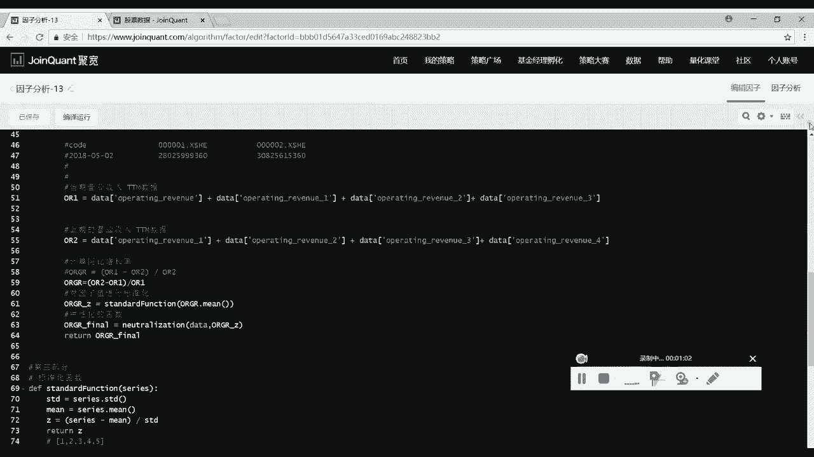

本节课我们一起学习了量化因子分析的全流程：
1.  **平台使用**：了解了聚宽量化平台的基本情况。
2.  **因子构建**：从定义类、设置参数、声明数据到编写`calc`计算逻辑，完整构建了“营业收入同比增长率”因子。
3.  **因子处理**：掌握了对因子值进行**标准化**（统一量纲）和**中性化**（剔除市值等常见风险影响）这两个关键步骤，这是构建有效多因子模型的基础。

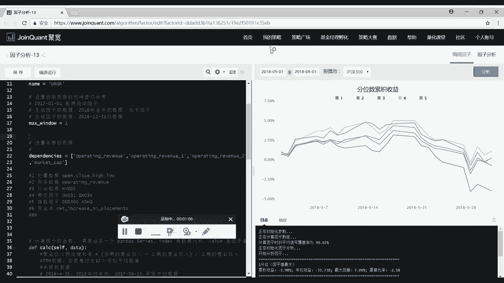

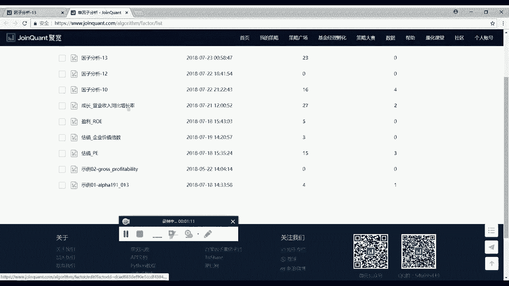

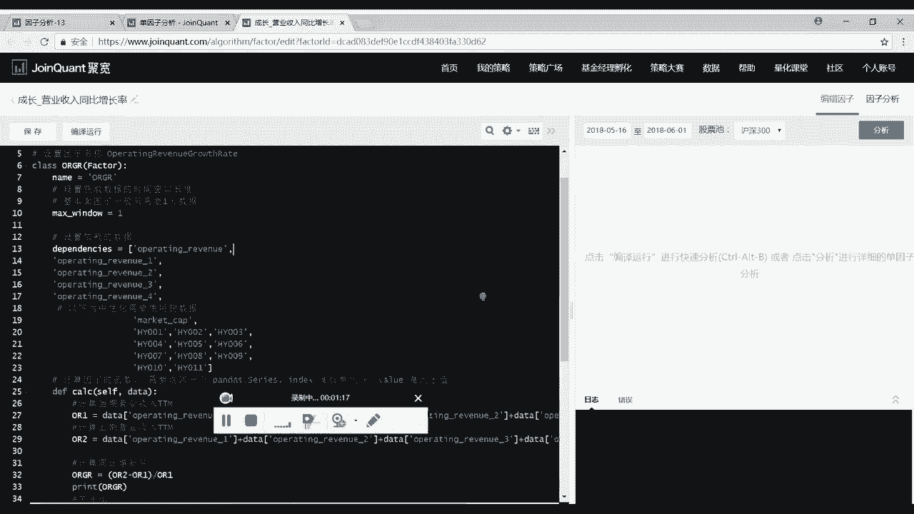

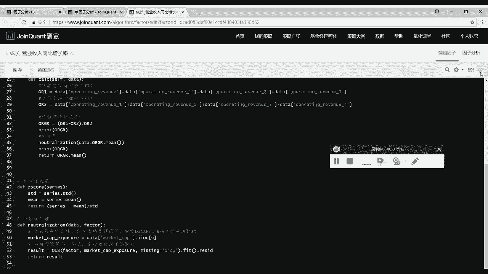

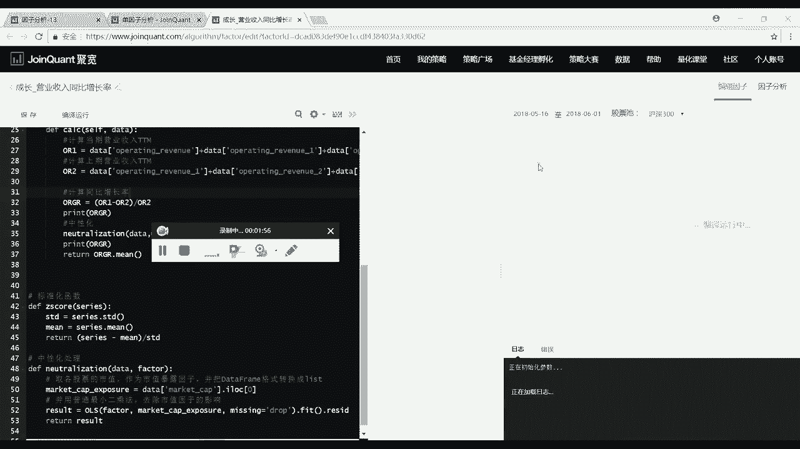

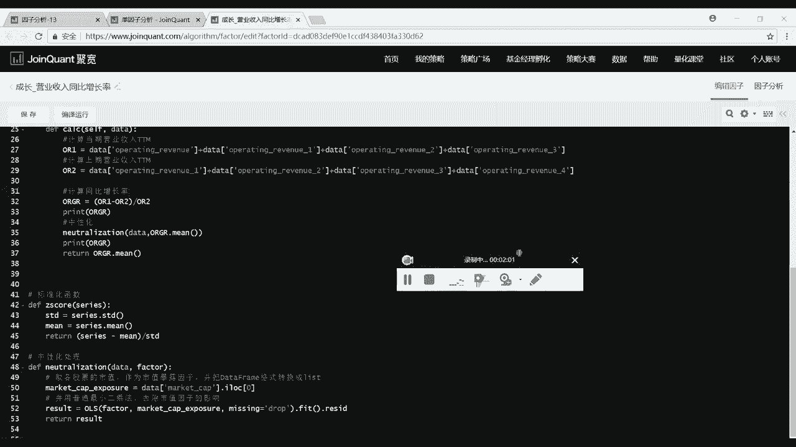

掌握单个因子的构建方法是编写复杂量化策略的第一步。建议大家根据提供的代码模板，在聚宽平台上亲自实践，尝试修改计算逻辑来创建不同的因子（如市盈率PE、净资产收益率ROE等），并通过平台回测功能观察其表现。