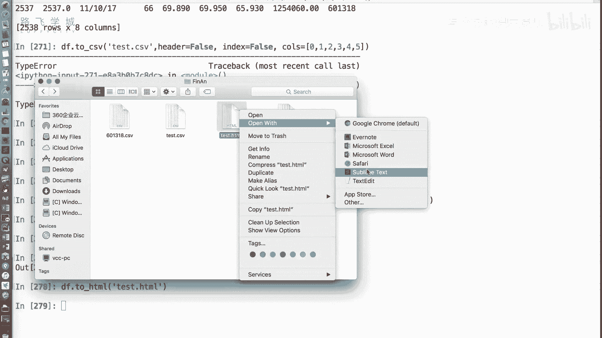
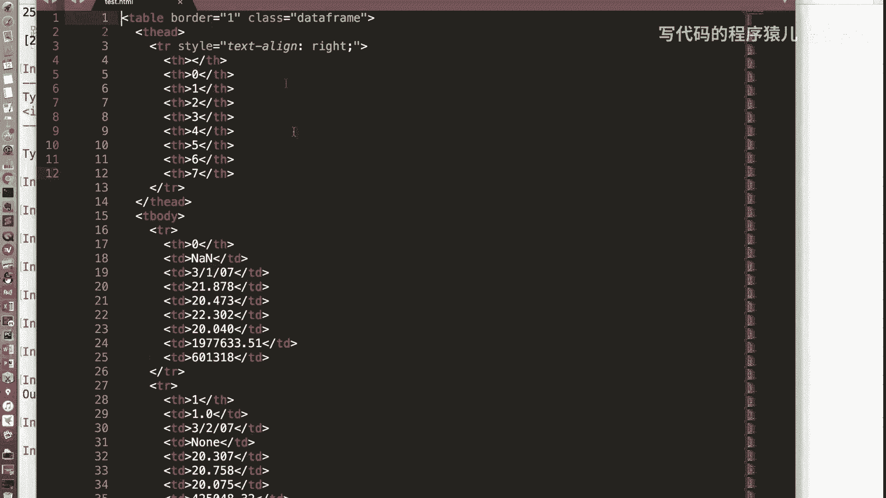
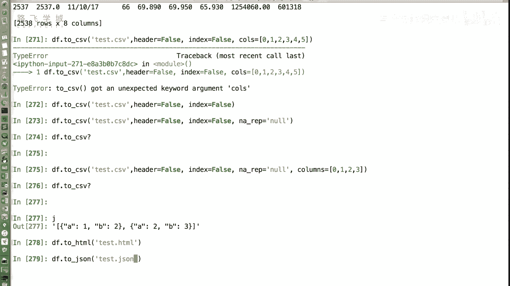
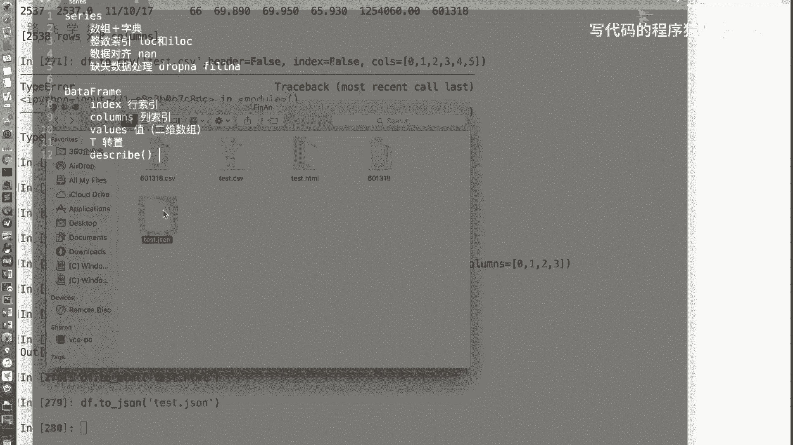
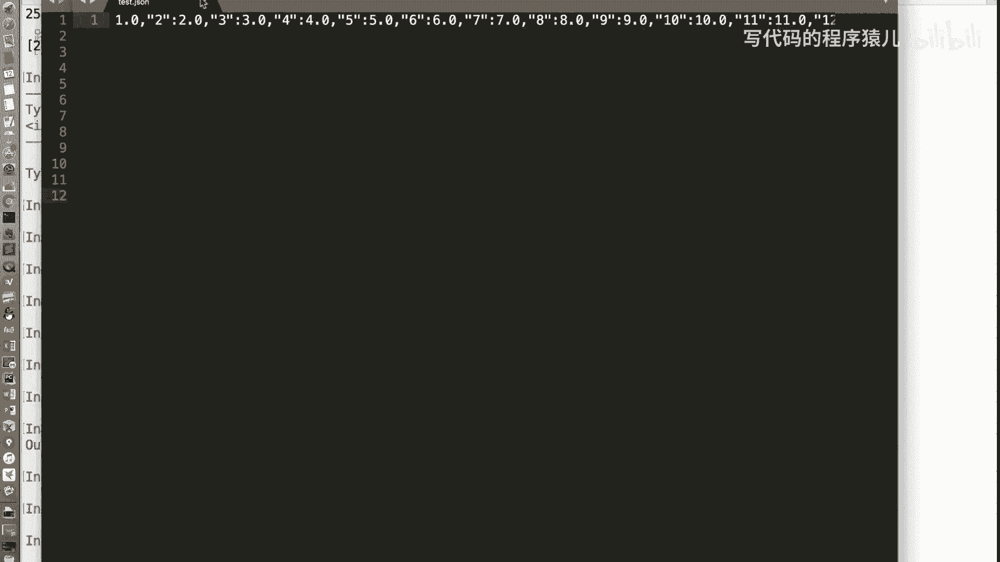
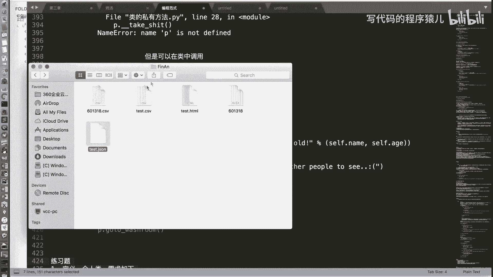
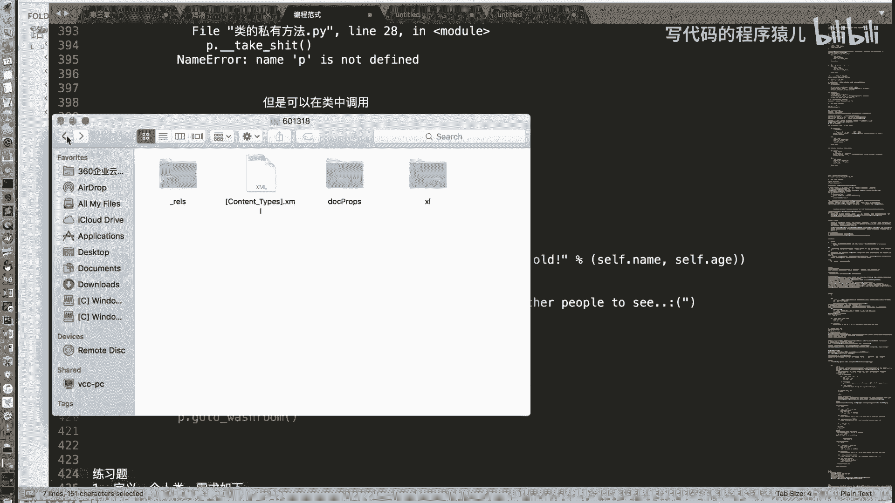
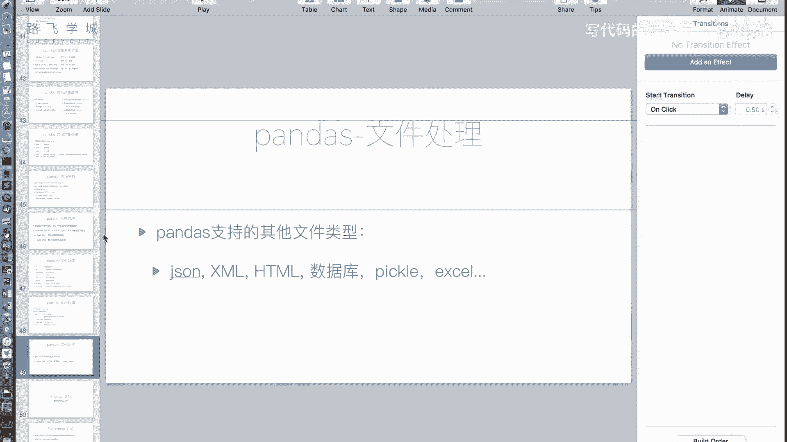

# Python金融量化：P23：文件操作3与pandas收尾 📊

在本节课中，我们将学习如何使用pandas库将数据写入文件，并了解其支持的其他文件格式。最后，我们将对pandas模块的核心内容进行总结。

## 写入CSV文件 📝

上一节我们介绍了`read_csv`函数用于读取文件，本节中我们来看看`to_csv`函数，它用于将数据写入文件。

`to_csv`函数有几个关键参数，它们与`read_csv`函数的参数相对应，但功能相反。

以下是`to_csv`函数的主要参数说明：

*   **`sep`参数**：与`read_csv`的`sep`参数一样，用于指定写入文件时使用的分隔符。默认是逗号（`,`）。
*   **`na_rep`参数**：与`read_csv`的`na_values`参数功能相反。`na_values`用于指定哪些字符串应被解释为缺失值（NaN），而`na_rep`则用于指定将NaN值写入文件时转换成的字符串。默认是空字符串。
*   **`header`参数**：设置为`False`时，不输出列名（表头）那一行。
*   **`index`参数**：设置为`False`时，不输出行索引那一列。
*   **`columns`参数**：可以传入一个列表，用于指定输出哪些列。列表中的元素可以是列的编号或列名。

以下是一个简单的代码演示：

```python
# 假设df是一个DataFrame对象
# 将第0行第0列的值改为NaN
df.iloc[0, 0] = np.nan

# 将DataFrame写入CSV文件，不输出表头和行索引，并指定NaN的替换字符串
df.to_csv('test.csv', sep=',', na_rep='NULL', header=False, index=False)
```

## 支持的其他文件格式 📁

除了CSV文件，pandas还支持多种其他文件格式的读写，例如JSON、HTML、数据库、Pickle、Excel等。

以下是pandas支持的部分文件格式操作示例：





*   **写入JSON**：`df.to_json('data.json')`
*   **写入HTML表格**：`df.to_html('table.html')`。生成的HTML文件在浏览器中打开会显示为表格。
*   **写入Excel**：`df.to_excel('data.xlsx')`





相应的读取函数也类似，例如：





*   **读取JSON**：`pd.read_json('data.json')`
*   **读取HTML**：`pd.read_html('table.html')`
*   **读取Excel**：`pd.read_excel('data.xlsx')`

> **注意**：使用`read_excel`函数需要额外安装`openpyxl`或`xlrd`库，因为Excel文件（.xlsx）本质上是基于XML的压缩包，并非纯文本格式。安装命令通常为：`pip install openpyxl`。

你可以使用IPython的查询功能（例如`pd.read_excel?`）来查看这些函数的具体参数和示例。

## pandas核心内容总结 🎯

本节课中我们一起学习了pandas的文件写入功能。现在，让我们对整个pandas模块的核心内容进行总结。




pandas库主要围绕两个核心数据结构展开：

1.  **Series对象**：用于处理一维数据，类似于带标签的数组。
2.  **DataFrame对象**：用于处理二维表格数据，是数据分析中最常用的结构。

我们详细讲解了以下内容：



*   **索引与切片**：如何高效地选取数据。需要特别注意使用整数索引时`.loc`（基于标签）和`.iloc`（基于位置）的区别。对于DataFrame，建议使用`df.loc[行选择, 列选择]`的格式，而不是连续使用两个中括号`df[][]]`。
*   **数据对齐与运算**：Series或DataFrame对象进行运算时，会按照行和列的标签自动对齐。公式可以表示为：**运算结果 = 按标签对齐后的数据执行运算**。
*   **缺失数据处理**：缺失值在pandas中用`NaN`表示。我们可以使用`dropna()`方法删除含有缺失值的行或列，或者使用`fillna()`方法用特定值（如均值、中位数等）填充缺失值。
*   **时间序列支持**：pandas提供了强大的时间序列处理功能。
*   **文件读写**：支持包括CSV、Excel、JSON、HTML等多种格式的数据导入和导出。

关于pandas核心库的介绍就到这里。后续需要通过练习题来巩固这些知识，否则很容易遗忘。

我们pandas的学习章节到此结束。