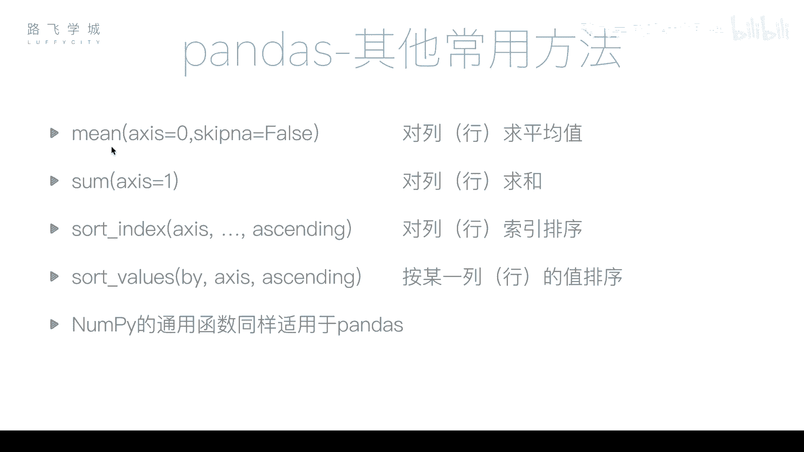
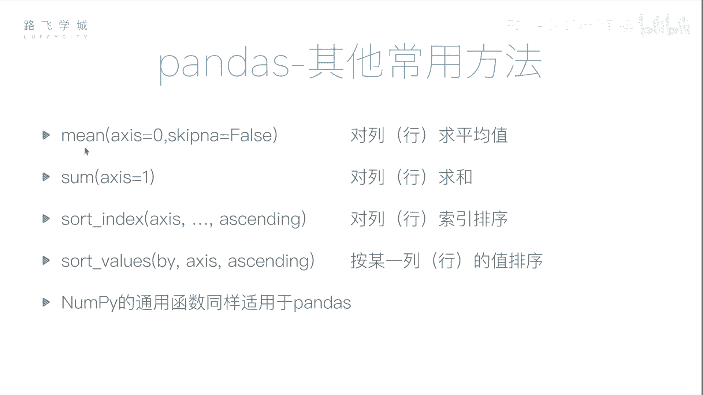

# Python金融量化：P23：pandas常用函数 📊

在本节课中，我们将学习pandas库中一些非常实用的常用函数，包括数据统计、排序等操作。这些功能是进行数据分析和金融量化研究的基础。



## 求平均值与求和


上一节我们介绍了缺失值处理，本节中我们来看看如何进行基本的数值计算。pandas提供了便捷的方法来计算数据的平均值和总和。

`DataFrame.mean()` 方法用于计算平均值。与NumPy中的`mean`函数不同，当对`DataFrame`对象调用此方法时，它会默认对**每一列**分别计算平均值，并返回一个`Series`对象。

```python
# 假设df是一个DataFrame
df.mean()
```

对于一个包含两列的`DataFrame`，该方法会返回一个长度为2的`Series`，分别对应两列的平均值。例如，第一列忽略缺失值后计算平均值为16，第二列四个数的平均值为2.5。

如果想按行求平均值，可以传入参数 `axis=1`。

```python
df.mean(axis=1)
```

`DataFrame.sum()` 方法用于求和，其逻辑与`mean()`方法类似。默认参数 `axis=0` 是按列求和，`axis=1` 则是按行求和。

```python
df.sum()        # 按列求和
df.sum(axis=1)  # 按行求和
```

## 数据排序

在数据分析中，排序是整理和观察数据的重要手段。pandas提供了两种主要的排序方式：按值排序和按索引排序。

### 按值排序

`DataFrame.sort_values()` 方法用于根据指定列的值进行排序。由于`DataFrame`通常有多列，因此必须通过 `by` 参数指定依据哪一列进行排序。

以下是按值排序的方法：
*   **升序排序**：默认行为，或显式设置 `ascending=True`。
*   **降序排序**：设置参数 `ascending=False`。
*   **处理缺失值**：如果排序的列中存在缺失值（NaN），这些行将不参与排序，统一被放置在结果的最后。

```python
# 按 ‘two’ 列进行升序排序
df.sort_values(by='two')

# 按 ‘two’ 列进行降序排序
df.sort_values(by='two', ascending=False)
```

理论上也可以按行排序，即指定某一行作为排序依据。但这在实际应用中较少见，因为按行排序需要指定具体哪一行的值作为排序键。

### 按索引排序

`DataFrame.sort_index()` 方法用于根据索引标签进行排序。这包括对行索引（默认）或列索引的排序。

以下是按索引排序的方法：
*   **按行索引排序**：默认对行标签（如A, B, C, D）进行排序。
*   **按列索引排序**：传入参数 `axis=1` 即可对列标签进行排序。
*   **排序方向**：同样使用 `ascending` 参数控制升序或降序。

```python
# 按行索引升序排序
df.sort_index()

# 按行索引降序排序
df.sort_index(ascending=False)

# 按列索引排序
df.sort_index(axis=1)
```

## 其他通用统计函数

除了平均值和求和外，之前在NumPy库中学习过的许多通用函数同样适用于pandas。这些函数为数据分析提供了强大的支持。

以下是pandas中同样可用的部分统计函数：
*   `df.std()`: 计算标准差。
*   `df.var()`: 计算方差。
*   `df.max()`: 找出最大值。
*   `df.min()`: 找出最小值。

这些函数默认按列计算，也可以通过 `axis` 参数指定按行计算。

---



本节课中我们一起学习了pandas的核心常用函数。我们掌握了如何使用 `mean()` 和 `sum()` 进行数据统计，以及如何使用 `sort_values()` 和 `sort_index()` 对数据进行灵活的排序。这些方法是进行数据清洗、预处理和初步分析的关键步骤，为后续更复杂的金融量化分析打下坚实基础。