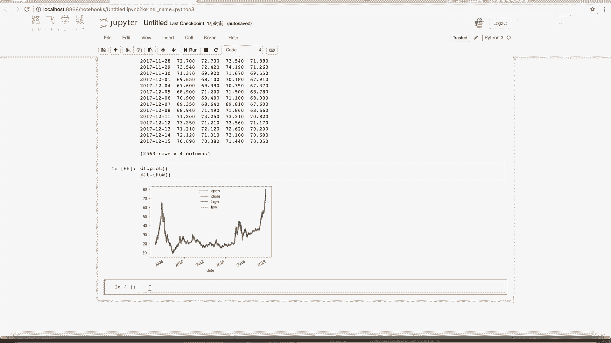
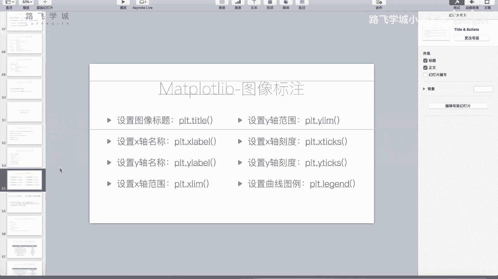
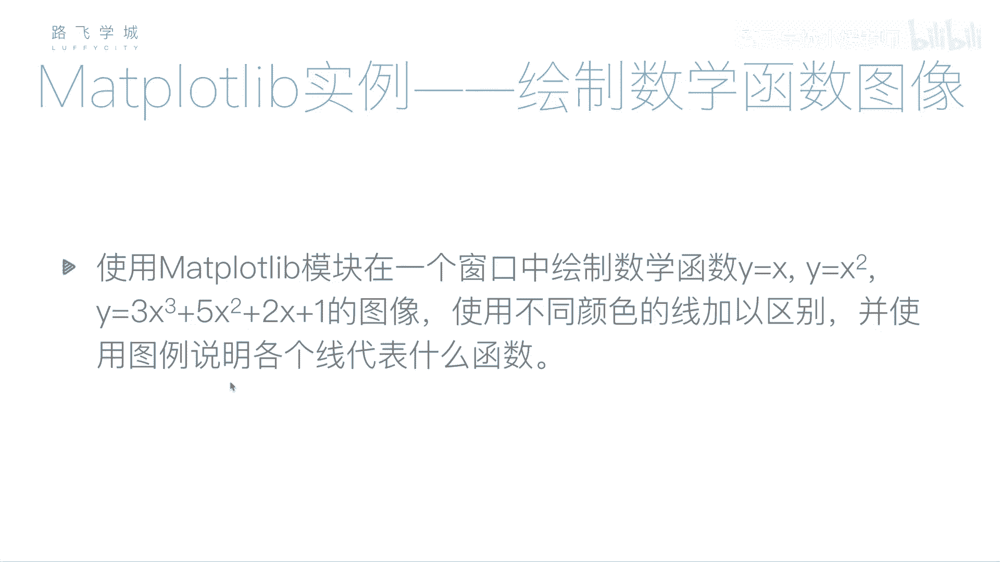

# Python金融量化：P23：pandas与Matplotlib结合绘图 📊

在本节课中，我们将学习如何将pandas库中的DataFrame和Series数据，与Matplotlib库结合起来，直接绘制成图表。这是一种非常便捷的数据可视化方法。

上一节我们介绍了`plot`函数及其周边功能，本节中我们来看看pandas与Matplotlib的关联。

## pandas数据直接绘图 📈

pandas的DataFrame和Series对象内置了`.plot()`方法，可以方便地调用Matplotlib进行绘图。

例如，我们有一个股票数据文件`601318.csv`。首先，我们读取并处理数据：

```python
import pandas as pd

# 读取数据
df = pd.read_csv('601318.csv')
# 将‘date’列转换为日期时间对象，并设置为索引
df['date'] = pd.to_datetime(df['date'])
df.set_index('date', inplace=True)
# 使用花式索引选择需要的列：开盘价、收盘价、最高价、最低价
price_df = df[['open', 'close', 'high', 'low']]
```

现在，我们有了一个包含四列价格数据的DataFrame `price_df`。

## 绘制DataFrame图表

如果想将这个DataFrame直接可视化为图表，方法非常简单。

以下是核心操作：
```python
import matplotlib.pyplot as plt

# 直接调用DataFrame的.plot()方法
price_df.plot()
plt.show()
```

执行上述代码，Matplotlib会智能地生成一个图表。在这个图表中：
*   **X轴** 自动使用了DataFrame的索引列，即日期时间。
*   **Y轴** 表示价格。
*   四列数据（开盘价、收盘价、最高价、最低价）被绘制成四条不同颜色的曲线。

由于股票每日的这几个价格数值非常接近，且数据量庞大，四条线在图表中可能看起来几乎重叠。这属于正常现象，可以通过调整图表窗口大小进行局部观察。这展示了pandas与Matplotlib结合绘图的便捷性：**索引列自动成为X轴坐标，数据列自动成为Y轴值并绘制为曲线**。



同样，如果数据是一个Series（单列数据），调用`.plot()`方法则会绘制出一条单线图。



## 课后练习 ✍️

为了巩固所学知识，请大家尝试完成以下练习。

以下是练习的具体要求：
1.  在一个图形窗口中，绘制三个数学函数的图像。
2.  三个函数分别为：
    *   `y = x` （直线）
    *   `y = x^2` （抛物线）
    *   `y = 3*x^3 + 5*x^2 + 2*x + 1` （三次曲线）
3.  需要使用不同颜色的线条来区分这三个函数。
4.  必须为图表添加图例（legend），说明每条线对应的函数。

大家可以先独立思考并完成编码。在下一个视频中，我们将一起编写代码，你可以对比一下你的实现思路。



---

本节课中我们一起学习了如何利用pandas库的`.plot()`方法，便捷地将DataFrame或Series数据通过Matplotlib可视化。我们掌握了数据预处理、直接绘图的方法，并理解了其工作原理：**索引为X轴，数据列为Y轴**。最后，布置了一个绘制数学函数图像的练习来巩固这个知识点。