# Python金融量化分析：24：Matplotlib介绍 📊

在本节课中，我们将要学习Python中一个非常重要的数据可视化工具包——Matplotlib。它主要用于绘制图表，例如在金融分析中，将股票价格数据绘制成图表比查看表格数据更为直观。

---

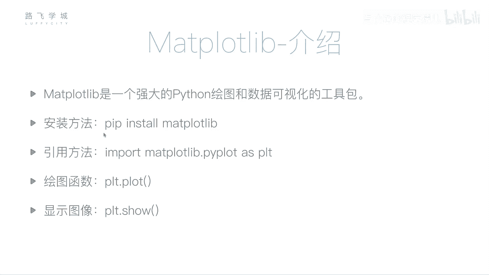

## 概述

Matplotlib是一个强大的Python绘图和数据可视化工具包。安装方法依然是使用pip命令：`pip install matplotlib`。

## 引入Matplotlib

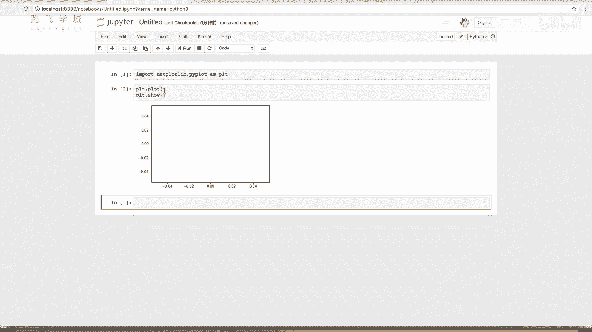

在代码中，我们通常这样引入Matplotlib的绘图模块：

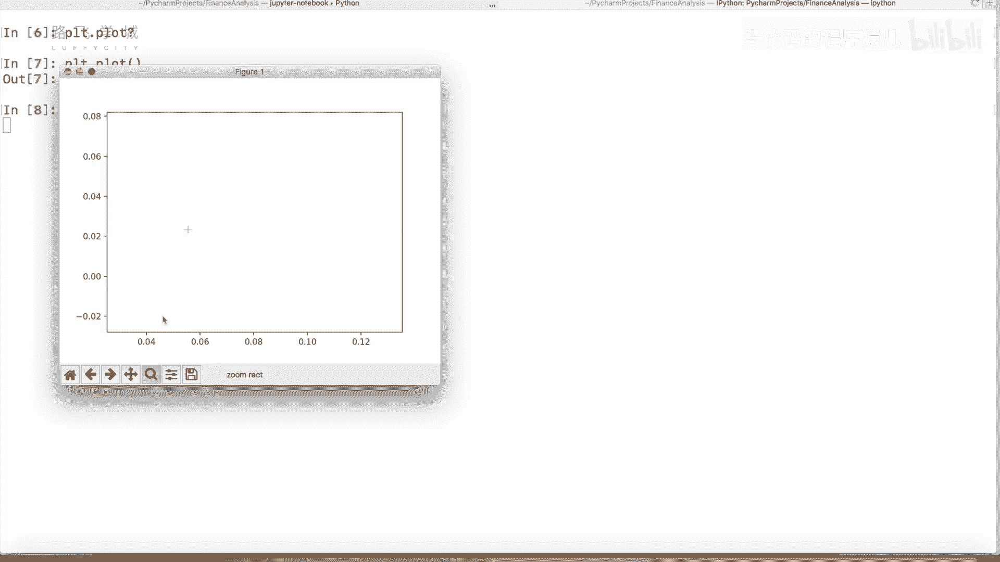

```python
import matplotlib.pyplot as plt
```


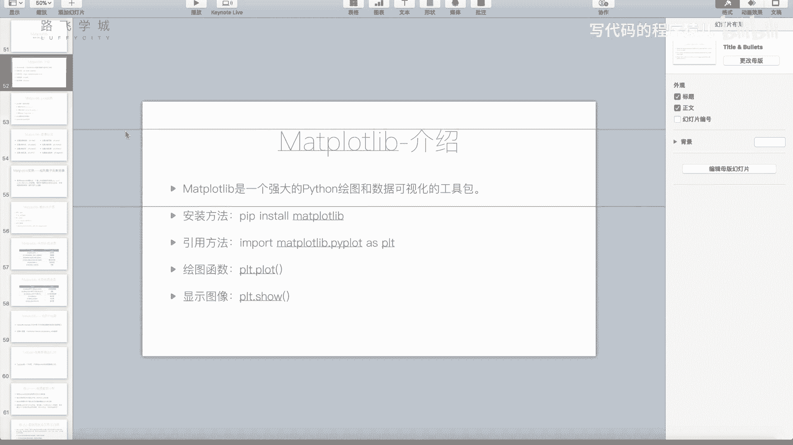

其中，`plt`是约定俗成的别名。`plt.plot()`函数用于绘图，`plt.show()`函数用于展示图形。

## 绘制基础折线图

`plt.plot()`函数最基本的功能是绘制折线图。它接受两个主要参数：X轴数据列表和Y轴数据列表。

```python
plt.plot([1, 2, 3, 4], [2, 4, 6, 8])
plt.show()
```

运行上述代码，会生成一条连接点(1,2)、(2,4)、(3,6)、(4,8)的直线。如果Y值改为`[2, 3, 6, 4]`，则会生成一条折线。

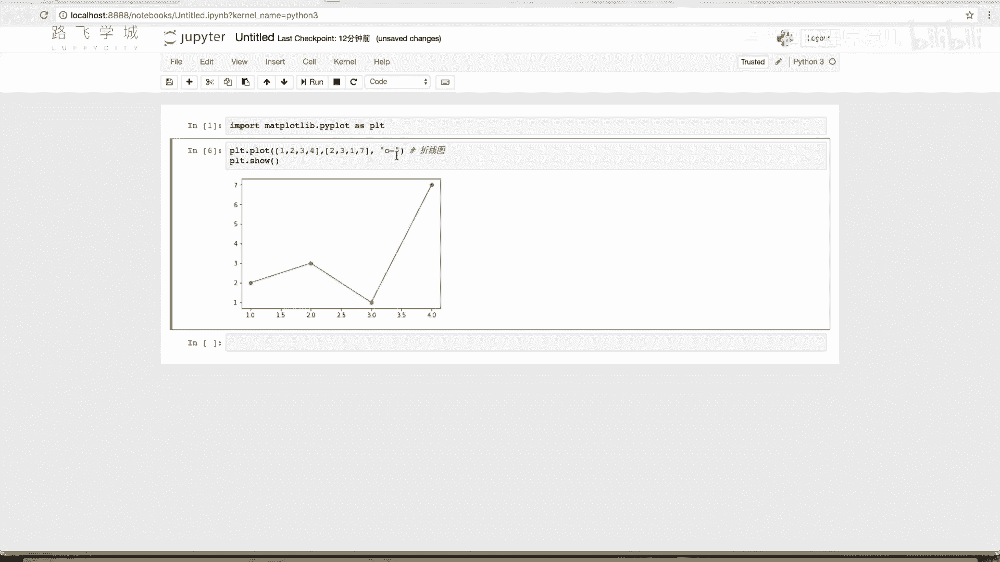

## 自定义线条样式

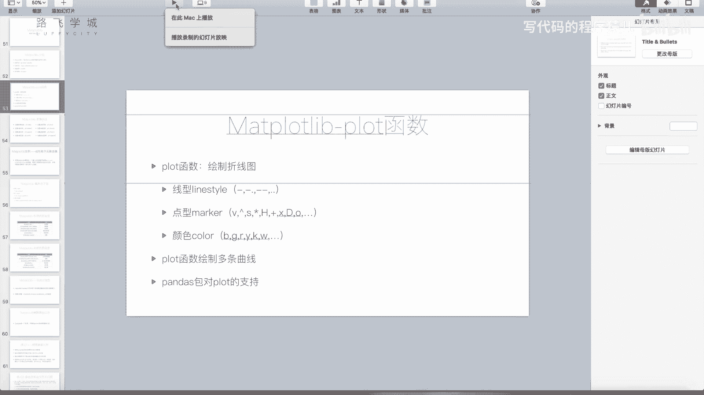

`plt.plot()`函数还有第三个可选参数，它是一个格式字符串，用于控制线条的**线型**、**标记点**和**颜色**。

格式字符串的语法为：`‘[颜色][标记点][线型]’`。

以下是几个关键部分的示例：


*   **颜色**：`‘b’`（蓝色）、`‘g’`（绿色）、`‘r’`（红色）、`‘k’`（黑色）。
*   **标记点**：`‘o’`（圆点）、`‘v’`（下三角）、`‘^’`（上三角）、`‘*’`（星号）、`‘+’`（加号）。
*   **线型**：`‘-’`（实线）、`‘--’`（虚线）、`‘:’`（点线）。

例如，`‘ro-’`表示绘制红色实线，并在数据点处用圆圈标记。`‘g--’`表示绘制绿色虚线，无标记点。

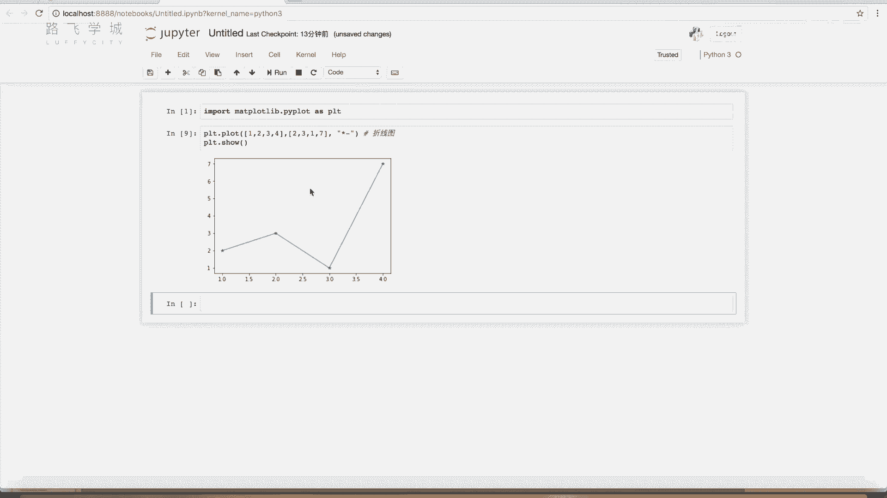

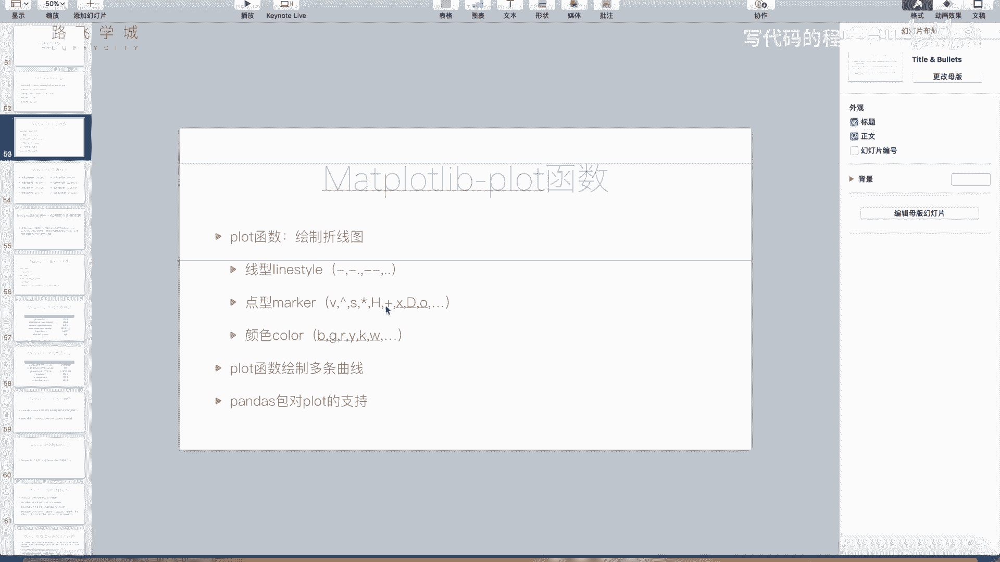

你也可以使用关键字参数分别指定，例如：`color=‘red‘, marker=‘o‘, linestyle=‘--‘`。

---

上一节我们介绍了如何绘制单条折线并自定义其样式，本节中我们来看看如何在同一个图形中绘制多条折线，以及一些其他常用功能。

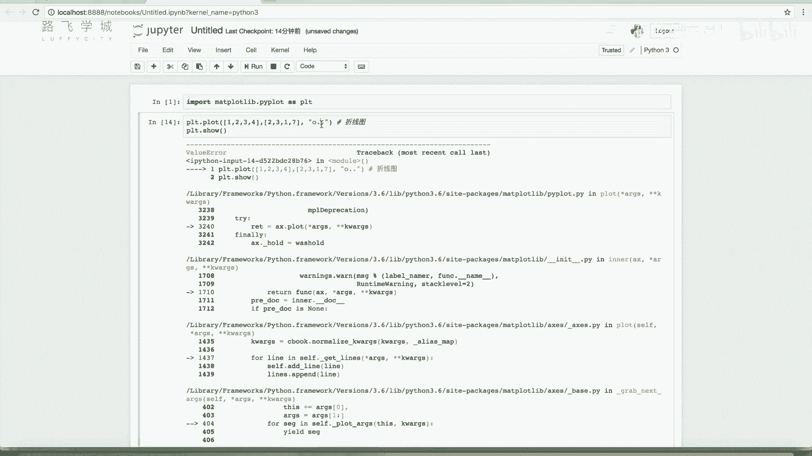


## 在同一图形中绘制多条线

只需多次调用`plt.plot()`函数，然后再调用`plt.show()`，即可在同一坐标系中叠加多条线。

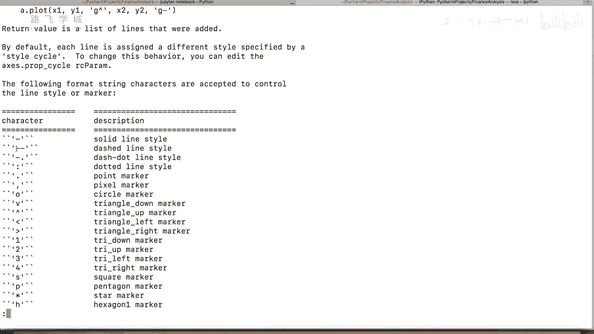

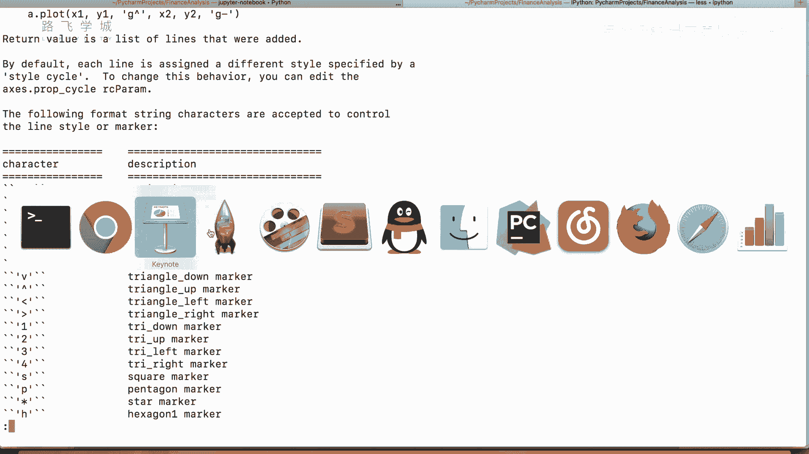

```python
# 绘制第一条线：红色圆点实线
plt.plot([1, 2, 3, 4], [1, 4, 9, 16], ‘ro-‘)
# 绘制第二条线：蓝色三角虚线
plt.plot([1, 2, 3, 4], [2, 5, 10, 17], ‘b^--‘)
plt.show()
```

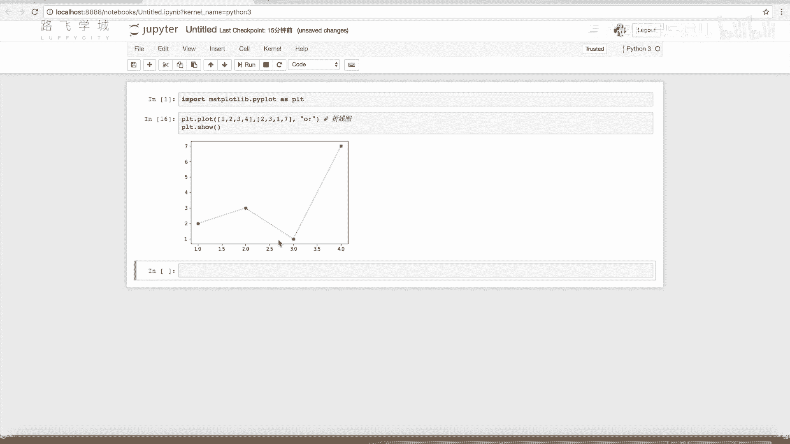

## 其他常用函数

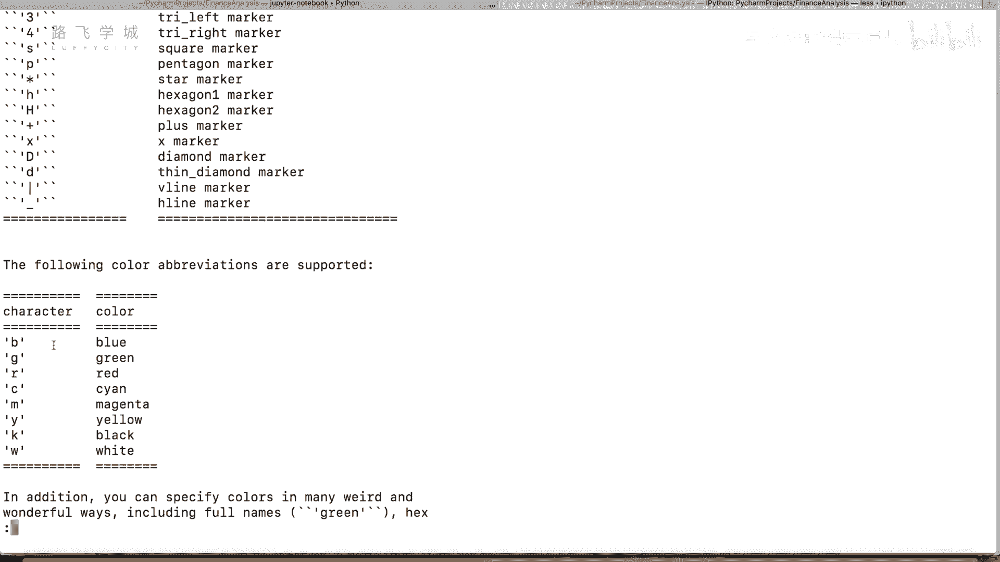

除了`plot`，Matplotlib还提供了许多其他绘图函数，例如：
*   `plt.scatter()`: 绘制散点图。
*   `plt.bar()`: 绘制柱状图。
*   `plt.hist()`: 绘制直方图。
*   `plt.title()`: 为图表添加标题。
*   `plt.xlabel()` / `plt.ylabel()`: 为X/Y轴添加标签。
*   `plt.legend()`: 显示图例。

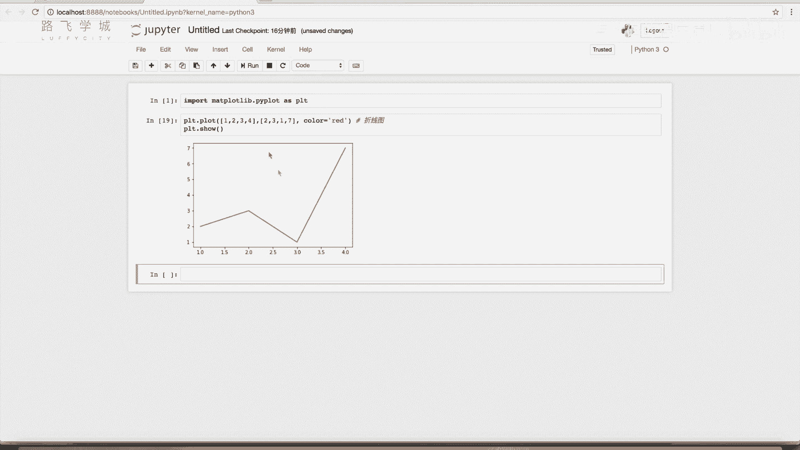

---


## 总结

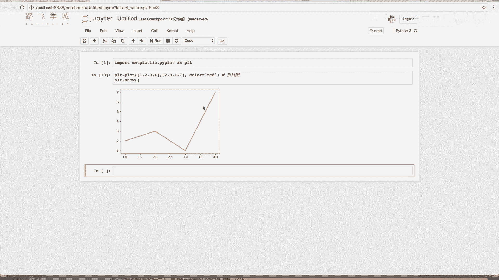

本节课中我们一起学习了Matplotlib的基础知识。我们掌握了如何使用`plt.plot()`函数绘制基础的折线图，如何通过格式字符串或关键字参数自定义线条的颜色、标记和线型，以及如何在同一图形中绘制多条曲线。Matplotlib是数据可视化的核心工具，熟练掌握它将为后续的金融数据分析与图表展示打下坚实基础。