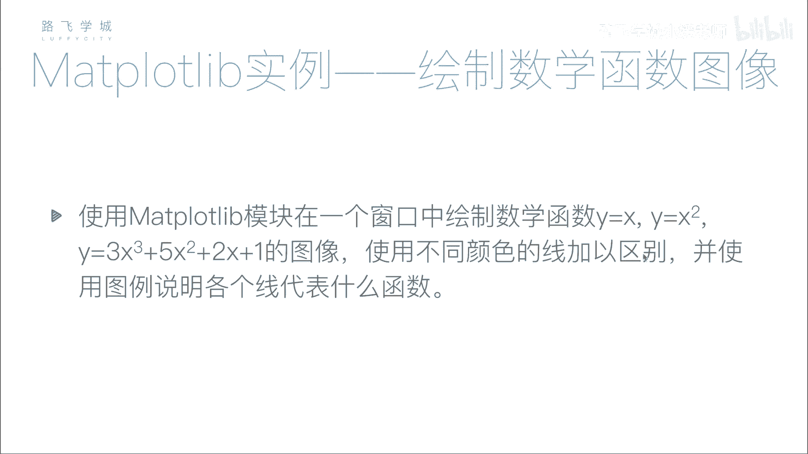
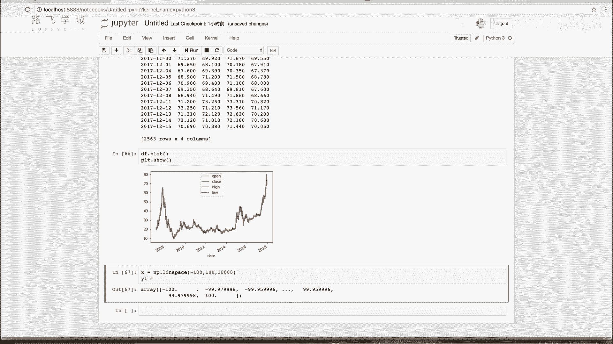
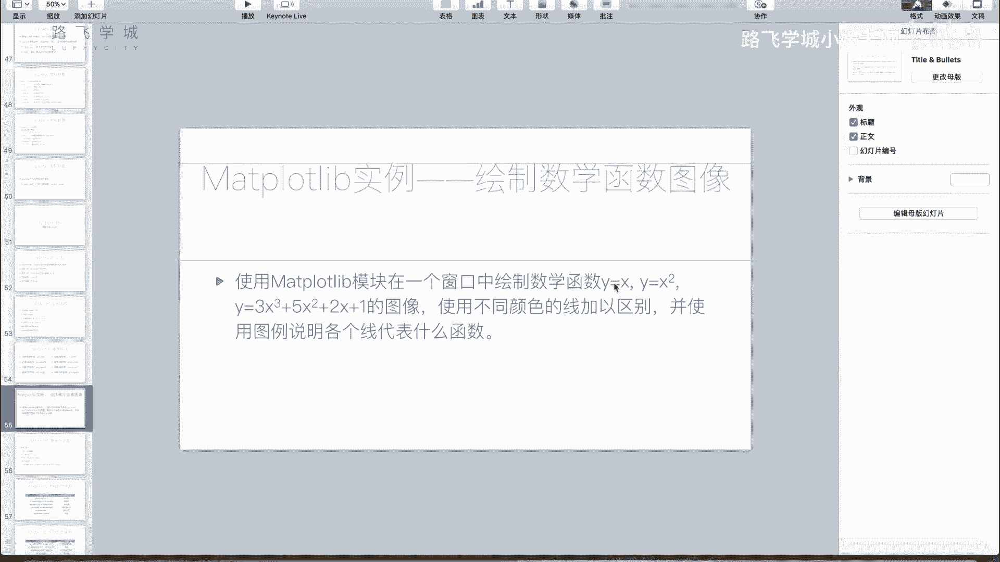
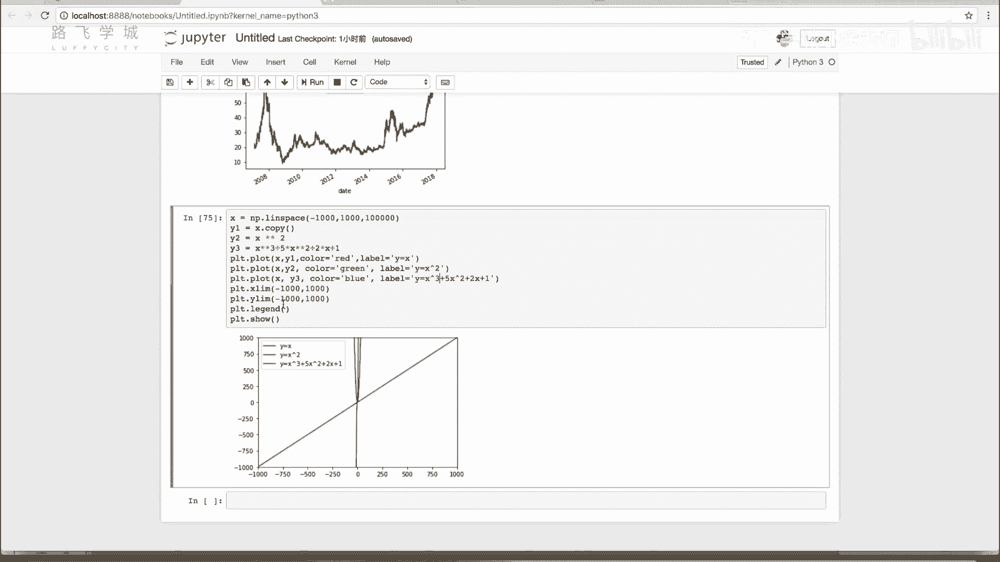

# Python金融量化：P24：使用matplotlib绘制数学函数图像 📈

## 概述
在本节课中，我们将学习如何使用Python的matplotlib库来绘制数学函数图像。我们将通过生成密集的数据点来模拟连续的曲线，并绘制多个函数在同一坐标系中进行比较。

---



## 绘制原理
上一节我们介绍了基本的绘图方法，本节中我们来看看如何绘制数学函数图像。

计算机绘图本质上是由点构成的。所谓的线，实际上是由许多密集的点连接而成。例如，在绘图软件中画一个圆，放大后会发现它是由一个个像素点组成的。绘制数学函数曲线也是同样的原理。

为了绘制函数 `Y = f(X)` 的图像，我们需要生成一个密集的X值列表，然后计算出每个X对应的Y值，最后将这些点连接起来。


---

## 生成密集数据点
以下是生成密集X值数组的方法。我们将使用NumPy库中的 `linspace` 函数。

```python
import numpy as np



# 使用linspace生成从-100到100之间的10000个等间距点
X = np.linspace(-100, 100, 10000)
```
`linspace` 函数的第一个参数是起点，第二个参数是终点，第三个参数是要生成的点数。点数越多，曲线看起来越平滑。如果觉得不够密集，可以尝试增加点数，例如100000。



---

## 计算Y值并绘图
有了X数组后，我们就可以计算对应的Y值。NumPy支持对数组进行整体运算，这非常方便。

以下是定义三个函数并计算Y值的示例：
```python
# 计算三个函数的Y值
Y1 = X                     # Y = X
Y2 = X ** 2                # Y = X的平方
Y3 = 3 * X**3 + 5 * X**2 + 2 * X + 1  # Y = 3X³ + 5X² + 2X + 1
```

接下来，我们使用matplotlib的plot函数将这些曲线绘制出来，并用不同的颜色和图例进行区分。

```python
import matplotlib.pyplot as plt

plt.plot(X, Y1, color='red', label='Y = X')
plt.plot(X, Y2, color='green', label='Y = X²')
plt.plot(X, Y3, color='blue', label='Y = 3X³ + 5X² + 2X + 1')

plt.legend()  # 显示图例
plt.show()
```

---

## 调整坐标轴范围
有时不同函数的Y值范围差异巨大，可能导致某些曲线在图中显示不明显。例如，立方函数增长非常快。

为了解决这个问题，我们可以使用 `plt.ylim` 函数来手动设置Y轴的范围，以便更好地观察所有曲线。

```python
# 设置Y轴的显示范围
plt.ylim(-1000, 1000)
```
同样，如果需要，也可以使用 `plt.xlim` 来调整X轴的范围。

---



## 总结
本节课中我们一起学习了使用matplotlib绘制数学函数图像的方法。核心步骤包括：
1.  使用NumPy的 `linspace` 生成密集的X值点。
2.  根据函数公式计算对应的Y值数组。
3.  使用 `plt.plot` 绘制图像，并用颜色和图例区分不同函数。
4.  必要时使用 `plt.ylim` 或 `plt.xlim` 调整坐标轴范围，以获得最佳的视觉效果。

这种方法在数学实验、数据分析和科学计算中非常常用，是数据可视化的重要基础。