# Python金融量化：P25：plot函数周边设置详解 📊

在本节课中，我们将深入学习Matplotlib库中`plot`函数的周边设置。我们将探讨如何在同一图表中绘制多条曲线，以及如何为图表添加标题、坐标轴标签、刻度、范围和图例等元素，使图表更加专业和清晰。

---

## 绘制多条曲线

上一节我们介绍了`plot`函数的基本用法。本节中我们来看看如何在一个图表中绘制多条曲线。例如，在股票分析中，我们可能需要同时绘制多只股票的价格趋势或不同的技术指标线。

实现方法非常简单：只需多次调用`plt.plot()`函数即可。Matplotlib会将这些调用累积起来，直到调用`plt.show()`时，将所有曲线绘制在同一张图上。

以下是绘制两条曲线的示例代码：

```python
import matplotlib.pyplot as plt

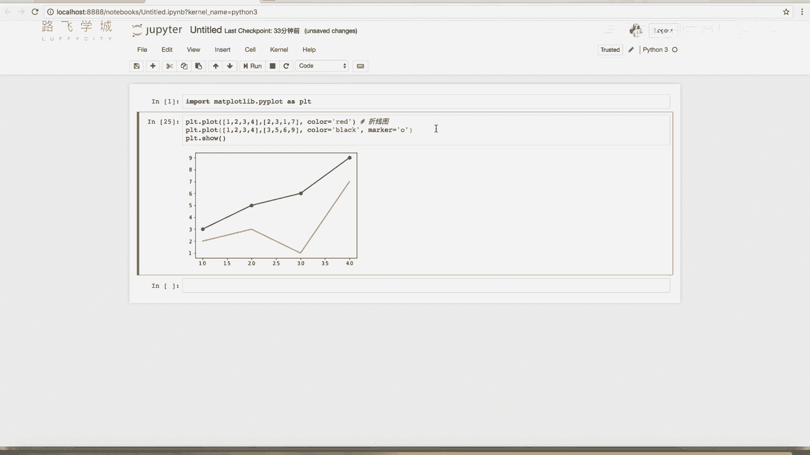

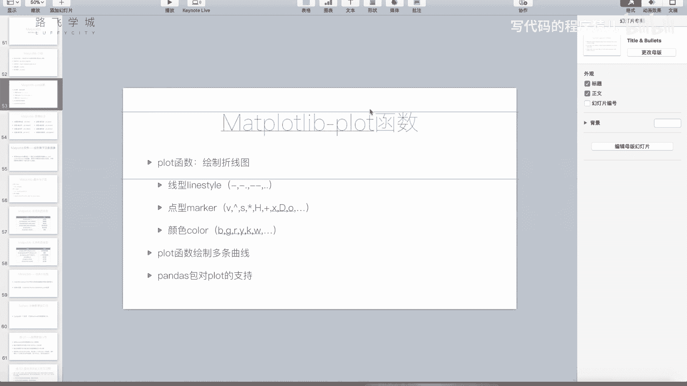

# 第一条曲线
plt.plot([1, 2, 3, 4], [1, 4, 9, 16], 'ro-', label='Line A')
# 第二条曲线
plt.plot([1, 2, 3, 4], [2, 5, 10, 17], 'bo--', label='Line B')

plt.show()
```

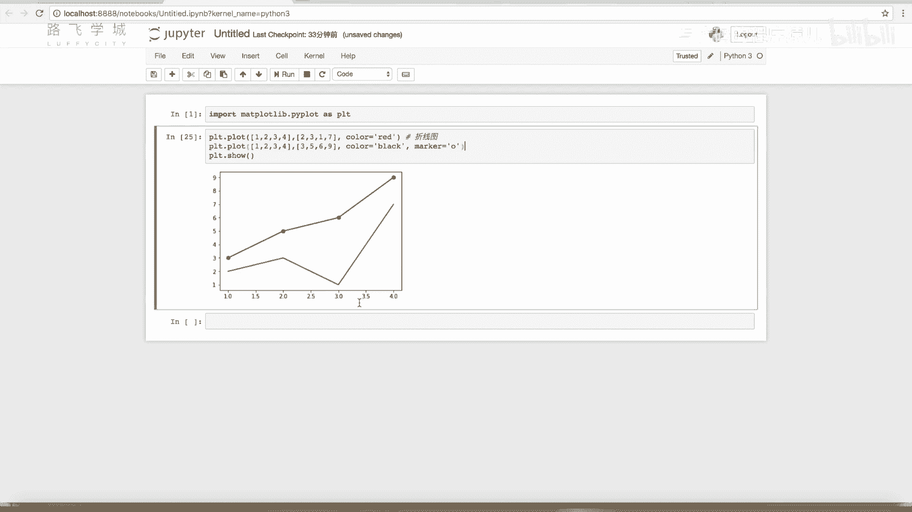

代码中，`‘ro-’`和`‘bo--’`是格式化字符串，分别指定了红色圆点实线和蓝色圆点虚线。`label`参数用于为曲线添加标签，这在后续添加图例时会用到。

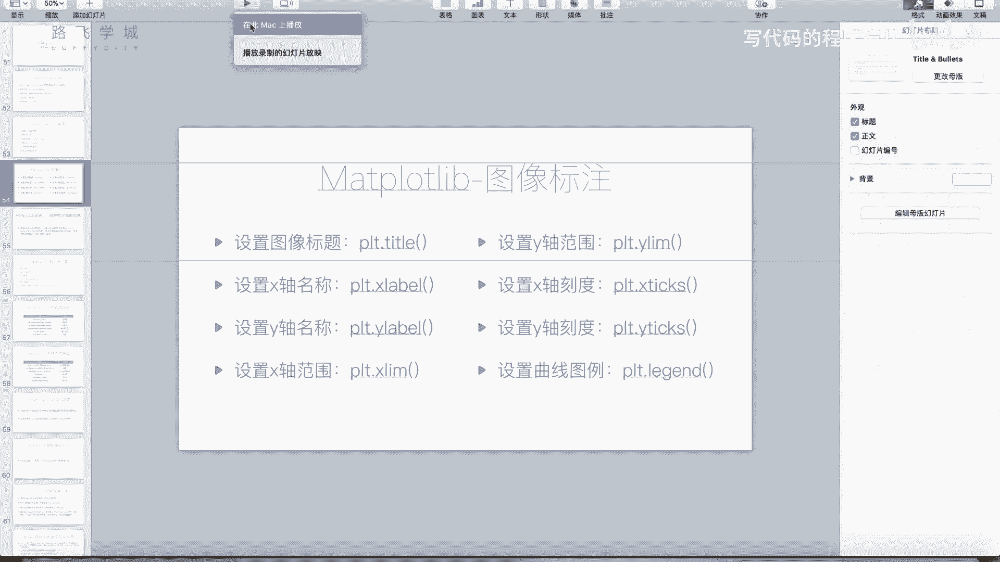

---

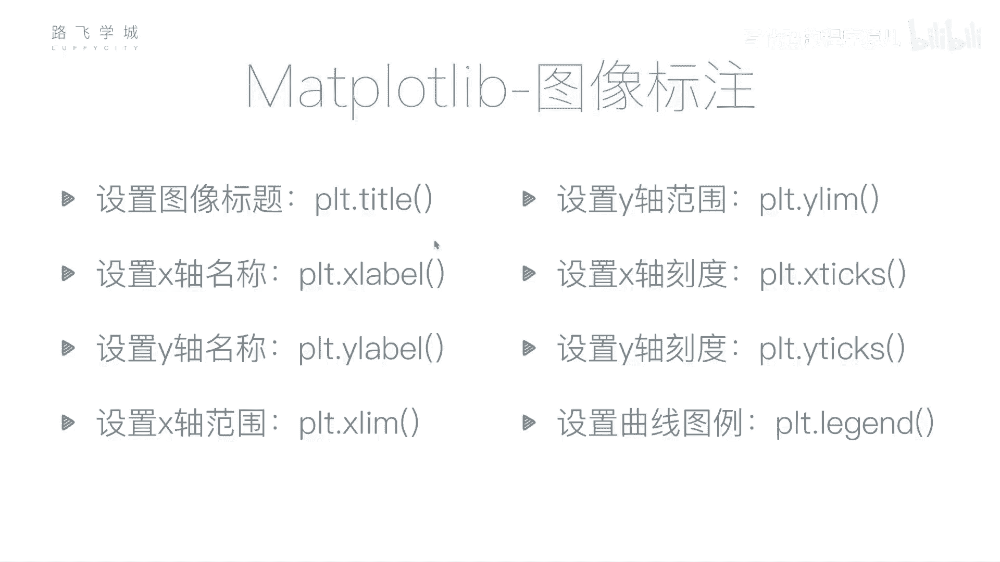

## 设置图表标题与坐标轴标签

一个完整的图表通常包含标题和坐标轴说明。以下是设置这些元素的相关函数。

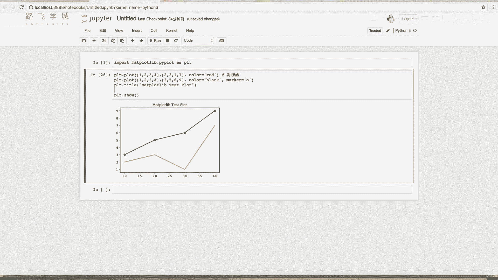

*   **`plt.title()`**: 设置图表的标题。
*   **`plt.xlabel()`**: 设置X轴的标签。
*   **`plt.ylabel()`**: 设置Y轴的标签。

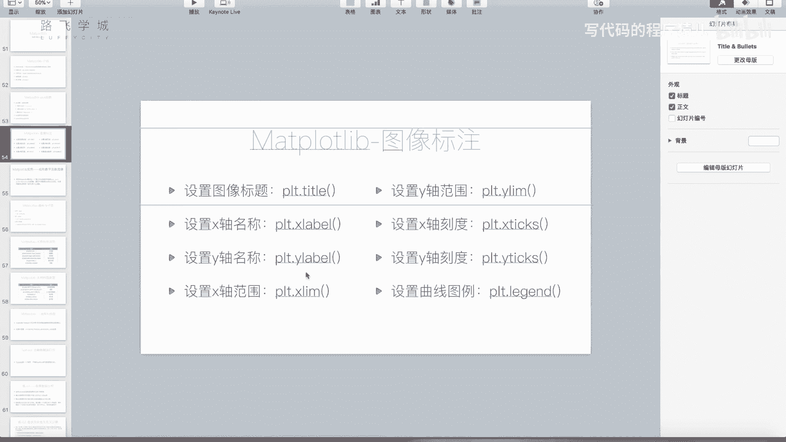

这些函数可以在`plot`调用之后、`show`调用之前的任何位置使用。

```python
plt.title(‘Matplotlib Test Plot’)
plt.xlabel(‘X Label’)
plt.ylabel(‘Y Label’)
plt.show()
```

---

## 设置坐标轴范围与刻度

有时我们需要手动控制坐标轴显示的范围或刻度值，以使图表呈现更符合需求。

*   **`plt.xlim()` 和 `plt.ylim()`**: 用于设置X轴和Y轴的显示范围。它们接收两个参数：最小值和最大值。如果不设置，Matplotlib会自动调整范围以适配所有数据。

```python
# 设置X轴范围为0到5，Y轴范围为0到20
plt.xlim(0, 5)
plt.ylim(0, 20)
```

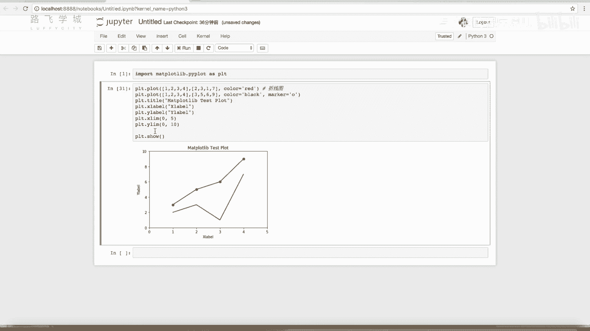

*   **`plt.xticks()` 和 `plt.yticks()`**: 用于手动设置坐标轴的刻度位置和标签。
    *   传入一个列表，可以指定刻度显示的位置。
    *   传入两个列表（位置列表和标签列表），可以同时指定刻度的位置和显示的文本标签。这在绘制分类数据（如国家名、产品名）时非常有用。

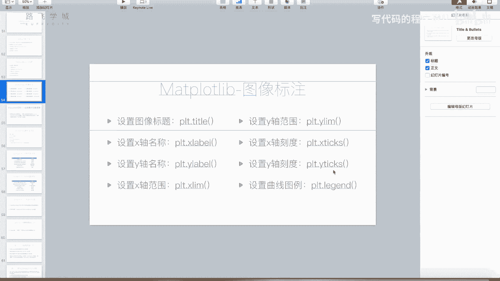

以下是设置刻度的示例：

```python
import numpy as np

# 设置X轴刻度位置为0, 2, 4, 6, 8, 10
plt.xticks(np.arange(0, 11, 2))

# 设置X轴刻度位置为1,2,3,4,5，并显示为自定义标签
plt.xticks([1, 2, 3, 4, 5], [‘A’, ‘B’, ‘C’, ‘D’, ‘E’])
```

---

## 添加图例 (Legend)

当图表中有多条曲线时，添加图例至关重要，它用于说明每条曲线所代表的含义。

添加图例最直接的方法是在调用`plt.plot()`时，通过`label`参数为每条曲线指定一个标签。然后，调用`plt.legend()`函数即可显示图例。

```python
# 绘制曲线时指定label
plt.plot([1, 2, 3, 4], [1, 4, 9, 16], label=‘Line A (Price)’)
plt.plot([1, 2, 3, 4], [2, 5, 10, 17], label=‘Line B (MA)’)

# 显示图例
plt.legend()
plt.show()
```

`plt.legend()`函数还有其他高级用法，例如手动指定图例位置、样式等，但对于初学者，上述方法最为直观和常用。

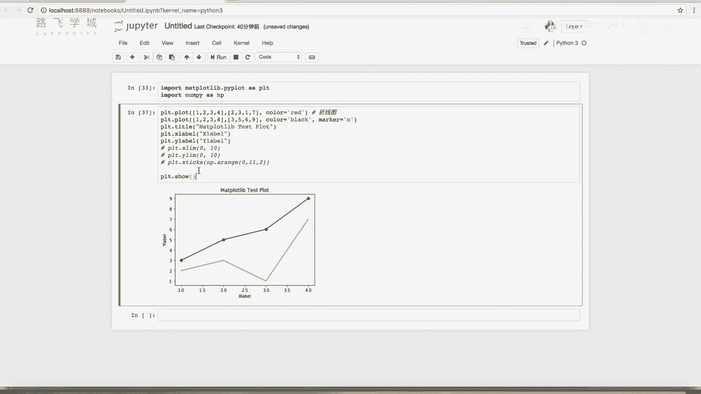

---

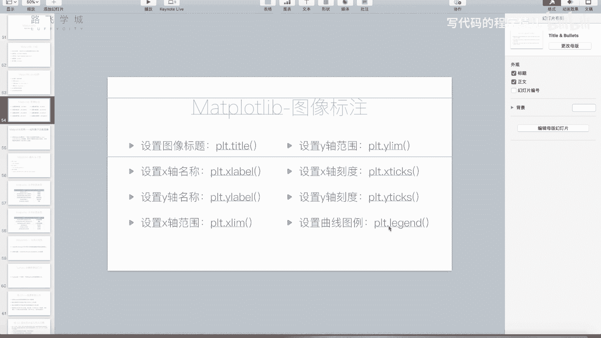

## 综合示例与总结

本节课中我们一起学习了`plot`函数的周边设置。让我们通过一个综合示例来回顾所有内容：

```python
import matplotlib.pyplot as plt
import numpy as np

# 生成示例数据
x = np.arange(0, 10, 0.1)
y1 = np.sin(x)
y2 = np.cos(x)

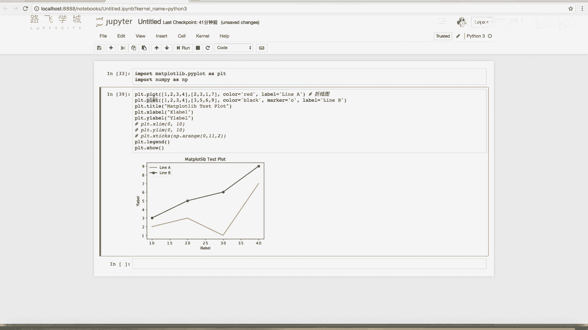

# 绘制两条曲线
plt.plot(x, y1, ‘b-’, label=‘sin(x)’)
plt.plot(x, y2, ‘r--’, label=‘cos(x)’)

# 设置图表标题和坐标轴标签
plt.title(‘Sine and Cosine Waves’)
plt.xlabel(‘X Axis (Radians)’)
plt.ylabel(‘Y Axis (Value)’)

# 设置坐标轴范围
plt.xlim(0, 10)
plt.ylim(-1.5, 1.5)

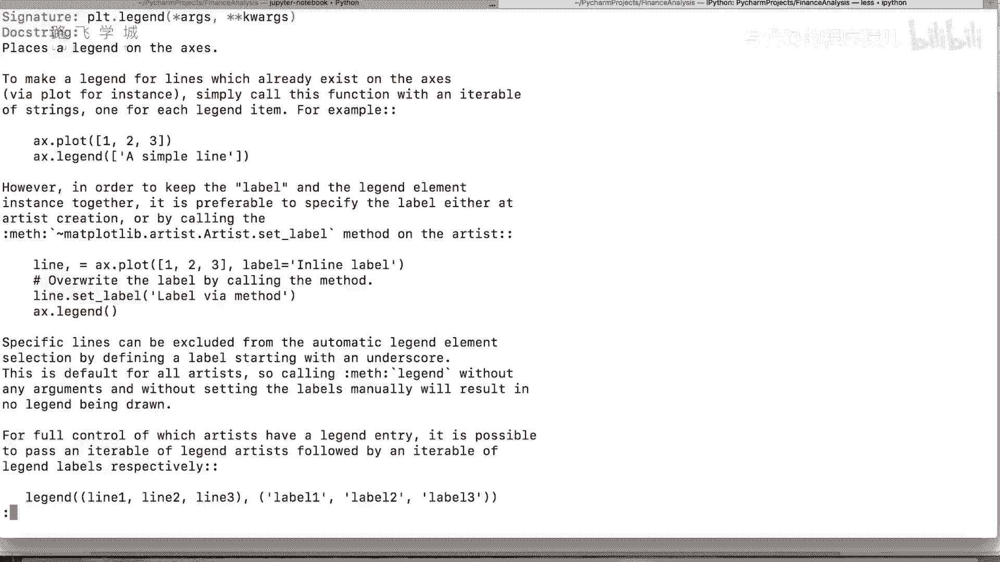

# 设置X轴刻度
plt.xticks(np.arange(0, 11, 2))

# 添加图例
plt.legend()

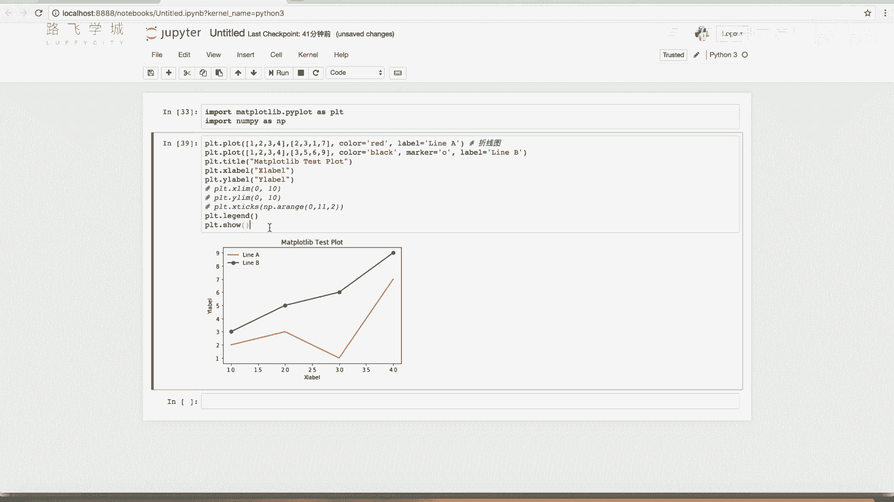

# 显示图表
plt.show()
```

**总结**：本节课我们掌握了如何利用Matplotlib美化图表，包括绘制多条曲线、添加标题与标签、调整坐标轴范围与刻度，以及创建图例。这些技能是进行数据可视化的基础，能让你的图表传达更准确、更丰富的信息。在后续课程中，我们还会接触到更多类型的图表和定制化选项。