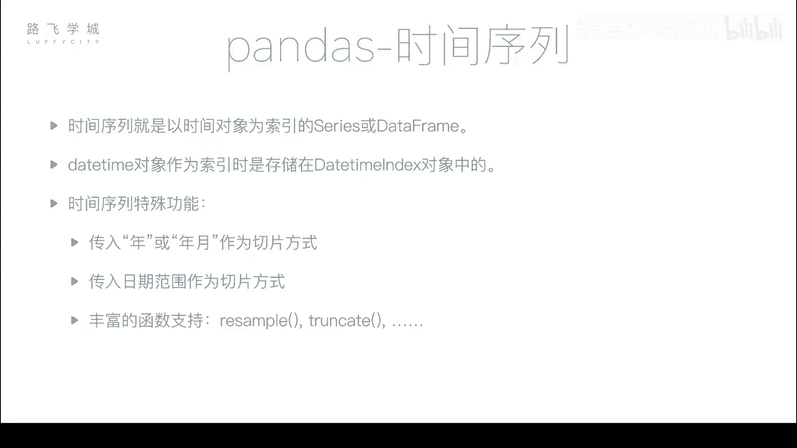
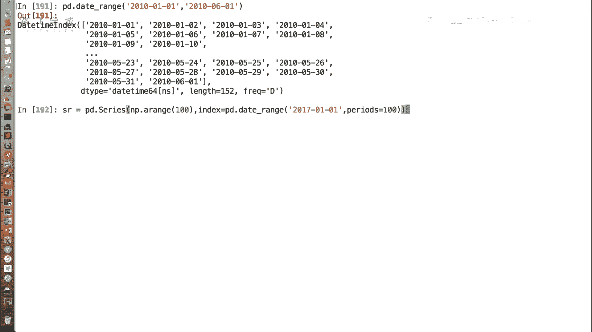
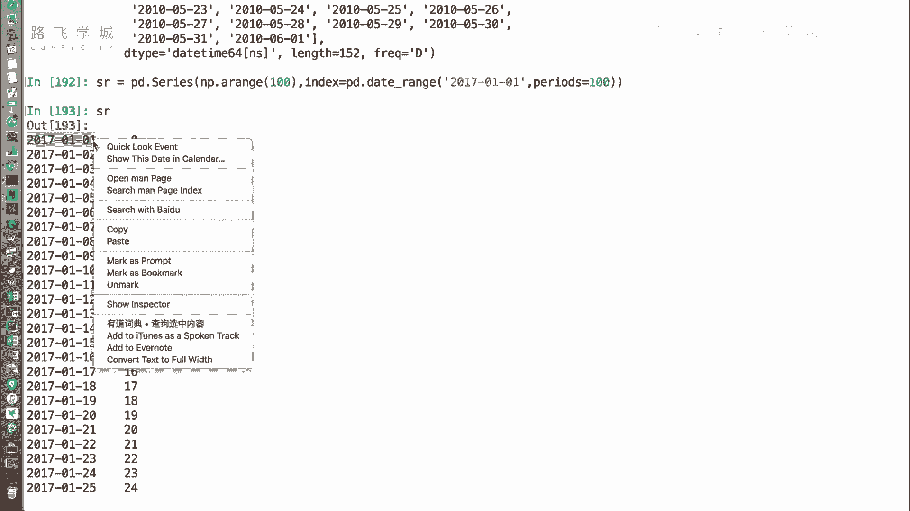
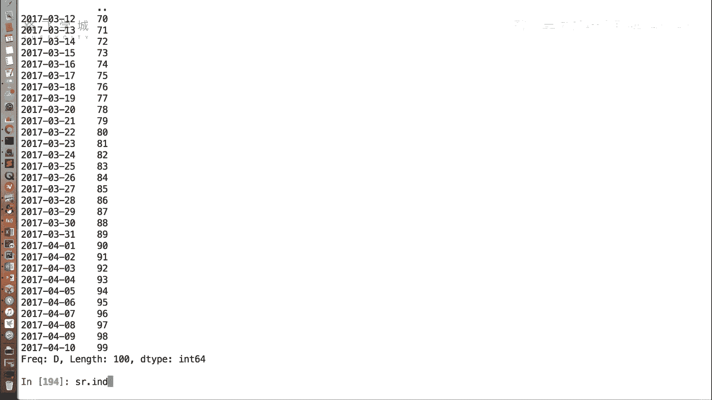
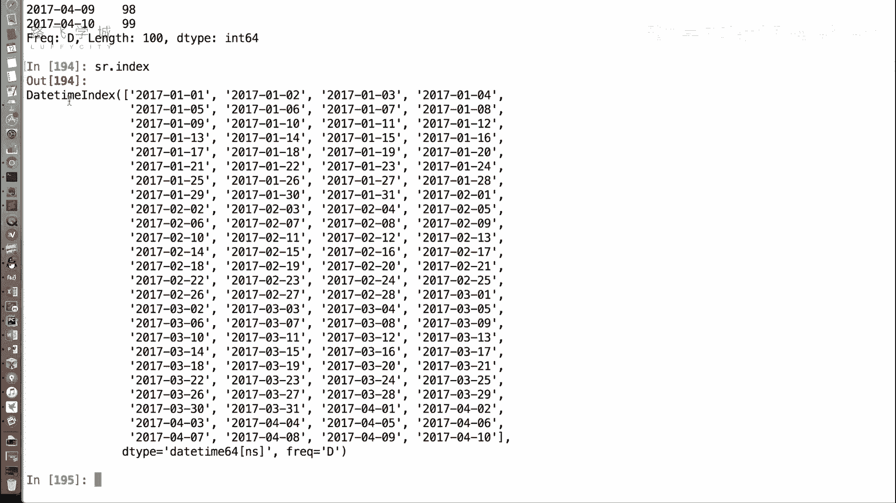
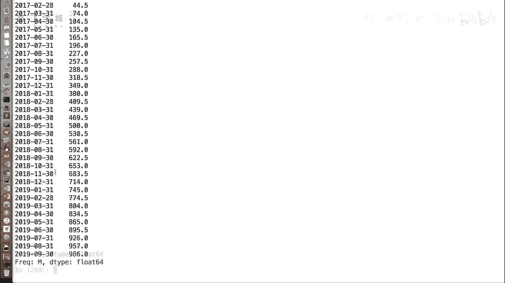
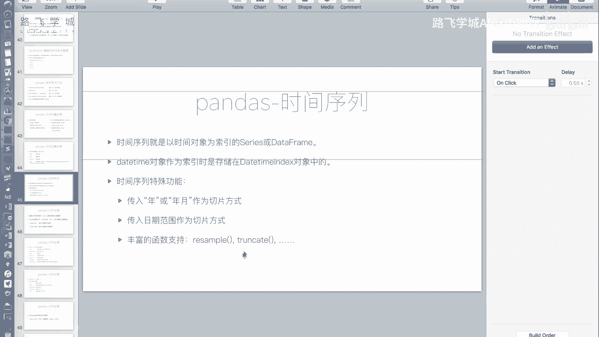
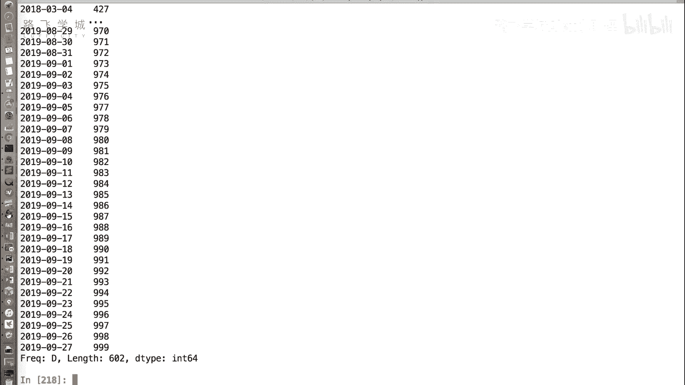
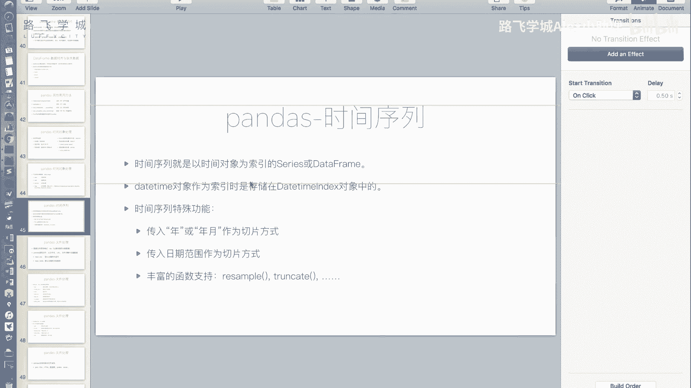

# Python金融量化：P25：29 时间序列 📅

在本节课中，我们将要学习如何利用Pandas创建和使用时间序列。时间序列是以时间对象作为索引的Series或DataFrame，它在金融数据分析中至关重要，能帮助我们轻松地进行时间维度的数据切片、重采样等操作。



## 创建时间序列

上一节我们介绍了Pandas中生成时间对象的函数。本节中我们来看看如何用它们来构建时间序列。

我们可以使用`pd.date_range`函数生成一个`DatetimeIndex`，并将其作为Series或DataFrame的索引。

```python
import pandas as pd
import numpy as np



# 创建一个Series，其索引为时间序列
sr = pd.Series(
    np.arange(100),  # 生成0到99的100个值
    index=pd.date_range('2017-01-01', periods=100)  # 指定时间索引
)
print(sr.index)  # 输出：DatetimeIndex
```


运行上述代码，可以看到索引显示为`DatetimeIndex`，而非普通字符串。这表明我们成功创建了一个时间序列。



## 时间序列的切片操作



成为时间序列后，一个直观的好处是我们可以方便地按时间范围选取数据。



以下是几种常见的切片方式：

*   **按年月切片**：`sr[‘2017-03’]` 会选取2017年3月的所有数据。
*   **按年切片**：`sr[‘2017’]` 会选取2017年全年的数据。
*   **按日期范围切片**：`sr[‘2017-12-25’:’2018-02-01’]` 会选取从2017年12月25日到2018年2月1日（包含首尾）的数据。

即使传入的是不完整的日期字符串（如只有年或年月），Pandas也能正确识别并进行切片。

## 重采样（Resample）功能

除了切片，时间序列还支持强大的重采样功能。`resample`函数可以将数据按照新的时间频率（如按周、按月）进行聚合。

以下是`resample`函数的基本用法：

```python
# 按周求和
weekly_sum = sr.resample('W').sum()
print(weekly_sum)

# 按月求平均值
monthly_mean = sr.resample('M').mean()
print(monthly_mean)
```

*   `’W’` 表示按周（Week）重采样。
*   `’M’` 表示按月（Month）重采样。
*   `.sum()` 和 `.mean()` 是聚合函数，分别计算总和与平均值。

执行后，数据会被聚合到每周的起始日或每月的最后一天，并计算出相应的聚合值。

## 其他辅助函数：truncate



时间序列还有一个`truncate`函数，用于截断指定日期之前或之后的数据。

以下是`truncate`函数的示例：



```python
# 截取2018年2月3日之后的数据
after_data = sr.truncate(after='2018-02-03')

# 截取2018年2月3日之前的数据
before_data = sr.truncate(before='2018-02-03')
```

*   `after`参数：保留该日期之后的数据。
*   `before`参数：保留该日期之前的数据。

不过，这个功能通常可以用更直观的切片操作`sr[‘2018-02-03’:]`或`sr[:’2018-02-03’]`来实现，因此`truncate`的使用频率相对较低。



---



本节课中我们一起学习了Pandas时间序列的核心操作。我们掌握了如何创建时间序列，如何利用不完整的日期字符串进行灵活的数据切片，以及如何使用`resample`函数按不同时间频率对数据进行重采样和聚合。这些功能为按时间维度分析金融数据提供了极大的便利。