# Python金融量化：P25：37 matplotlib 画布与子图 🎨

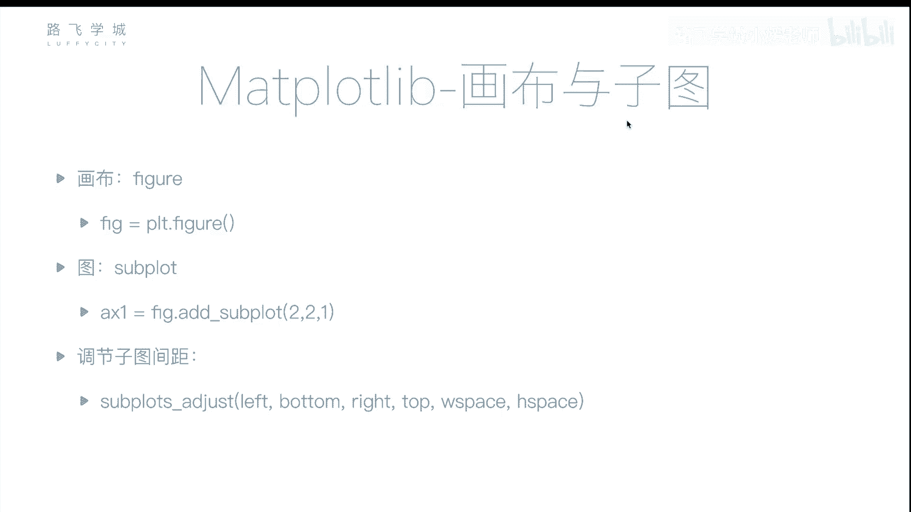

## 概述
在本节课中，我们将要学习如何使用Matplotlib库在一个窗口中创建多个独立的图表。我们将重点介绍**画布**和**子图**的概念，这对于金融分析中同时展示多个相关图表（例如股票K线图与大盘走势图）至关重要。

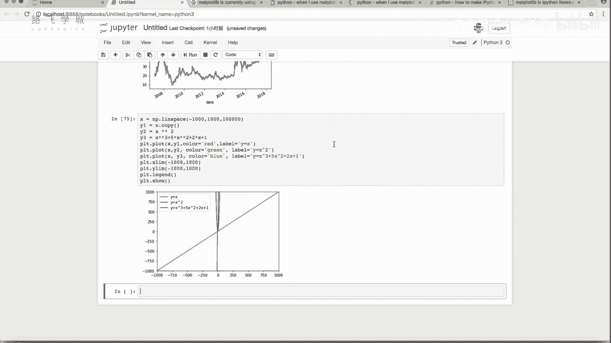

## 画布与子图的概念
上一节我们介绍了如何在一个图表中绘制多条线。本节中我们来看看如何在一个窗口中创建多个独立的图表。

有时，我们可能需要在一个窗口中并排显示多个图表。例如，在股票分析中，我们可能希望上方显示个股的K线图，下方显示大盘的走势图。这就需要用到**画布**和**子图**的功能。

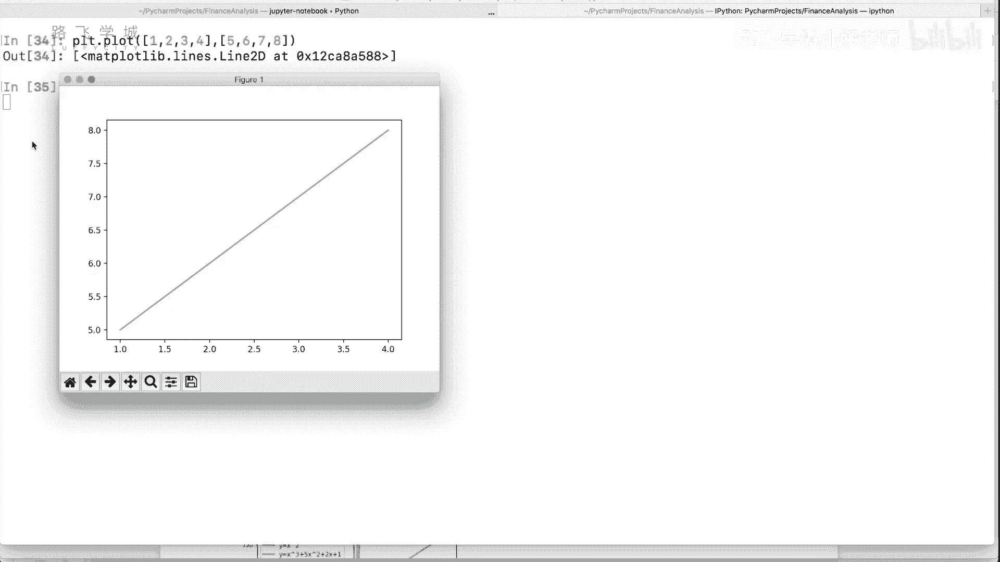

**画布**可以理解为一个窗口或一张画纸，而**子图**则是画布上划分出的独立绘图区域。

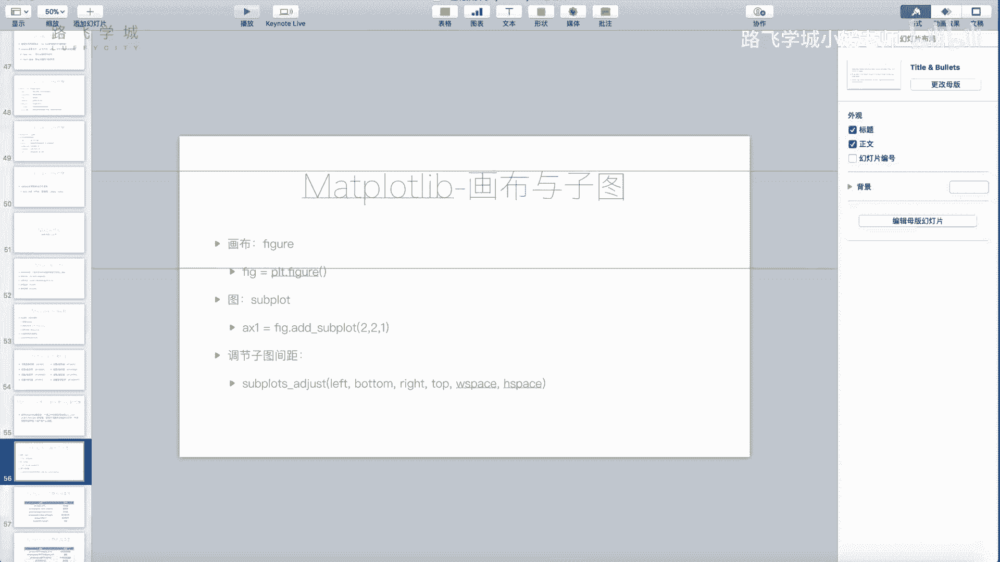

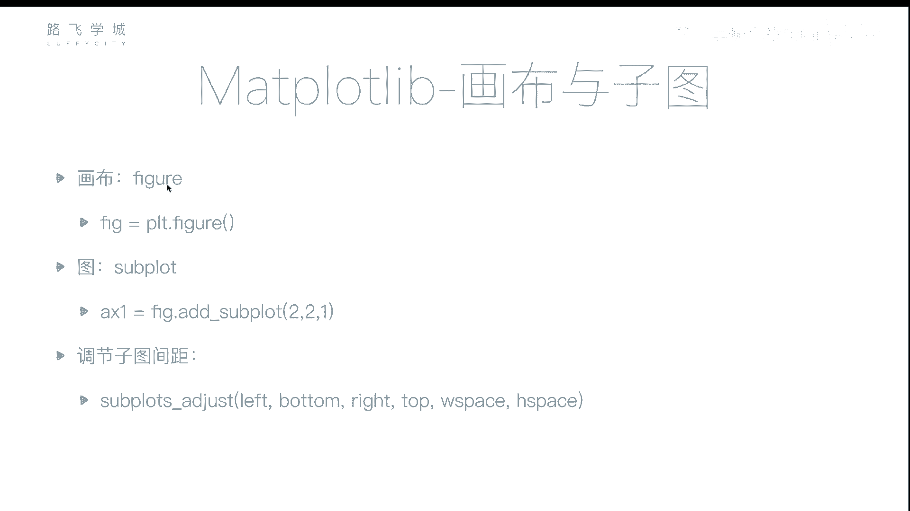

## 创建画布与子图
以下是创建画布和添加子图的基本步骤。

1.  **创建画布**：使用 `plt.figure()` 创建一个画布对象。
2.  **添加子图**：在画布上使用 `.add_subplot()` 方法添加子图。该方法需要指定子图的布局和位置。
3.  **在子图上绘图**：获取子图对象后，调用其绘图方法（如 `.plot()`）进行绘制。

### 核心代码示例
```python
import matplotlib.pyplot as plt

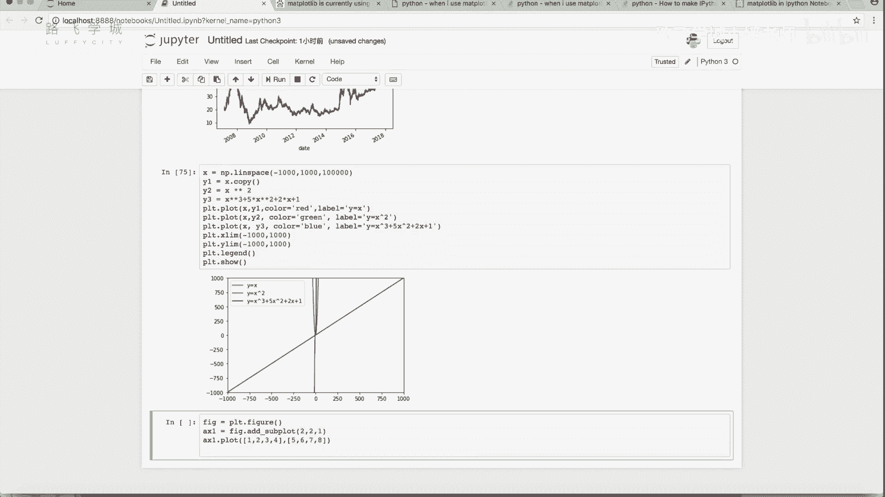

# 1. 创建画布
fig = plt.figure()

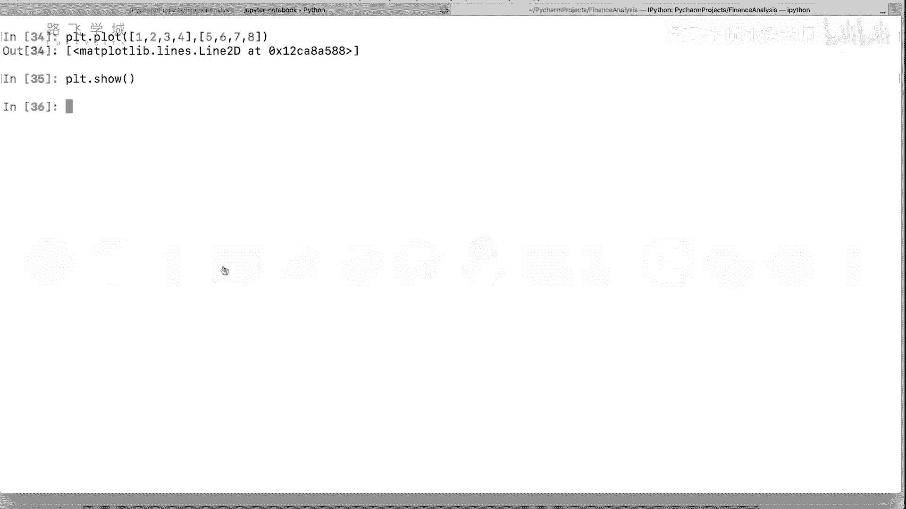

# 2. 添加第一个子图：布局为2行2列，位置为第1个
ax1 = fig.add_subplot(2, 2, 1)
ax1.plot([1, 2, 3, 4, 5, 6, 7, 8])  # 在第一个子图上绘图

# 3. 添加第二个子图：布局为2行2列，位置为第2个
ax2 = fig.add_subplot(2, 2, 2)
# ax2.plot(...)  # 可以在此子图上绘图

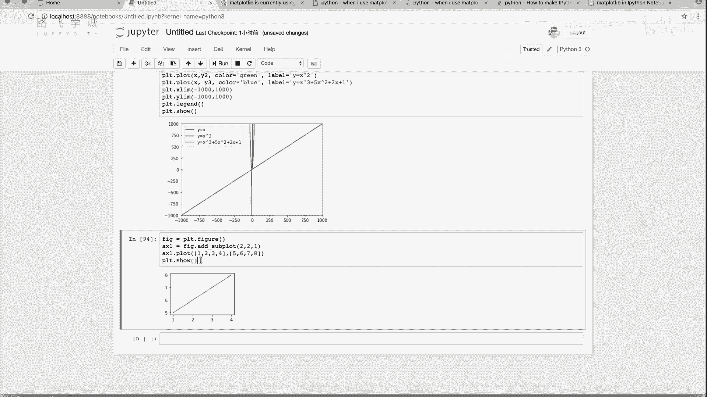

# 4. 显示画布
fig.show()
# 或者使用 plt.show()
```

## 理解子图参数
`.add_subplot()` 方法的参数 `(nrows, ncols, index)` 含义如下：
*   **nrows**：将画布划分为多少行。
*   **ncols**：将画布划分为多少列。
*   **index**：子图在网格中的位置索引（从1开始，按行从左到右、从上到下计数）。

例如，`add_subplot(2, 2, 1)` 表示将画布分成2行2列（共4个区域），并在第1个位置（左上角）创建子图。

## 创建上下布局的子图
要实现一个图表在上、一个图表在下的布局，可以这样操作：

```python
import matplotlib.pyplot as plt

fig = plt.figure()

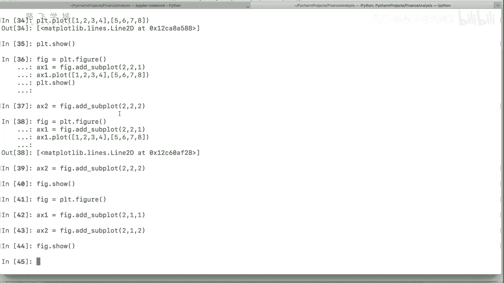

# 上方子图：2行1列中的第1个
ax1 = fig.add_subplot(2, 1, 1)
ax1.plot([1, 2, 3])  # 在上方子图绘图


# 下方子图：2行1列中的第2个
ax2 = fig.add_subplot(2, 1, 2)
ax2.plot([3, 2, 1])  # 在下方子图绘图

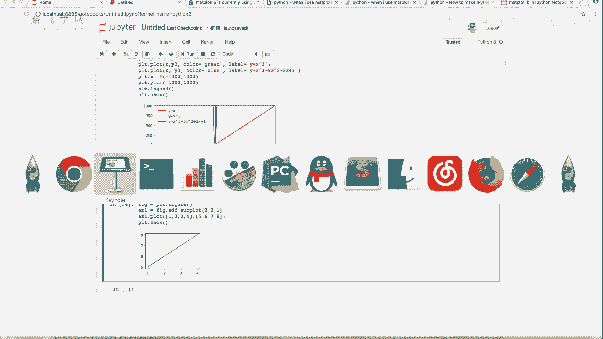

plt.show()
```

## 调整子图间距
当有多个子图时，它们之间可能存在间距。可以使用 `plt.subplots_adjust()` 函数来调整这些间距。

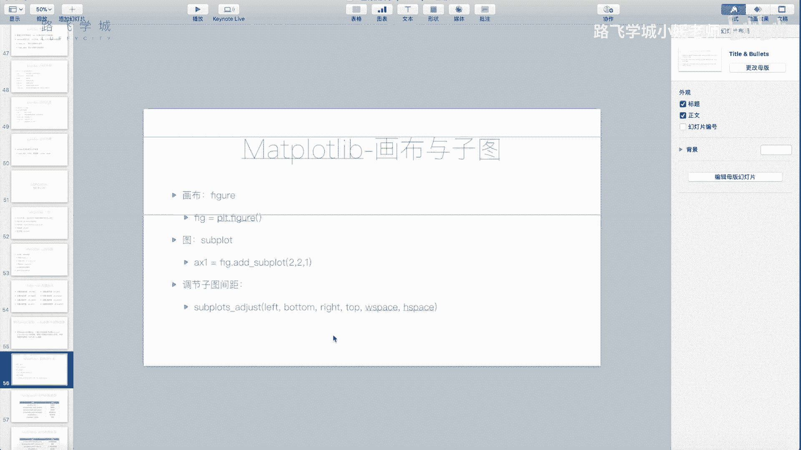

以下是该函数的主要参数：
*   `left`, `right`, `bottom`, `top`：控制子图区域距离画布边缘的距离。
*   `wspace`：控制子图之间的宽度间距。
*   `hspace`：控制子图之间的高度间距。

```python
# 调整子图间距示例
plt.subplots_adjust(left=0.1, bottom=0.1, right=0.9, top=0.9, wspace=0.4, hspace=0.4)
```
通常情况下，Matplotlib的默认间距设置已经足够，但你可以根据需要进行微调。

## 总结
本节课中我们一起学习了Matplotlib中**画布**与**子图**的核心用法。我们掌握了如何通过 `plt.figure()` 创建画布，以及如何使用 `.add_subplot()` 在画布上划分并创建多个独立的子图区域。这使我们能够在一个窗口中灵活地组织多个图表，例如在金融分析中同时展示股价走势和相关指标。我们还了解了如何通过 `plt.subplots_adjust()` 调整子图之间的间距。掌握这些知识，是进行复杂数据可视化的重要基础。