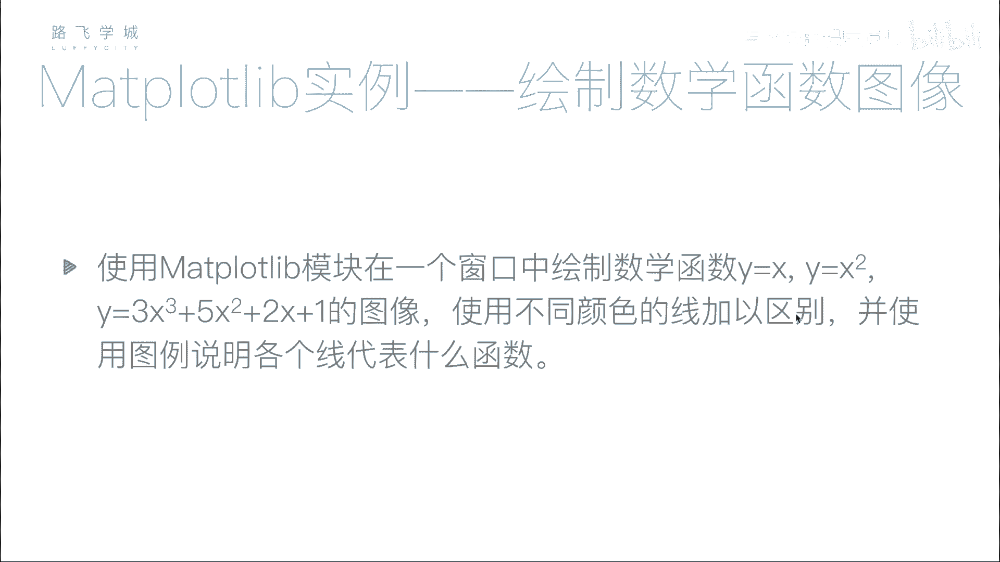
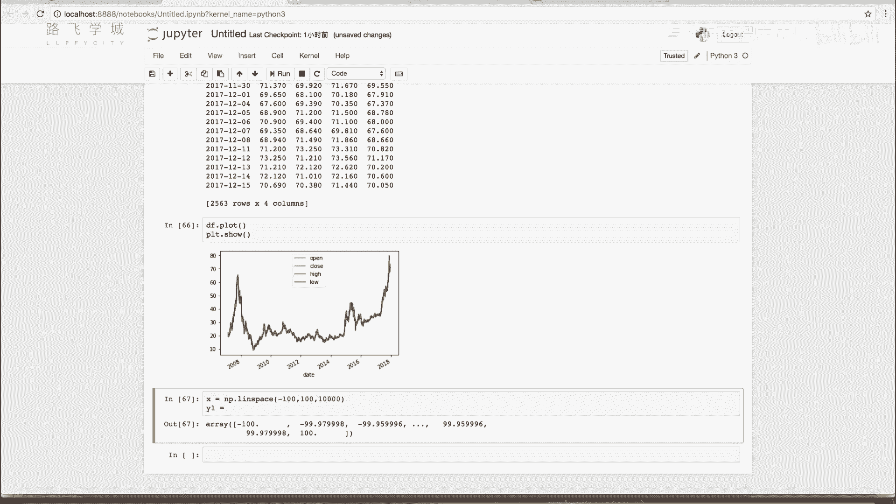
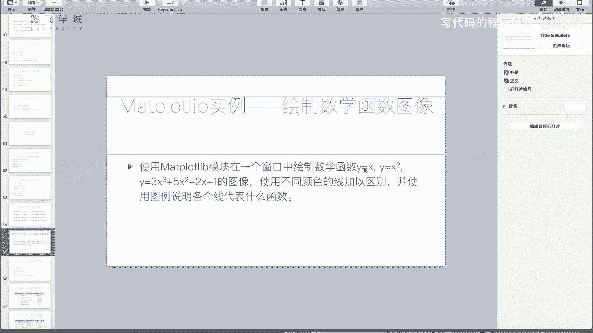
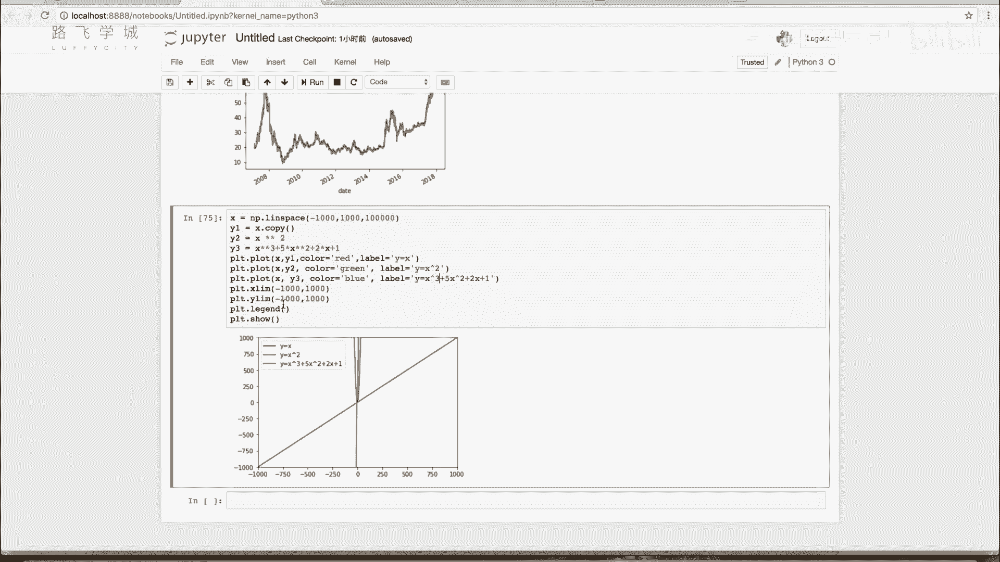

# Python金融量化：P26：27 使用matplotlib绘制数学函数图像 📈

在本节课中，我们将学习如何使用matplotlib库绘制数学函数图像。我们将通过生成密集的数据点来模拟连续的曲线，并绘制多个函数在同一坐标系中进行比较。

## 概述

计算机绘图本质上是通过连接一系列密集的点来形成线条或曲线。要绘制一个数学函数图像，我们需要先生成一系列密集的X值，然后根据函数公式计算出对应的Y值，最后将这些点连接起来。



## 生成密集的数据点

上一节我们介绍了绘图的基本原理，本节中我们来看看如何具体生成绘制函数所需的数据点。为了绘制平滑的曲线，我们需要在X轴上生成一系列非常密集的点。

我们可以使用NumPy库中的`linspace`函数来生成一个等间距的数值数组。`linspace`函数接收三个主要参数：起点、终点和要生成的点的数量。


以下是使用`linspace`生成数据点的代码示例：

```python
import numpy as np

# 生成从-100到100之间，包含10000个点的数组
x = np.linspace(-100, 100, 10000)
```

## 计算函数值



有了X值的数组后，我们就可以根据数学函数公式计算对应的Y值。NumPy数组支持向量化运算，这意味着我们可以直接对整个数组进行数学运算，而无需使用循环。



以下是计算三个不同函数Y值的示例：

```python
# 计算三个函数的Y值
y1 = x                     # y = x
y2 = x ** 2                # y = x^2
y3 = 3 * (x ** 3) + 5 * (x ** 2) + 2 * x + 1  # y = 3x^3 + 5x^2 + 2x + 1
```

## 绘制函数图像

数据准备完成后，就可以使用matplotlib的`plot`函数进行绘制了。为了区分不同的函数，我们需要为每条曲线设置不同的颜色和标签。

以下是绘制并美化图像的代码：

```python
import matplotlib.pyplot as plt

# 绘制三条曲线
plt.plot(x, y1, color='red', label='y = x')
plt.plot(x, y2, color='green', label='y = x^2')
plt.plot(x, y3, color='blue', label='y = 3x^3 + 5x^2 + 2x + 1')

# 添加图例
plt.legend()

# 显示图像
plt.show()
```

## 调整坐标轴范围

有时，不同函数的数值范围差异很大，可能导致某些曲线在图中显示不明显。这时，我们可以使用`ylim`函数来手动设置Y轴的范围，以确保所有曲线都能清晰可见。

以下是调整Y轴范围的示例：

```python
# 设置Y轴的显示范围为-1000到1000
plt.ylim(-1000, 1000)
```

将这段代码添加到`plt.legend()`之前，可以改变图像的纵坐标尺度，使各条曲线的对比更加清晰。



## 总结

本节课中我们一起学习了使用matplotlib绘制数学函数图像的核心方法。关键步骤包括：使用`np.linspace`生成密集的X值点，利用NumPy的向量化运算计算函数值，用`plt.plot`绘制曲线，并通过设置颜色、标签、图例和坐标轴范围来完善图像。这种方法在数学实验和数据分析中非常实用。