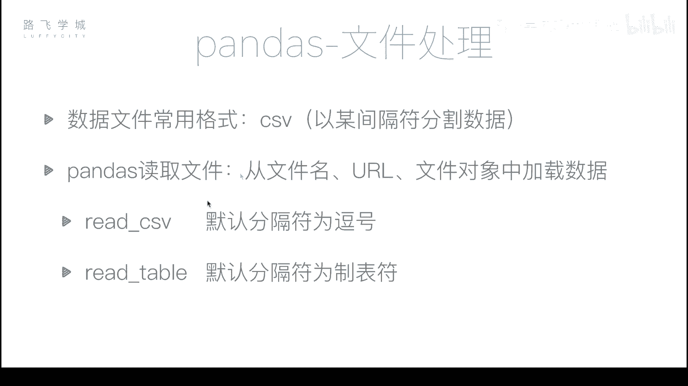
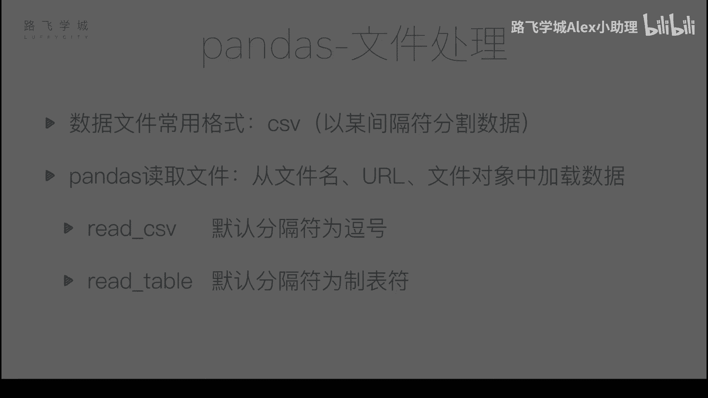
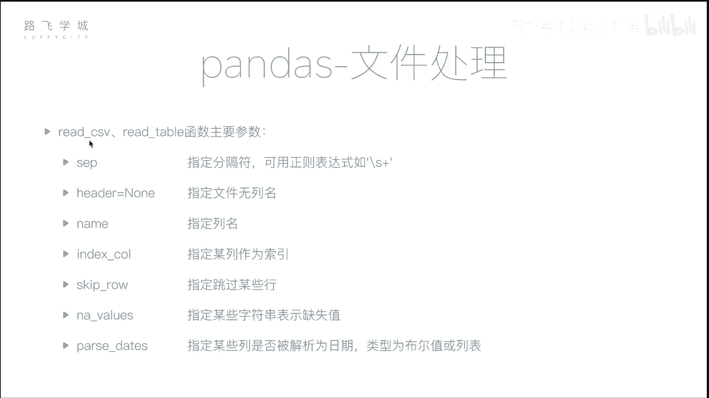

# Python金融量化：P26：文件读取 📂

在本节课中，我们将学习如何使用Pandas库读取外部文件中的数据。这是数据分析中至关重要的一步，因为真实世界的数据通常存储在文件中，而非手动输入。

## 概述

到目前为止，我们已经介绍了Pandas的许多核心功能，包括灵活的数据操作、数据对齐、缺失数据处理和时间序列等。最后一部分，我们将聚焦于文件处理。在日常编程中，我们通常不会手动创建`DataFrame`对象，而是从文件中读取真实数据。最常用的数据文件格式之一是CSV。

## CSV文件格式





CSV文件本质上是一个文本文件。文件中的每一行代表一条数据记录，而每条记录中的不同字段（单元格）由逗号分隔。这类似于Excel表格，两个逗号之间的内容就相当于一个单元格中的数据。

## 使用`read_csv`函数读取数据

`read_csv`函数可以将CSV文件的内容读取到Pandas的`DataFrame`对象中。

以下是一个示例文件，它包含了某只股票从2007年3月1日到2017年11月10日的行情数据。其列包括：序号、时间、开盘价、收盘价、最高价、最低价、成交量和股票代码。

现在，我们使用`pd.read_csv`函数来读取这个文件。

```python
import pandas as pd
df = pd.read_csv('stock_data.csv')
```

执行上述代码后，数据被成功读取。但可能会发现一些问题。例如，文件原有的行号（0, 1, 2...）被读取成了一列数据，并且Pandas又自动创建了一个新的数字索引。

## 指定行索引列

如果我们希望将文件中的某一列作为行索引，可以使用`index_col`参数。

*   **传入列编号**：`index_col=0` 会将第一列（第0列）设置为索引。
*   **传入列名**：`index_col='date'` 会将名为“date”的列设置为索引。这通常比使用行号更有意义，尤其是在处理时间序列数据时。

```python
df = pd.read_csv('stock_data.csv', index_col='date')
```

## 解析日期列

将日期列设置为索引后，你可能会发现索引的数据类型是字符串，而非时间对象。为了将其转换为Pandas的`DatetimeIndex`，需要使用`parse_dates`参数。

`parse_dates`参数有两种使用方式：

1.  **传入布尔值**：`parse_dates=True`。Pandas会尝试将文件中所有可以解析为日期的列都转换为时间对象。
2.  **传入列表**：`parse_dates=['date']`。可以精确指定需要转换的列名。

```python
# 方式一：自动解析所有日期列
df = pd.read_csv('stock_data.csv', index_col='date', parse_dates=True)

# 方式二：指定解析特定列
df = pd.read_csv('stock_data.csv', index_col='date', parse_dates=['date'])
```

执行后，`df.index`的类型将变为`DatetimeIndex`。

## 处理没有列名的文件

如果CSV文件的第一行就是数据，没有列名，直接读取会导致第一行数据被误认为是列名。这时需要使用`header`参数。

*   `header=None`：Pandas不会将第一行作为列名，并会自动生成数字列名（0, 1, 2...）。
*   如果想自定义列名，可以结合`names`参数，传入一个列名列表。

```python
# 文件无列名，自动生成数字列名
df = pd.read_csv('data_without_header.csv', header=None)

# 文件无列名，自定义列名
column_names = ['A', 'B', 'C', 'D', 'E', 'F', 'G', 'H']
df = pd.read_csv('data_without_header.csv', header=None, names=column_names)
```

## `read_table`函数与分隔符

除了`read_csv`，Pandas还提供了`read_table`函数。两者的主要区别在于默认分隔符：

*   `read_csv`默认分隔符是逗号（`,`）。
*   `read_table`默认分隔符是制表符（`\t`）。

在`read_csv`或`read_table`中，都可以通过`sep`参数来指定分隔符。默认值是逗号，但可以指定为冒号、空格等，甚至是一个正则表达式。

```python
# 使用read_csv读取以空格分隔的文件
df = pd.read_csv('space_separated.txt', sep=' ')

# 使用正则表达式匹配任意空白字符（空格或制表符）
df = pd.read_csv('irregular_separated.txt', sep='\s+')
```

## 其他常用参数

以下是`read_csv`函数中其他一些有用的参数：

*   **`skiprows`**：跳过文件开头的指定行数。例如，`skiprows=[1, 2, 3]`会跳过第2、3、4行（注意索引从0开始）。
*   **`na_values`**：指定哪些字符串应被识别为缺失值（NaN）。这对于处理来源多样、缺失值标记不统一的数据非常有用。

```python
# 跳过前3行数据
df = pd.read_csv('data.csv', skiprows=3)

# 将字符串'N/A'和'NULL'识别为缺失值
df = pd.read_csv('data.csv', na_values=['N/A', 'NULL'])
```

例如，如果数据中本应是数字的列里混入了字符串“N”，整列可能会被错误地识别为对象（字符串）类型。通过设置`na_values=['N']`，可以将“N”解释为缺失值，从而保持该列正确的数值类型。

## 总结

本节课我们一起学习了如何使用Pandas读取文件数据。我们重点介绍了：

1.  **`read_csv`函数**是读取CSV文件的主要工具。
2.  **关键参数**：
    *   `index_col`：指定作为行索引的列。
    *   `parse_dates`：将特定列解析为日期时间对象。
    *   `header`和`names`：处理没有列名的文件。
    *   `sep`：指定字段分隔符。
    *   `na_values`：自定义缺失值标识符。
3.  **`read_table`函数**与`read_csv`类似，但默认分隔符不同。



掌握这些文件读取技巧，是进行后续数据清洗、分析和可视化的坚实基础。下一节，我们将学习如何将处理好的数据写回文件。