# Python金融量化：P26：Matplotlib柱状图与饼图 📊

在本节课中，我们将学习Matplotlib库中两种常见的图表类型：柱状图和饼图。我们将了解它们的基本绘制方法、常用参数以及如何自定义图表样式。

## 概述

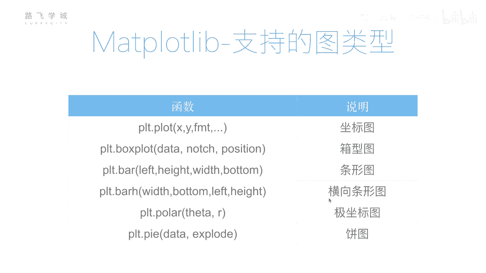

上一节我们重点介绍了`plt.plot()`函数用于绘制折线图。实际上，Matplotlib支持绘制多种图表类型。本节中，我们来看看如何绘制柱状图和饼图。

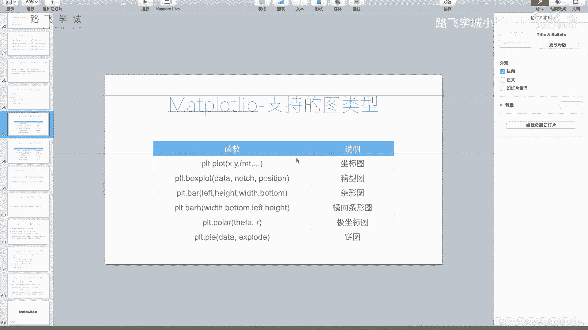

## 柱状图绘制

柱状图用于展示分类数据的数值大小对比。以下是绘制柱状图的基本步骤。

首先，我们需要准备数据。假设我们有四个月份的销售数据。

```python
import matplotlib.pyplot as plt
import numpy as np

# 数据准备
data = [32, 48, 21, 100]  # 四个数据点
labels = ['JAN', 'FEB', 'MAR', 'APR']  # 对应的标签
```

接下来，我们使用`plt.bar()`函数绘制柱状图。该函数的核心参数是柱子的位置和高度。

```python
# 绘制柱状图
positions = np.arange(len(data))  # 生成位置数组 [0, 1, 2, 3]
plt.bar(positions, data)
```

运行上述代码，会生成一个基础的柱状图，但X轴刻度显示的是数字0-3，而非月份标签。

## 自定义柱状图

为了使图表更清晰，我们需要自定义X轴标签、柱子颜色和宽度。

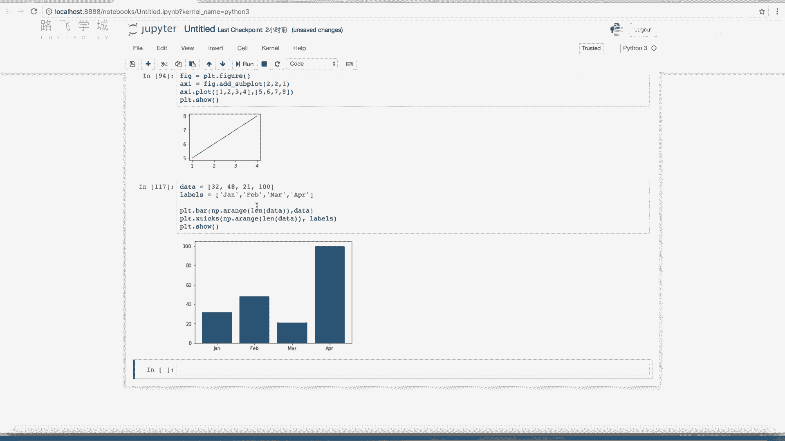

以下是自定义柱状图的代码示例：

```python
# 绘制自定义柱状图
plt.bar(positions, data, color='red', width=0.3, align='edge')

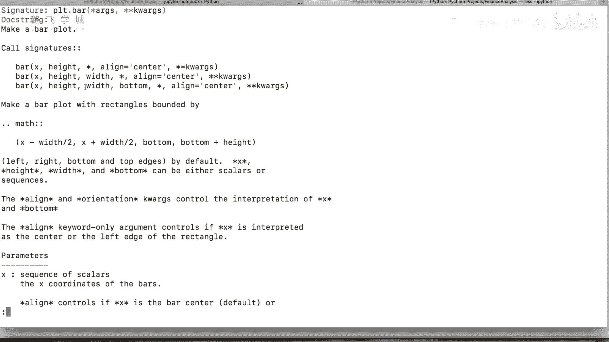

# 设置X轴标签
plt.xticks(positions, labels=labels)

# 显示图表
plt.show()
```

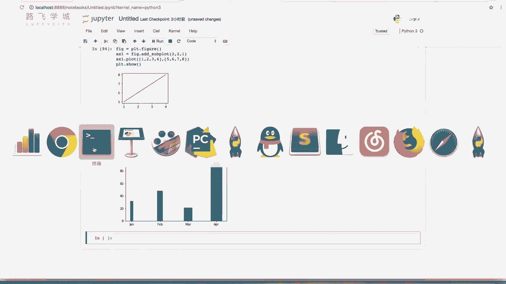

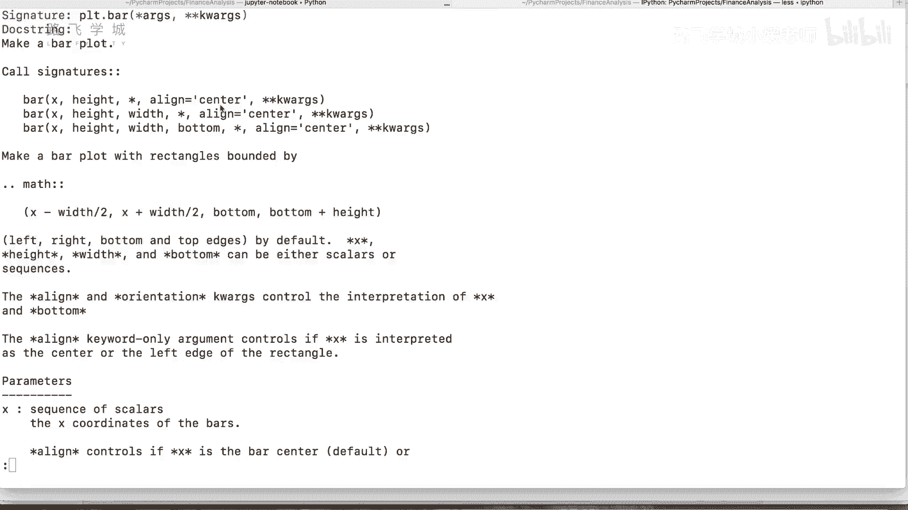

**代码解释**：
*   `color=‘red’`：将所有柱子设置为红色。
*   `width=0.3`：设置柱子的宽度。
*   `align=‘edge’`：设置柱子与刻度线边缘对齐。
*   `plt.xticks(positions, labels=labels)`：将X轴刻度位置`positions`的标签替换为`labels`列表中的字符串。

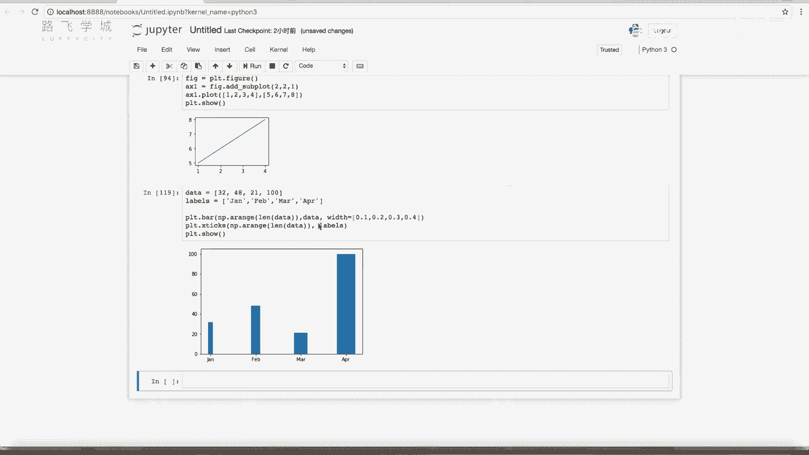

`plt.bar()`函数还有许多其他参数，如设置边框、透明度等，大家可以通过查阅官方文档进行探索。

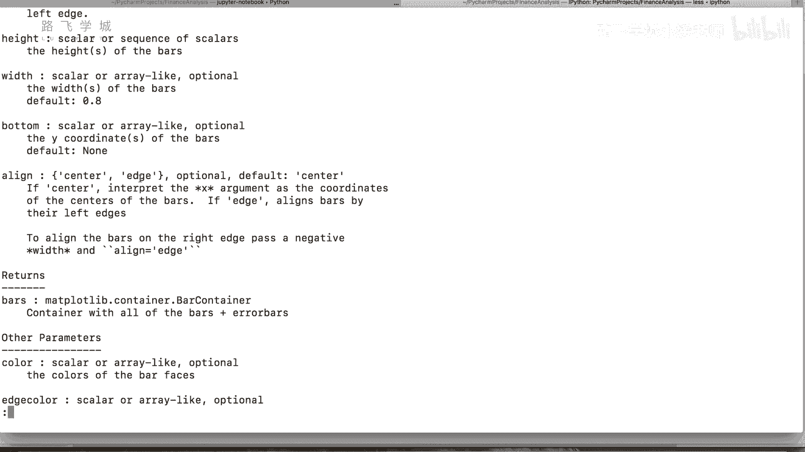

## 饼图绘制

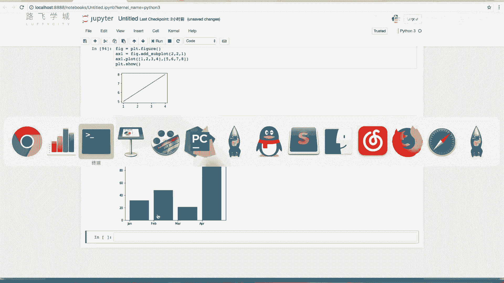

饼图用于显示各部分占总体的比例。绘制饼图使用`plt.pie()`函数。

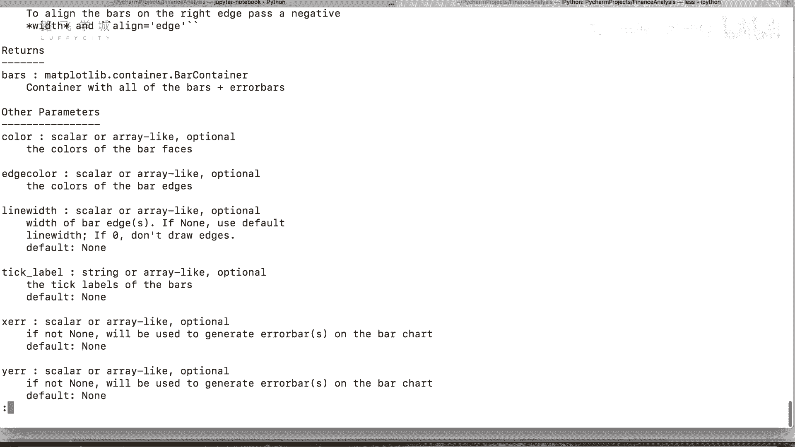

以下是绘制基础饼图的步骤。

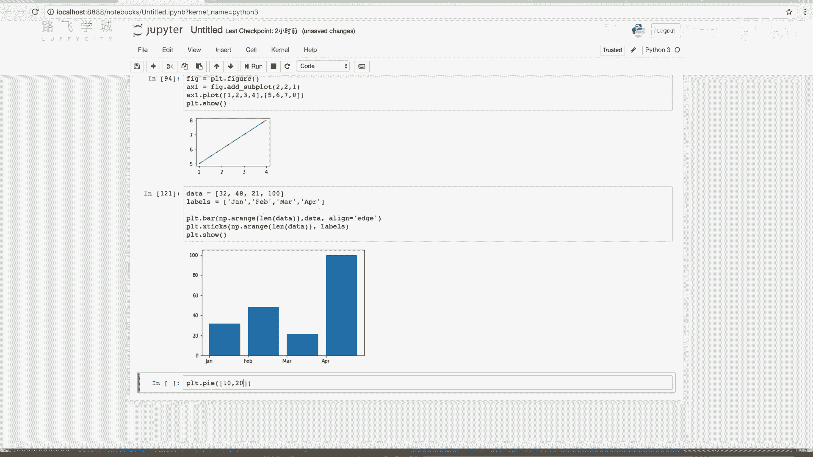

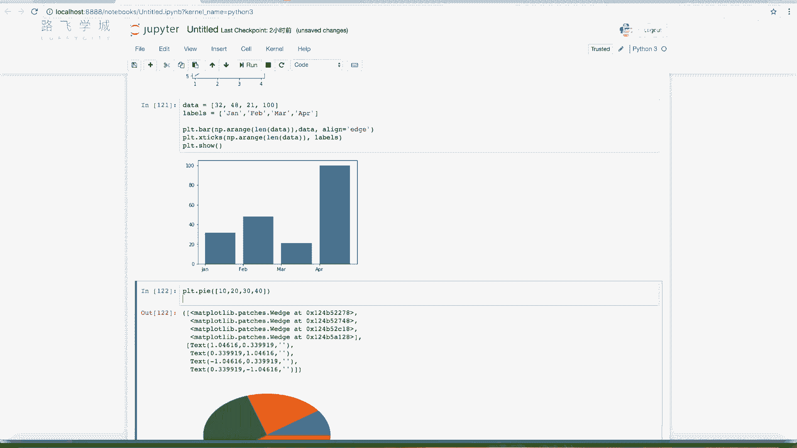

首先，准备一组数据。

```python
# 饼图数据
sizes = [10, 20, 30, 40]
labels = ['A', 'B', 'C', 'D']
```

然后，使用`plt.pie()`函数绘制。

```python
# 绘制基础饼图
plt.pie(sizes, labels=labels)
plt.show()
```

## 自定义饼图

我们可以对饼图进行多项自定义，例如显示百分比、突出某一部分、设置等轴比例等。

以下是自定义饼图的代码示例：

```python
# 自定义饼图
explode = (0, 0, 0.1, 0)  # 突出第三部分（‘C’）
plt.pie(sizes,
        labels=labels,
        autopct='%1.0f%%',  # 显示百分比，保留0位小数
        explode=explode,
        shadow=True,        # 添加阴影
        startangle=90)      # 起始角度设置为90度
plt.axis('equal')  # 设置等轴，使饼图呈圆形
plt.show()
```

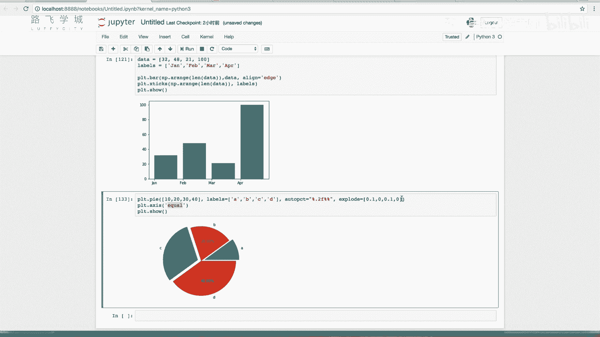

**代码解释**：
*   `autopct=‘%1.0f%%’`：在饼图区块内显示百分比。`%1.0f`表示格式化为保留0位小数的浮点数，两个`%%`用于输出一个`%`符号。
*   `explode=(0, 0, 0.1, 0)`：一个元组，指定每个部分的“爆炸”偏移距离。0.1表示将第三部分向外突出。
*   `startangle=90`：设置饼图起始绘制角度为90度（垂直向上）。
*   `plt.axis(‘equal’)`：确保X轴和Y轴比例相等，使饼图是正圆形而非椭圆形。

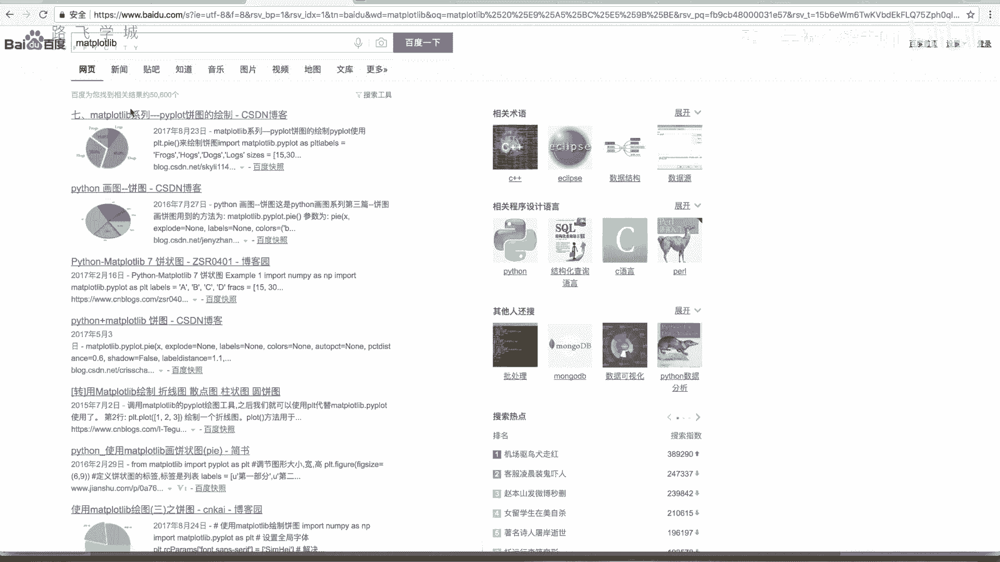

## 总结

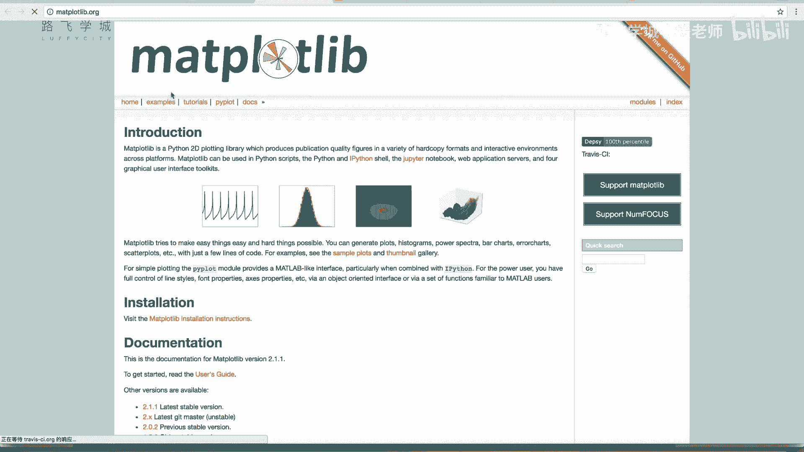

本节课我们一起学习了Matplotlib中两种重要图表的绘制方法。
*   我们学习了使用`plt.bar()`函数绘制柱状图，并掌握了设置柱子位置、高度、颜色、宽度以及X轴标签的方法。
*   我们学习了使用`plt.pie()`函数绘制饼图，并学会了如何显示百分比、突出特定部分以及调整饼图外观。

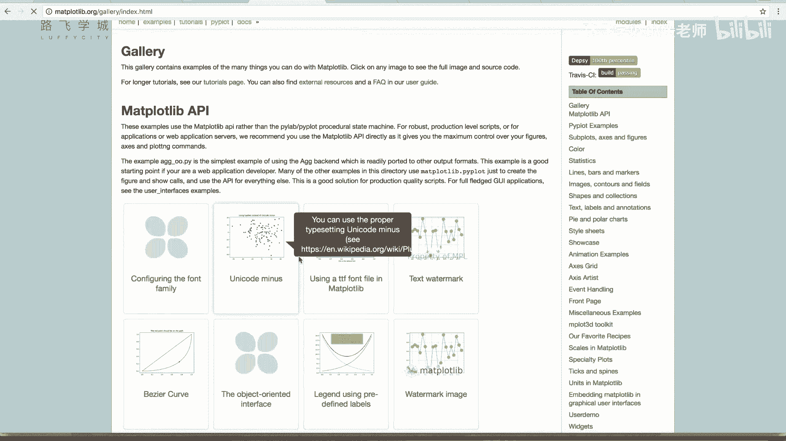

柱状图和饼图是数据可视化的常用工具，结合之前学习的折线图，已经能够满足许多基础的金融数据展示需求。对于更复杂的图表类型，大家可以参考Matplotlib官方文档中的示例进行学习。