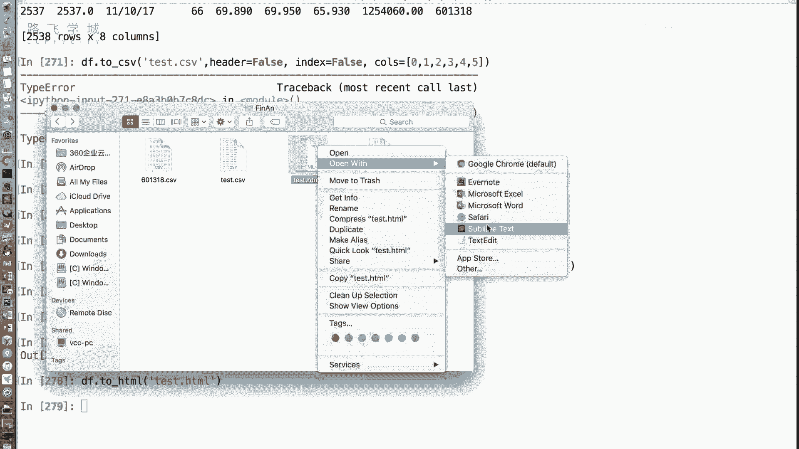
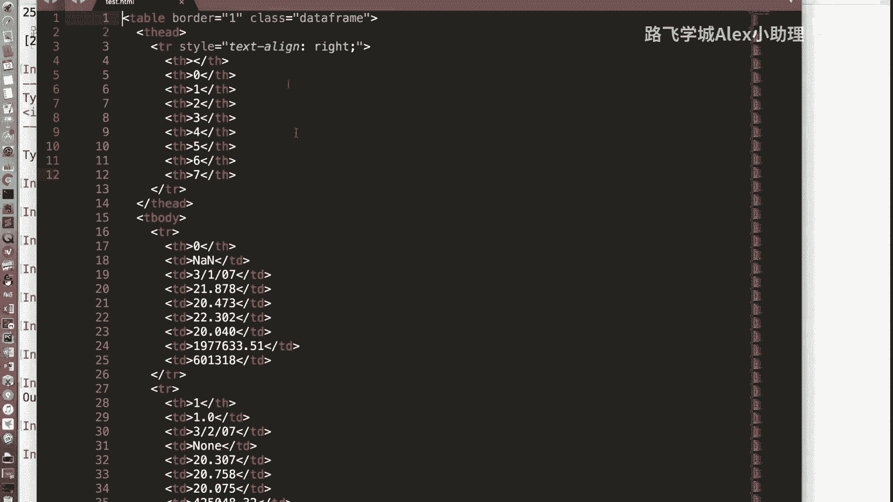
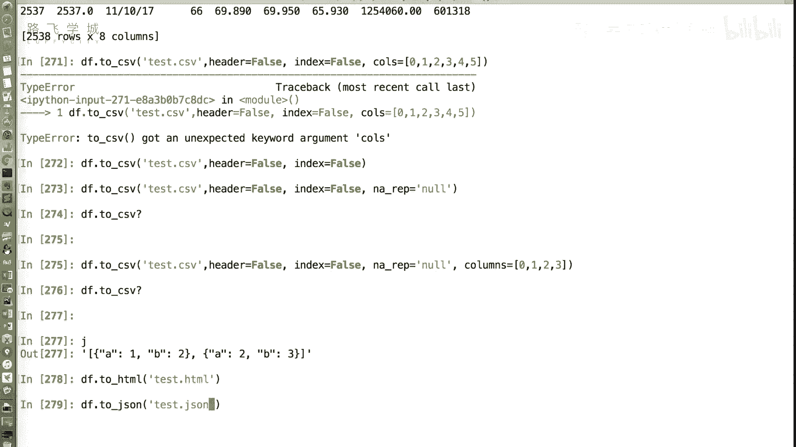
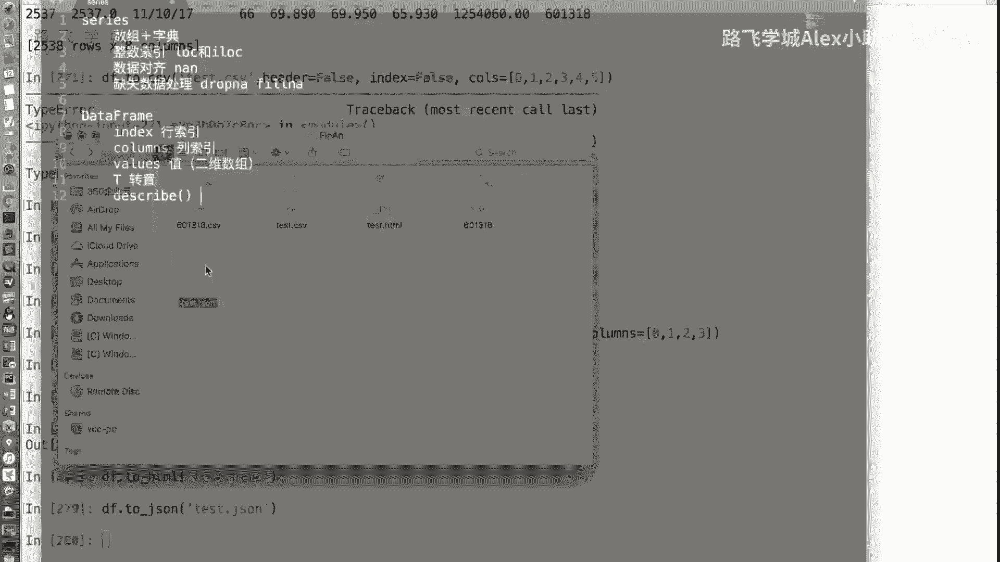
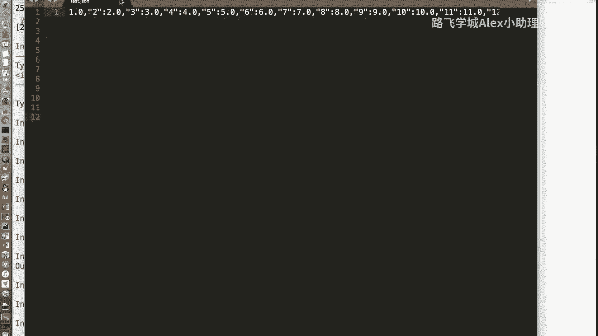
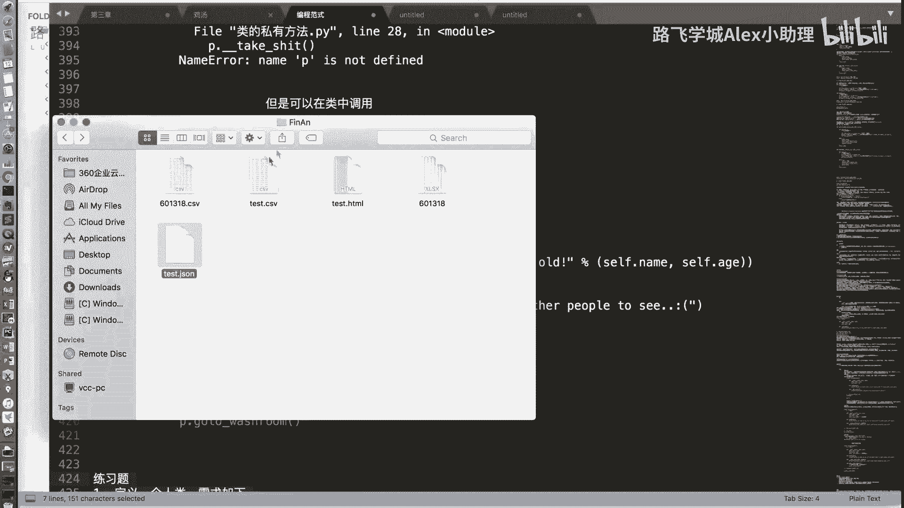
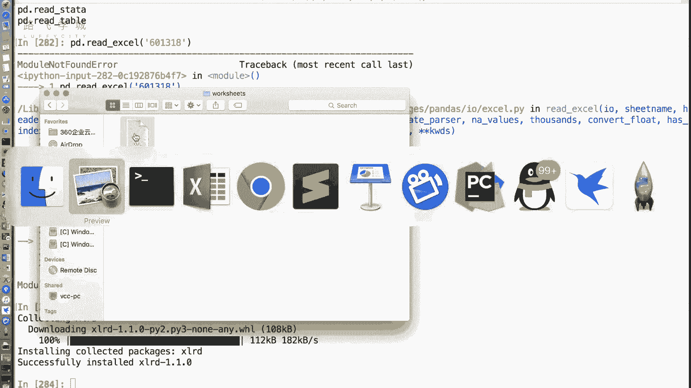
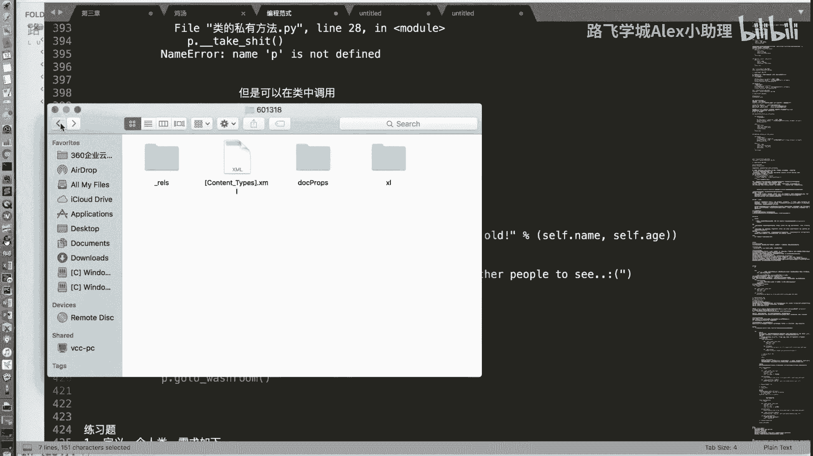
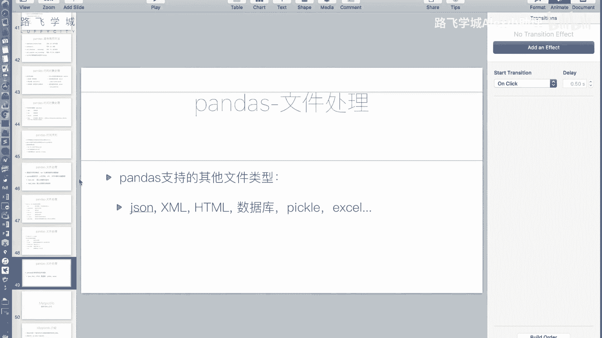

# Python金融量化：P27：文件操作3与pandas收尾 📊

在本节课中，我们将深入学习pandas库中`to_csv`方法的关键参数，并了解pandas如何支持多种文件格式的读写操作。最后，我们将对pandas模块的核心内容进行总结。

## `to_csv`方法参数详解

上一节我们介绍了`read_csv`函数用于读取文件，本节中我们来看看`to_csv`函数用于写入文件时的关键参数。

`to_csv`方法用于将DataFrame对象写入到CSV文件中，其常用参数如下：

*   **`sep`**：指定写入文件时使用的分隔符。默认值为逗号 `,`。例如：`sep='\t'` 表示使用制表符分隔。
*   **`na_rep`**：指定如何表示缺失值（NaN）。默认将NaN写入为空字符串。此参数与`read_csv`中的`na_values`作用相反，后者是将特定字符串解释为NaN。例如：`na_rep='NULL'` 会将所有NaN替换为字符串“NULL”写入文件。
*   **`header`**：布尔值，控制是否将列名（表头）写入文件。`header=False`表示不写入列名。
*   **`index`**：布尔值，控制是否将行索引写入文件。`index=False`表示不写入行索引。
*   **`columns`**：一个列表，用于指定需要写入文件的列。可以传入列名或列的位置索引。例如：`columns=[0, 1, 2]` 或 `columns=['colA', 'colB']`。

以下是使用这些参数的代码示例：
```python
import pandas as pd
import numpy as np

# 假设df是一个已有的DataFrame
df = pd.DataFrame(np.random.randn(5, 6))

# 将第0行第0列的值改为NaN
df.iloc[0, 0] = np.nan

# 将DataFrame写入CSV文件，并指定参数
df.to_csv('test.csv',
          sep=',',         # 使用逗号分隔
          na_rep='NULL',   # 将NaN替换为'NULL'
          header=False,    # 不写入列名
          index=False,     # 不写入行索引
          columns=[0, 1, 2, 3] # 只写入前四列
         )
```

## pandas支持的其他文件格式



除了CSV文件，pandas库还支持读写多种其他常见的数据格式。







以下是pandas支持的部分文件格式及对应方法：
*   **JSON**：`to_json()`, `read_json()`
*   **Excel**：`to_excel()`, `read_excel()`
*   **HTML**：`to_html()`, `read_html()`
*   **数据库**：`to_sql()`, `read_sql()`
*   **Pickle**：`to_pickle()`, `read_pickle()`





例如，将DataFrame保存为HTML表格或JSON字符串非常简单：
```python
# 保存为HTML文件，在浏览器中打开即为表格形式
df.to_html('output.html')

# 保存为JSON格式文件
df.to_json('output.json')

# 读取Excel文件需要额外安装`openpyxl`或`xlrd`库
# pip install openpyxl
df_from_excel = pd.read_excel('data.xlsx')
```
**注意**：读写Excel文件通常需要安装额外的依赖库，如`openpyxl`（用于.xlsx格式）或`xlrd`（用于旧版.xls格式）。如果遇到类似“No module named ‘xlrd’”的错误，使用`pip install openpyxl`命令安装即可。

对于其他格式（如HDF5、Parquet等）的读写，可以通过在Jupyter Notebook或IPython中使用`pd.read_?`和`df.to_?`并查看帮助文档来了解具体用法。



## 本章总结 🎯



本节课中我们一起学习了pandas库中关于数据输出和多格式支持的最后一部分内容。

简单总结一下整个pandas模块的核心内容，我们主要学习了以下两个核心数据对象：
1.  **Series对象**：用于处理一维带标签数据。
2.  **DataFrame对象**：用于处理二维表格型数据，是数据分析的核心结构。



我们详细讲解了它们的创建、索引与切片方法。需要特别注意，在使用整数索引时，要区分`loc`（基于标签）和`iloc`（基于位置）的用法。对于DataFrame，建议使用`df.iloc[行索引, 列索引]`的格式，而非连续使用两个中括号。

此外，我们介绍了pandas运算中的数据对齐规则，即运算会按照行和列的标签自动对齐。当出现缺失数据（NaN）时，可以使用`dropna()`删除或`fillna()`填充。

最后，我们还了解了pandas对时间序列的支持以及强大的文件读写能力。至此，关于pandas核心库的模块介绍就告一段落。接下来的练习至关重要，请务必动手实践以巩固所学知识。