# Python金融量化分析：P28：Matplotlib介绍 📊

在本节课中，我们将要学习三大工具包中的最后一个——Matplotlib。这是一个用于数据可视化的强大Python工具包，简单来说，就是用来画图的。无论是金融分析还是其他数据分析，图表都比单纯的数字表格更直观。本节课我们将介绍Matplotlib的基本安装、引入方法以及如何使用其核心绘图功能。

---

## 什么是Matplotlib？🤔

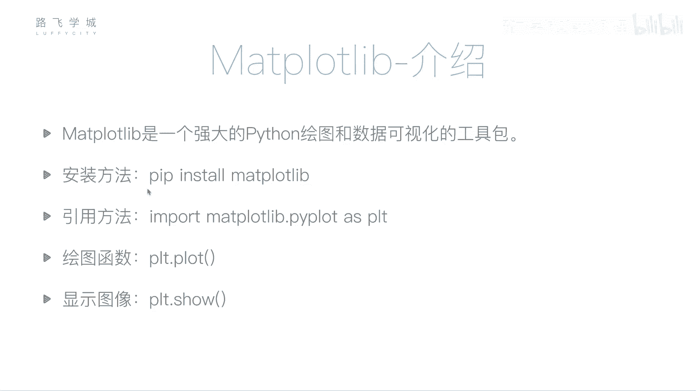

Matplotlib是一个强大的Python绘图和数据可视化工具包。它的主要作用是生成各种静态、动态和交互式的图表。

安装方法依然是使用pip命令：
```bash
pip install matplotlib
```

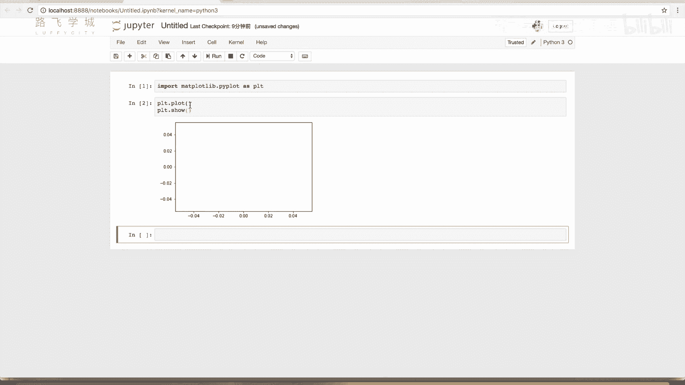

---

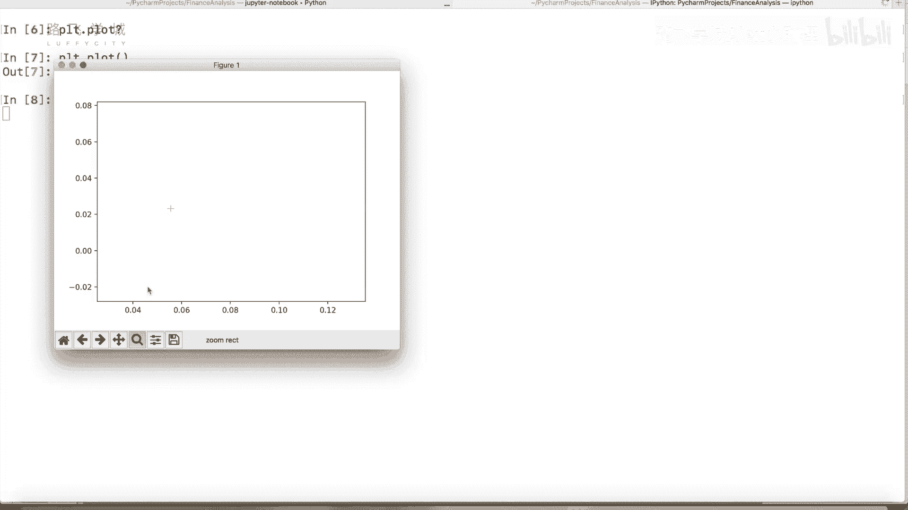

## 基本使用方法 🛠️


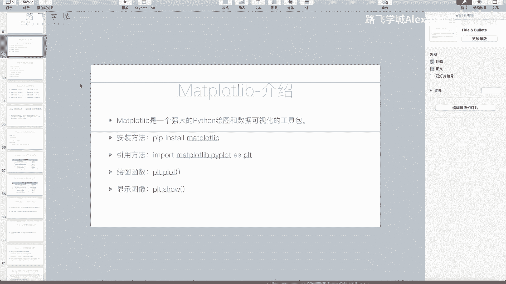

上一节我们介绍了Matplotlib是什么，本节中我们来看看它的基本使用方法。我们主要使用Jupyter Notebook进行演示。

引入Matplotlib时，通常使用其子模块`pyplot`，并简写为`plt`：
```python
import matplotlib.pyplot as plt
```

以下是绘图的基本流程：
*   `plt.plot()` 函数用于绘制图形。
*   `plt.show()` 函数用于展示图形。

如果只运行`plt.plot()`和`plt.show()`而不传入数据，会得到一个空的图像框。在命令行或某些IDE中运行，会弹出一个可以缩放和拖动的独立窗口。

---

## 绘制折线图 📈

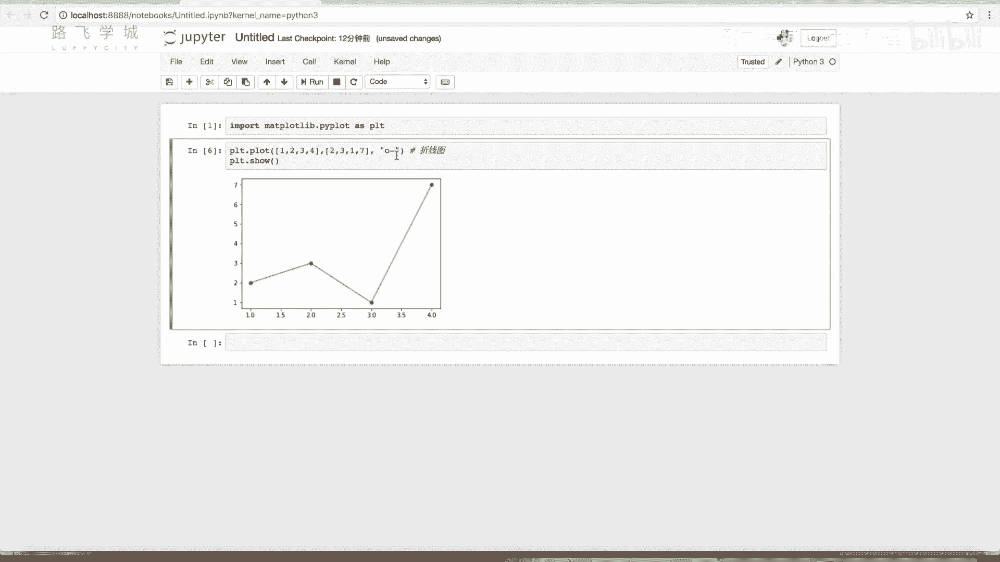

`plot`函数最基本的功能是绘制折线图。它通过连接一系列数据点来形成线条。

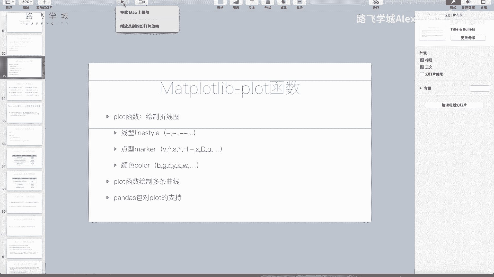

`plot`函数最基本的用法是传入两个参数：X轴坐标列表和Y轴坐标列表。
```python
plt.plot([1, 2, 3, 4], [2, 4, 6, 8])
plt.show()
```
这段代码会将点(1,2)、(2,4)、(3,6)、(4,8)连接起来，形成一条直线。如果Y值不是等比例增长，例如`[2, 3, 6, 4]`，则会形成一条折线。

---

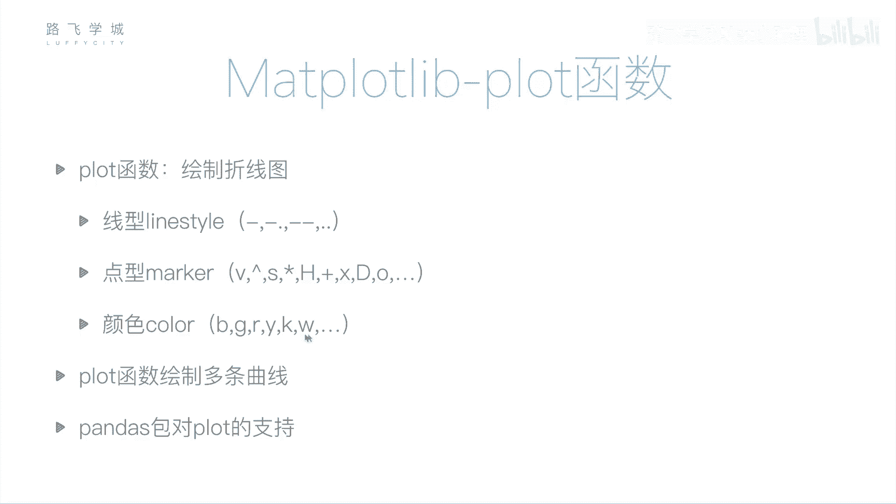

## 自定义图表样式 🎨


除了数据点，我们还可以通过第三个参数（一个格式字符串）来定义线条的样式、点的标记和颜色。

格式字符串通常按`[颜色][标记][线型]`的顺序组合。例如：
*   `‘ro-’` 表示红色(`r`)、圆点标记(`o`)、实线(`-`)。
*   `‘b--’` 表示蓝色(`b`)、虚线(`--`)。
*   `‘g^:`` 表示绿色(`g`)、上三角标记(`^`)、点线(`:`)。

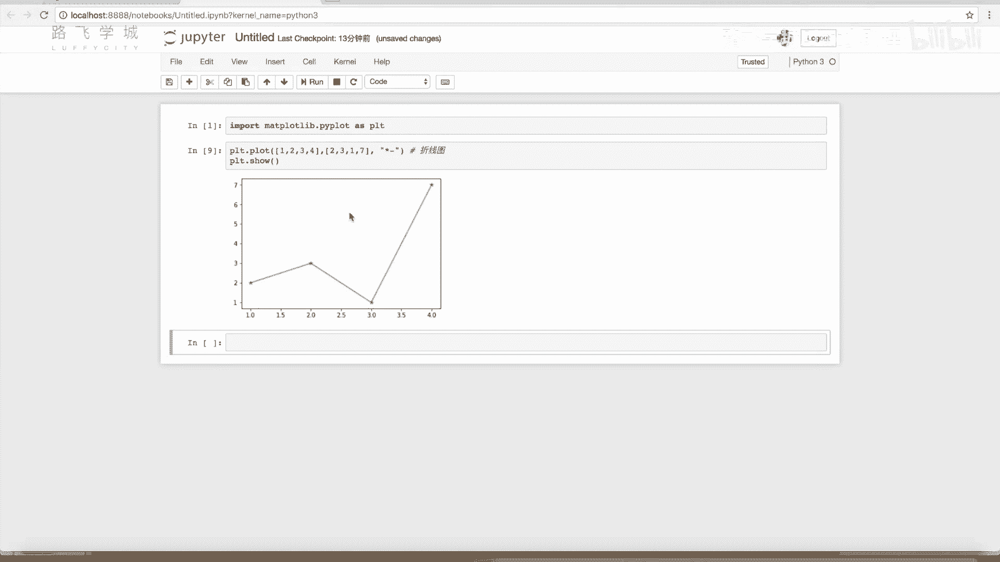

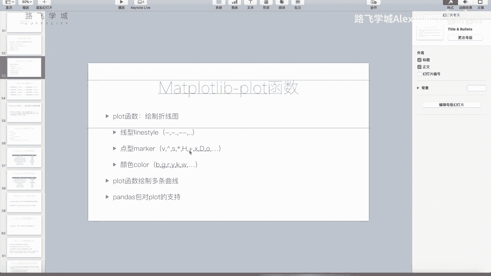

以下是常见的样式选项：

**线型 (linestyle):**
*   `‘-’` 实线
*   `‘--’` 虚线
*   `‘:’` 点线
*   `‘-.’` 点划线

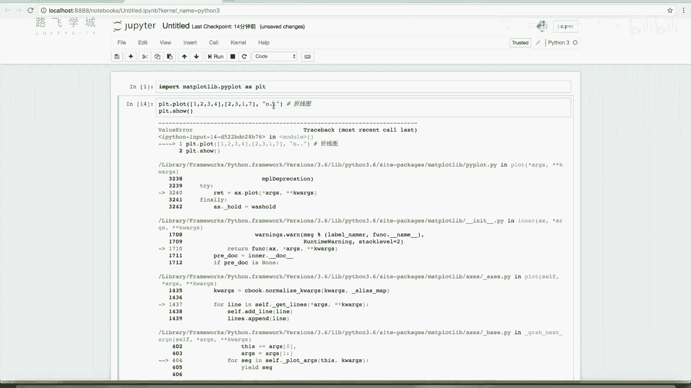

**标记 (marker):**
*   `‘o’` 圆圈
*   `‘v’` 下三角
*   `‘^’` 上三角
*   `‘s’` 正方形
*   `‘*’` 星形
*   `‘+’` 加号
*   `‘x’` 叉号
*   `‘d’` 菱形

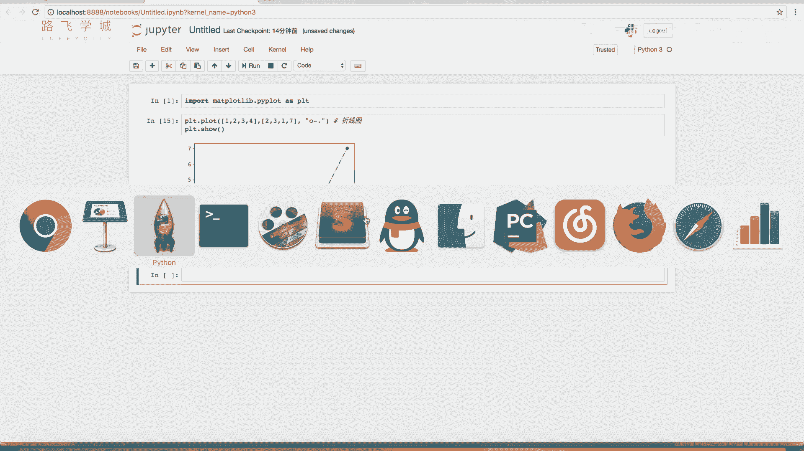

**颜色 (color):**
*   `‘b’` 蓝色
*   `‘g’` 绿色
*   `‘r’` 红色
*   `‘c’` 青色
*   `‘m’` 洋红色
*   `‘y’` 黄色
*   `‘k’` 黑色
*   `‘w’` 白色

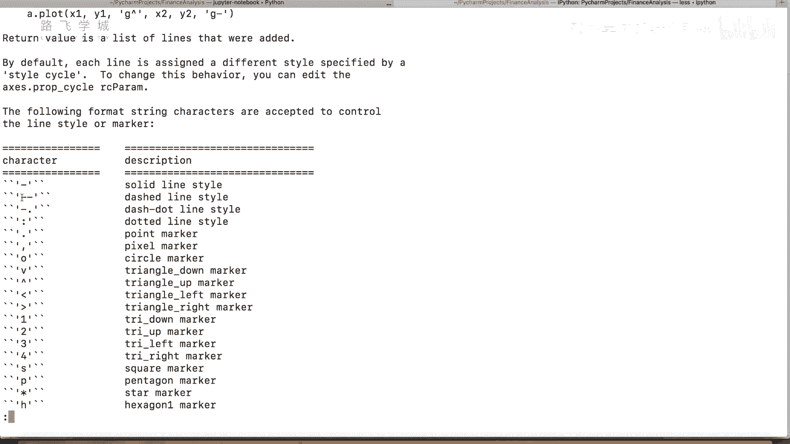

你也可以使用关键字参数来分别指定这些属性，这样代码可读性更高：
```python
plt.plot(x, y, color=‘red’, linestyle=‘--’, marker=‘o’)
```

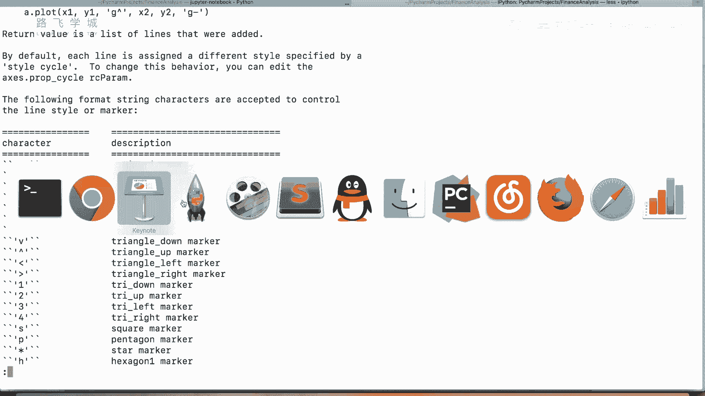

---

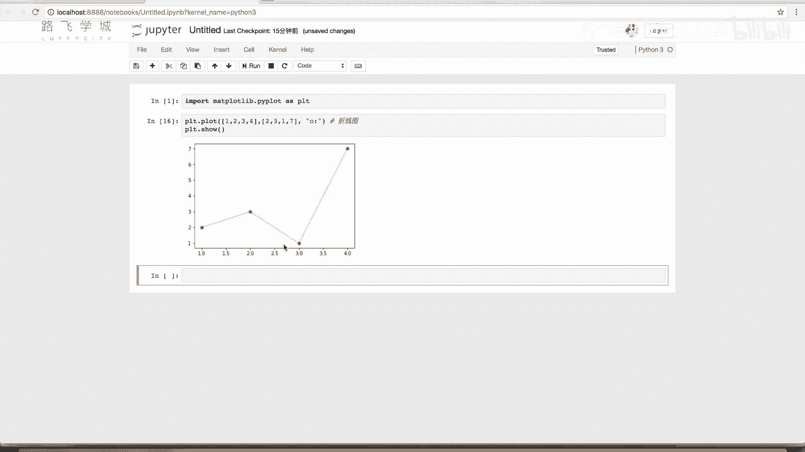

## 高级功能与多图绘制 🔧

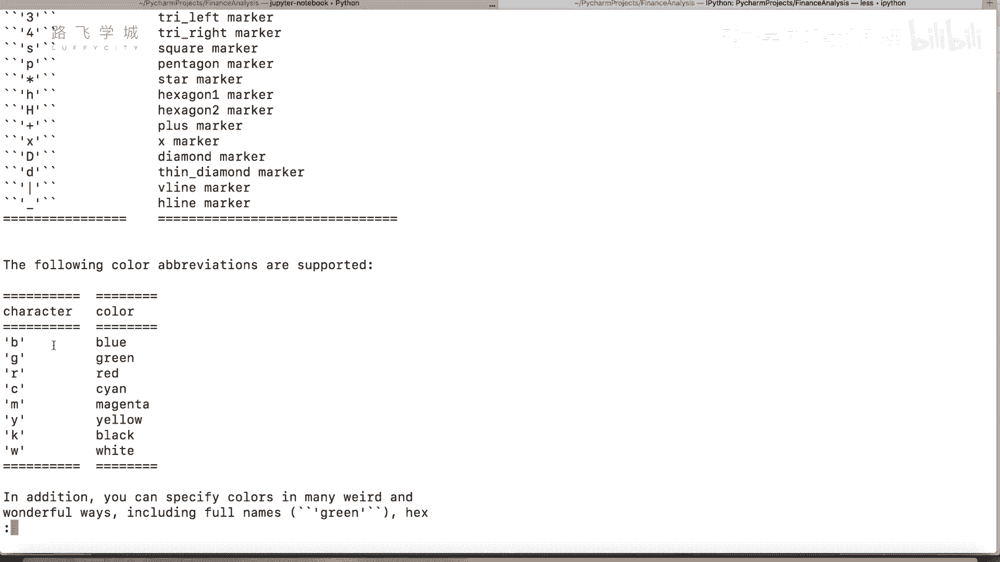

接下来我们讲一些更复杂的使用。例如，如何在一个坐标系中绘制多条折线。

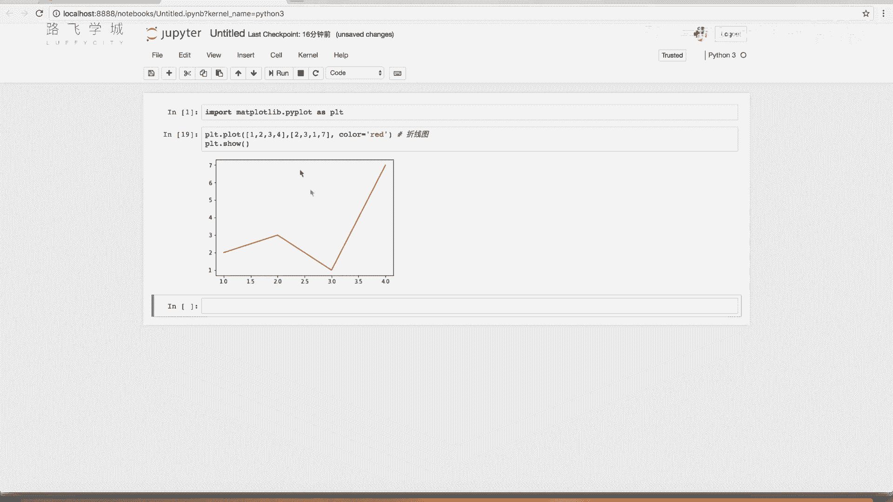

方法很简单，只需要多次调用`plt.plot()`函数即可。Matplotlib会自动为不同的线条分配不同的颜色。
```python
plt.plot([1,2,3,4], [1,4,9,16]) # 第一条线
plt.plot([1,2,3,4], [2,4,6,8])  # 第二条线
plt.show()
```
运行后，你会看到同一个图里绘制了两条不同颜色和走势的折线。


---

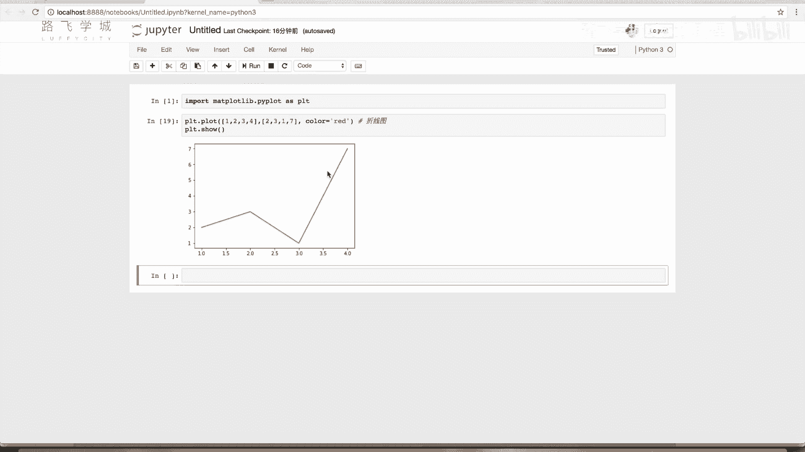

本节课中我们一起学习了Matplotlib的基本概念和核心绘图函数`plot`的使用。我们了解了如何安装和引入Matplotlib，如何使用它绘制基本的折线图，以及如何通过格式字符串或关键字参数来自定义线条的颜色、标记和线型。最后，我们还学习了如何在一个图中绘制多条曲线。掌握这些基础是进行更复杂数据可视化的第一步。