# Python金融量化：P29：34 plot函数周边 📊

## 概述
在本节课程中，我们将深入学习Matplotlib库中`plot`函数的周边功能。上一节我们介绍了`plot`函数的基本用法，本节中我们来看看如何在一个图表中绘制多条曲线，以及如何为图表添加标题、坐标轴标签、刻度、图例等元素，使图表更加专业和清晰。

---

## 绘制多条曲线 📈
在数据分析中，我们经常需要将多条数据曲线绘制在同一张图上进行比较，例如不同股票的价格趋势或均线。

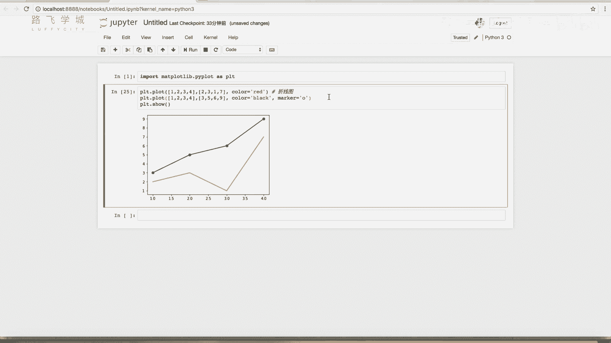

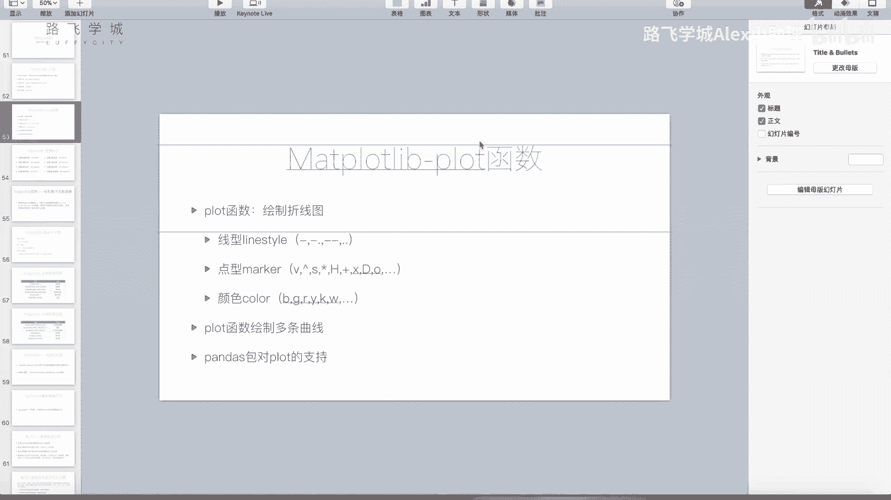

以下是绘制多条曲线的方法：
*   调用多个`plot`函数即可。Matplotlib库的特性是，在调用`plt.show()`之前，所有调用过的`plot`函数都会将其绘制的曲线叠加到同一个图表中。

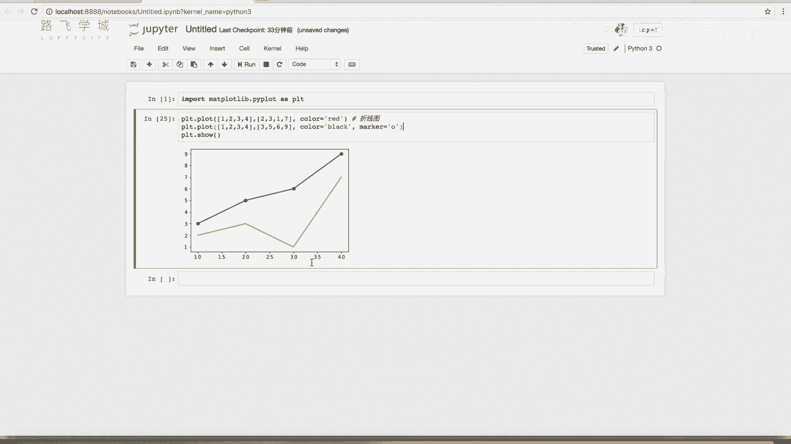

```python
import matplotlib.pyplot as plt

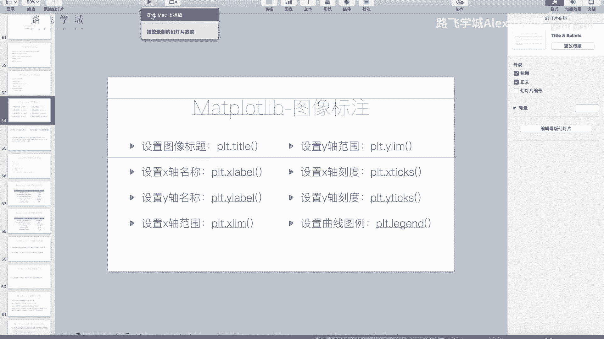

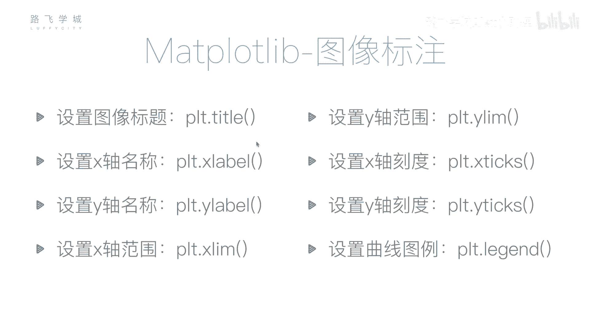

# 绘制第一条曲线
plt.plot([1, 2, 3, 4], [1, 4, 9, 16])
# 绘制第二条曲线，使用不同的标记样式
plt.plot([1, 2, 3, 4], [1, 4, 9, 16], 'o')
# 显示图表
plt.show()
```

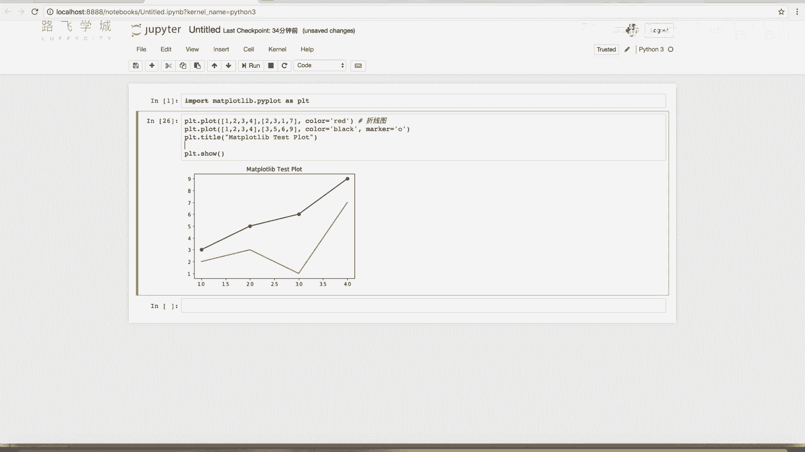

运行上述代码，可以看到两条曲线被绘制在了同一张图中。如果再添加一个`plot`调用，图表中就会出现第三条线。

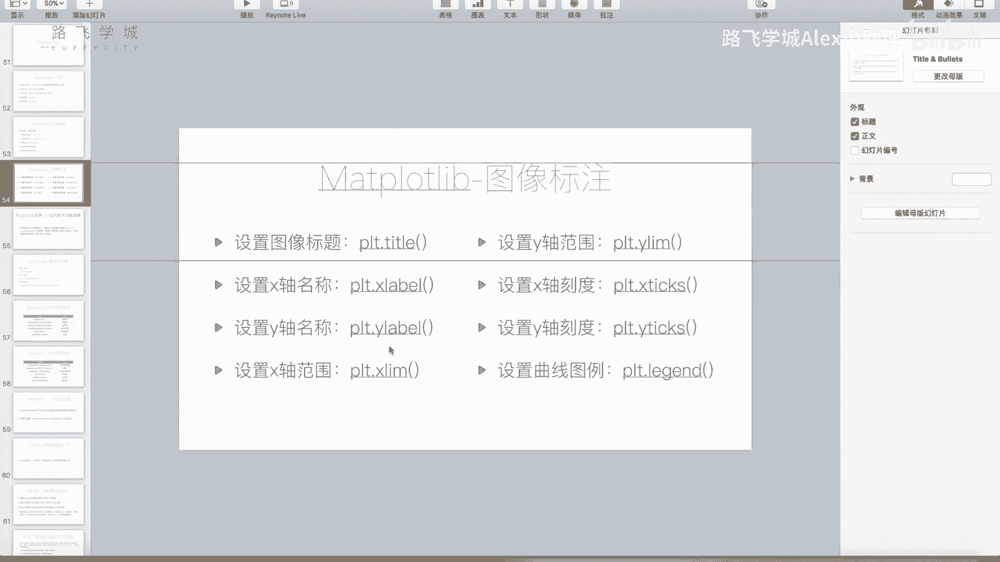

---

## 设置图表标题与坐标轴标签 🏷️
一个完整的图表通常包含标题、X轴和Y轴的标签，用以说明图表内容和坐标轴含义。

以下是设置图表标题与坐标轴标签的函数：
*   **`plt.title()`**: 设置图表标题。
*   **`plt.xlabel()`**: 设置X轴标签。
*   **`plt.ylabel()`**: 设置Y轴标签。

这些函数可以在`plot`调用之后、`show`调用之前的任何位置使用。

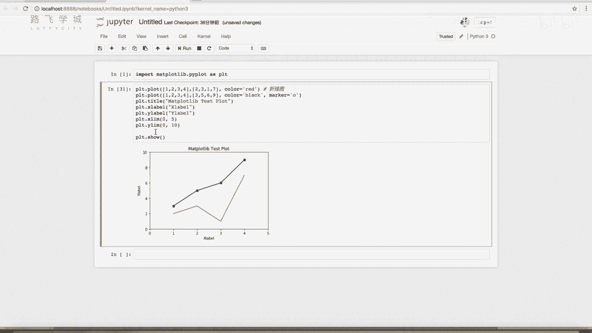

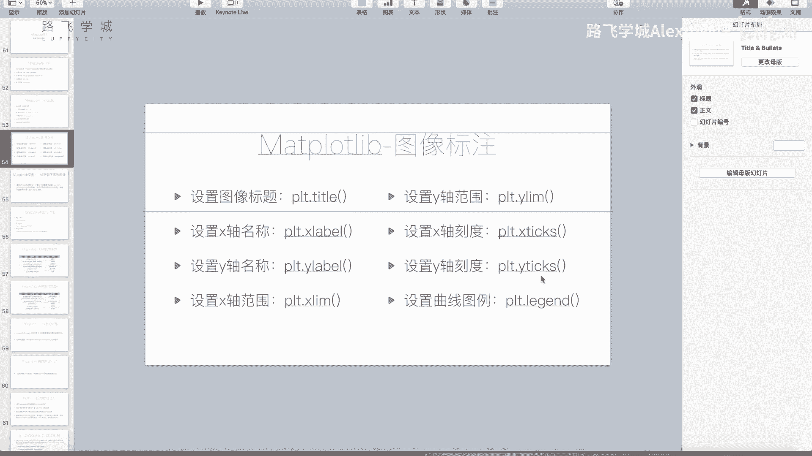

```python
plt.plot([1, 2, 3, 4], [1, 4, 9, 16])
plt.title('Matplotlib Test Plot')  # 设置标题
plt.xlabel('X Label')              # 设置X轴标签
plt.ylabel('Y Label')              # 设置Y轴标签
plt.show()
```

---

## 设置坐标轴范围与刻度 🔢
默认情况下，Matplotlib会自动调整坐标轴范围以适应数据。但有时我们需要手动设置范围或刻度。

以下是设置坐标轴范围与刻度的函数：
*   **`plt.xlim(min, max)` / `plt.ylim(min, max)`**: 手动设置X轴或Y轴的显示范围。
*   **`plt.xticks(ticks, labels)` / `plt.yticks(ticks, labels)`**: 设置坐标轴刻度的位置和标签。

```python
import numpy as np

plt.plot([1, 2, 3, 4], [1, 4, 9, 16])
plt.xlim(0, 10)                     # 设置X轴范围为0到10
plt.ylim(0, 20)                     # 设置Y轴范围为0到20
# 设置X轴刻度位置为0, 2, 4, 6, 8, 10
plt.xticks(np.arange(0, 11, 2))
# 设置X轴刻度位置并用自定义标签替换
# plt.xticks([0, 2, 4, 6, 8, 10], ['A', 'B', 'C', 'D', 'E', 'F'])
plt.show()
```

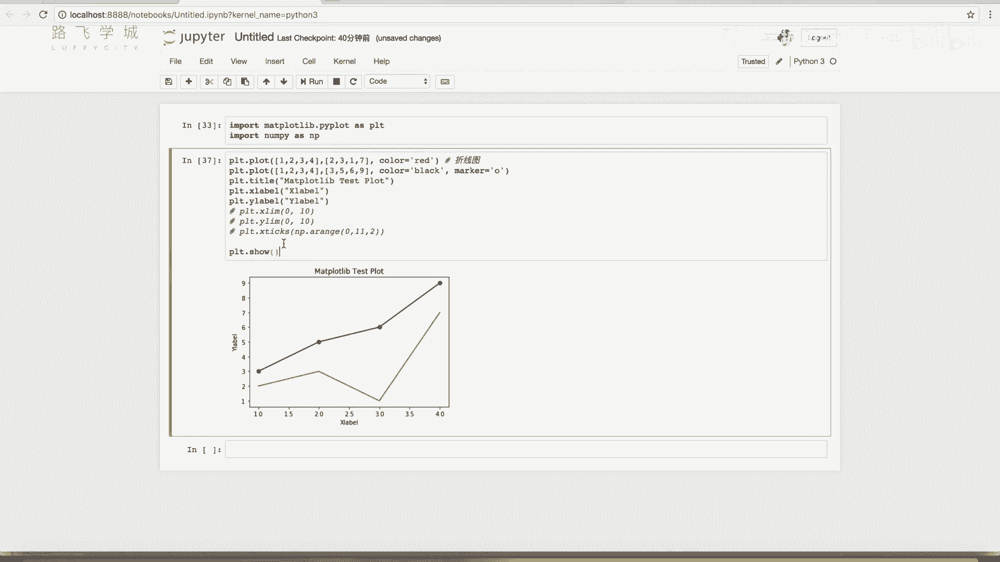

---

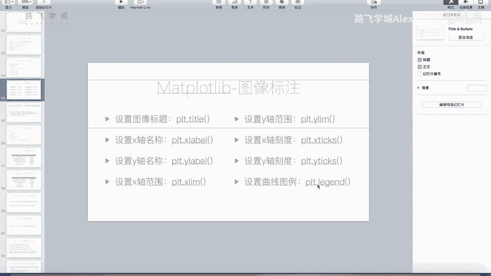

## 添加图例 📖
当图表中有多条曲线时，需要添加图例来说明每条曲线代表的数据系列。

添加图例最推荐的方法是：
*   在每个`plot`函数调用时，通过`label`参数为曲线指定一个标签名称。
*   然后调用`plt.legend()`函数来显示图例。

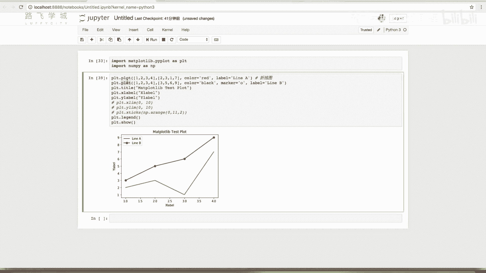

```python
# 绘制第一条曲线，并设置标签
plt.plot([1, 2, 3, 4], [1, 4, 9, 16], label='Line A')
# 绘制第二条曲线，并设置标签
plt.plot([1, 2, 3, 4], [1, 8, 27, 64], 'o', label='Line B')
# 显示图例
plt.legend()
plt.show()
```

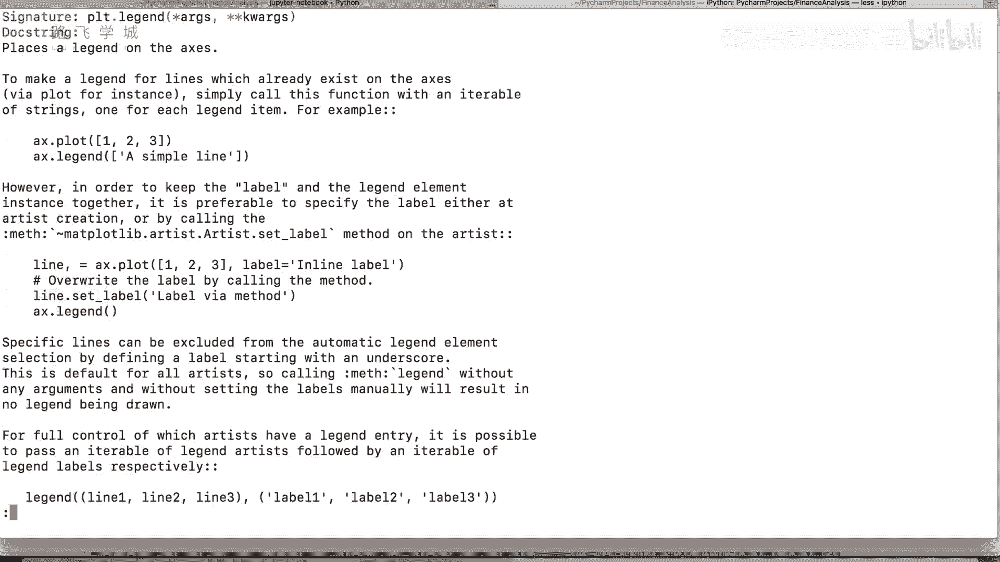

图例会根据`label`参数自动生成。`legend`函数还有其他用法，例如手动传入标签列表，但上述方法最为直观和常用。

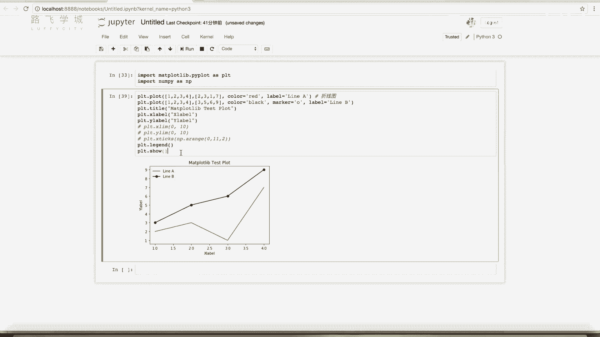

---

## 总结
本节课中我们一起学习了`plot`函数的周边设置功能。我们掌握了如何在同一图表中绘制多条曲线，以及如何通过`title`、`xlabel`、`ylabel`、`xlim`、`ylim`、`xticks`、`yticks`和`legend`等函数来完善图表的标题、坐标轴、刻度和图例。这些功能对于制作清晰、专业的可视化图表至关重要。后续课程中如果遇到新的图表定制需求，我们可能会对这些函数进行补充讲解。