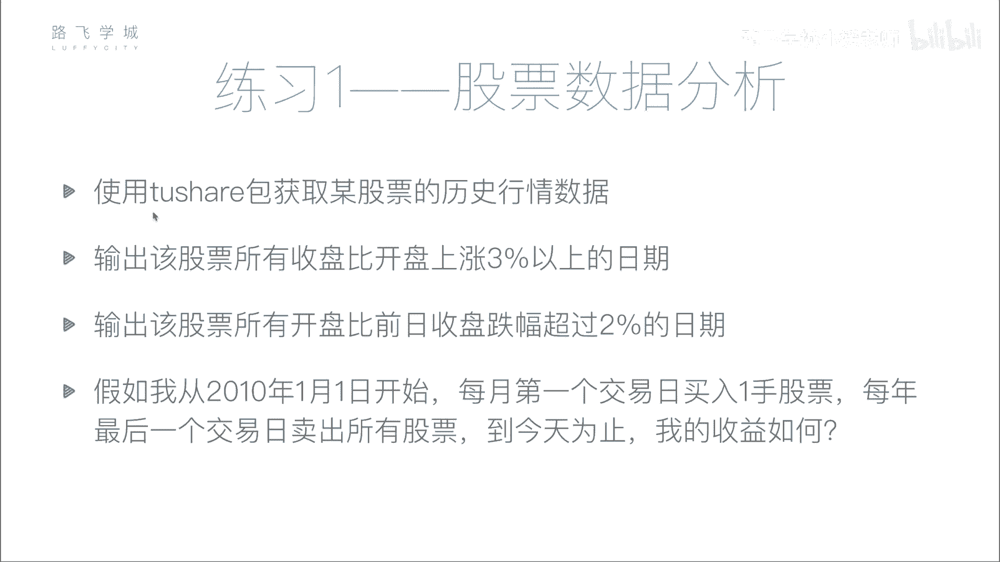
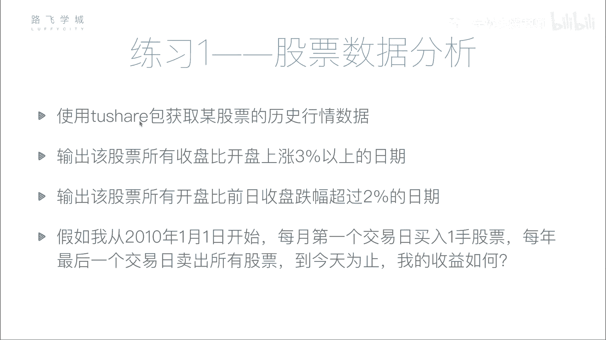
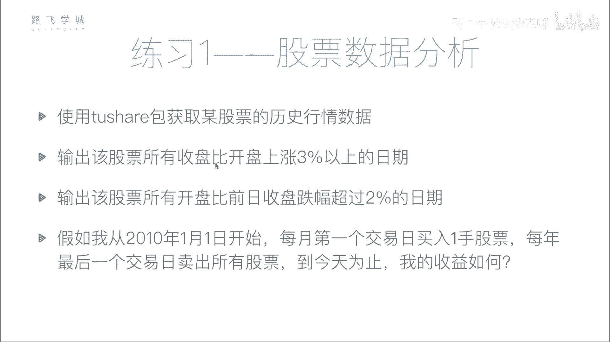
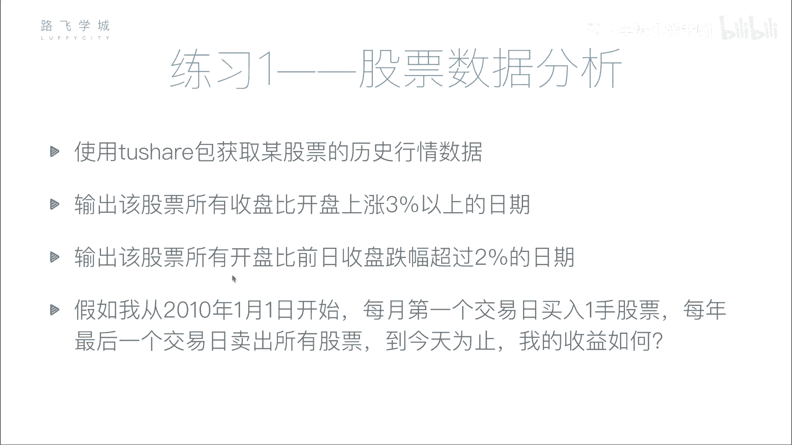
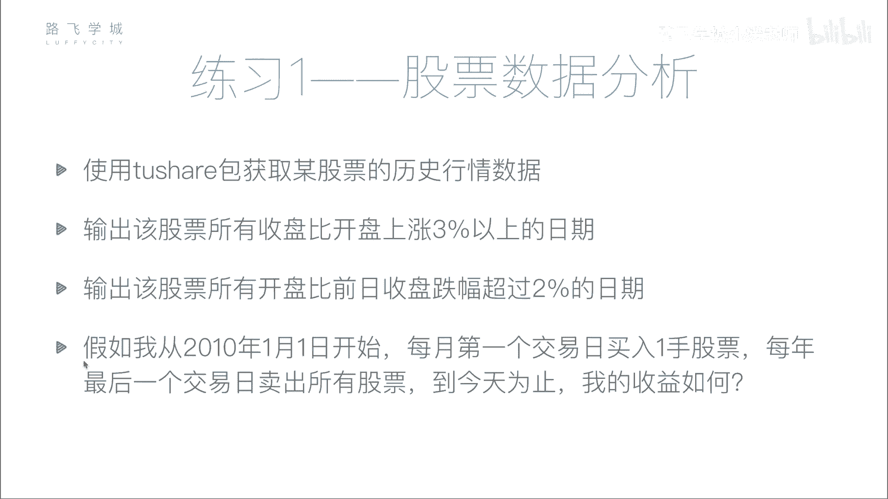
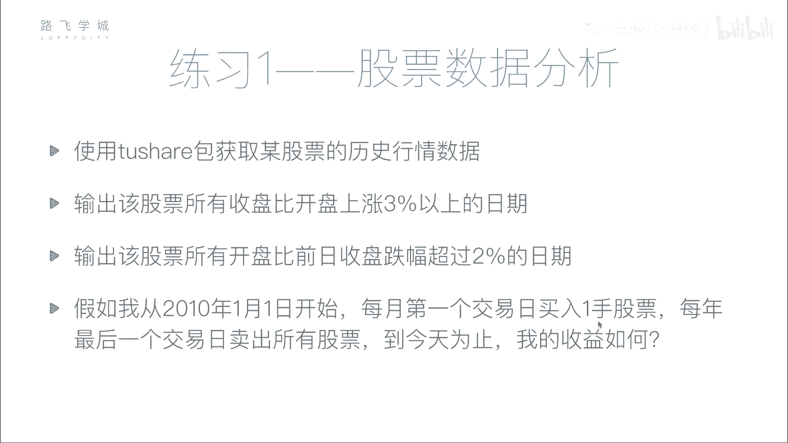

# Python金融量化：P29：股票分析作业说明 📊



在本节课中，我们将通过一个综合练习来应用之前学到的金融数据分析技能。我们将使用 `tushare` 包获取股票数据，并进行一系列基础分析，最后模拟一个简单的投资策略来计算收益。

## 概述

本次作业包含四个主要任务：获取并存储股票数据、分析单日涨幅、分析开盘跳空跌幅，以及模拟一个定期买入并最终卖出的投资策略。通过这些练习，你将巩固数据获取、清洗、分析和策略回测的基本流程。

## 作业任务详解



### 任务一：数据获取与存储

首先，你需要使用 `tushare` 包获取某一只股票的历史行情数据。数据的时间范围可以自行选择，例如从2008年或2010年开始至今。获取数据后，请将其保存到本地的CSV文件中，以便后续分析时快速读取，避免每次重复调用接口。



**核心步骤代码示例：**
```python
import tushare as ts
import pandas as pd


# 获取股票数据（例如：贵州茅台，代码600519）
df = ts.get_k_data(‘600519’, start=‘2010-01-01’)
# 将数据保存到CSV文件
df.to_csv(‘stock_data.csv’, index=False)
```



### 任务二：筛选单日大幅上涨日期

在上一节我们获取并存储了数据，本节中我们来看看如何进行分析。第二个任务是：从数据中找出所有“收盘价比开盘价上涨超过3%”的交易日。

以下是实现此功能的关键步骤：
1.  计算每日的涨跌幅：`(收盘价 - 开盘价) / 开盘价 * 100%`。
2.  使用布尔型索引筛选出涨幅大于3%的数据行。
3.  将这些符合条件的日期提取出来，存入一个列表或数组中。


**核心公式与代码：**
```python
# 读取本地数据
df = pd.read_csv(‘stock_data.csv’)
# 计算单日涨幅（百分比）
df[‘daily_change_pct’] = (df[‘close’] - df[‘open’]) / df[‘open’] * 100
# 使用布尔索引筛选
up_dates = df[df[‘daily_change_pct’] > 3][‘date’].tolist()
```

### 任务三：筛选开盘跳空下跌日期



接下来，我们进行一个略有不同的分析。第三个任务是：找出所有“开盘价比前一日收盘价的跌幅超过2%”的日期。这表示股票一开盘就出现了较大的向下跳空缺口。



这个任务需要比较当前行与前一行的数据，因此会用到 `shift()` 函数来获取前一天的收盘价。

以下是实现此功能的关键步骤：
1.  使用 `shift(1)` 函数将“收盘价”列向下移动一行，得到前一天的收盘价。
2.  计算开盘价相对于前日收盘价的涨跌幅。
3.  使用布尔型索引筛选出跌幅超过2%的日期。

**核心代码：**
```python
# 计算前一日收盘价
df[‘prev_close’] = df[‘close’].shift(1)
# 计算开盘跳空跌幅（百分比）
df[‘gap_down_pct’] = (df[‘open’] - df[‘prev_close’]) / df[‘prev_close’] * 100
# 筛选并获取日期列表
gap_down_dates = df[df[‘gap_down_pct’] < -2][‘date’].tolist()
```

### 任务四：模拟定期投资策略

最后，我们来模拟一个简单的投资策略。假设从2010年1月1日开始，执行以下操作：
*   **买入**：在每个月的第一个交易日买入100股（1手）。
*   **卖出**：在每年的最后一个交易日，卖出持有的全部股票。

我们需要计算，如果一直执行此策略到今天（例如2017年12月某日），总共赚了多少钱。

以下是计算收益的逻辑与步骤：
1.  **初始状态**：设定初始现金（例如1亿元）。
2.  **模拟交易**：
    *   遍历数据，在每个月的第一个交易日，检查现金是否足够，然后以当日开盘价买入100股，并更新现金和持股数量。
    *   在每年的最后一个交易日，以当日开盘价卖出全部持股，并更新现金。
3.  **计算最终收益**：
    *   **最终资产** = 最终现金 + (最终持股数量 * 最终日期的开盘价)
    *   **总收益** = 最终资产 - 初始现金

**策略模拟核心思路代码：**
```python
# 初始化变量
initial_cash = 100000000
cash = initial_cash
holdings = 0 # 持有股数

# 此处需编写循环，遍历数据框，识别每月首日与每年末日，并进行买卖操作
# ...
# 计算最终收益
final_asset = cash + holdings * df.iloc[-1][‘open’]
total_profit = final_asset - initial_cash
print(f“总收益为：{total_profit:.2f}元”)
```

## 总结

本节课中我们一起完成了一个完整的股票分析小项目。我们实践了从数据获取 (`tushare`)、本地存储 (`to_csv`)，到基础数据分析（布尔索引、`shift`函数），最后到简单策略回测的全过程。这个练习涵盖了量化分析的基本环节，虽然策略本身非常简单，但为你后续学习更复杂的金融指标和策略模型打下了坚实的基础。请尝试独立完成以上任务，完成后可以对照下一个视频进行学习。