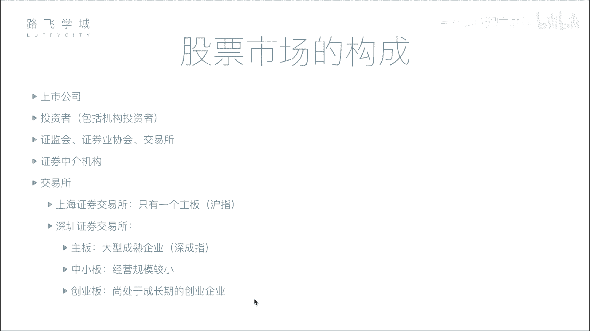
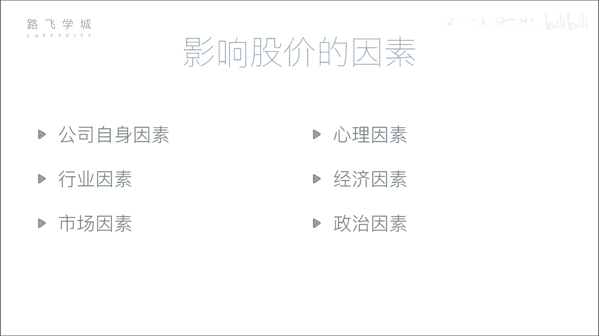

# Python金融量化：P3：03 股票市场构成 📈

在本节课中，我们将要学习股票市场的构成。了解市场中有哪些参与者以及他们的角色，是理解股票交易流程和后续量化分析的基础。

上一节我们介绍了股票的分类，本节中我们来看看股票市场是如何组织起来的。

## 市场主要参与者

股票市场并非只有买卖双方，它是一个由多个角色共同构成的复杂系统。以下是市场中的核心参与者：

### 1. 公司与投资者
这是市场中最基础的两方。**公司**是融资方，通过发行股票来筹集资金。**投资者**是出资方，通过购买股票进行投资，期望获得回报。

### 2. 监管机构
为了确保市场公平、公正，防止暗箱操作，需要强有力的监管。在中国，最主要的监管机构是**中国证券监督管理委员会（证监会）**。它的权力非常大，负责审核公司上市资格、监督市场行为（如打击内幕交易、洗钱等违法行为），并有权决定公司能否上市或将其退市。

### 3. 证券业协会
这是一个行业自律组织，作用相对较弱。例如，证券从业资格考试通常由其主办。

### 4. 证券交易所
交易所是提供集中、公开交易场所的机构。在中国，主要有**上海证券交易所**和**深圳证券交易所**。它们负责处理所有买卖指令，是股票交易最终发生的地方。早期交易需要投资者亲自到交易所排队，现在则通过网络连接完成。

### 5. 证券中介机构（券商）
个人投资者通常不能直接进入交易所买卖股票。这是因为直接交易的成本过高（历史上需要购买昂贵的交易席位）。因此，投资者需要通过**证券中介机构**，即**券商**（如中信证券、中金公司等）来进行交易。

券商在交易所有席位，它们开发交易软件（如同花顺），投资者通过软件将买卖指令发送给券商，券商再利用自己的席位将指令传递到交易所执行。这个过程可以概括为：
```
投资者 -> 券商软件 -> 券商席位 -> 交易所
```

## 中国的交易所与板块

中国有两个主要交易所，每个交易所下又设有不同的板块，以适应不同规模和发展阶段的企业。

以下是各交易所的板块划分：

*   **上海证券交易所**：主要设有**主板**（沪市主板）。
*   **深圳证券交易所**：设有三个板块，分别是**主板**（深市主板）、**中小板**和**创业板**。

中小板和创业板的设立是为了鼓励和支持中小型、创新型企业的发展，它们的上市门槛（如对公司净利润的要求）通常比主板要低。例如，创业板可能要求公司连续几年达到一定数额的净利润即可申请上市。

## 市场指数（大盘）

我们常听到的“大盘”，指的其实是反映某个市场或板块整体走势的**指数**。

指数的作用是综合反映该板块内所有（或代表性）股票的整体表现。它就像是一个“平均值”或“趋势图”，让投资者能快速了解市场整体的好坏。

例如：
*   上海主板的大盘指数是**上证指数（沪指）**。
*   深圳各板块的大盘指数分别是：**深证成指（深成指）**、**中小板指**和**创业板指**。

如果指数上涨，通常意味着市场内大部分股票在上涨，整体行情向好；反之则意味着行情走弱。

---





本节课中我们一起学习了股票市场的构成。我们认识了市场中的五大参与者：公司、投资者、监管机构、交易所和券商，并了解了它们各自的功能。同时，我们也熟悉了中国两大交易所及其板块划分，以及“大盘指数”的含义。理解这些基本结构，是后续进行股票数据获取、分析和量化交易策略开发的重要前提。