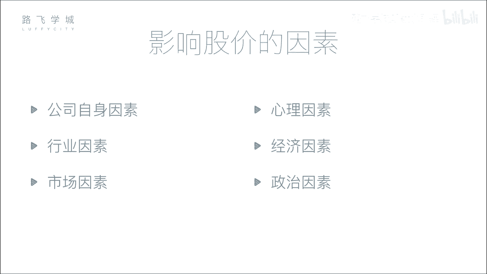

# Python金融量化：P3：03 金融量化分析-股票市场构成 📈

在本节课中，我们将要学习股票市场的构成。了解市场中有哪些参与者以及他们各自扮演的角色，是进行金融量化分析的基础。我们将从公司和投资者开始，逐步介绍监管机构、交易所和中介机构，最后解释股票指数（大盘）的含义。

## 公司和投资者

上一节我们介绍了股票的分类，本节中我们来看看股票市场的参与者。首先，市场中最核心的两方是公司和投资者。

*   **公司**：需要融资的一方。
*   **投资者**：提供资金的一方。

公司通过发行股票向投资者融资，投资者则通过购买股票进行投资。但股票交易并非由公司和投资者直接进行。

## 监管机构与自律组织

为了保证市场的公平、公正，防止暗箱操作，需要有专门的机构进行监管。

*   **证监会**：这是证券行业的监管机构，权力很大。公司想要上市，必须向证监会提交各种材料。证监会负责审查公司是否存在欺诈、洗钱等违法行为，并有权决定公司能否上市或将其退市。
*   **证券业协会**：这是一个自律性组织，作用相对较弱。例如，证券从业资格考试通常由其主办。

## 交易所

交易所为股票交易提供了集中的场所。在中国，主要有上海和深圳两家证券交易所。

交易所的功能在于处理所有买卖股票的请求。在电子化交易普及之前，投资者需要亲自到交易所排队交易。现在，所有交易都通过网络连接到交易所的系统完成。

## 证券中介机构（券商）

个人投资者不能直接进入交易所买卖股票，成本太高。在早期，交易所通过出售价格高昂的“交易席位”来限制直接参与者。拥有席位的机构（如大型投资银行）为了赚回席位费，便发展出代理小投资者买卖股票的业务。

以下是现代证券中介机构（俗称券商）的作用：

*   券商（如中信证券、中金公司等）在证券交易所拥有交易席位。
*   它们开发交易软件（如同花顺等），供投资者使用。
*   投资者通过券商的软件提交交易指令，券商再通过其在交易所的席位，将指令传达给交易所，从而完成股票买卖。

## 交易所板块与股票指数（大盘）

中国有两个主要交易所，每个交易所下又分为不同的板块，以适应不同规模和发展阶段的企业。

*   **上海证券交易所**：主要设有**主板**。
*   **深圳证券交易所**：设有**主板**、**中小板**和**创业板**。中小板和创业板是为规模较小但成长性好的创业公司提供融资渠道的板块。

对于每个板块，都有一个综合性的**股票指数**来反映其整体表现，俗称“大盘”。

**指数**的含义是：将一个板块内众多股票的价格表现，通过特定算法（如加权平均）综合计算，形成一条趋势曲线。它反映了整个市场盘子的总体走势是向好还是向坏。

主要的股票指数包括：
*   上海主板指数：**沪指**（上证综指）
*   深圳主板指数：**深成指**
*   中小板指数：**中小板指**
*   创业板指数：**创业板指**

---

本节课中我们一起学习了股票市场的构成。我们认识了市场中的核心参与者——公司与投资者，了解了维护市场秩序的证监会和证券业协会，知道了提供交易场所的交易所，明白了连接个人投资者与交易所的券商（证券中介机构）的作用，最后学习了不同交易所的板块划分以及反映市场整体走势的股票指数（大盘）。理解这些基本概念，是后续进行股票数据获取、分析和量化策略开发的重要前提。