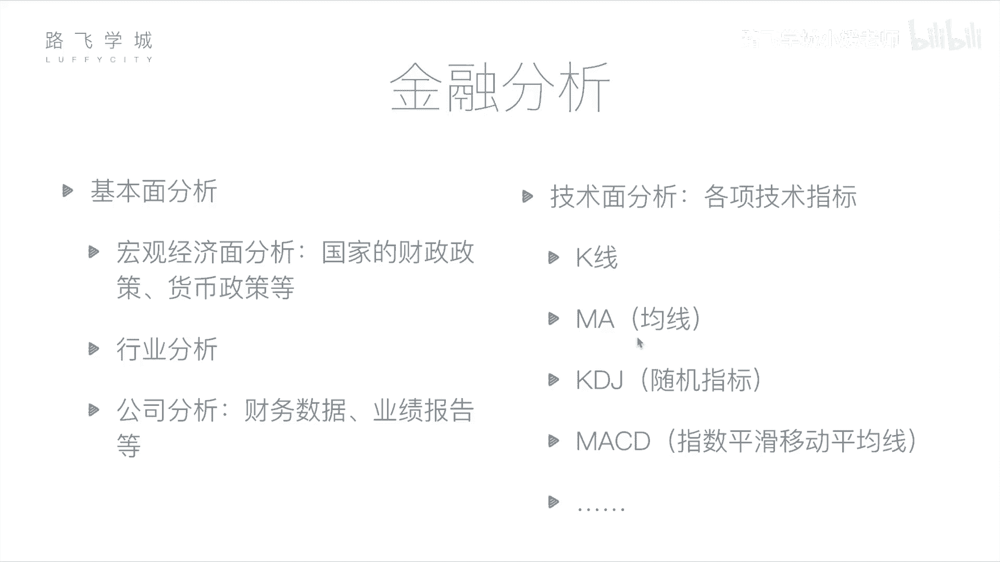
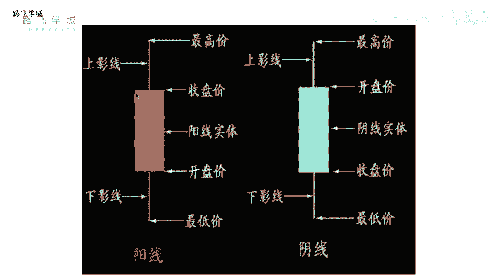
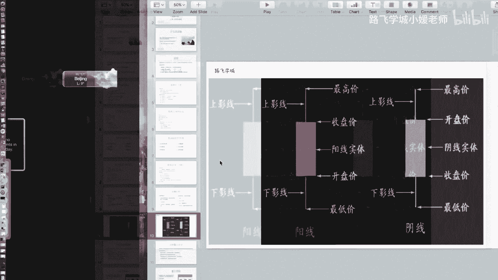
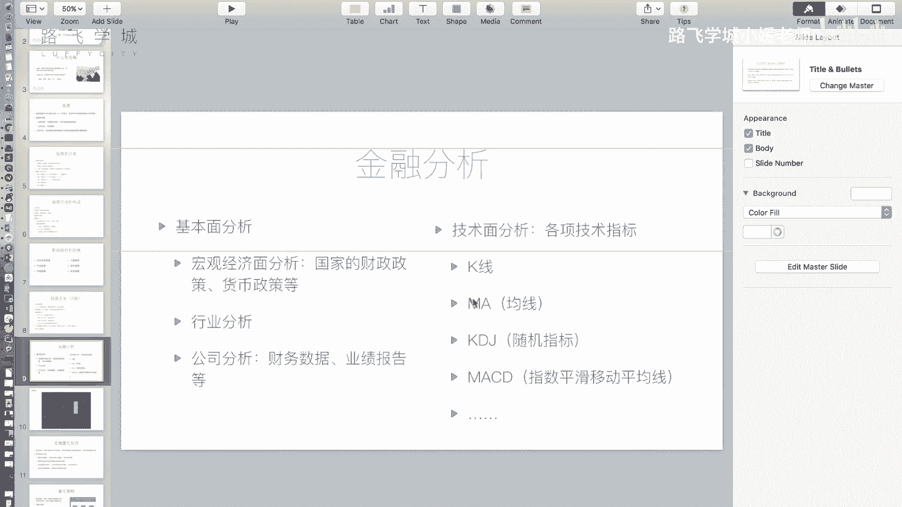
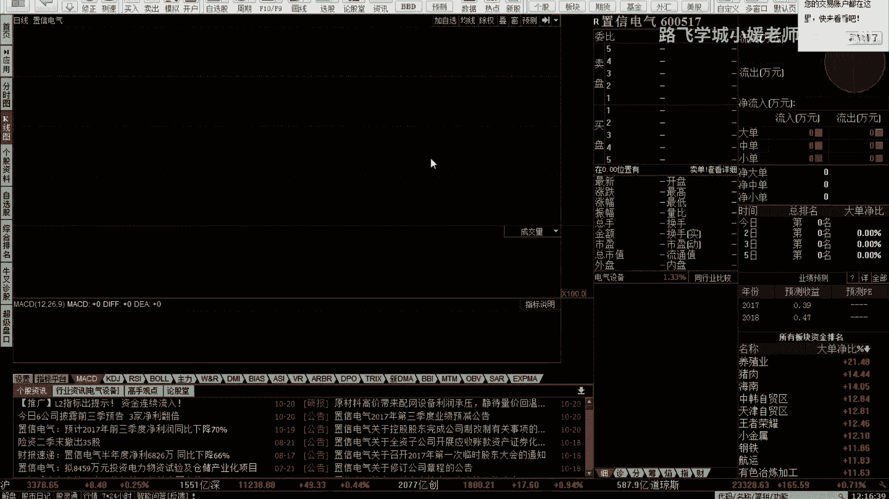
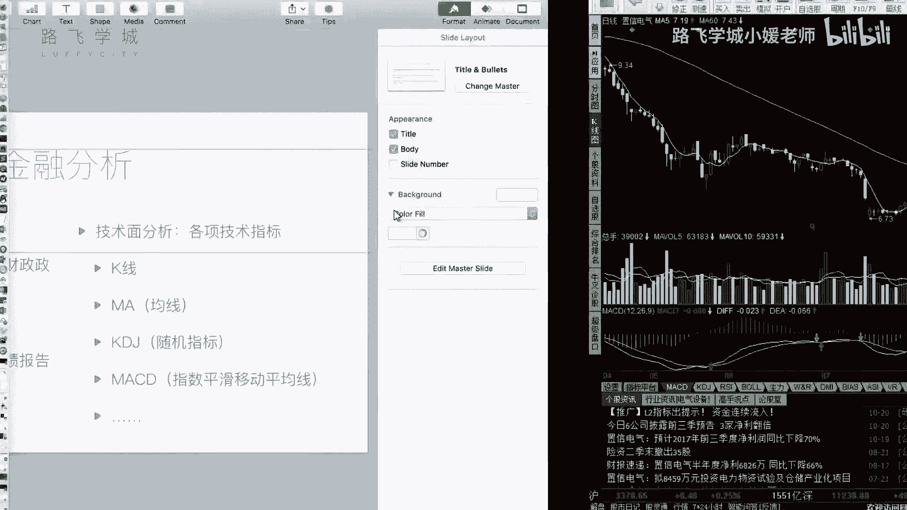

# Python金融量化：P3：05 金融量化分析-金融分析 📈

在本节课中，我们将要学习金融分析的基本方法。上一节我们介绍了金融和股票的基础知识，本节中我们来看看如何通过分析手段来判断股票的买卖时机，而不是盲目投资。

金融分析主要分为两种方法：基本面分析和技术面分析。

## 基本面分析

基本面分析的核心是评估公司的运营状况，这涉及到我们之前提到的影响股价的公司自身因素。你需要分析当前的经济环境、行业前景以及公司具体的经营情况，以此来决定是否购买其股票。



以下是基本面分析的三个层面：



1.  **宏观经济面分析**：分析国家的财政政策、货币政策等宏观因素。例如，判断政策是鼓励资金流入股市还是倾向于储蓄。但需注意，宏观经济规律并非总是与股市表现一致。
2.  **行业分析**：判断整个行业的发展状况。例如，评估教育、IT或传统工业（如钢铁、煤炭）哪个行业更具发展潜力。你可以通过观察该行业中几只代表性股票的走势来辅助判断。
3.  **公司分析**：这是最具体的层面。例如，如果你考虑购买贵州茅台的股票，就需要仔细研究该公司的公开财务数据。上市公司会定期发布经过审计的财报（如年度报告和季度报告），这些数据是公开且相对可靠的。通过分析财报中的盈利、每股收益等数据，结合新闻和实地考察，可以判断公司运营是否良好。如果公司运营非常好且盈利能力强，你就可以考虑购买其股票。



## 技术面分析

上一节我们介绍了基本面分析，本节中我们来看看技术面分析。技术面分析的核心观点是：所有信息都已蕴含在市场交易数据中。它通过研究历史市场走势和一系列技术指标来预测未来价格动向。

以下是两个基础且重要的技术指标：

1.  **K线**
    K线图是展示股票每日价格走势的图表。一根K线包含了四个关键价格：**开盘价**、**收盘价**、**最高价**和**最低价**。
    *   **阳线**（通常为红色或空心）：表示当日股价上涨，即收盘价高于开盘价。实体的下边缘是开盘价，上边缘是收盘价。
    *   **阴线**（通常为绿色或实心）：表示当日股价下跌，即收盘价低于开盘价。实体的上边缘是开盘价，下边缘是收盘价。
    *   **影线**：实体上方细线顶端为**最高价**，下方细线底端为**最低价**。
    *   **特殊形态**：例如“十字星”（开盘价等于收盘价）或“光头光脚线”（无影线，开盘/收盘价即是最低/最高价）。不同的K线形态可用于辅助分析。





2.  **移动平均线**
    移动平均线是通过计算过去若干天收盘价的平均值，并将每日的点连接起来形成的曲线。它用于平滑价格波动，反映趋势。
    *   **计算公式（以5日均线MA5为例）**：
        ```
        MA5(今日) = (今日收盘价 + 前1日收盘价 + 前2日收盘价 + 前3日收盘价 + 前4日收盘价) / 5
        ```
    *   **常见均线**：例如`MA5`（5日均线）、`MA60`（60日均线）。数字代表计算平均值所取的天数。
    *   **应用**：均线可以帮助判断趋势。例如，短期均线上穿长期均线可能被视为买入信号，这构成了“双均线策略”的基础，我们将在后续量化策略部分详细讨论。

---



本节课中我们一起学习了金融分析的两大支柱：基本面分析和技术面分析。基本面分析侧重于公司价值，而技术面分析侧重于市场行为和历史模式。理解K线和移动平均线是开启技术分析大门的第一步。在接下来的课程中，我们将学习如何应用这些分析工具来构建具体的量化交易策略。