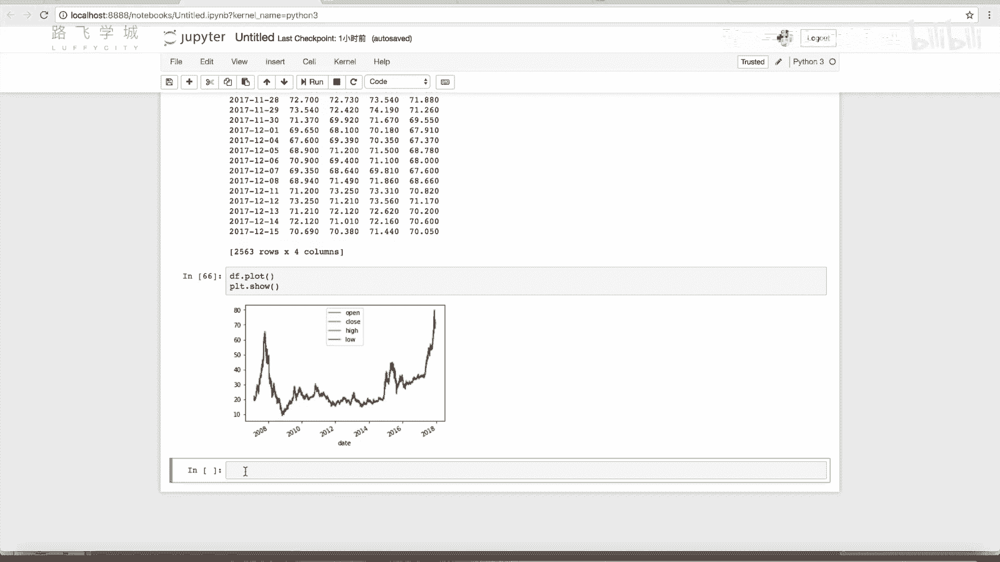

# Python金融量化：P30：pandas与Matplotlib结合绘图

## 概述
在本节课中，我们将学习如何将pandas库中的DataFrame和Series数据结构与Matplotlib绘图库相结合，实现数据的快速可视化。我们将通过一个股票数据的实例，演示如何直接将DataFrame绘制成图表，并了解其便捷性。

---

## pandas与Matplotlib的关联

上一节我们介绍了`plot`函数及其周边功能，本节中我们来看看pandas库与Matplotlib库之间的直接关联。

具体来说，我们之前创建的DataFrame可以直接转换为图表。例如，我们可以使用之前的一个股票数据文件。

我们首先加载数据文件`601318.csv`，并查看其结构。

```python
import pandas as pd

# 读取数据
df = pd.read_csv('601318.csv')
print(df.head())
```

接下来，我们进行一些数据预处理。将日期列转换为日期时间对象，并设置为索引。

```python
# 将日期列转换为datetime对象并设为索引
df['date'] = pd.to_datetime(df['date'])
df.set_index('date', inplace=True)
```

由于数据中包含一些字符串列（如股票代码）和无用的序列，我们使用花式索引选择出需要的四列价格数据：开盘价、收盘价、最高价和最低价。

```python
# 选择需要的价格列
price_df = df[['open', 'close', 'high', 'low']]
print(price_df.head())
```

## 直接绘制DataFrame

现在，如果我们想将这个`price_df` DataFrame 直接可视化为图表，有一个非常简便的方法。

我们可以直接调用DataFrame对象的`.plot()`方法，然后使用`plt.show()`显示图表。

```python
import matplotlib.pyplot as plt

# 直接绘制DataFrame
price_df.plot()
plt.show()
```

执行上述代码后，Matplotlib会智能地生成一个图表。索引列（日期）会自动成为X轴的坐标，而选中的四列数据则成为Y轴坐标，绘制成四条不同颜色的曲线。

图表中四条线看起来几乎重叠，这是因为股票每日的开盘价、收盘价、最高价和最低价数值非常接近，且数据量很大。在图表窗口中，我们可以通过缩放功能更清晰地观察每条线的细微差别。

这种方法同样适用于pandas的Series对象。Series是单列数据，调用`.plot()`方法将绘制出一条单线图。



**核心操作公式**：
`DataFrame.plot() -> matplotlib图形`
`Series.plot() -> matplotlib图形`


---

## 课程作业

以下是本节课后的小练习，旨在巩固Matplotlib绘制函数图像的能力。

请尝试绘制以下三个数学函数的图像，并将它们显示在同一个图形窗口中：
1.  **Y = X** （一条直线）
2.  **Y = X²** （一条抛物线）
3.  **Y = 3X³ + 5X² + 2X + 1** （一个三次函数）

作业要求：
*   使用不同颜色的线条区分三个函数。
*   为每条曲线添加图例（legend），说明其代表的函数。
*   调整X轴的范围，以便清晰地展示函数图形。

完成后，可以对比下一节视频中提供的参考答案，看看你的实现方式有何不同。


---

## 总结
本节课中我们一起学习了pandas与Matplotlib结合使用的便捷方法。我们了解到，pandas的DataFrame和Series对象可以直接调用`.plot()`方法进行快速绘图，Matplotlib会自动处理索引和数据的映射关系，极大简化了数据可视化的步骤。同时，我们布置了一个绘制数学函数图像的作业，以练习Matplotlib的基本绘图功能。