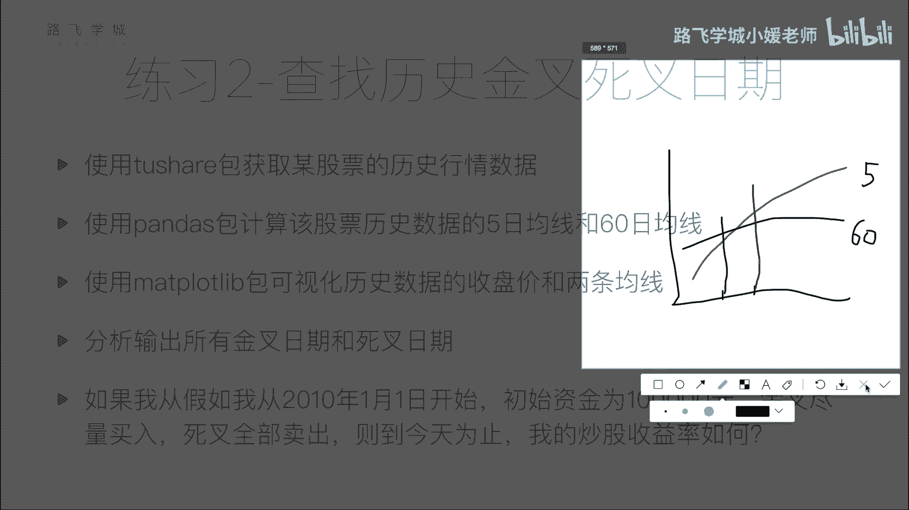

# Python金融量化：P30：双均线分析作业说明 📈

## 概述
在本节课中，我们将学习一个在量化交易中常用的策略——双均线策略。我们将理解其核心概念，并完成一个实践作业：获取股票数据、计算移动平均线、识别买卖信号，并模拟一个简单的交易策略来计算最终收益。

---

## 上一节回顾与本节引入
上一节我们介绍了一个关于识别每月首个交易日和每年最后一个交易日的练习题。本节中，我们来看看一个更贴近实际交易的策略：双均线策略。

## 双均线策略核心概念
双均线策略基于两条不同周期的移动平均线（Moving Average, MA）的交叉关系来判断买卖时机。

### 移动平均线（MA）定义
对于每个交易日，计算前N天收盘价的平均值，将这些平均值连成线，即得到N日移动平均线。

**公式**：
`MA(N)_t = (Price_{t} + Price_{t-1} + ... + Price_{t-N+1}) / N`
其中，`MA(N)_t` 代表第t天的N日移动平均值，`Price` 通常指收盘价。

常用周期有5日（短线）、10日、30日、60日（中线）、120日和240日（长线）。周期越短，均线对价格波动越敏感；周期越长，均线走势越平缓。

### 金叉与死叉
这是双均线策略的两个核心信号。

*   **金叉**：短期均线从下方上穿长期均线，被视为**买入信号**。
*   **死叉**：短期均线从上方下穿长期均线，被视为**卖出信号**。

策略思想是：金叉预示上涨趋势可能开始，死叉预示下跌趋势可能开始。但需注意，该信号具有滞后性。

---

## 作业任务说明
以下是本次作业需要完成的步骤。

### 第一步：数据获取与均线计算
使用 `tushare` 包获取一支股票的历史行情数据。接着，使用 `pandas` 包计算该股票的5日移动平均线（MA5）和60日移动平均线（MA60）。

### 第二步：数据可视化
使用 `matplotlib` 包绘制三条线：每日收盘价曲线、MA5曲线以及MA60曲线。通过图表直观观察价格与均线的走势关系。

### 第三步：识别金叉与死叉日期
根据计算出的MA5和MA60数据，找出所有的金叉日期和死叉日期。

**判断逻辑**：
比较相邻两天的均线大小关系。
*   如果前一天满足 `MA5 < MA60`，而后一天满足 `MA5 > MA60`，则后一天日期为**金叉**日期。
*   如果前一天满足 `MA5 > MA60`，而后一天满足 `MA5 < MA60`，则后一天日期为**死叉**日期。

可以使用循环遍历数据来实现这一判断。

### 第四步：模拟交易策略
在完成信号识别后，我们将模拟一个简单的交易策略。

**策略规则**：
1.  初始资金为10万元。
2.  出现**金叉**时，尽可能多地买入股票，但必须以“手”为单位（1手=100股）。即，用当前可用资金，计算能购买的最大整数手数。
3.  出现**死叉**时，卖出持有的全部股票。
4.  金叉与死叉交替出现，策略循环执行“买入-卖出”。

**最终目标**：
计算从2010年1月1日至今，执行该策略后的总收益率，即最终资产相对于10万元本金的盈亏情况。

---

## 总结
本节课我们一起学习了双均线策略的基本原理，包括移动平均线的计算、金叉死叉的概念及其作为买卖信号的逻辑。并通过一个完整的作业，实践了从数据获取、处理、可视化到策略回测的量化分析流程。请根据以上步骤完成练习，这将帮助你巩固对均线策略的理解。