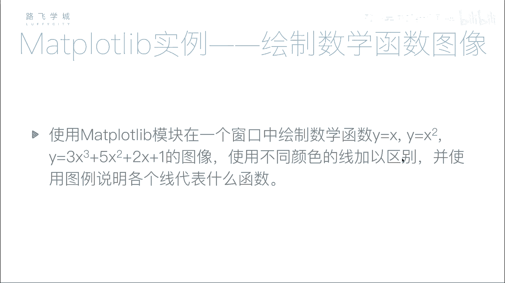
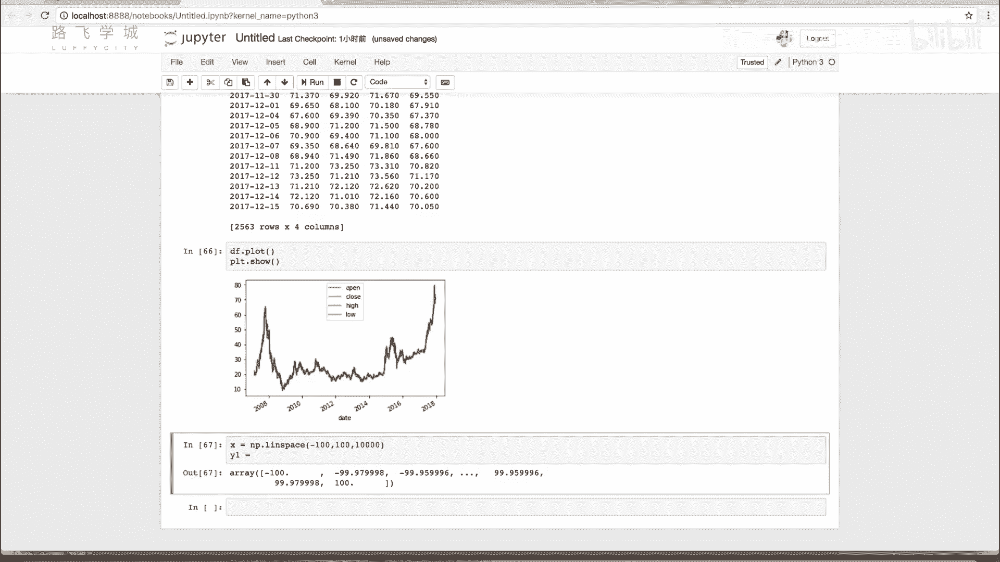
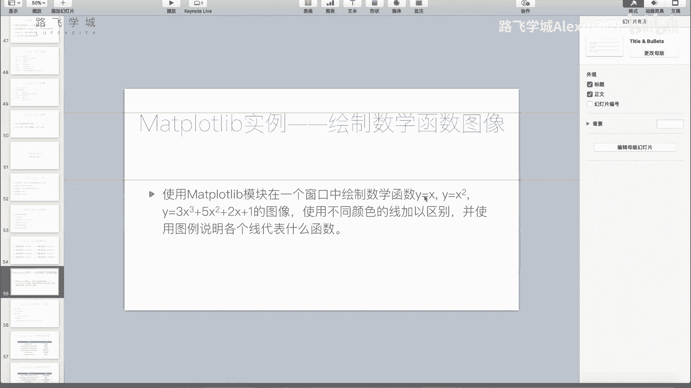
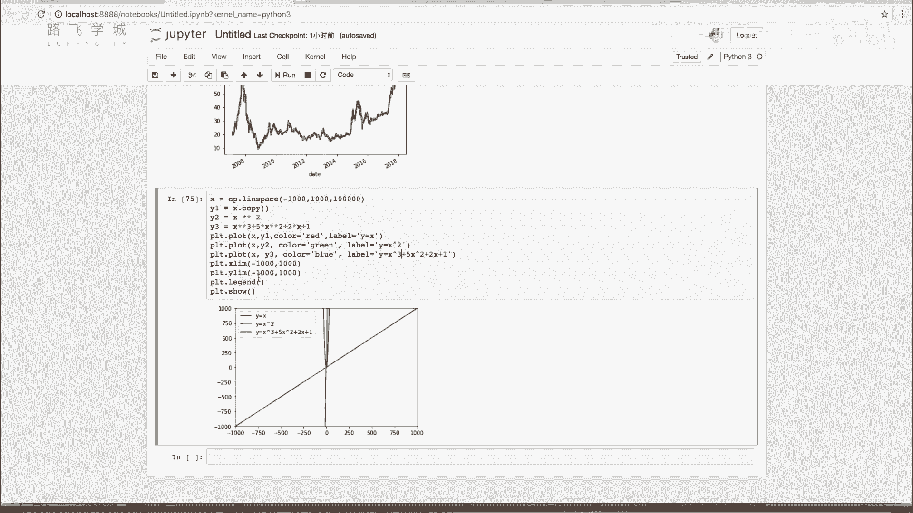

# Python金融量化：P31：36 使用matplotlib绘制数学函数图像 📈

## 概述
在本节课中，我们将学习如何使用Python的matplotlib库来绘制数学函数图像。我们将理解计算机绘制曲线的基本原理，并通过一个具体的例子，绘制三个不同的函数图像。



## 计算机如何绘制曲线
上一节我们介绍了数据可视化的基础，本节中我们来看看如何绘制数学函数图像。计算机屏幕上显示的图像，无论是直线、圆还是曲线，本质上都是由一系列密集的点构成的。例如，在绘图软件中画一个圆，放大后会发现它是由许多像素点组成的。绘制数学函数图像也是同样的原理：我们需要生成一系列密集的X坐标点，然后根据函数公式计算出对应的Y坐标点，最后将这些点连接起来，就形成了我们看到的曲线。

## 生成密集的数据点
为了绘制平滑的曲线，我们需要生成一系列非常接近的X值。这可以通过NumPy库中的`linspace`函数来实现。与`arange`函数不同，`linspace`的第三个参数指定的是将起点到终点的区间**等分成多少份**，而不是步长。


以下是使用`linspace`生成数据点的代码示例：
```python
import numpy as np
# 在区间[-100, 100]内生成10000个等间距的点
x = np.linspace(-100, 100, 10000)
```

## 计算函数值并绘图
有了X值的数组后，我们就可以根据数学公式计算对应的Y值。NumPy数组支持向量化运算，可以直接对数组进行数学运算，非常方便。





接下来，我们以三个函数为例进行绘制：
1.  Y = X
2.  Y = X²
3.  Y = 3X³ + 5X² + 2X + 1

以下是计算Y值并绘图的完整代码步骤：
```python
import matplotlib.pyplot as plt
import numpy as np

# 1. 生成X轴数据点
x = np.linspace(-100, 100, 10000)

# 2. 计算三个函数的Y值
y1 = x                     # Y = X
y2 = x ** 2                # Y = X²
y3 = 3 * (x ** 3) + 5 * (x ** 2) + 2 * x + 1  # Y = 3X³ + 5X² + 2X + 1

# 3. 绘制图像
plt.plot(x, y1, color='red', label='Y = X')
plt.plot(x, y2, color='green', label='Y = X²')
plt.plot(x, y3, color='blue', label='Y = 3X³ + 5X² + 2X + 1')

# 4. 添加图例
plt.legend()
plt.show()
```

## 图像显示与坐标轴调整
运行上述代码后，你可能会发现红色的直线（Y=X）几乎看不见。这是因为Y=X³的函数值增长极快，导致Y轴的范围被拉得非常大，使得Y=X这条直线在图像中显得非常“扁平”。

为了解决这个问题，我们可以手动设置Y轴的显示范围，以便更清晰地观察各个函数。这需要使用`plt.ylim()`函数。

调整Y轴范围的代码如下：
```python
# 在plt.show()之前添加，设置Y轴的显示范围为[-1000, 1000]
plt.ylim(-1000, 1000)
```
通过调整坐标轴范围，我们可以让不同数量级的函数曲线都能在图中清晰地显示出来。



## 总结
本节课中我们一起学习了使用matplotlib和NumPy绘制数学函数图像的方法。核心步骤包括：利用`np.linspace`生成密集的X坐标点；通过向量化运算根据函数公式计算Y坐标点；使用`plt.plot`进行绘图，并用不同颜色和标签区分多条曲线；最后，通过调整坐标轴范围（如`plt.ylim`）来优化图像的显示效果。这个方法在数学实验和数据分析中非常实用。