# Python金融量化投资分析与股票交易：P32：31 plot函数周边 📊

## 概述
在本节课中，我们将深入学习Matplotlib库中`plot`函数的周边功能。上一节我们介绍了`plot`函数的基本用法，本节中我们来看看如何绘制多条曲线，并为图表添加标题、坐标轴标签、刻度以及图例等元素，使图表更加完整和专业。

## 绘制多条曲线
在同一个图表中绘制多条曲线非常简单，只需多次调用`plot`函数即可。Matplotlib库会累积所有调用过的`plot`函数，直到调用`show`函数时，将所有曲线绘制在同一张图中。

以下是绘制多条曲线的示例代码：
```python
import matplotlib.pyplot as plt

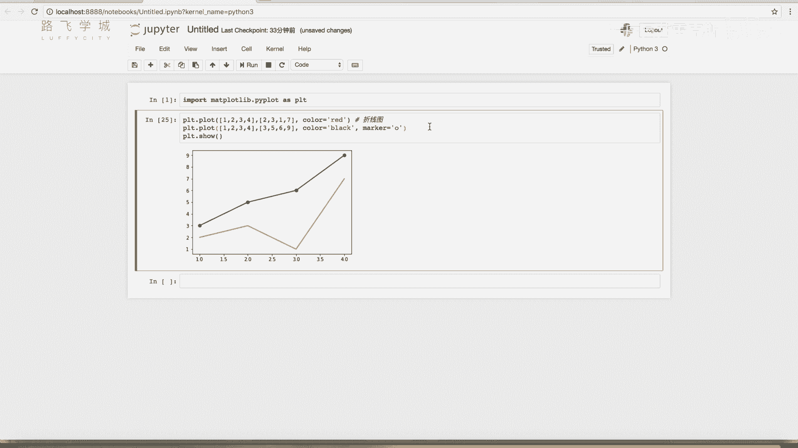

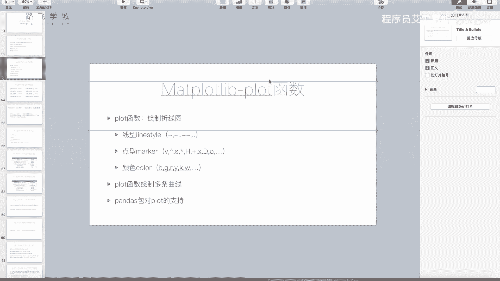

# 绘制第一条曲线
plt.plot([1, 2, 3, 4], [1, 4, 9, 16], 'ro-', label='Line A')
# 绘制第二条曲线
plt.plot([1, 2, 3, 4], [2, 5, 10, 17], 'bo--', label='Line B')

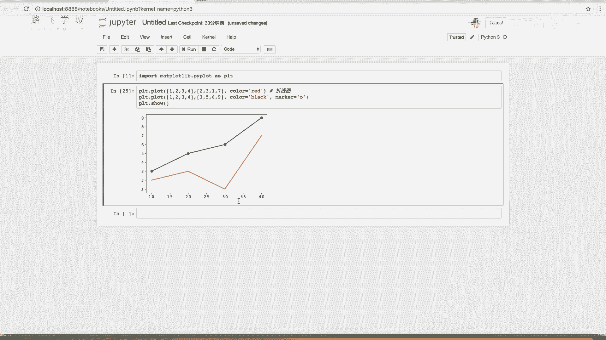

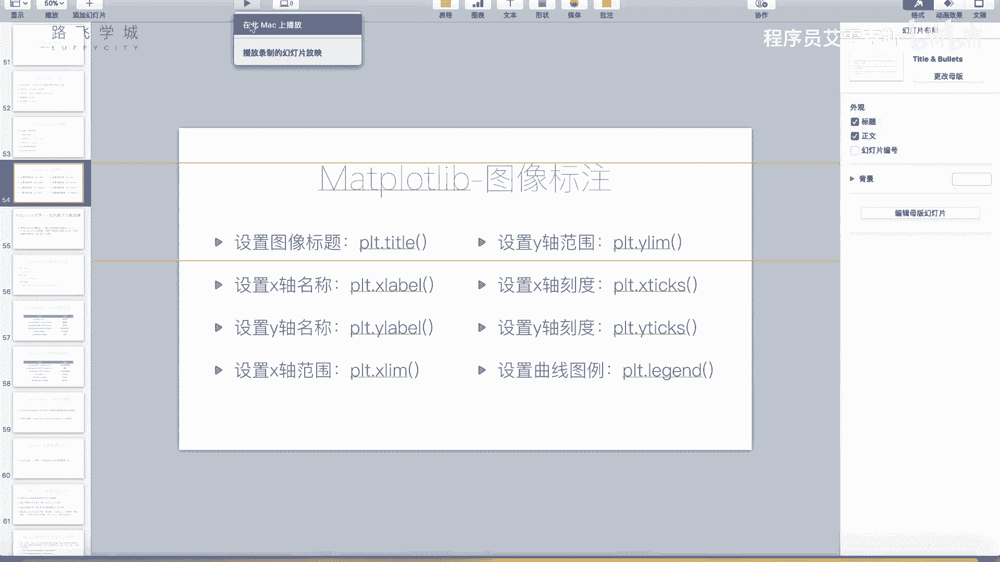

plt.show()
```

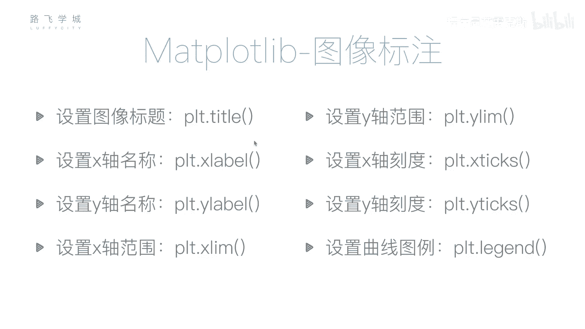

## 设置图表标题与坐标轴标签
为了使图表信息更清晰，我们需要为其添加标题和坐标轴标签。以下是相关函数的使用方法。

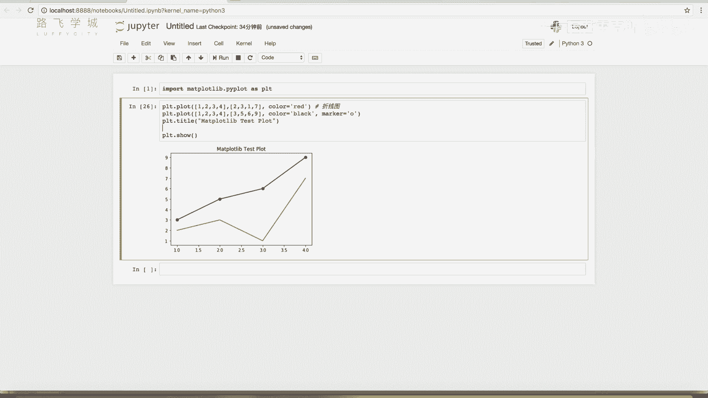

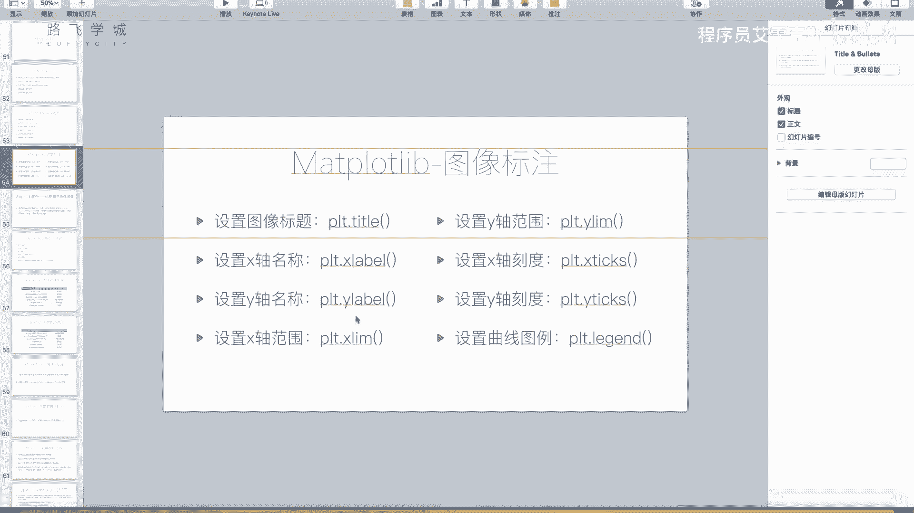

以下是设置标题和标签的示例代码：
```python
import matplotlib.pyplot as plt

plt.plot([1, 2, 3, 4], [1, 4, 9, 16])
# 设置图表标题
plt.title('Matplotlib Test Plot')
# 设置X轴标签
plt.xlabel('X Label')
# 设置Y轴标签
plt.ylabel('Y Label')

plt.show()
```

## 设置坐标轴范围
默认情况下，Matplotlib会自动调整坐标轴范围以适应数据。但有时我们需要手动设置范围，可以使用`xlim`和`ylim`函数。

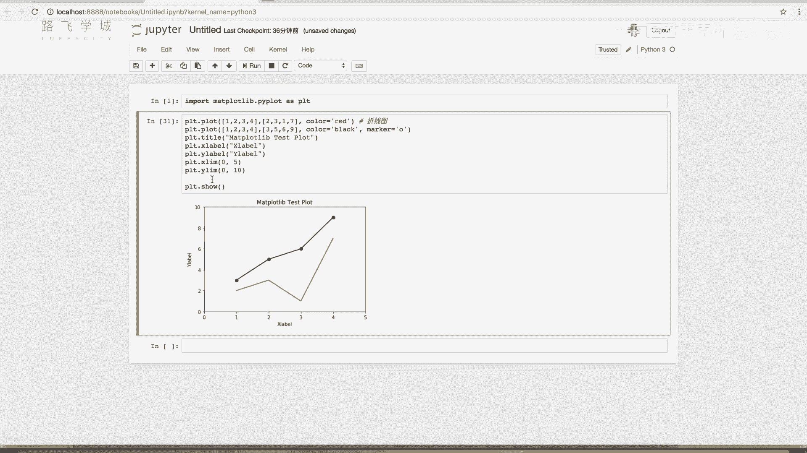

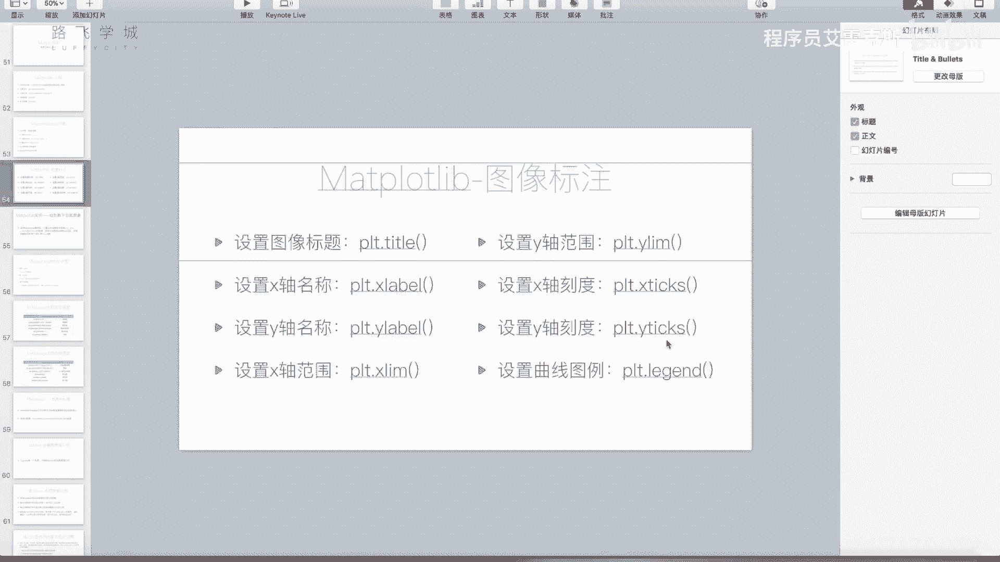

以下是设置坐标轴范围的示例代码：
```python
import matplotlib.pyplot as plt

plt.plot([1, 2, 3, 4], [1, 4, 9, 16])
# 设置X轴范围为0到5
plt.xlim(0, 5)
# 设置Y轴范围为0到20
plt.ylim(0, 20)

plt.show()
```

## 设置坐标轴刻度
我们可以自定义坐标轴上的刻度位置和标签，这对于展示非数值型数据（如类别）非常有用。

以下是设置刻度的示例代码：
```python
import matplotlib.pyplot as plt
import numpy as np

plt.plot([1, 2, 3, 4], [1, 4, 9, 16])
# 设置X轴刻度位置
plt.xticks([0, 2, 4])
# 使用numpy生成刻度位置
plt.xticks(np.arange(0, 11, 2))
# 设置X轴刻度标签
plt.xticks([1, 2, 3, 4], ['A', 'B', 'C', 'D'])

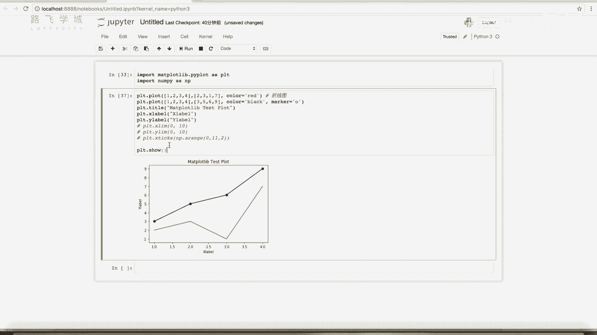

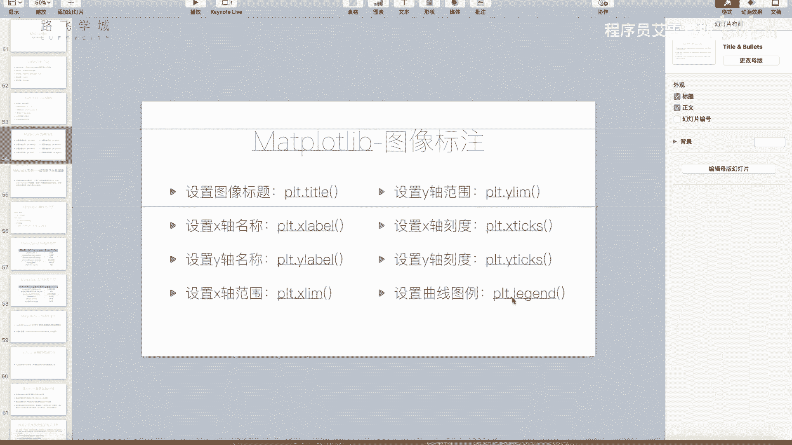

plt.show()
```

## 添加图例
图例用于说明图表中每条曲线所代表的含义。最推荐的方法是在调用`plot`函数时，通过`label`参数为每条曲线指定标签，然后调用`legend`函数显示图例。

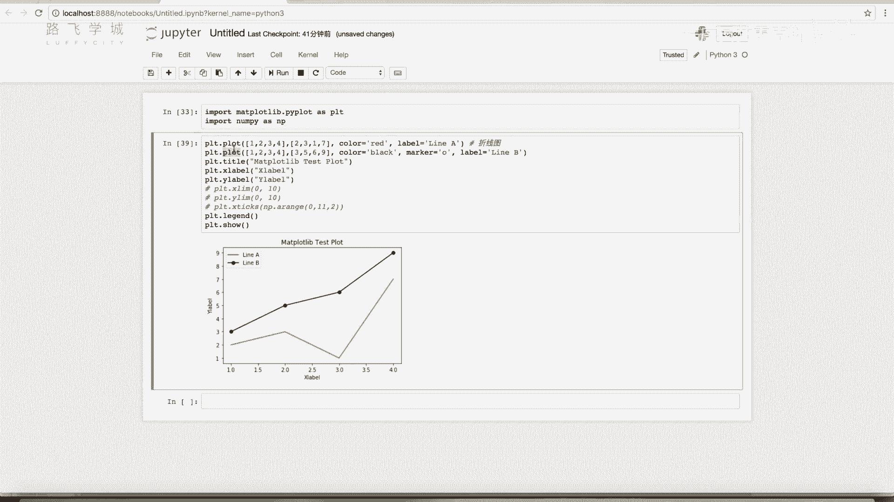

以下是添加图例的示例代码：
```python
import matplotlib.pyplot as plt

# 绘制曲线并指定标签
plt.plot([1, 2, 3, 4], [1, 4, 9, 16], label='Line A')
plt.plot([1, 2, 3, 4], [2, 5, 10, 17], label='Line B')
# 显示图例
plt.legend()

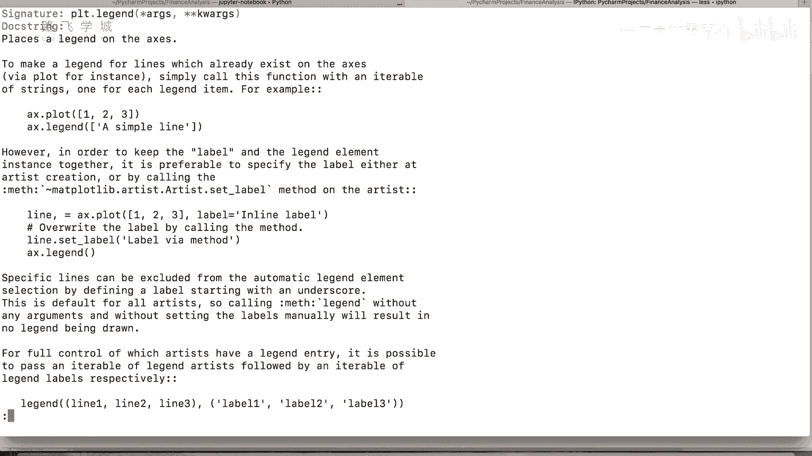

plt.show()
```

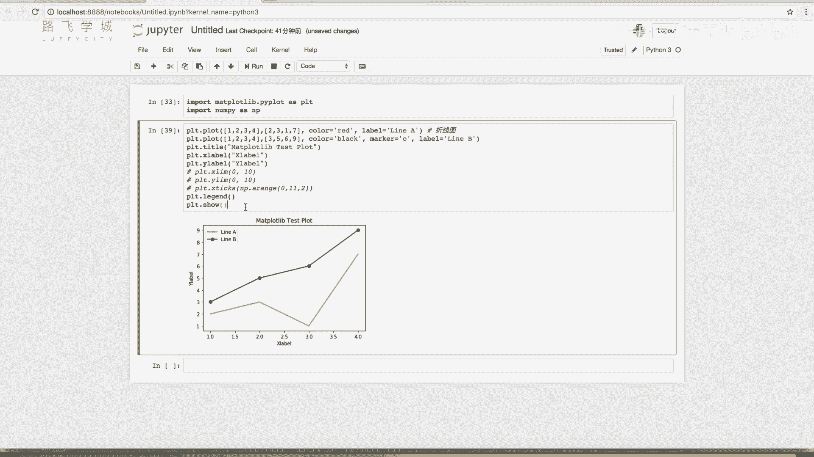

## 总结
本节课中我们一起学习了`plot`函数的周边功能。我们掌握了如何在同一个图表中绘制多条曲线，以及如何通过设置标题、坐标轴标签、范围和刻度来完善图表。最后，我们还学习了如何添加图例来清晰地标识每条曲线的含义。这些功能是制作专业、易读图表的基础，在后续的金融数据可视化中会经常用到。