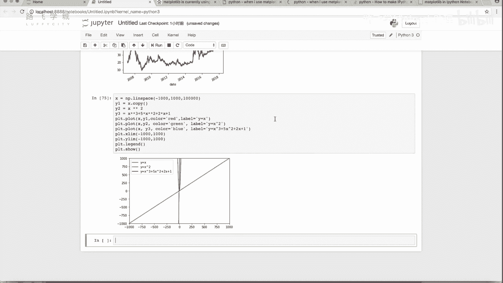
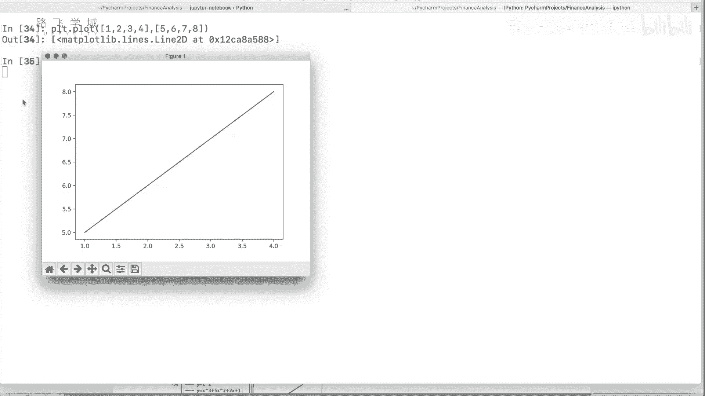
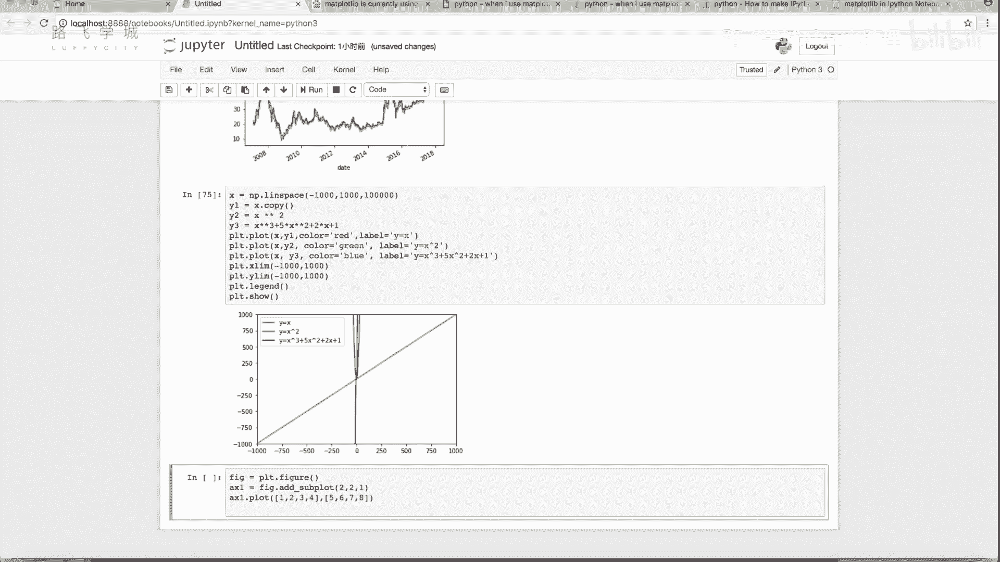
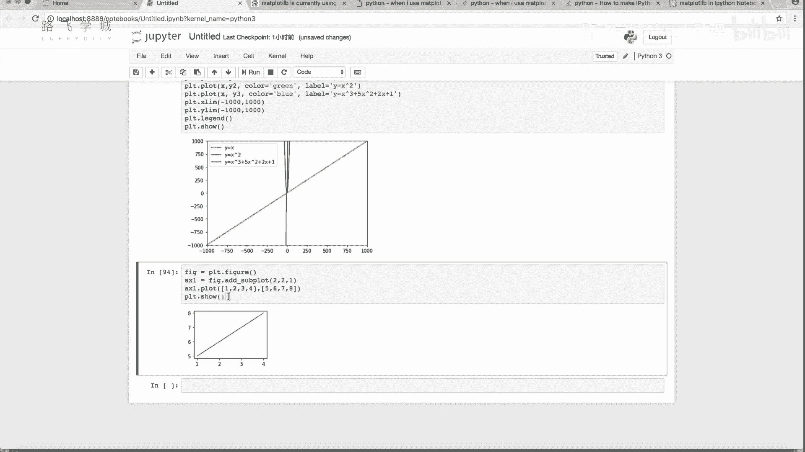
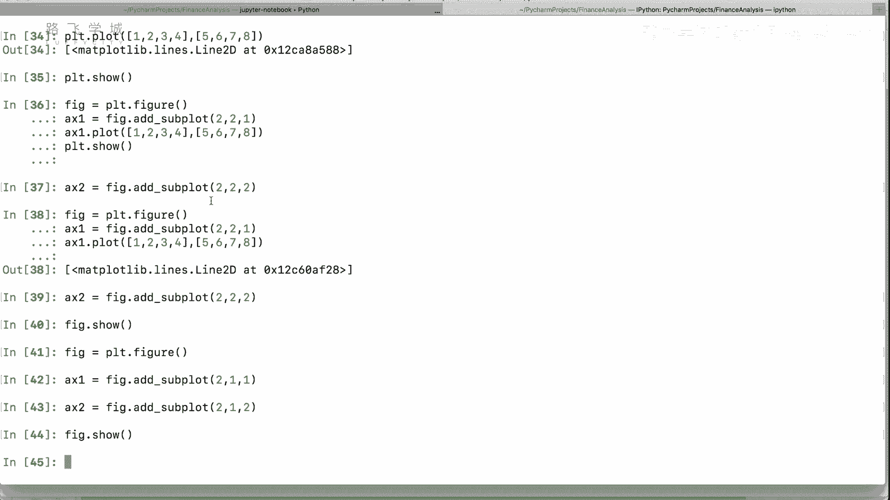

# Python金融量化：P32：37 matplotlib 画布与子图 📊




## 概述
在本节课中，我们将学习如何使用Matplotlib在一个窗口中创建并排列多个独立的图表。这是金融分析中常见的需求，例如同时展示股票K线图和大盘走势图。




## 画布与子图的概念
上一节我们介绍了如何在一个图表中绘制多条线。本节中我们来看看如何在一个窗口中创建多个独立的图表。


有时我们需要在一个窗口中展示多个图表。例如，分析股票时，可能希望上方显示股票的K线图，下方显示大盘的走势图。这就需要用到“画布”和“子图”的概念。



*   **画布**：可以理解为一个窗口或一张画纸。创建方法为 `plt.figure()`。
*   **子图**：是画布上的一个独立绘图区域。创建方法为 `figure.add_subplot()`。


## 创建画布与单个子图
以下是创建一个画布并在其上添加一个子图的基本步骤。



1.  首先，创建一个画布对象。
    ```python
    fig = plt.figure()
    ```
2.  然后，在画布上添加一个子图。`add_subplot(221)` 中的参数表示将画布划分为2行、2列，并选择第1个位置。
    ```python
    ax1 = fig.add_subplot(221)
    ```
3.  接着，在这个子图对象上绘图，而不是使用 `plt.plot()`。
    ```python
    ax1.plot([1, 2, 3, 4, 5, 6, 7, 8])
    ```
4.  最后，显示画布。
    ```python
    fig.show()
    ```
    执行后，会看到一个较小的图表显示在划分出的第一个区域。

## 创建多个子图
我们可以通过多次调用 `add_subplot` 并指定不同的位置参数，在同一个画布上创建多个子图。

例如，要创建两行一列的两个子图（一个在上，一个在下），可以这样操作：
```python
fig = plt.figure()
# 创建第一个子图（2行1列的第1个位置）
ax1 = fig.add_subplot(211)
ax1.plot([1, 2, 3, 4])
# 创建第二个子图（2行1列的第2个位置）
ax2 = fig.add_subplot(212)
ax2.plot([4, 3, 2, 1])
fig.show()
```
这样就能得到上下排列的两个独立图表。



## 调整子图间距
当创建多个子图时，它们之间默认会有一些间距。如果需要调整，可以使用 `subplots_adjust` 函数。


以下是该函数的主要参数：
*   `left`：左边距
*   `right`：右边距
*   `bottom`：底边距
*   `top`：顶边距
*   `wspace`：子图之间的宽度间距
*   `hspace`：子图之间的高度间距


调用方法如下：
```python
fig.subplots_adjust(left=0.1, bottom=0.1, right=0.9, top=0.9, wspace=0.4, hspace=0.4)
```
通常情况下，使用默认间距即可满足需求。

## 总结
本节课中我们一起学习了Matplotlib的“画布”与“子图”功能。我们掌握了如何通过 `plt.figure()` 创建画布，以及如何使用 `figure.add_subplot()` 在画布上创建和排列多个独立的图表区域。这使我们能够在一个窗口中并排展示多个相关的图表，例如股票价格与交易量的关系图，这对于金融数据分析至关重要。下一节，我们将介绍Matplotlib支持的其他常用图表类型。