# Python金融量化：P33：38 matplotlib 柱状图和饼图 📊

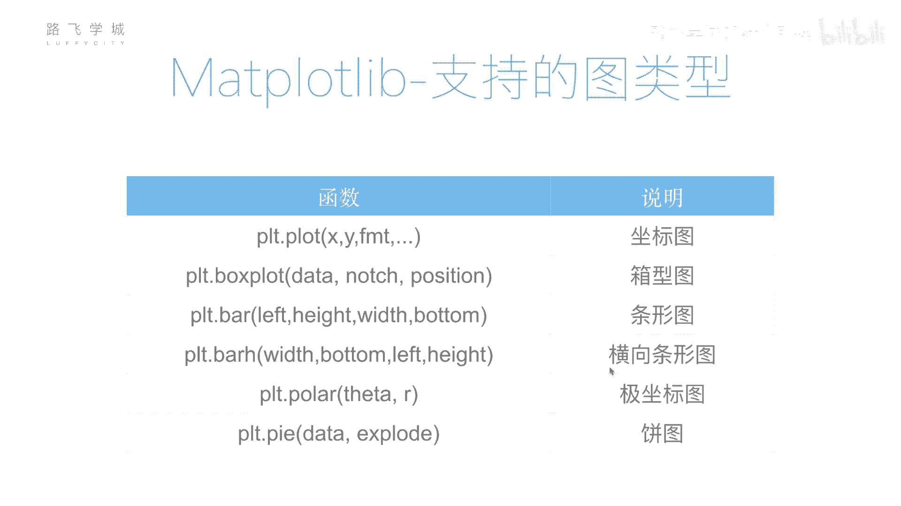

在本节课中，我们将要学习Matplotlib库中除折线图外的另外两种常见图表：柱状图和饼图。我们将了解它们的基本绘制方法、常用参数以及如何自定义图表样式。

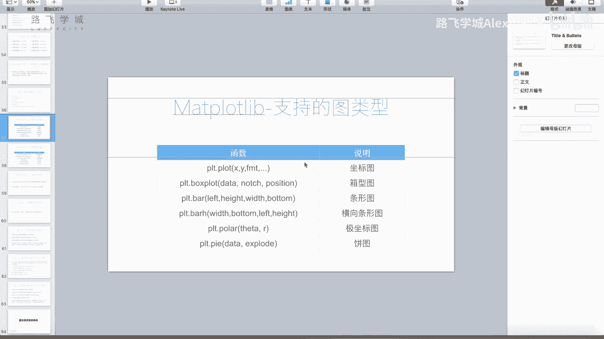

## 概述

上一节我们重点介绍了`plt.plot()`函数用于绘制折线图。实际上，Matplotlib支持绘制多种图表类型，例如象形图、条形图、极坐标图、饼图、散点图、直方图等。其中，柱状图和饼图是数据分析中非常直观和常用的两种图表。本节中，我们来看看如何绘制它们。

## 绘制柱状图

柱状图用于展示分类数据的数值大小对比。在Matplotlib中，我们使用`plt.bar()`函数来绘制。

以下是绘制柱状图的基本步骤和参数：

1.  **准备数据**：需要两组数据，一组表示柱子的位置（通常是分类的索引），另一组表示柱子的高度（即数值）。
    ```python
    import numpy as np
    import matplotlib.pyplot as plt

    # 示例数据：四个季度的销售额
    data = [32, 48, 21, 100]  # 柱子的高度
    labels = ['Jan', 'Feb', 'Mar', 'Apr']  # 分类标签
    positions = np.arange(len(data))  # 柱子的位置：[0, 1, 2, 3]
    ```

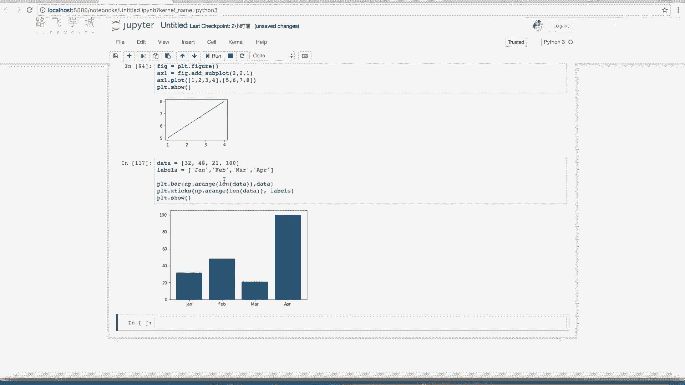

2.  **绘制基础柱状图**：使用`plt.bar()`函数，传入位置和高度数据。
    ```python
    plt.bar(positions, data)
    plt.show()
    ```

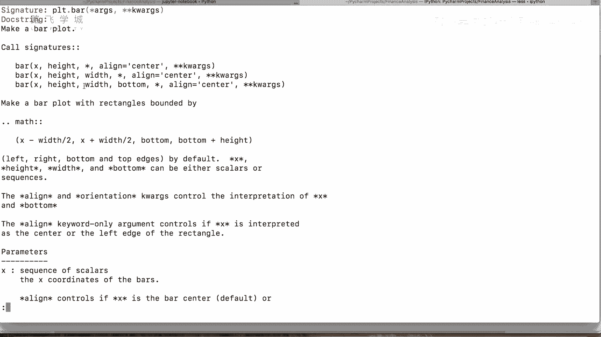

3.  **设置坐标轴标签**：使用`plt.xticks()`函数将X轴刻度标签替换为有意义的分类名称。
    ```python
    plt.bar(positions, data)
    plt.xticks(positions, labels)  # 在指定位置显示指定标签
    plt.show()
    ```

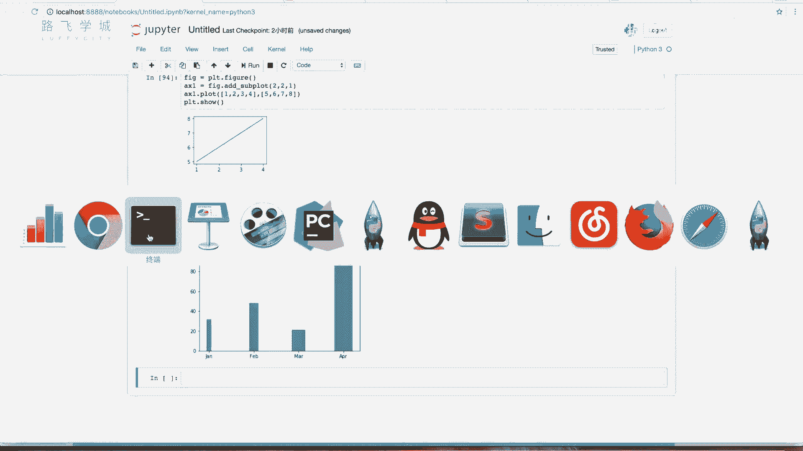

4.  **自定义样式**：`plt.bar()`函数支持许多参数来自定义图表外观。
    *   **颜色 (`color`)**：设置柱子的颜色。
        ```python
        plt.bar(positions, data, color='red')
        ```
    *   **宽度 (`width`)**：设置柱子的宽度，默认值为0.8。
        ```python
        plt.bar(positions, data, width=0.5)
        ```
    *   **对齐方式 (`align`)**：设置柱子相对于刻度线的对齐方式，可选`'center'`（默认，居中）或`'edge'`（靠刻度线边缘）。
        ```python
        plt.bar(positions, data, align='edge')
        ```

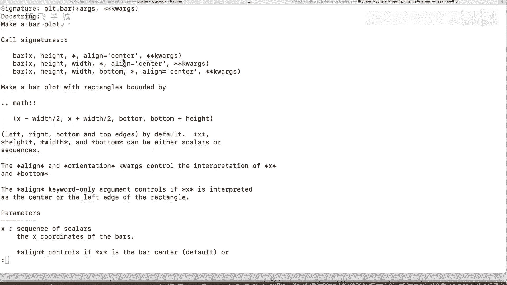

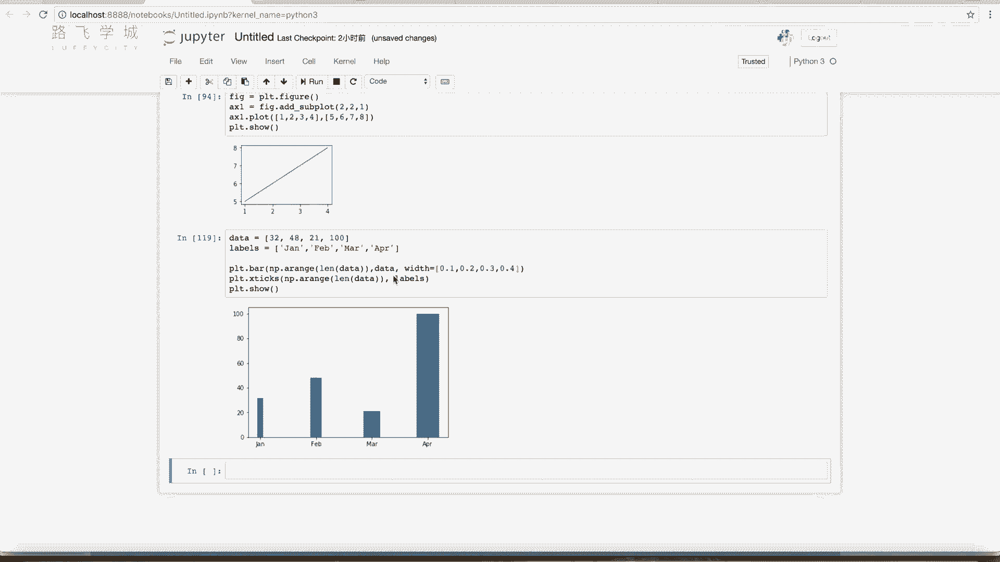

## 绘制饼图

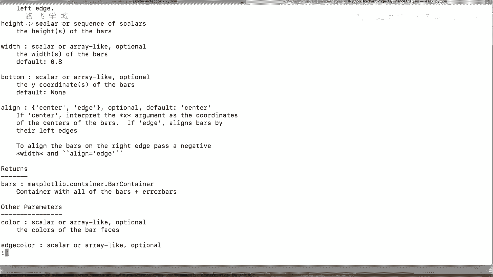

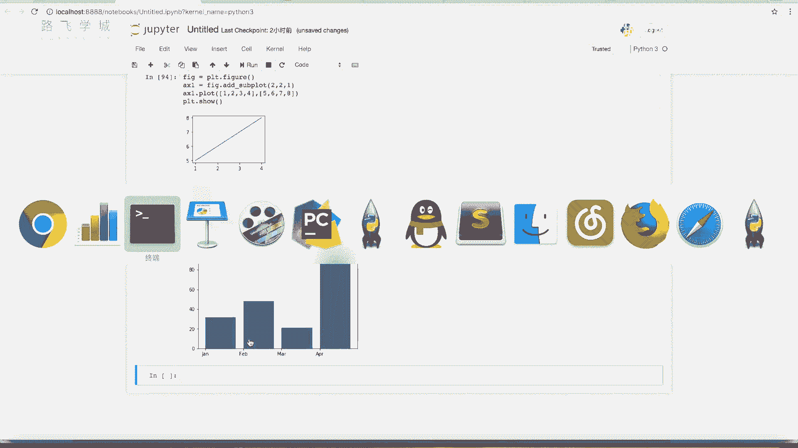

饼图用于显示一个整体中各个组成部分的比例关系。我们使用`plt.pie()`函数来绘制。

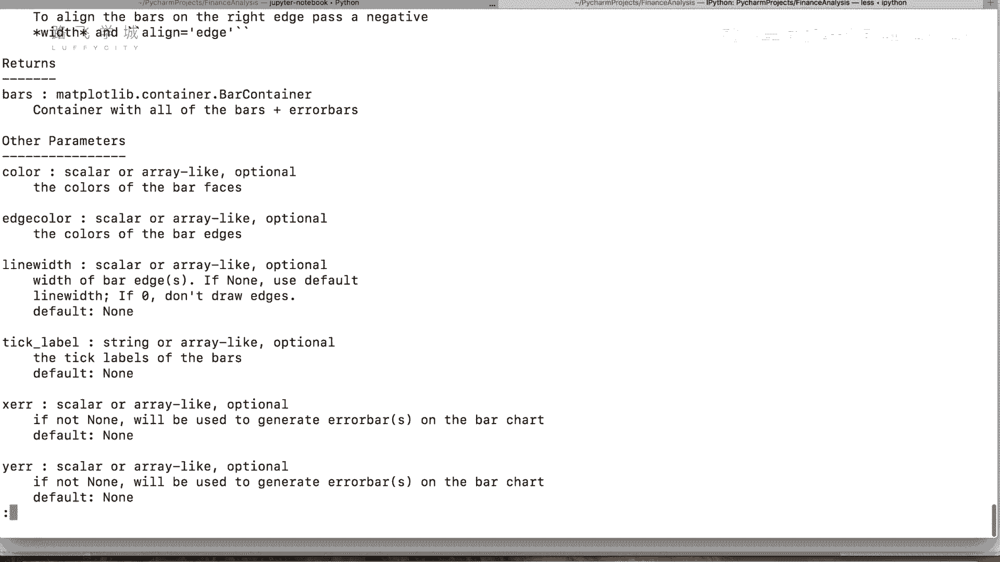

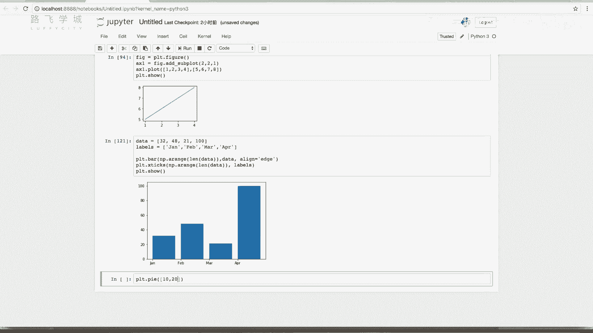

以下是绘制饼图的基本步骤和参数：

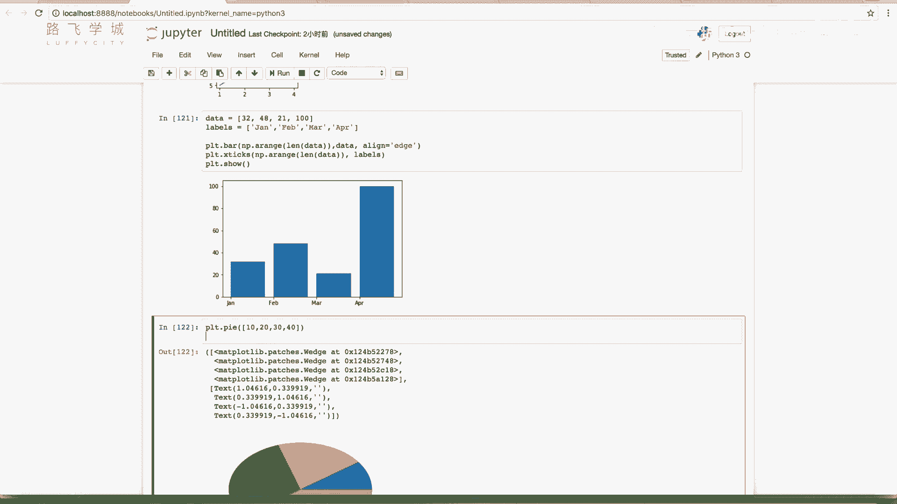

1.  **绘制基础饼图**：传入一个数据列表即可。
    ```python
    sizes = [10, 20, 30, 40]  # 各部分的大小
    plt.pie(sizes)
    plt.show()
    ```

2.  **添加标签**：使用`labels`参数为每个部分添加标签。
    ```python
    labels = ['A', 'B', 'C', 'D']
    plt.pie(sizes, labels=labels)
    plt.show()
    ```

3.  **显示百分比**：使用`autopct`参数在饼图上显示各部分所占的百分比。
    ```python
    # 显示百分比，保留0位小数
    plt.pie(sizes, labels=labels, autopct='%1.0f%%')
    plt.show()
    ```

4.  **突出显示某部分**：使用`explode`参数可以将饼图中的某一块“拉出来”以作强调。
    ```python
    # 将第三部分（索引为2）向外突出0.1个单位
    explode = (0, 0, 0.1, 0)
    plt.pie(sizes, labels=labels, autopct='%1.1f%%', explode=explode)
    plt.show()
    ```

5.  **使饼图正圆**：默认饼图可能呈椭圆形，使用`plt.axis('equal')`可以使其显示为正圆形。
    ```python
    plt.pie(sizes, labels=labels, autopct='%1.1f%%')
    plt.axis('equal')  # 确保饼图是正圆
    plt.show()
    ```

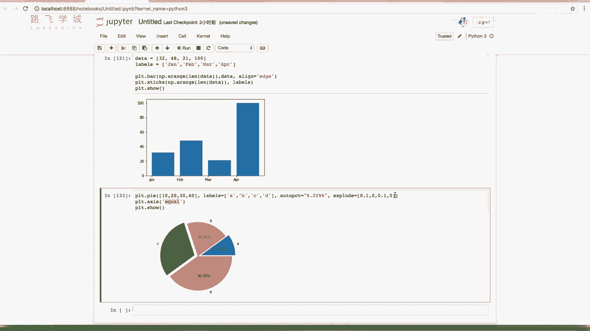

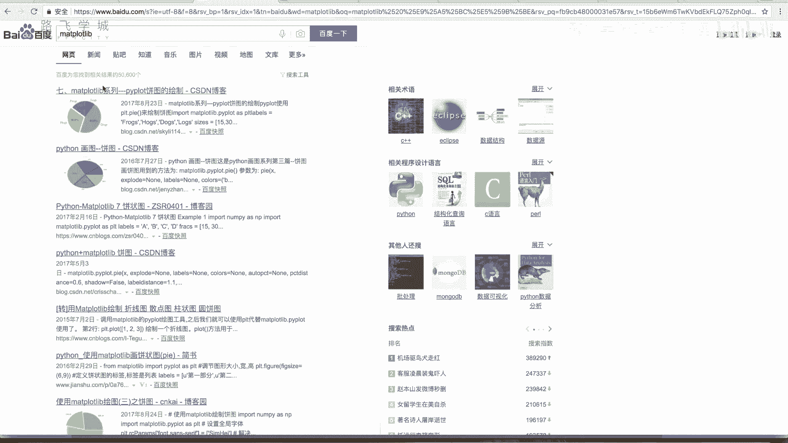

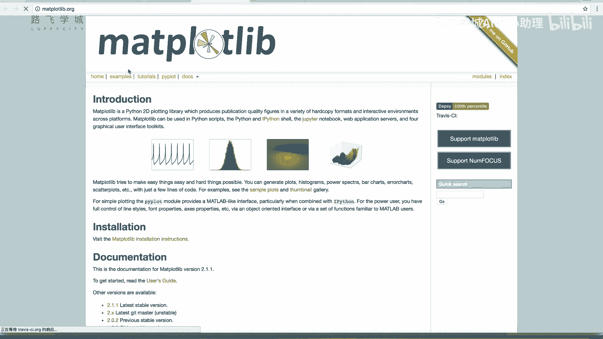

## 总结

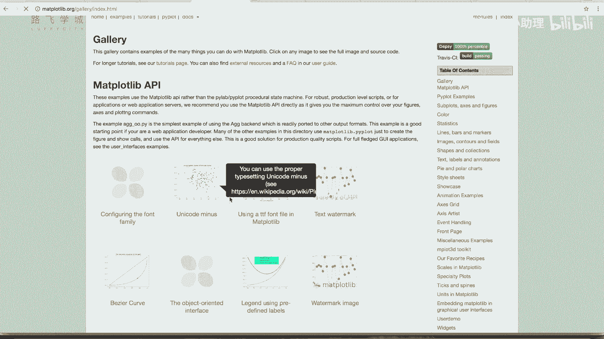

本节课中我们一起学习了Matplotlib中两种重要的图表类型。我们掌握了使用`plt.bar()`函数绘制柱状图，并学会了设置其位置、高度、标签、颜色和宽度。接着，我们学习了使用`plt.pie()`函数绘制饼图，并了解了如何添加标签、显示百分比、突出特定部分以及调整图形形状。虽然Matplotlib功能非常丰富，但掌握这两种基础图表的绘制方法，已经能够满足大部分数据可视化的初步需求。对于更复杂的定制需求，可以参考Matplotlib官方文档中的示例进行深入学习。