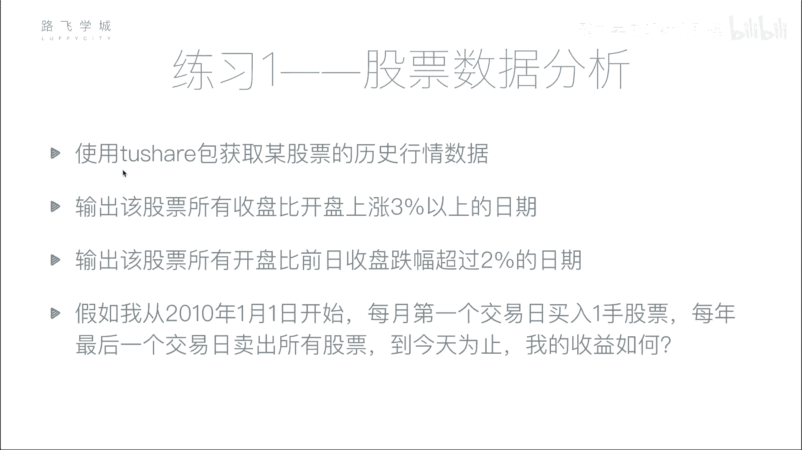
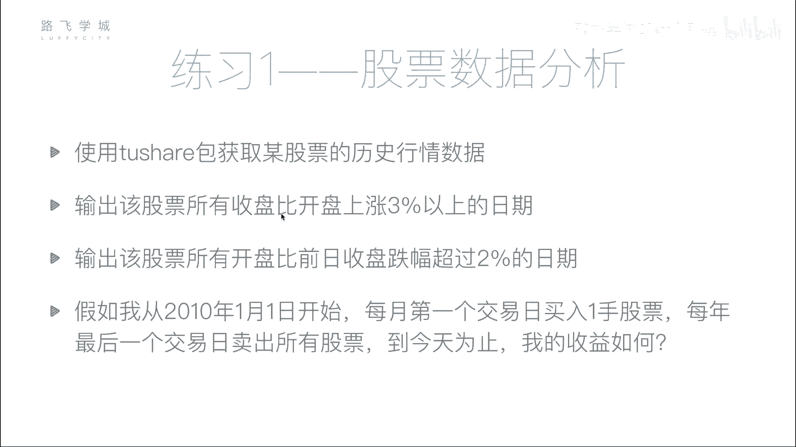
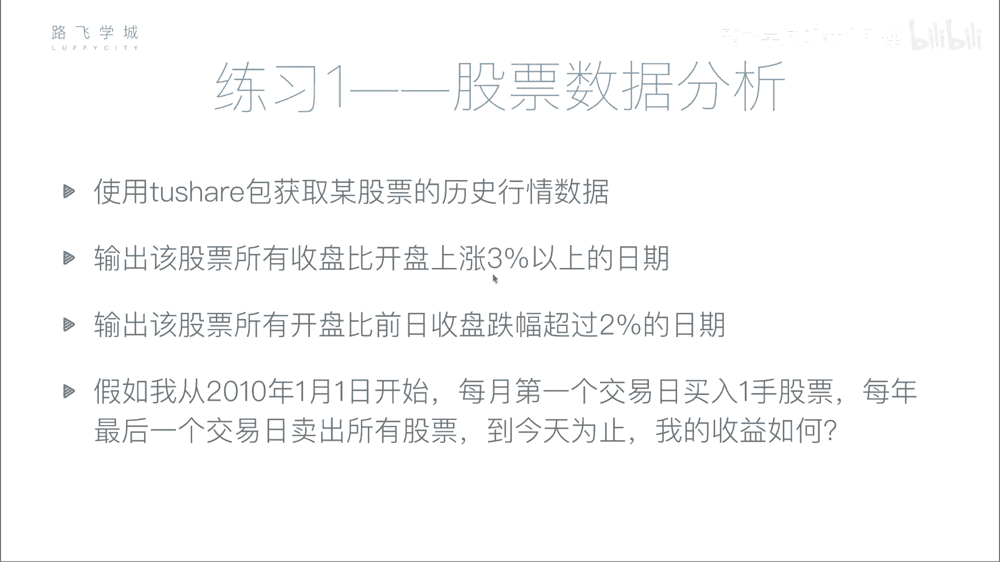
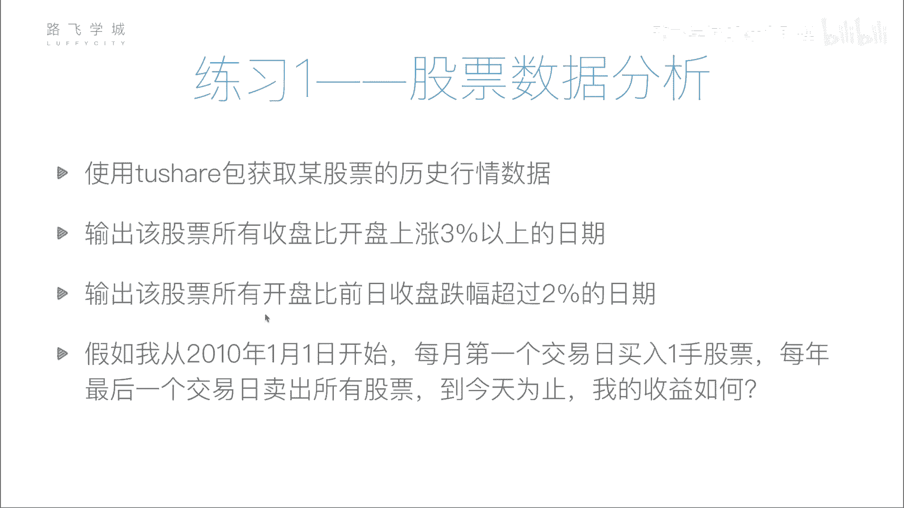
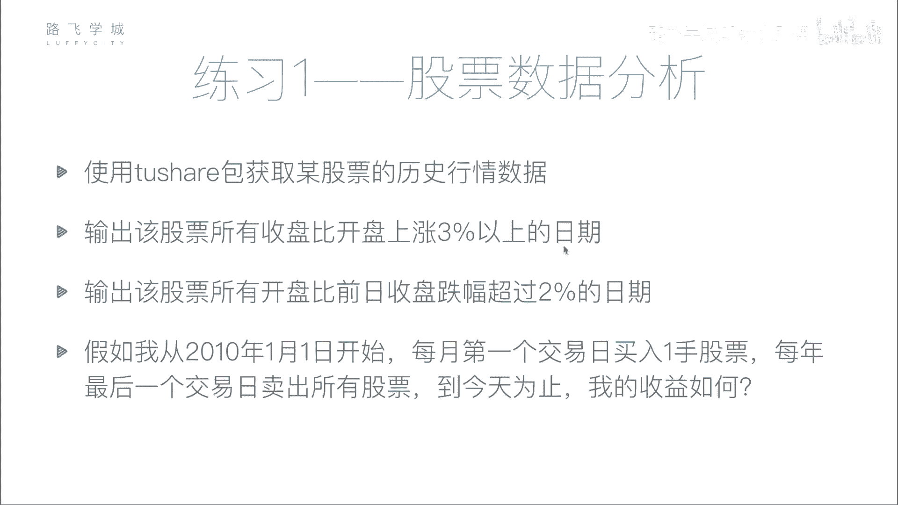
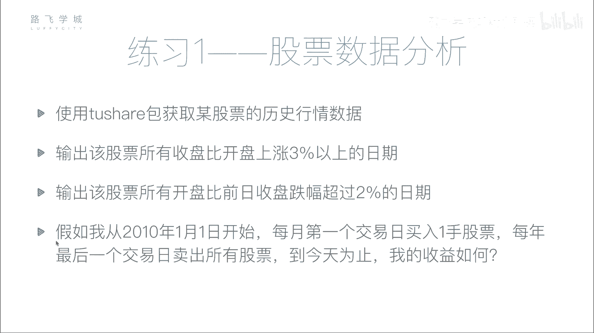
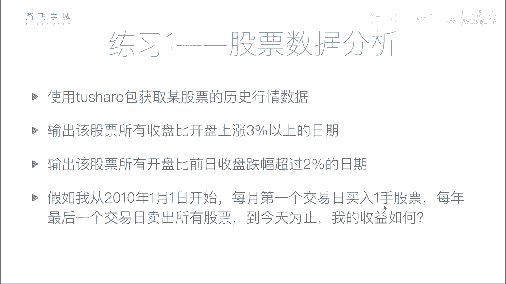

# Python金融量化实战：P36：股票分析作业说明 📈



## 概述
在本节课中，我们将通过一个综合练习来应用之前学到的金融数据分析技能。这个作业将引导你完成从数据获取、基础分析到简单策略模拟的全过程，帮助你巩固对`pandas`数据处理和布尔索引的理解。

---

## 作业任务详解


### 任务一：数据获取与存储
上一节我们介绍了`tushare`包的基本用法，本节中我们来看看如何应用它来获取数据。



首先，你需要使用`tushare`包获取任意一只股票的历史行情数据。数据的时间范围可以自行选择，例如从2008年或2010年开始，直至该股票上市以来的所有数据。获取数据后，请将其保存到一个本地的CSV文件中。这样做的好处是避免每次分析时都重新调用接口，从而提高数据读取效率。



以下是核心步骤的代码示意：
```python
import tushare as ts
# 获取股票数据
df = ts.get_k_data('股票代码', start='2010-01-01')
# 保存到CSV文件
df.to_csv('stock_data.csv', index=False)
```



### 任务二：单日涨幅分析
在获取并存储数据之后，接下来我们进行第一项基础分析：筛选出单日内涨幅较大的交易日。

你需要从数据中找出所有“收盘价比开盘价上涨超过3%”的日期。这属于同一天内的数据比较。完成筛选后，请将这些日期存入一个列表或数组中返回。

以下是实现此功能的核心逻辑：
```python
# 假设df是包含‘open’（开盘）和‘close’（收盘）列的DataFrame
condition = (df['close'] - df['open']) / df['open'] > 0.03
up_dates = df[condition]['date'].tolist()
```



### 任务三：隔夜跌幅分析
完成了单日内的分析，现在我们来处理涉及跨交易日的数据比较。





第三项任务是获取所有“开盘价比前一日收盘价跌幅超过2%”的日期。这需要比较当前交易日的开盘价与前一个交易日的收盘价。这里会用到`pandas`的`shift()`函数来移动数据列，以便进行错位比较。

以下是实现此功能的核心逻辑：
```python
# 计算隔夜涨跌幅
overnight_change = (df['open'] - df['close'].shift(1)) / df['close'].shift(1)
# 筛选跌幅超过2%的日期
condition = overnight_change < -0.02
down_dates = df[condition]['date'].tolist()
```

### 任务四：简单定投策略模拟
前面三问都是基础的数据筛选，最后我们将进行一个简单的投资策略模拟，将分析结果应用到实际场景中。

假设我们从2010年1月1日开始，执行以下策略：
1.  在每年每个月的第一个交易日，买入一手（100股）该股票。
2.  在每年的最后一个交易日，卖出当年累积持有的所有该股票。

你需要计算，从策略开始执行到某个特定日期（例如你进行分析的当天，或指定为2017年12月某日），这个策略是盈利还是亏损，具体赚了或赔了多少钱。

**收益计算说明：**
-   初始假定你拥有充足的现金（例如1亿元）。
-   最终的总资产 = 剩余现金 + 持有股票的总市值（股票数量 × 计算当日的股票价格，可用开盘价近似）。
-   总收益 = 最终总资产 - 初始现金。

这个策略本身没有复杂的金融依据，仅用于练习数据处理和简单的资金流计算。

---

## 总结
本节课我们一起完成了一个完整的股票分析小作业。我们实践了使用`tushare`获取并存储数据，运用布尔索引筛选满足特定涨跌幅条件的日期，并通过`shift()`函数进行跨期数据比较，最后模拟了一个简单的月度定投年度清仓策略来计算收益。请尝试独立完成以上练习，完成后可以观看下一个视频查看参考答案和讲解。