# Python金融量化：P37：股票分析作业 📈

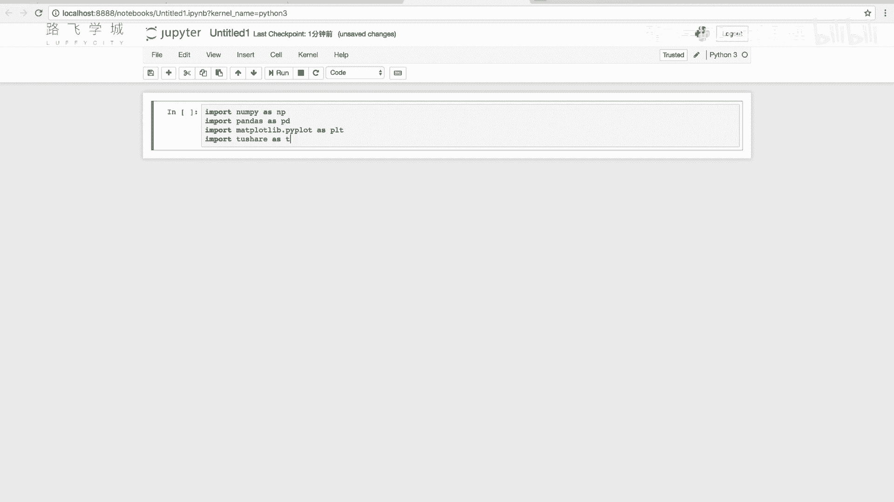

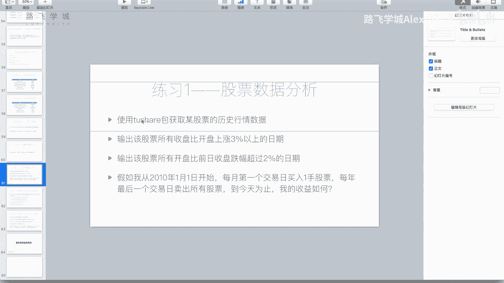

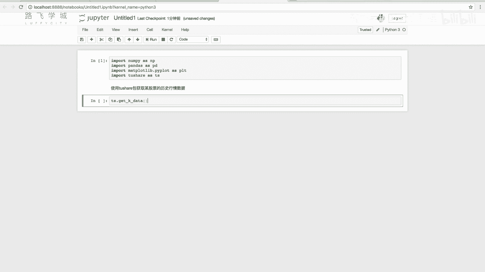

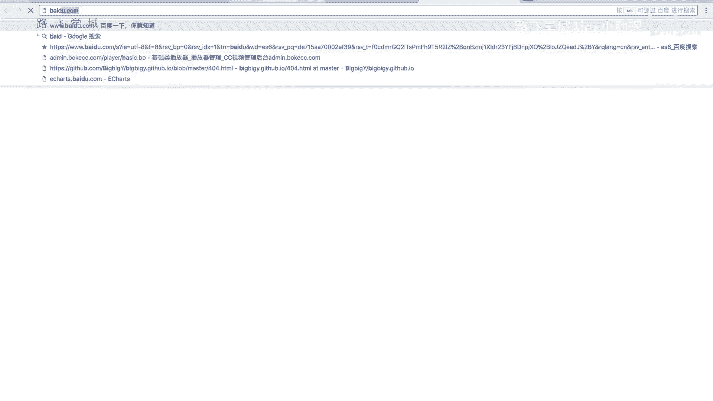

在本节课中，我们将学习如何利用Python进行股票数据分析，完成一个包含数据获取、条件筛选和简单交易策略模拟的综合练习。我们将使用`tushare`获取数据，`pandas`进行数据处理，并通过编写代码解决三个具体问题。

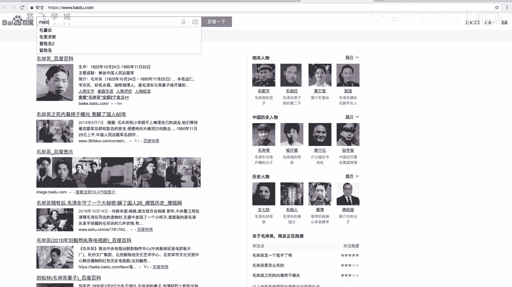

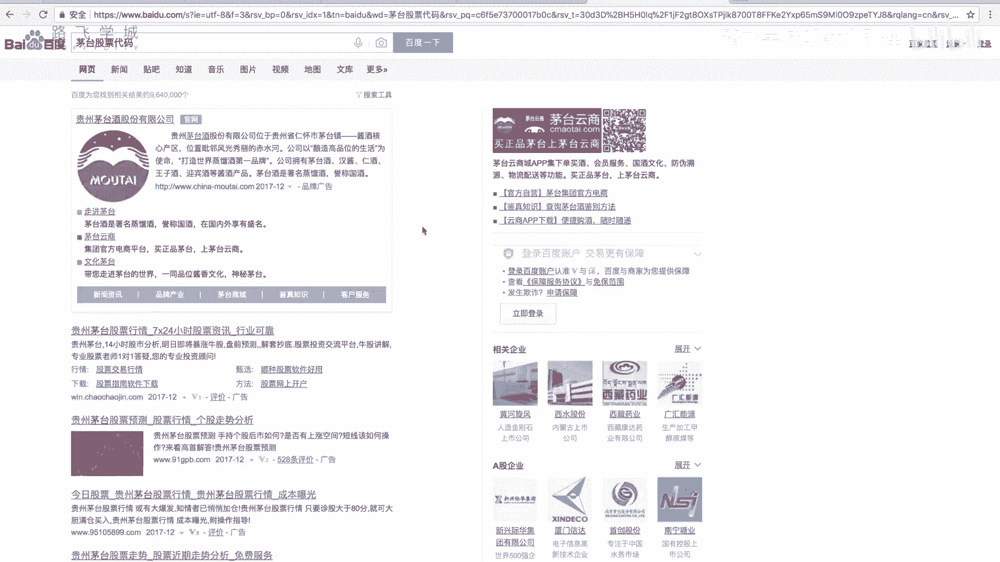

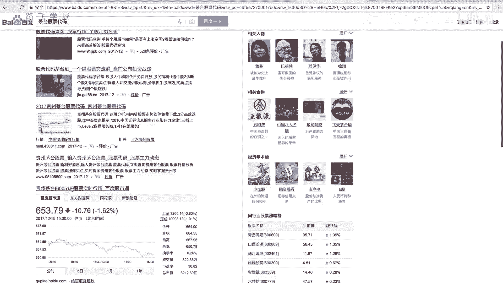

---

## 第一步：导入必要的库 📦

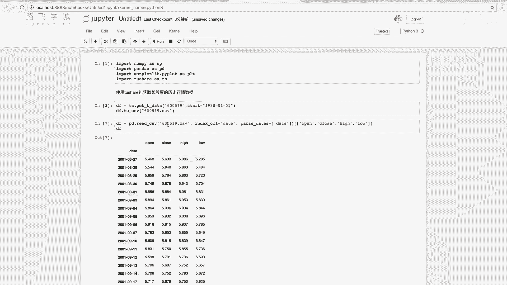

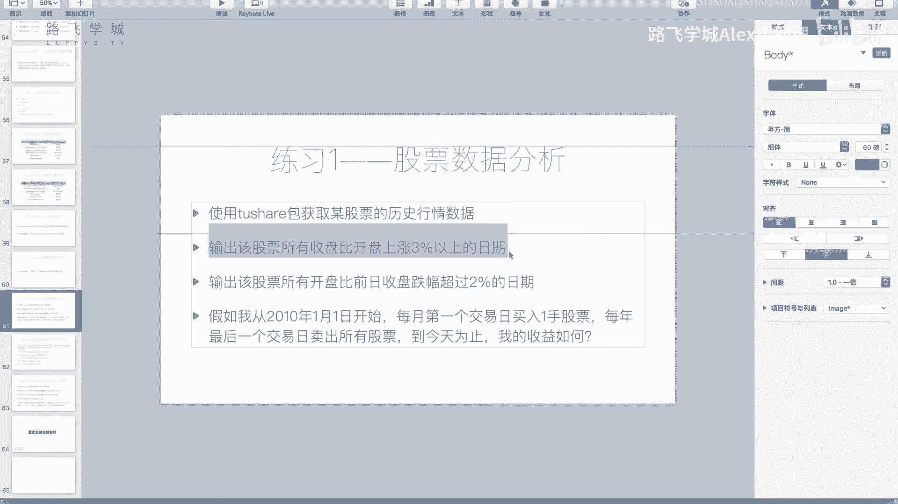

首先，我们需要导入后续分析中将要用到的所有Python库。

```python
import pandas as pd
import numpy as np
import tushare as ts
import matplotlib.pyplot as plt
```

---

## 第二步：获取并保存股票历史数据 📊

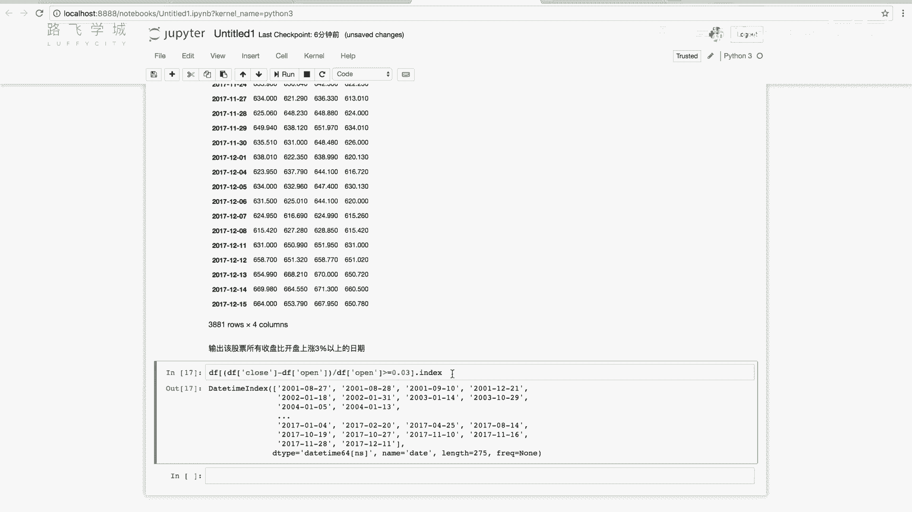

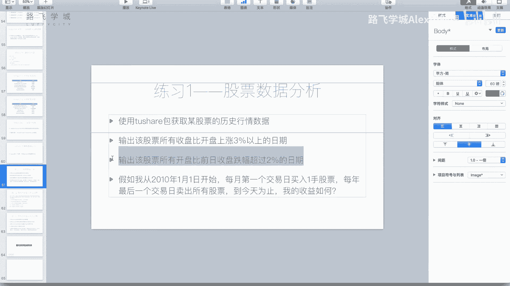

我们的第一个任务是获取某只股票的历史行情数据。这里我们以贵州茅台（股票代码：600519）为例。

```python
# 获取贵州茅台从2001年至今的历史行情数据
df = ts.get_k_data('600519', start='2001-01-01')
# 将数据保存到CSV文件，方便后续直接读取
df.to_csv('600519.csv', index=False)
```

获取数据后，我们将其从本地文件重新读取，并进行初步处理，只保留开盘价、最高价、最低价和收盘价这几列核心数据。

```python
# 从CSV文件读取数据，并将‘date’列设置为索引
df = pd.read_csv('600519.csv', index_col='date', parse_dates=['date'])
# 只保留‘open’, ‘high’, ‘low’, ‘close’四列
df = df[['open', 'high', 'low', 'close']]
```

---

## 第三步：筛选特定条件的交易日 📅

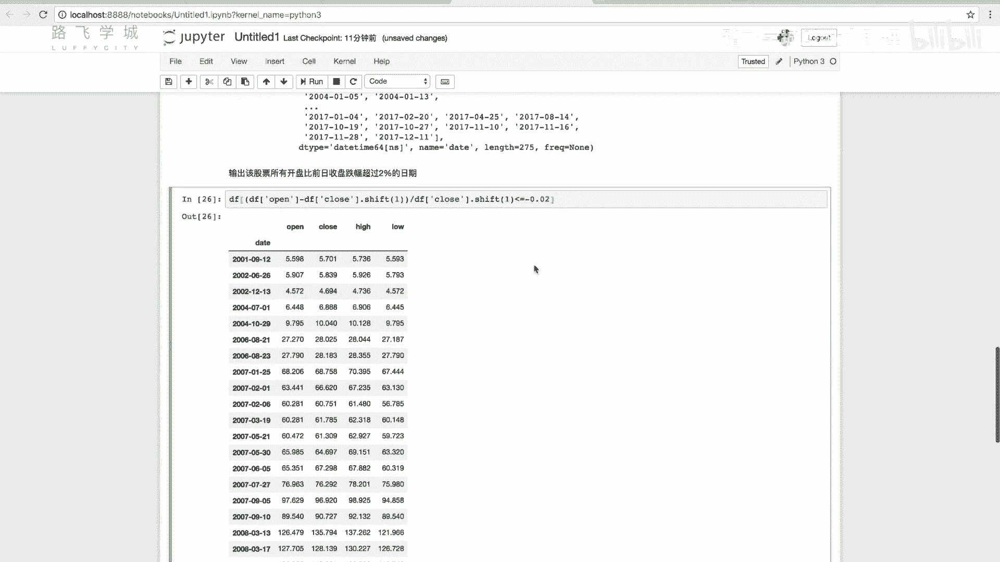

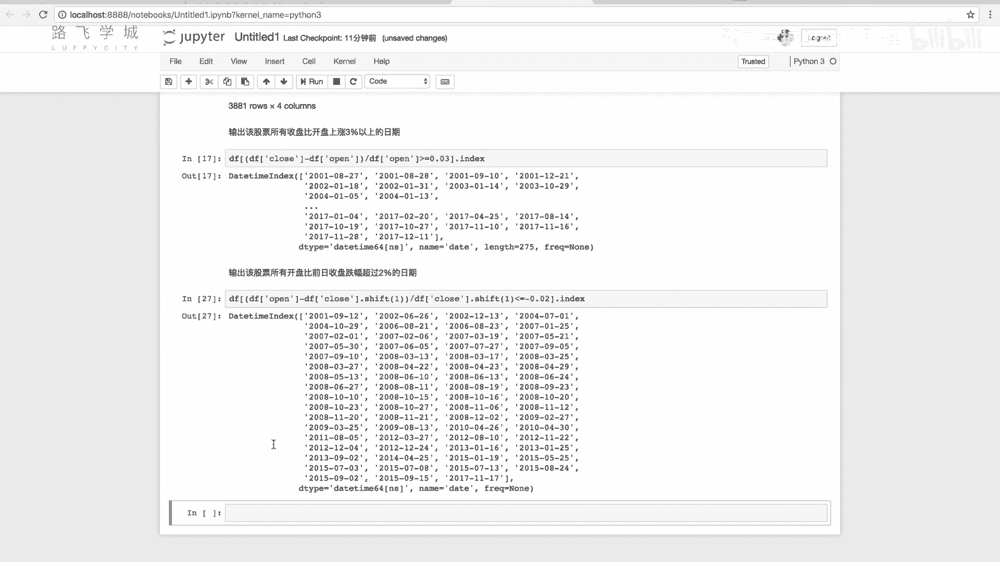

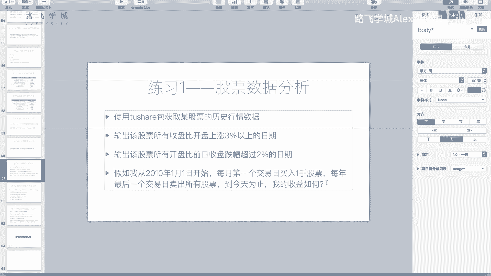

上一节我们准备好了数据，本节中我们来看看如何根据特定条件筛选交易日。

### 问题一：收盘价较开盘价上涨超过3%的日期

以下是计算上涨率并筛选日期的步骤：

1.  计算每日的上涨率，公式为：`(收盘价 - 开盘价) / 开盘价`。
2.  使用布尔索引筛选出上涨率大于等于3%的日期。

```python
# 计算上涨率并筛选
rise_condition = (df['close'] - df['open']) / df['open'] >= 0.03
rise_dates = df[rise_condition].index
print(rise_dates)
```

### 问题二：开盘价较前一日收盘价跌幅超过2%的日期

这个问题需要比较当前交易日的开盘价与前一个交易日的收盘价。我们使用`shift()`函数将收盘价向下移动一行，使其与下一行的开盘价对齐。

```python
# 计算跌幅并筛选
# shift(1)将‘close’列的值向下移动一行，与下一行的‘open’对齐
prev_close = df['close'].shift(1)
fall_condition = (df['open'] - prev_close) / prev_close <= -0.02
fall_dates = df[fall_condition].index
print(fall_dates)
```

---

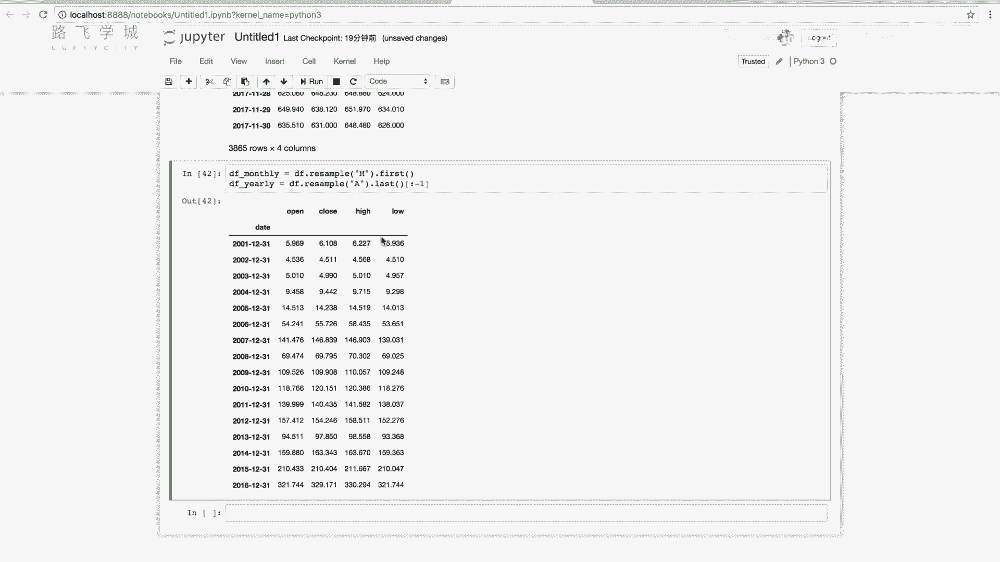

## 第四步：模拟一个简单的交易策略 💹

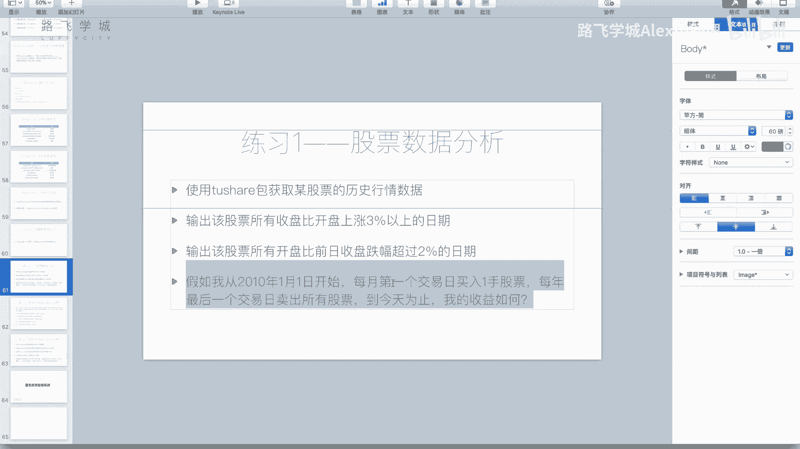

在完成了基础的条件筛选后，本节我们将模拟一个更复杂的场景：一个定期买卖的简单交易策略，并计算其收益。

**策略规则**：从2010年1月1日开始，每月第一个交易日买入一手（100股），每年最后一个交易日卖出所有持仓。计算至今的总收益。

实现这个策略需要以下几个步骤：

1.  **数据准备**：获取每月第一个交易日和每年最后一个交易日的股价数据。
2.  **模拟交易**：循环每一年，执行“按月买入，按年卖出”的操作。
3.  **计算收益**：考虑最终持仓，计算总盈亏。

以下是核心代码实现：

```python
# 1. 准备数据：剔除首尾不完整的月份和年份
df = df['2010':'2017']  # 选取2010年至2017年的数据

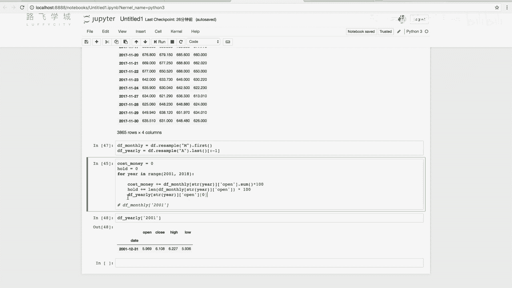

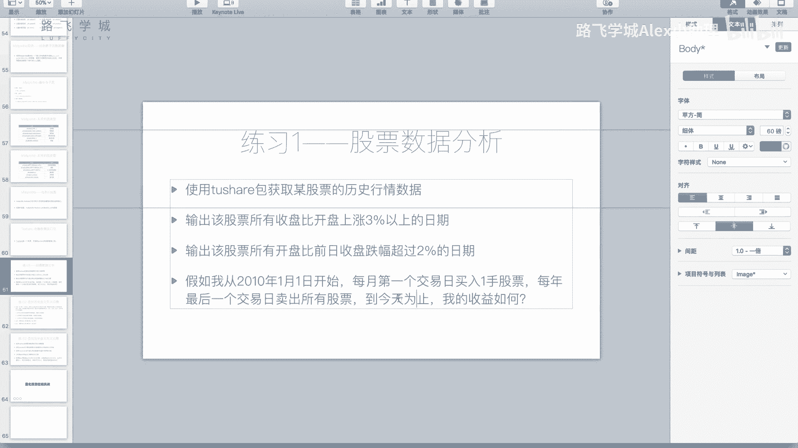

# 获取每月第一个交易日的开盘价数据
df_monthly = df.resample('MS').first()['open']
# 获取每年最后一个交易日的开盘价数据，并剔除最后一年（2017年）
df_yearly = df.resample('A').last()['open'][:-1]

# 2. 初始化变量
cost_money = 0  # 总现金支出（负值代表净收入）
hold_stock = 0  # 持有股票总数（股）

# 3. 模拟交易过程
for year in range(2010, 2018):
    # 每年买入：获取该年所有月度首个交易日的开盘价
    monthly_prices = df_monthly[str(year)]
    # 计算该年买入股票的总花费和总股数
    cost_money -= (monthly_prices * 100).sum()
    hold_stock += len(monthly_prices) * 100

    # 每年卖出：如果不是最后一年（2017），则在年末卖出全部持仓
    if year != 2017:
        sell_price = df_yearly[str(year)].iloc[0]  # 获取该年末交易日的开盘价
        cost_money += sell_price * hold_stock  # 卖出获得现金
        hold_stock = 0  # 清空持仓

# 4. 计算最终收益（考虑2017年末的持仓价值）
last_price = df['open'].iloc[-1]  # 数据集中最后一个交易日的开盘价
final_value = hold_stock * last_price  # 最终持仓市值
profit = cost_money + final_value  # 总收益 = 现金变化 + 最终持仓市值

print(f"该策略的总收益为：{profit:.2f} 元")
```

**代码逻辑解释**：
*   `cost_money`记录现金流水，买入时减去金额，卖出时加上金额。
*   `hold_stock`记录累计持股数量。
*   循环中，每年先执行12次（或实际交易次数）买入。
*   每年末（除了最后一年）执行一次卖出，清空持仓。
*   循环结束后，计算剩余持仓在最新日期的价值，并计入总收益。

---

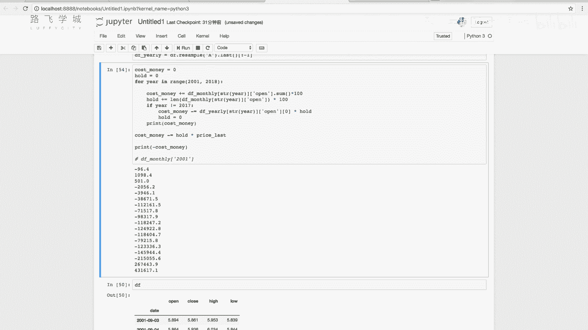

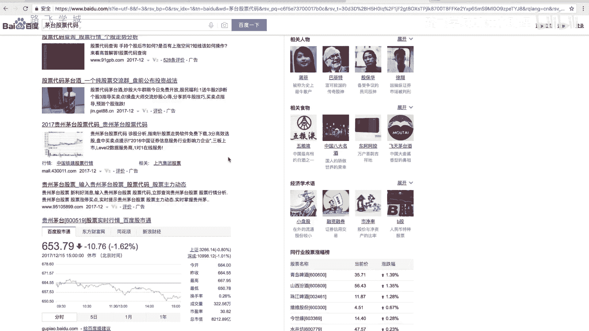

## 总结 📝

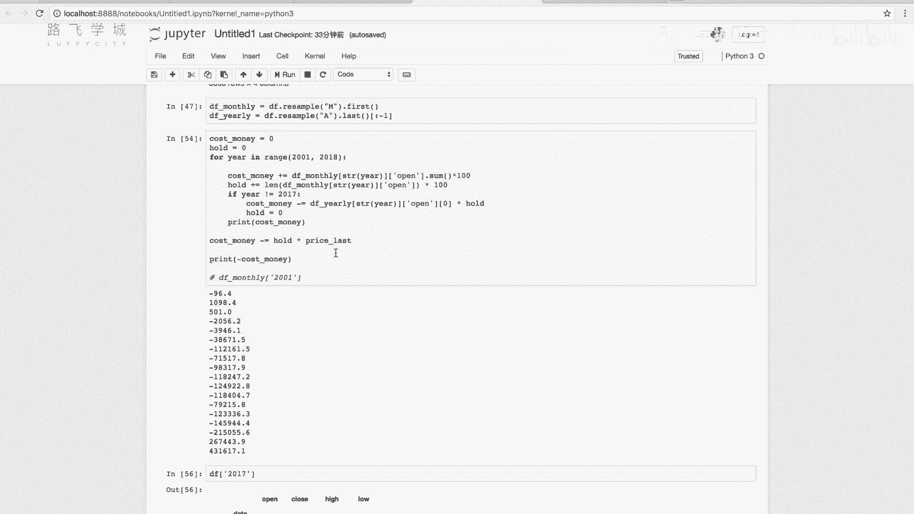

本节课我们一起学习了股票数据分析的完整流程：
1.  **数据获取与清洗**：使用`tushare`获取数据，并用`pandas`进行清洗和格式化。
2.  **条件筛选**：利用布尔索引和`shift()`函数，筛选出满足特定价格变动条件的交易日。
3.  **策略回测**：通过模拟“按月定投、按年清仓”的交易策略，计算了其在历史数据上的收益。

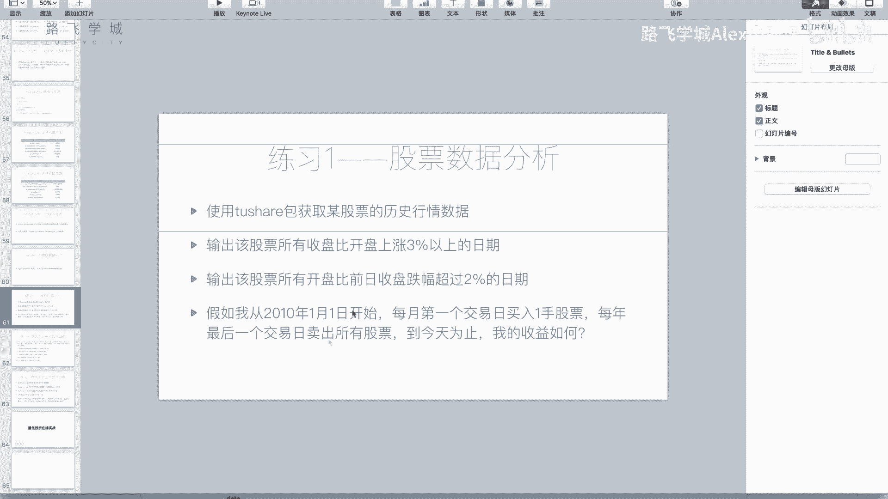

这个练习涵盖了金融数据分析的常见操作，是构建更复杂量化交易策略的基础。在下一个练习中，我们将接触“双均线策略”，学习如何利用技术指标进行交易决策。