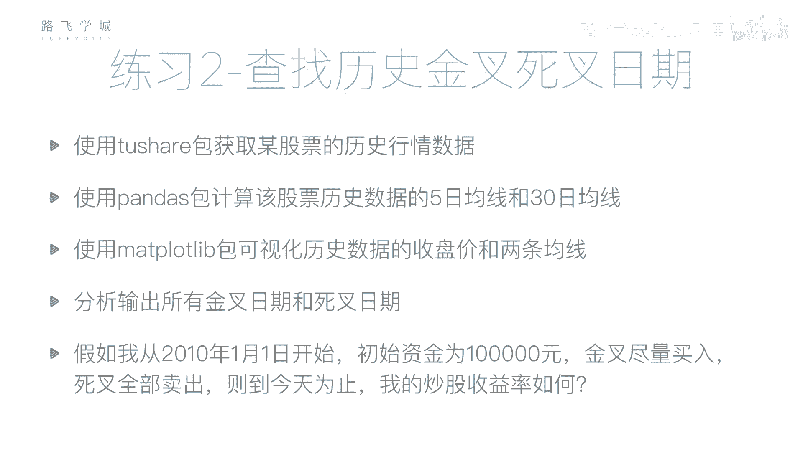
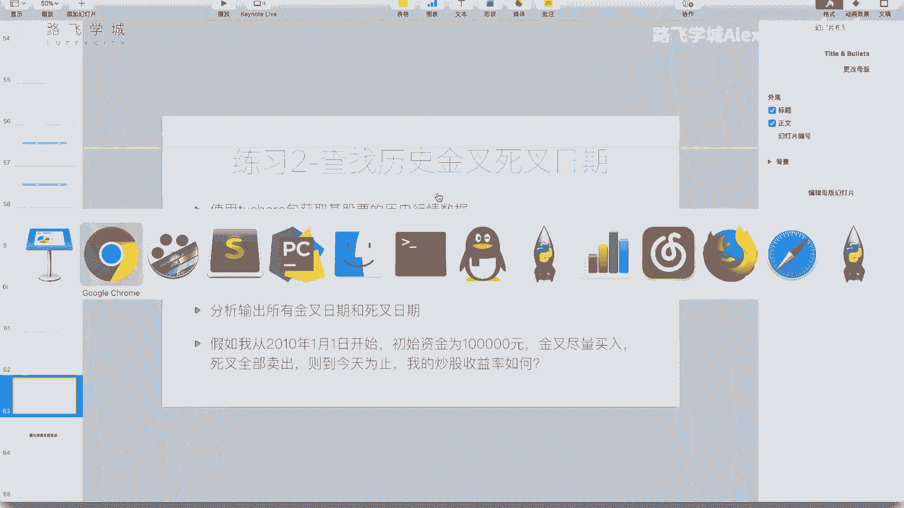
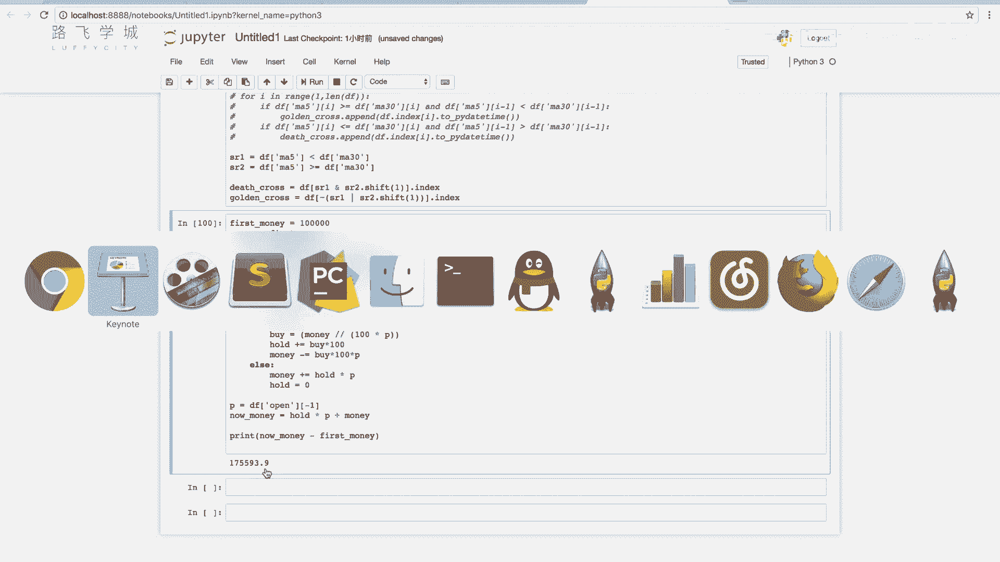
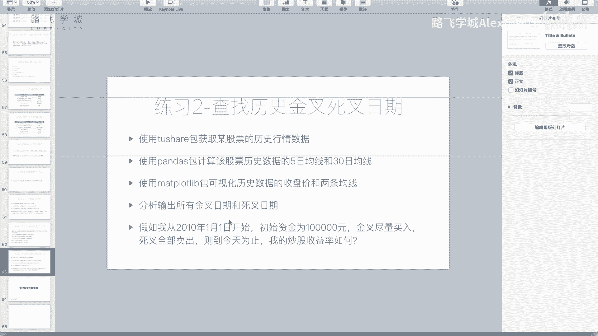
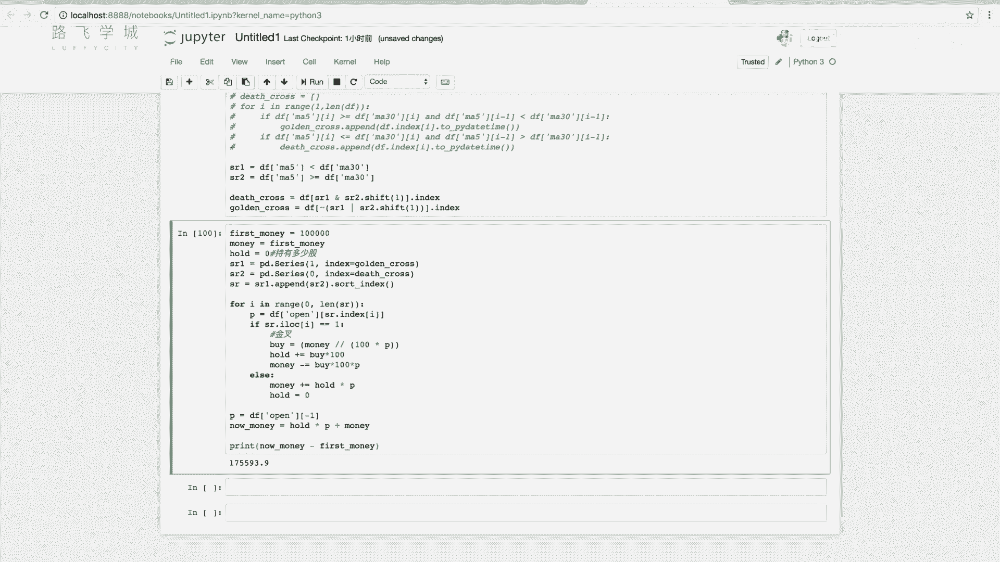
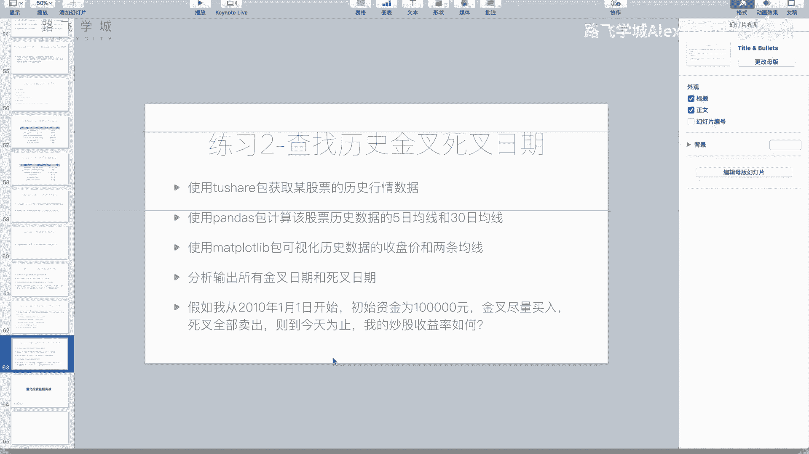

# Python金融量化：P39：双均线分析作业2





在本节课中，我们将完成双均线策略的第二个练习，即模拟使用该策略进行股票交易的收益率。我们将从2010年1月1日开始，假设初始资金为10万元，根据计算出的金叉和死叉信号进行买入和卖出操作，并最终计算总收益。

---

## 数据准备与信号筛选

上一节我们计算了金叉和死叉信号。本节中，我们首先需要筛选出2010年1月1日之后的数据，因为我们的模拟交易将从此时开始。

具体操作是修改生成信号`DataFrame`的代码，在计算金叉和死叉之后，对`df`进行切片，只保留2010年1月1日及之后的数据。

```python
# 假设df是包含股价和均线的原始DataFrame
# 计算金叉和死叉信号后...
df = df['2010-01-01':]  # 筛选指定日期之后的数据
```

运行后，再次查看死叉列表，其起始日期应为2010年4月29日，这确认了数据筛选成功。

---

## 整合交易信号

目前，金叉和死叉信号分别存储在两个列表中。为了便于在时间线上顺序处理买卖操作，我们需要将它们整合到一个按时间排序的序列中。

以下是整合信号的思路：
1.  创建两个`pandas.Series`对象，一个代表金叉（值设为1），一个代表死叉（值设为0）。
2.  将两个`Series`合并，并按时间索引进行排序。

```python
import pandas as pd

# 假设 golden_cross 和 death_cross 是包含日期索引的列表或数组
sr1 = pd.Series(1, index=golden_cross)  # 金叉标记为1
sr2 = pd.Series(0, index=death_cross)   # 死叉标记为0

# 合并并排序
sr = sr1.append(sr2).sort_index()
```

现在，`sr`是一个按时间顺序排列的序列，其中值为1代表买入信号（金叉），值为0代表卖出信号（死叉）。

---

## 模拟交易过程

有了排序好的信号序列，我们就可以开始模拟交易过程了。我们将遍历这个序列，根据信号执行买入或卖出操作，并动态更新现金和持股数量。

以下是模拟交易的核心逻辑步骤：

1.  **初始化参数**：设置初始资金`first_money`和持股数量`hold`。
2.  **遍历信号**：对每个信号日期，获取当天的开盘价。
3.  **执行买入**：若信号为1（金叉），计算可买入的手数（1手=100股），更新持股数量和剩余现金。
4.  **执行卖出**：若信号为0（死叉），卖出全部持股，将所得现金加回总资金，并将持股数量清零。
5.  **计算最终资产**：循环结束后，将剩余股票按最后一天的开盘价折算成现金，与账户现金相加，得到总资产。

```python
first_money = 100000  # 初始资金10万元
money = first_money   # 当前可用现金
hold = 0              # 当前持有股数

for i in range(len(sr)):
    date = sr.index[i]  # 当前信号日期
    signal = sr.iloc[i] # 当前信号值 (1或0)
    price = df.loc[date, 'open']  # 获取该日开盘价

    if signal == 1:  # 金叉，买入
        # 计算能买多少手（向下取整）
        buy_lots = int(money // (price * 100))
        if buy_lots > 0:
            hold += buy_lots * 100  # 更新持股数
            money -= buy_lots * 100 * price  # 更新现金
    else:  # 死叉，卖出
        if hold > 0:
            money += hold * price  # 卖出股票，获得现金
            hold = 0  # 持股清零

# 计算最终总资产：现金 + 持股按最后一天开盘价折算的价值
final_price = df['open'].iloc[-1]
total_asset = money + hold * final_price

profit = total_asset - first_money
print(f"最终总资产：{total_asset:.2f} 元")
print(f"总盈利：{profit:.2f} 元")
```

运行代码后，我们得到了模拟交易的盈利结果。在本例的历史数据回测中，该策略在数年内取得了可观的收益。

---

## 策略的思考与优化

在完成模拟后，我们需要回顾整个策略的逻辑，思考其在实际应用中的合理性。这里发现了一个关键点：我们使用**收盘价**来计算均线和金叉/死叉信号，但在实际交易中，我们在交易日开盘时（例如09:30）就需要做出决策，此时只能获取到**开盘价**。

因此，更符合实际的回测应该使用开盘价来计算信号。只需将计算均线和信号的代码中的`close`价格替换为`open`价格，然后重新运行整个流程。

```python
# 更符合实际的逻辑：使用开盘价计算移动均线和交易信号
df['ma5'] = df['open'].rolling(window=5).mean()
df['ma30'] = df['open'].rolling(window=30).mean()
# ... 后续计算金叉死叉的逻辑不变
```



重新运行后，收益率可能会发生变化。这说明模型的假设条件（使用未来信息——收盘价）对回测结果有显著影响。严谨的回测应尽量避免使用未来数据，以更真实地评估策略的有效性。

---



## 总结与展望

本节课中我们一起学习了如何实现一个完整的双均线策略回测：
1.  **筛选数据**：确定了模拟交易的时间起点。
2.  **整合信号**：将金叉和死叉信号合并为按时间排序的交易指令序列。
3.  **模拟交易**：通过遍历信号序列，模拟了真实的买入、卖出及资产计算过程。
4.  **反思优化**：指出了使用收盘价可能引入“未来函数”的问题，并提出了使用开盘价进行更合理回测的方法。



这个练习模拟了金融或基金公司中量化分析员的基础工作：将投资策略转化为代码，并用历史数据检验其收益。对于个人投资者而言，手动实现这些步骤较为复杂。幸运的是，目前存在许多成熟的量化交易平台（如JoinQuant、RiceQuant等），它们提供了更便捷的策略编写和回测框架。



在接下来的课程中，我们将介绍如何利用这些在线平台，快速构建并测试自己的交易策略。