# Python金融量化：P4：04 Python基础知识（二）


在本节课中，我们将要学习Python编程中的核心控制流结构，包括条件语句、循环语句、函数的声明与调用，以及模块的导入。掌握这些知识是编写自动化、高效量化分析程序的基础。

## 条件语句

上一节我们介绍了Python的基本数据类型和操作，本节中我们来看看如何让程序根据不同的条件做出决策，这需要使用条件语句。

Python的条件语句与Excel中的`IF`函数逻辑相似。其基本结构如下：
```python
if condition1:
    # 如果条件1为真，则执行这里的代码
    do_something()
elif condition2:
    # 如果条件1为假，但条件2为真，则执行这里的代码
    do_something_else()
else:
    # 如果以上条件均为假，则执行这里的代码
    do_another_thing()
```
**核心要点**：
*   每个`if`、`elif`、`else`关键字后面都必须有一个冒号`:`。
*   冒号下方的代码块必须进行缩进（通常使用4个空格或一个Tab键）。缩进是Python定义代码块的方式，错误的缩进会导致语法错误。

以下是条件语句的一个简单示例：
```python
x = 10
if x > 5:
    print("这个数很大")
else:
    print("这个数太小")
```
程序会判断变量`x`是否大于5，并打印相应的结果。

我们可以结合`input()`函数让程序与用户交互。`input()`函数会暂停程序，等待用户在命令行输入内容，并将输入的内容作为字符串返回。
```python
# 获取用户输入，并转换为浮点数
user_input = input("请输入一个数字: ")
x = float(user_input)

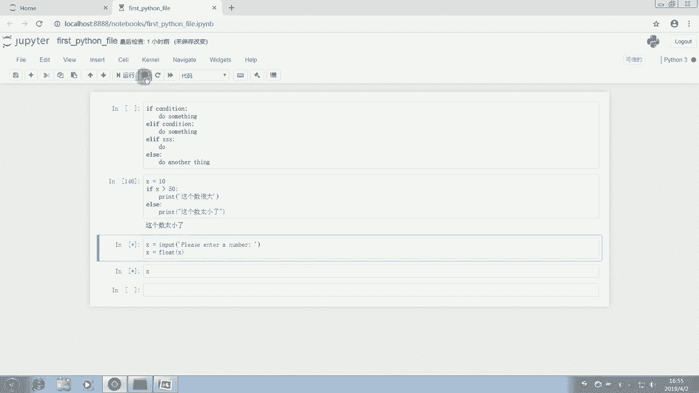

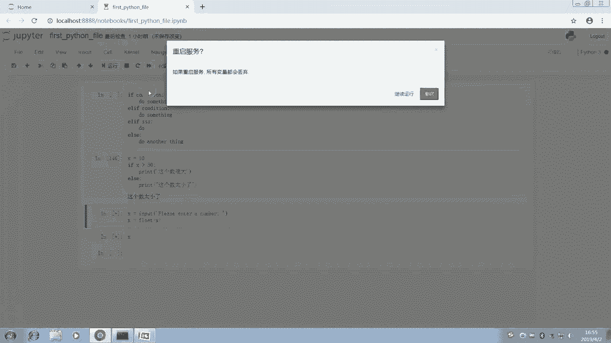

if x < 15:
    print("你是一个孩子")
elif x < 25:
    print("你是一个青年")
elif x < 40:
    print("你是一个中年人")
else:
    print("你是一位老年人")
```
运行这段代码，程序会根据用户输入的年龄给出不同的分类。

## 循环语句

条件语句让程序有了分支能力，而循环语句则能让程序重复执行特定的任务。Python主要有两种循环：`for`循环和`while`循环。

### for循环

`for`循环通常用于对序列（如列表、元组、字符串）或可迭代对象中的每个元素执行相同的操作。它是一种**有限循环**，循环次数在开始时就已确定。

`for`循环的基本语法是：
```python
for item in iterable:
    # 对每个item执行操作
    do_something_with(item)
```
其中，`item`是临时变量，在每次循环中代表可迭代对象`iterable`里的一个元素。

以下是`for`循环的一个应用实例：连续让用户输入10个数字，计算它们的总和与平均值。
```python
number_list = []  # 创建一个空列表，用于存储输入的数字
total = 0         # 初始化总和为0

# range(10) 生成一个从0到9的整数序列，循环将执行10次
for i in range(10):
    user_input = input(f"请输入第 {i+1} 个数字: ")
    num = float(user_input)      # 将输入转换为浮点数
    number_list.append(num)      # 将数字添加到列表末尾
    total = total + num          # 累加数字到总和

# 循环结束后，计算并打印结果
average = total / len(number_list)
print(f"所有数字之和为: {total}")
print(f"所有数字的平均值为: {average}")
```
这段代码演示了如何用`for`循环收集数据、进行累加计算，并在循环结束后输出最终结果。

`for`循环同样可以遍历字典。以下是遍历字典键值对的例子：
```python
stock_prices = {'贵州茅台': 840, '中国平安': 78, '中信证券': 16}

# 遍历字典的键
for stock_name in stock_prices.keys():
    print(stock_name)

# 遍历字典的键值对
for stock_name, price in stock_prices.items():
    print(f"{stock_name} 的价格是 {price} 元")
```

### while循环

`while`循环会在条件为真时，**不停地**执行循环体内的代码。它是一种**条件循环**，如果条件永远为真，则会形成无限循环，使用时需特别注意设置退出条件。

`while`循环的基本语法是：
```python
while condition:
    # 只要条件为真，就重复执行这里的代码
    do_something()
```
以下是一个使用`while`循环改进上述输入数字计算的例子：允许用户输入任意多个数字，直到输入“done”为止。
```python
number_list = []
total = 0

while True:  # 条件永远为真，循环将无限进行
    user_input = input("请输入一个数字 (输入 'done' 结束): ")

    if user_input.lower() == 'done':  # 检查退出条件
        break  # break语句会立即终止当前循环

    num = float(user_input)
    number_list.append(num)
    total = total + num

# 循环结束后计算平均值
if len(number_list) > 0:  # 避免除零错误
    average = total / len(number_list)
    print(f"所有数字之和为: {total}")
    print(f"所有数字的平均值为: {average}")
else:
    print("未输入任何数字。")
```
在这个例子中，`while True:`创建了一个无限循环。我们通过`if`语句检查用户输入，当输入为“done”时，使用`break`语句跳出循环，从而安全地结束程序。

## 函数的声明与调用

当一段代码需要重复使用时，我们可以将其封装成**函数**。函数可以接收输入（参数），执行特定操作，并返回结果。

### 定义函数

在Python中，使用`def`关键字来定义函数。
```python
def function_name(parameters):
    """可选的文档字符串，描述函数功能"""
    # 函数体
    do_something
    return result  # 可选的返回语句
```
例如，定义一个简单的打招呼函数：
```python
def greet(name):
    """向指定名字的人问好"""
    message = f"Hello, {name}!"
    return message

# 调用函数
greeting = greet("雷锋")
print(greeting)  # 输出: Hello, 雷锋!
```
函数可以没有参数，也可以没有返回值（默认返回`None`）。返回值可以是任何数据类型，如数字、字符串、列表、字典等。

### 将函数封装为模块

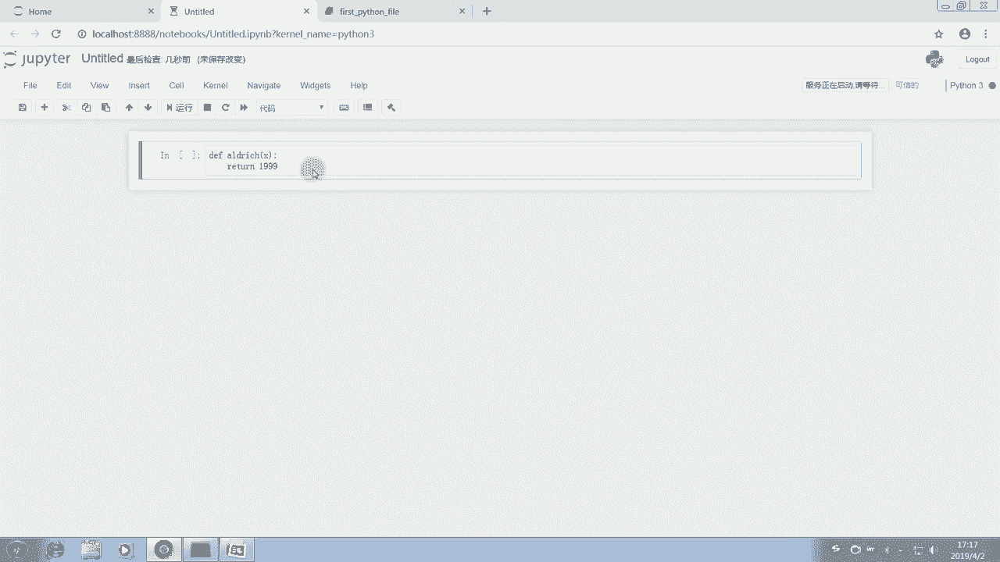

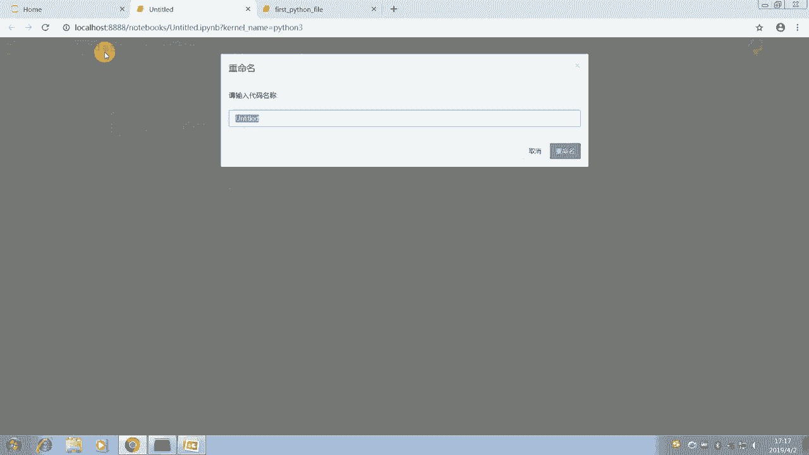

我们可以将常用的函数保存在单独的`.py`文件中，形成一个**模块**，以便在其他程序中重复导入使用。

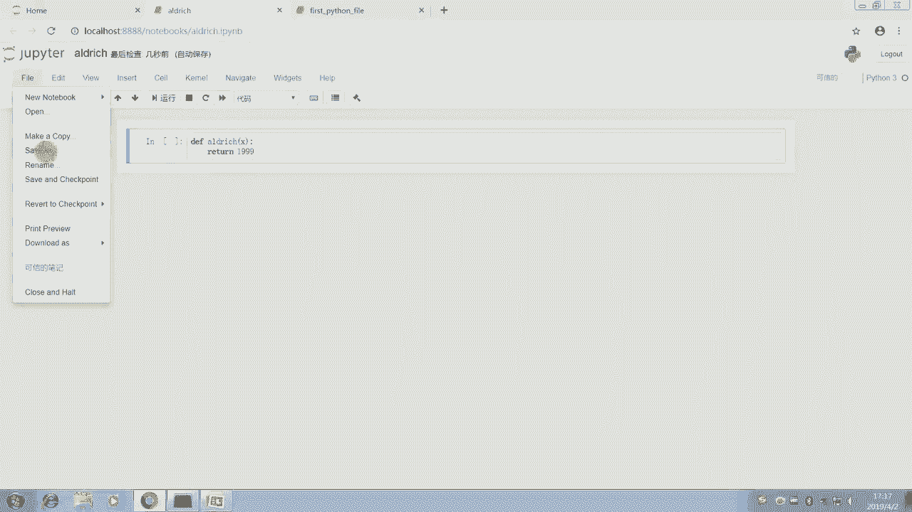

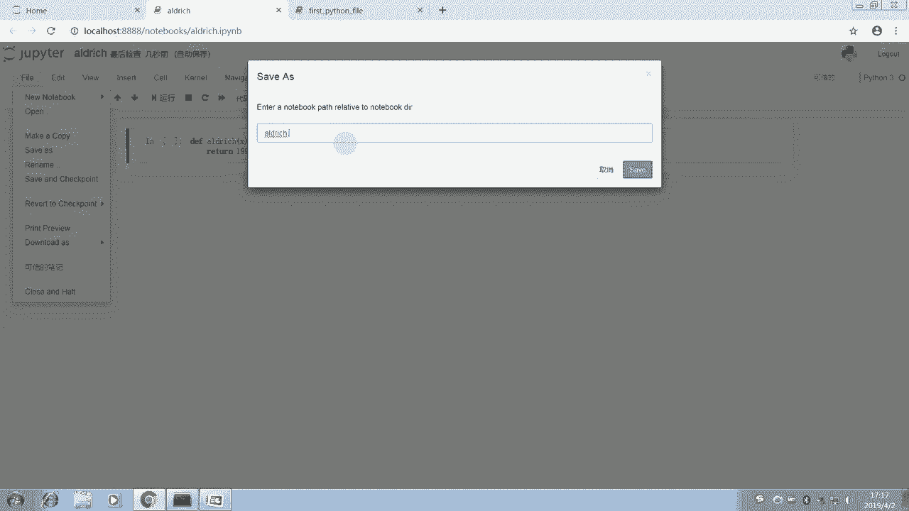

1.  创建一个新文件，例如 `my_functions.py`。
2.  在文件中定义你的函数：
    ```python
    # my_functions.py
    def calculate_average(number_list):
        """计算列表中数字的平均值"""
        if not number_list:  # 如果列表为空
            return 0
        return sum(number_list) / len(number_list)
    ```
3.  在另一个Python脚本或Jupyter Notebook中，使用`import`语句导入模块并使用其中的函数：
    ```python
    import my_functions

    data = [10, 20, 30, 40, 50]
    avg = my_functions.calculate_average(data)
    print(f"平均值是: {avg}")
    ```
使用`as`关键字可以为模块设置别名，这是非常常见的做法，尤其是对于名称较长的模块。
```python
import pandas as pd  # 导入pandas模块，并简称为 pd
import numpy as np   # 导入numpy模块，并简称为 np
```

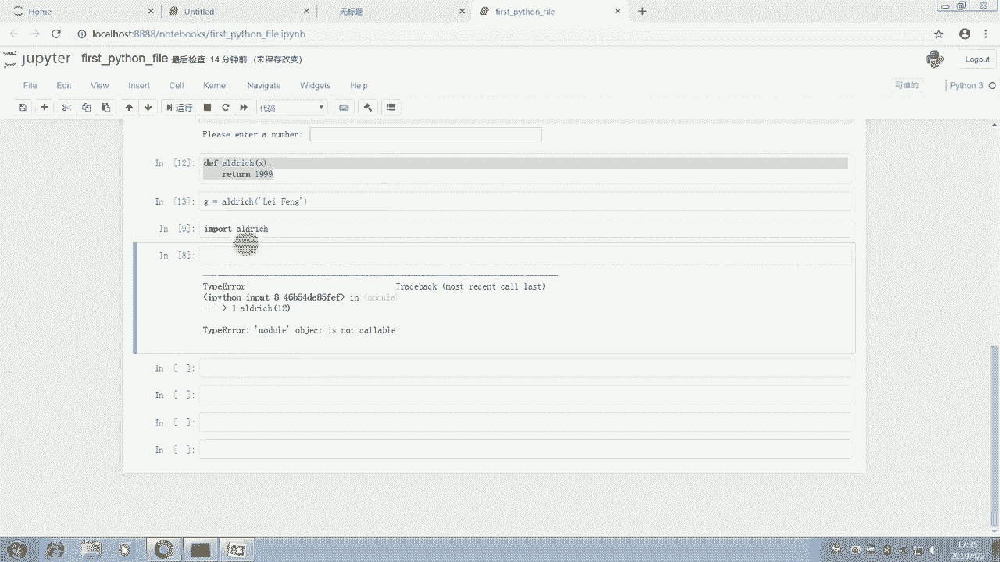

## Python内置函数简介

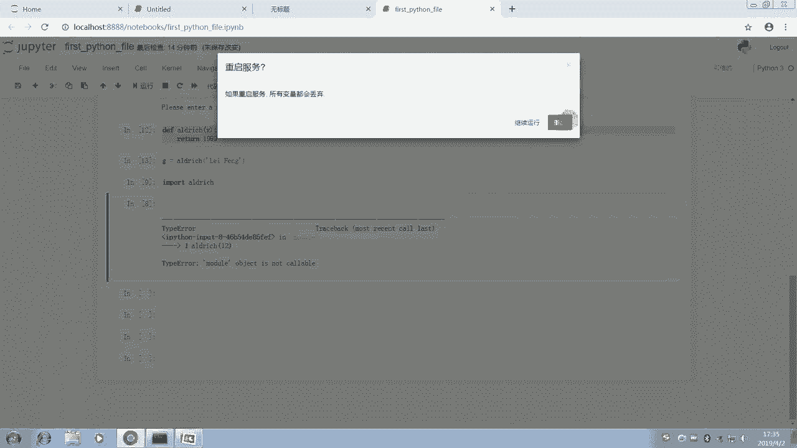

Python提供了许多内置函数，无需导入任何模块即可直接使用。这些函数能完成基础而重要的操作。

以下是部分常用的内置函数：
*   `abs(x)`: 返回数字`x`的绝对值。
*   `len(s)`: 返回对象（如字符串、列表、字典）`s`的长度或元素个数。
*   `int(x)`, `float(x)`, `str(x)`: 将`x`转换为整数、浮点数或字符串。
*   `type(obj)`: 返回对象`obj`的数据类型。
*   `input([prompt])`: 获取用户输入。
*   `print(*objects)`: 打印输出。
*   `range(stop)`: 生成一个整数序列。
*   `sum(iterable)`: 计算可迭代对象中所有元素的总和。
*   `help([object])`: 启动交互式帮助系统。例如，`help(print)`会显示`print`函数的用法说明。

要查看完整的内置函数列表和说明，可以查阅[Python官方文档](https://docs.python.org/3/library/functions.html)。

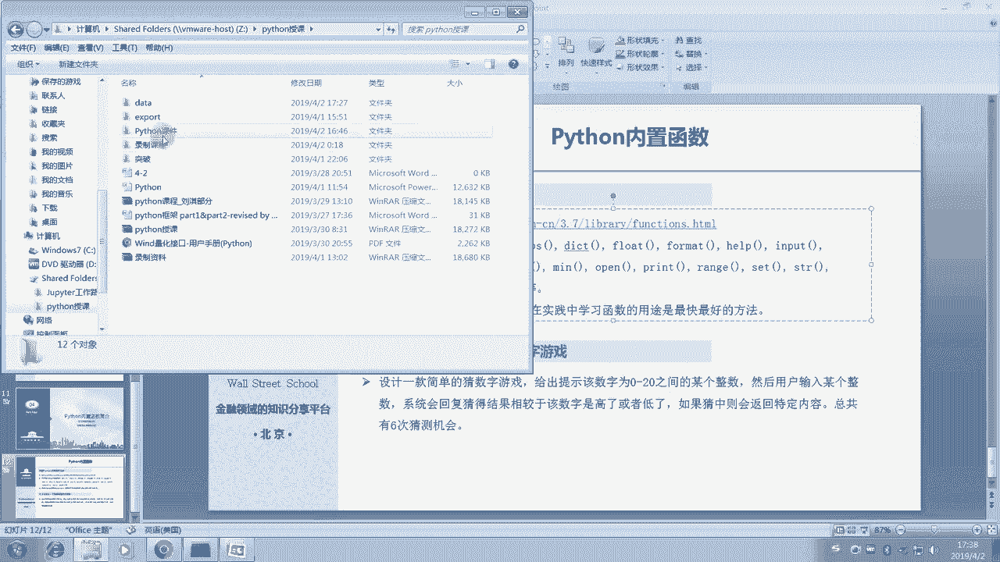

## 总结

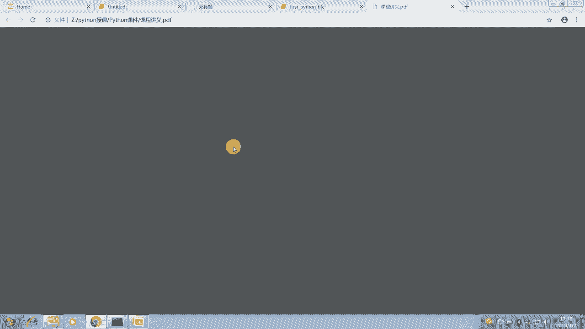

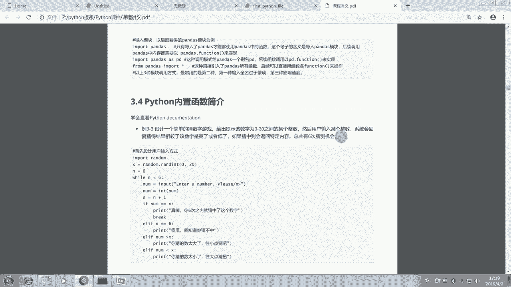

本节课中我们一起学习了Python程序的控制流核心概念。
我们首先掌握了**条件语句**（`if`/`elif`/`else`），它让程序能够根据不同条件执行不同的代码分支。
接着，我们深入探讨了两种**循环语句**：`for`循环用于遍历序列，执行确定次数的操作；`while`循环则在条件满足时持续运行，常用于需要反复交互或等待特定条件的场景。
然后，我们学习了如何通过`def`关键字**声明和调用函数**，将代码块封装成可重复使用的功能单元，并了解了如何将函数保存为独立的模块文件以便复用。
最后，我们简要介绍了Python丰富的**内置函数**，它们是编写高效代码的得力工具。
通过结合这些控制流工具，你已经可以编写出能够处理复杂逻辑和重复任务的Python程序了，这是迈向金融量化分析实践的重要一步。