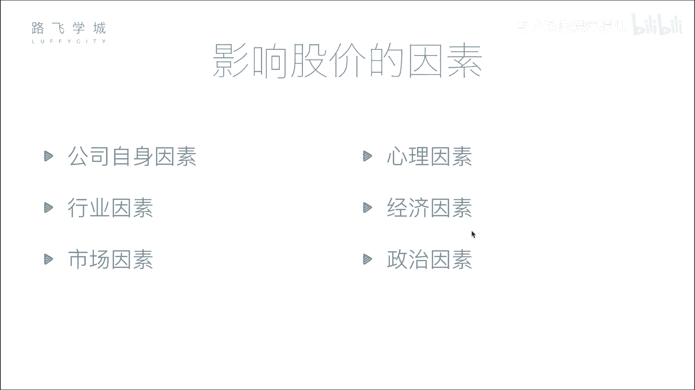
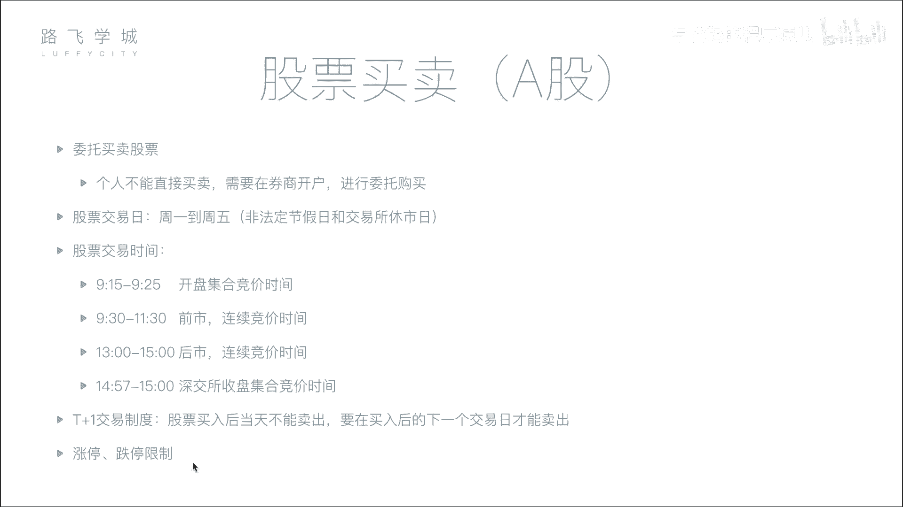

# Python金融量化：P4：04 影响股价因素与股票买卖知识 📈

在本节课中，我们将学习影响股票价格的主要因素，并了解股票买卖的基本流程与规则。理解这些基础知识是进行量化分析和策略制定的前提。

## 影响股价的六大因素

上一节我们介绍了股票的基本概念，本节中我们来看看哪些因素会决定股票价格的涨跌。影响股价的因素可以归纳为以下六点。

### 1. 公司自身因素
这是影响股价最根本的因素。公司的经营状况直接决定了其长期价值。例如，公司盈利增长、管理团队稳定、技术领先等正面因素会推动股价上涨；反之，重大丑闻、创始人离职或预期收益下降则会导致股价下跌。股票价格长期来看反映了公司的内在价值。

### 2. 市场因素
这是影响股价最直接的因素。股价的短期波动由市场的供求关系决定。当买盘多于卖盘（供不应求）时，股价上涨；当卖盘多于买盘（供过于求）时，股价下跌。这类似于任何商品的市场定价机制。

### 3. 行业因素
整个行业的发展前景会影响行业内所有公司的股价。如果某个行业（如人工智能）处于上升期，受到市场追捧，相关公司的股票通常会上涨。反之，如果某个行业（如传统IT）前景黯淡，其股票则可能普遍下跌。

### 4. 心理因素
投资者的情绪和非理性行为会加剧市场波动。例如，从众心理可能导致恐慌性抛售或盲目追涨。历史上著名的“黑色星期一”等市场崩盘事件，部分原因就是程序化交易错误引发了连锁的恐慌情绪。

### 5. 经济因素
国家层面的宏观经济政策和指标对股市有广泛影响。例如：
*   **利率**：存款利率上升，可能吸引资金从股市流向银行，导致市场资金减少，股价承压。
*   **货币政策、外汇汇率**等也会影响市场流动性和投资者信心。

### 6. 政治因素
国际关系、地区局势、政府政策等政治事件会显著影响市场。例如，地缘政治紧张局势（如军事摩擦）会引发市场恐慌，导致股市下跌，但可能刺激特定板块（如军工股）上涨。

## 股票买卖的基本流程与规则

了解了影响价格的因素后，我们来看看买卖股票的具体步骤和市场规则。

### 1. 开户与委托
个人投资者不能直接在交易所买卖股票，必须通过证券公司（券商）进行。流程如下：
1.  在券商处开设证券账户和资金账户。
2.  通过券商提供的系统（如交易软件）连接至交易所。
3.  提交买卖指令，这个过程称为“委托”。

### 2. 交易日与交易时间
股票交易所并非全天候营业。以下是A股市场的基本时间安排：

*   **交易日**：一般为每周一至周五（法定节假日除外）。
*   **交易时段**：每个交易日的上午和下午。具体可分为以下几个阶段：

以下是交易时段的具体划分：

*   **开盘集合竞价** (9:15 - 9:25)：此期间接受委托，但不立即成交。交易所会在9:25一次性对之前所有委托进行撮合，以产生当日的**开盘价**。撮合原则是**最大化成交量**。
*   **连续竞价** (9:30 - 11:30, 13:00 - 14:57)：这是主要交易时段。交易所系统几乎实时（例如每2-3秒）对买卖委托进行撮合成交。
*   **收盘集合竞价** (仅深圳交易所：14:57 - 15:00)：此期间提交的委托不立即处理，在15:00统一撮合，产生**收盘价**。上海交易所的收盘价为当日最后一笔连续竞价的成交价。

### 3. 交易制度：T+1与涨跌停限制
这两个重要规则我们在之前已提及，这里做简要回顾：

*   **T+1制度**：代码示例：`买入(T日)` -> `最早可卖出(T+1日)`。即当日买入的股票，最快下一个交易日才能卖出。
*   **涨跌停板制度**：公式表示：`涨停价 = 前收盘价 * (1 + 10%)`， `跌停价 = 前收盘价 * (1 - 10%)`。普通A股股票每日价格波动被限制在前一交易日收盘价的±10%以内。

---

本节课中我们一起学习了影响股票价格的六大因素（公司、市场、行业、心理、经济、政治），并梳理了股票买卖的核心流程与规则，包括开户委托、交易时间划分以及T+1、涨跌停板等基本制度。掌握这些知识是后续进行数据分析和量化建模的基础。