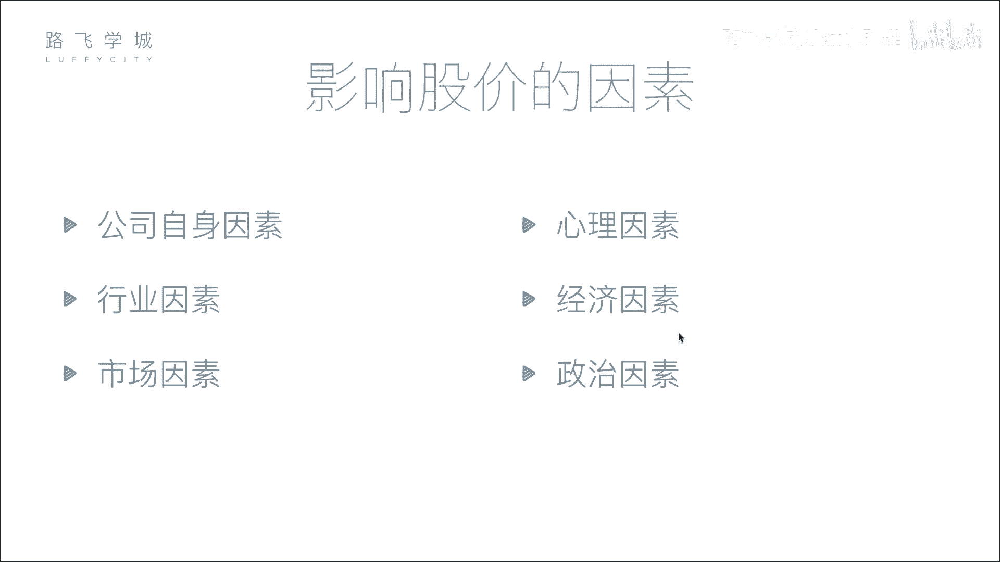
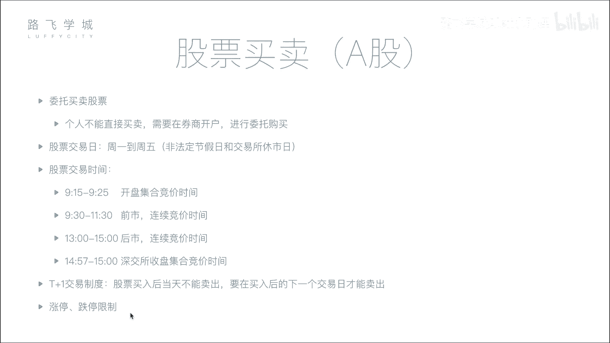

# Python金融量化：P4：04 影响股价因素与股票买卖知识 📈

在本节课中，我们将学习影响股票价格的主要因素，并了解股票买卖的基本流程与规则。理解这些基础知识是进行量化分析的前提。

## 影响股价的六大因素

上一节我们介绍了股票的基本概念，本节中我们来看看哪些因素会影响股票的价格。影响股价的因素可以归纳为以下六点。

### 1. 公司自身因素
这是影响股价最根本的因素。公司的经营状况直接决定了其内在价值。例如，公司盈利增长、前景看好，股价通常会上涨；反之，若公司出现重大丑闻或经营不善，股价则会下跌。股票价格长期来看是公司价值的体现。

### 2. 市场因素
这是影响股价最直接的因素。股价的短期波动由市场的供求关系决定。其核心逻辑是：
*   **买盘 > 卖盘**：供不应求，股价上涨。
*   **卖盘 > 买盘**：供过于求，股价下跌。

这类似于任何商品的市场规律。

### 3. 行业因素
整个行业的发展趋势会影响行业内所有公司的股价。例如，当人工智能行业成为热点时，相关公司的股票可能普遍上涨；如果某个行业前景黯淡，该行业的股票则可能集体下跌。

### 4. 心理因素
投资者的心理和情绪，尤其是从众心理，会加剧市场波动。例如，当看到有大额抛售时，其他投资者可能因恐慌而跟随抛售，导致股价非理性下跌。历史上因交易错误或恐慌情绪引发的“黑色星期一”等事件就是例证。

### 5. 经济因素
国家层面的宏观经济政策和指标会对股市产生整体影响。例如：
*   **利率上升**：可能导致资金从股市流向银行，市场资金减少，从而可能引起股价下跌。
*   **存款准备金率、外汇政策**等变化也会影响市场流动性。

### 6. 政治因素
国际或国内的政治事件、军事冲突等会引发市场不确定性，影响投资者信心。例如，地缘政治紧张局势可能导致股市大跌，而相关军工企业的股票则可能上涨。

---

## 股票买卖流程与规则

了解了影响股价的因素后，我们来看看实际操作中买卖股票的步骤和必须遵守的市场规则。

### 1. 开户与委托
个人不能直接进入交易所买卖股票，必须通过证券公司（券商）进行。流程如下：
1.  在券商处开设证券账户。
2.  通过券商提供的系统（如软件、电话）连接交易所。
3.  提交买卖指令，这个过程称为“委托”。

### 2. 交易日与交易时间
股票交易所并非全天候营业。以下是A股市场的主要时间安排：

*   **交易日**：一般为每周一至周五（法定节假日除外）。
*   **交易时段**：
    *   **开盘集合竞价**：9:15 - 9:25。此期间提交的委托单不会立即成交，交易所会在9:25一次性集中撮合，以产生当日的**开盘价**。其核心原则是**最大化成交量**。
    *   **连续竞价（早市）**：9:30 - 11:30。在此期间，系统对买卖申报进行**连续撮合**，成交几乎实时发生。
    *   **连续竞价（午市）**：13:00 - 14:57（上海）/ 14:57（深圳）。规则同早市。
    *   **收盘集合竞价（仅深圳）**：14:57 - 15:00。此期间提交的委托单会集中撮合，以产生**收盘价**。上海市场无此阶段，收盘价为最后一笔交易的成交价。

### 3. 交易制度
以下是两个重要的基础交易规则：

*   **T+1 制度**：当日（T日）买入的股票，需到下一个交易日（T+1日）才能卖出。目的是抑制过度投机。
*   **涨跌停板限制**：为防止股价过度波动，A股市场设有每日价格涨跌幅限制（通常为±10%）。股价达到涨跌停板时，交易可能受限。

---

本节课中我们一起学习了影响股票价格的六大因素（公司、市场、行业、心理、经济、政治），并掌握了股票买卖的基本流程、交易时间以及T+1、涨跌停板等核心规则。这些知识是构建量化分析策略的重要基础。