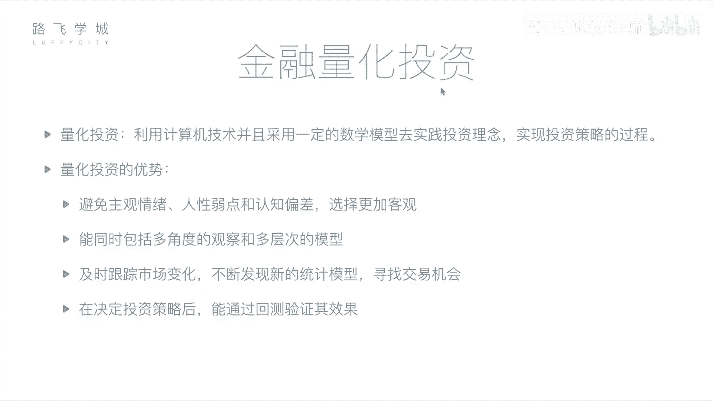
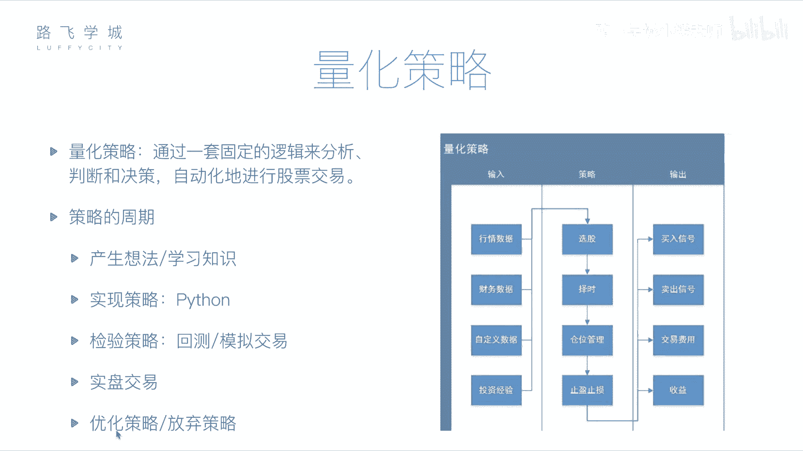

# Python金融量化分析：P4：06：金融量化投资介绍 📈

在本节课中，我们将要学习金融量化投资的核心概念。我们将了解什么是量化投资，它与传统投资方式的区别，以及构成一个量化策略的基本要素。通过本课的学习，你将建立起对金融量化分析的基本认知框架。

## 量化投资的概念 💡

上一节我们介绍了金融分析的基本面与技术面方法。本节中我们来看看如何将这些分析过程自动化。

金融分析是通过基本面或技术面对公司及股票做出判断。这个判断过程可以交给计算机来完成。因为基本面分析所需的财务报表，以及技术面分析所需的历史价格和交易记录，都可以被获取。将这些分析过程交由计算机处理，就称为**量化投资**或**量化分析**。

所谓量化投资，是指利用计算机技术，并采用一定的数学模型，去实践投资理念、实现投资策略的过程。量化投资包含三个重要部分：
1.  **计算机技术**：即使用计算机编程的方式。
2.  **数学模型**：即一些策略和套路，例如均线就是一个数学模型，其公式为 `MA = (P1 + P2 + ... + Pn) / n`。
3.  **实践**：用编写好的计算机程序去真实投资或预先尝试，以检验策略的可靠性。

## 量化投资的优势 🚀

相较于人工投资，量化投资具有以下优势：

以下是量化投资的主要优点：

1.  **避免主观情绪**：可以避免人性弱点（如不舍得止损）和认知偏差，使选择更加客观。
2.  **处理海量信息**：计算机能够同时从多角度、多层次分析大量数据，例如同时分析多只股票的均线、财报等，速度远超人类。
3.  **及时跟踪市场**：程序可以持续监测市场变化，及时发现交易机会，反应比人工更迅速。同时，也便于尝试和集成新的策略（如机器学习模型）。
4.  **回测验证策略**：在实盘交易前，可以通过历史数据回测策略效果。例如，用2012年至2017年的数据检验一个策略，判断其是否盈利，从而降低风险。

## 量化策略的核心构成 ⚙️

量化交易的核心是量化策略，即你的投资“套路”。一个完整的策略主要包括输入、处理逻辑和输出。

以下是量化策略需要处理的数据输入：

*   **行情数据**：股票历史交易数据，如每日的开盘价、收盘价、交易量等。
*   **财务数据**：各公司的财务报表数据。
*   **自定义数据**：例如通过自然语言处理分析的新闻舆情数据，甚至是个人总结的投资经验。

策略逻辑主要做以下四件事：

1.  **选股**：从众多股票中筛选出要投资的目标。
2.  **择时**：决定买入和卖出的具体时间点，旨在低买高卖。
3.  **仓位管理**：决定资金在不同股票间的分配比例。
4.  **止盈止损**：设置盈利和亏损的阈值，达到条件时自动卖出，以控制风险和保护收益。

策略执行后会产生以下输出：

*   **交易信号**：生成买入或卖出指令，可以提示用户或自动发送给券商系统。
*   **交易费用与收益**：计算本次交易产生的手续费、佣金等成本，以及最终的盈亏结果和各项收益指标。

## 量化策略的开发周期 🔄

一个量化策略从构思到应用，通常会经历一个完整的周期。

以下是量化策略从开发到应用的典型流程：

1.  **产生想法**：基于投资经验或新学的指标，形成策略思路。
2.  **程序实现**：使用编程语言（如Python）将想法转化为可执行的程序。
3.  **回测检验**：使用历史数据验证策略在过去的表现。
4.  **模拟交易**：使用当前实时数据进行模拟交易，进一步检验策略在近期市场的有效性。
5.  **实盘交易/优化**：策略通过检验后，可用于实盘投资。也可以根据回测或模拟结果对策略进行优化调整，或放弃无效策略。

本节课中我们一起学习了金融量化投资的基础知识，包括其定义、优势、核心策略构成以及开发流程。从下一节课开始，我们将介绍如何使用Python及其相关数据分析模块，来具体实现这些量化策略。