# Python金融量化：P40：第一个量化策略-1 🚀

## 概述
在本节课中，我们将学习如何在一个量化交易平台上编写第一个简单的量化策略。我们将从设置股票池开始，逐步介绍平台的基本函数和API使用方法，目标是让大家熟悉量化策略的基本框架和编写流程。

## 股票池设置：沪深300成分股

上一节我们介绍了课程目标，本节中我们来看看如何设置策略操作的股票范围。

首先，我们需要设置股票池为沪深300的所有成分股。沪深300指数是从上海和深圳两个证券交易所中，选取有代表性的300只股票编制而成的指数。这300只股票能够较好地代表整个A股市场的走势。我们的策略将只对这300只股票进行操作，而不是全市场所有股票。

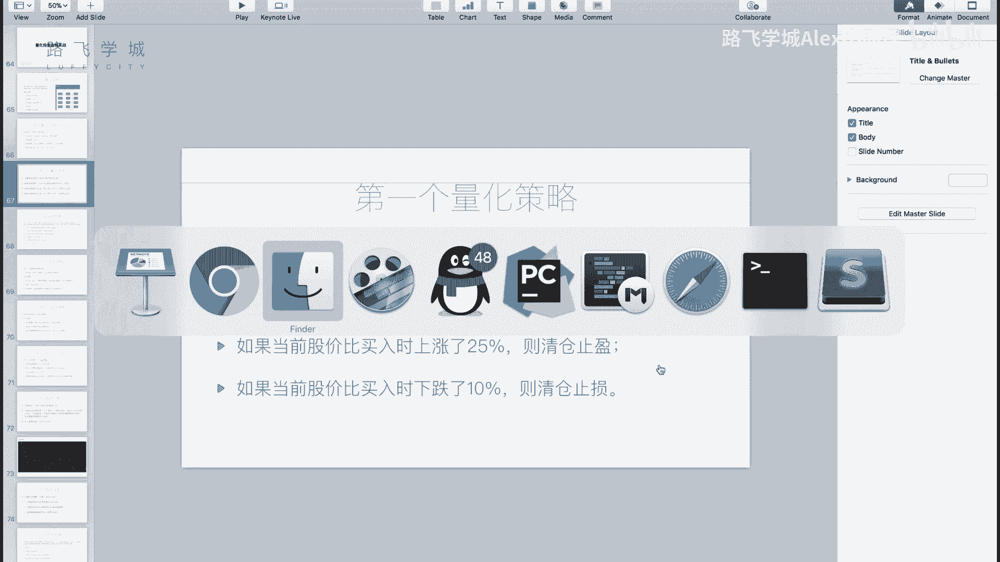

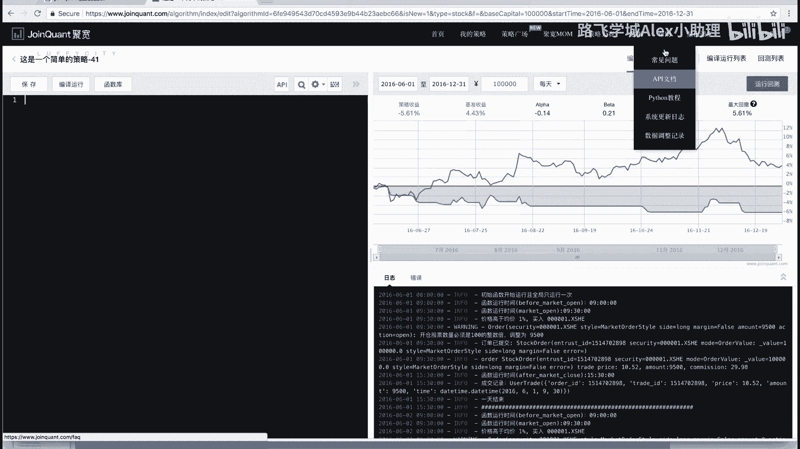

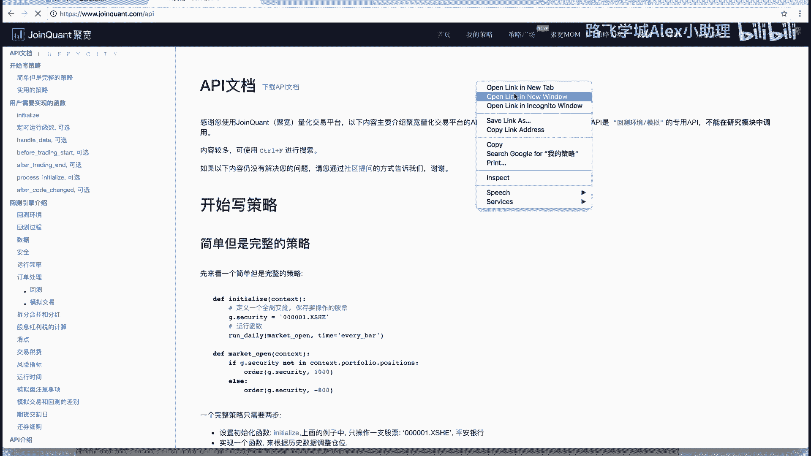

需要注意的是，沪深300的成分股并非一成不变，它会定期调整，以反映市场的变化。

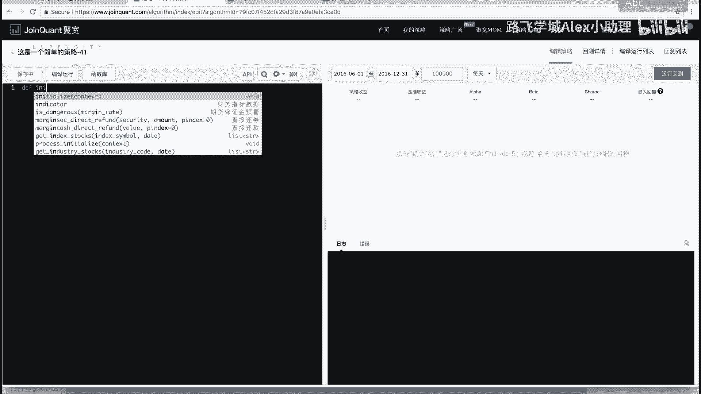

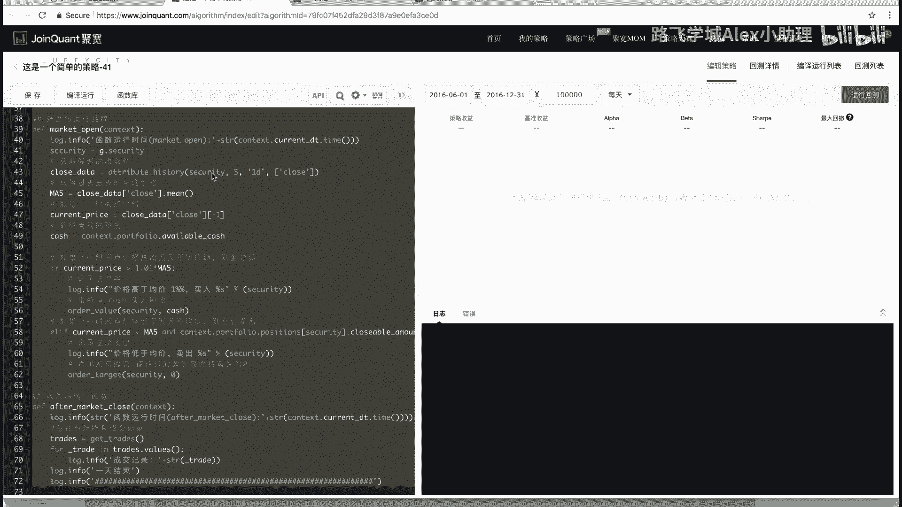

## 策略逻辑说明

在明确了操作范围后，我们来看看具体的交易策略是什么。这是一个基于价格和持仓状态的简单策略。

策略规则如下：
1.  **买入条件**：如果某只股票的当前股价低于10元，并且当前没有持有该股票，则买入。
2.  **卖出条件**：分为两种情况：
    *   **止盈**：如果当前股价相比买入成本上涨了25%，则清仓卖出，锁定利润。
    *   **止损**：如果当前股价相比买入成本下跌了10%，则清仓卖出，控制亏损。

这个策略的核心思想是“低价买入，设定盈利目标和亏损底线”。

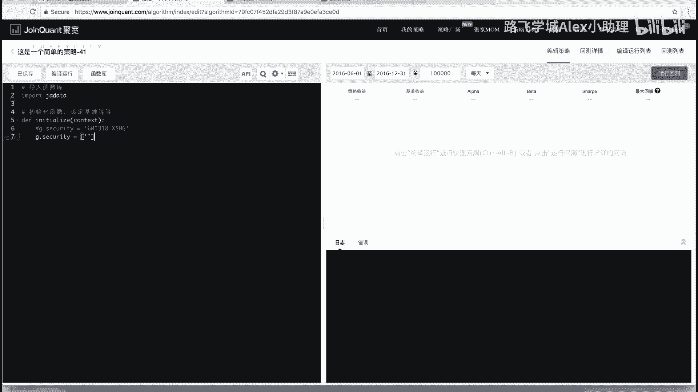

## 初始化函数详解

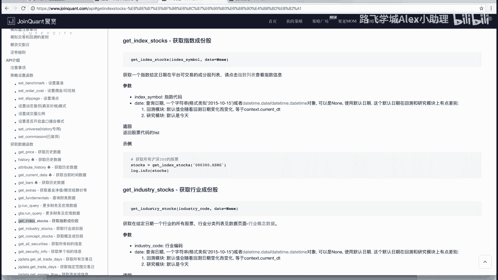

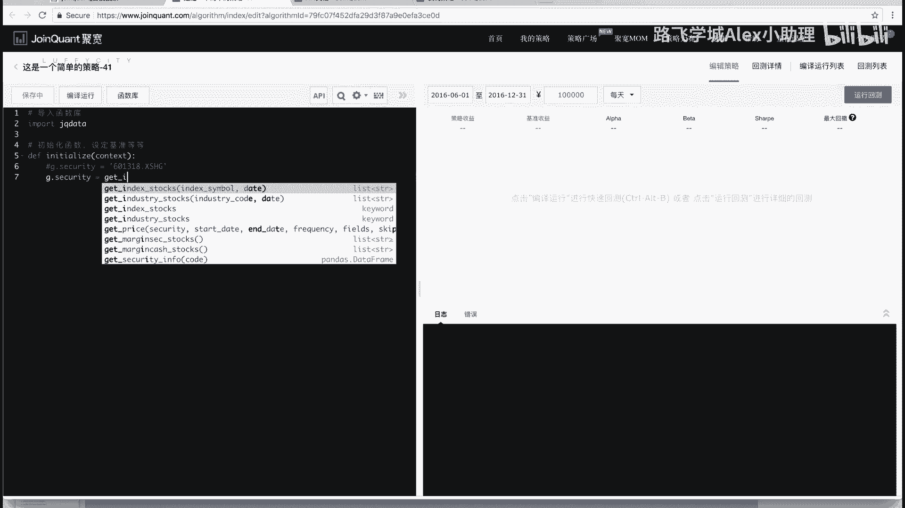

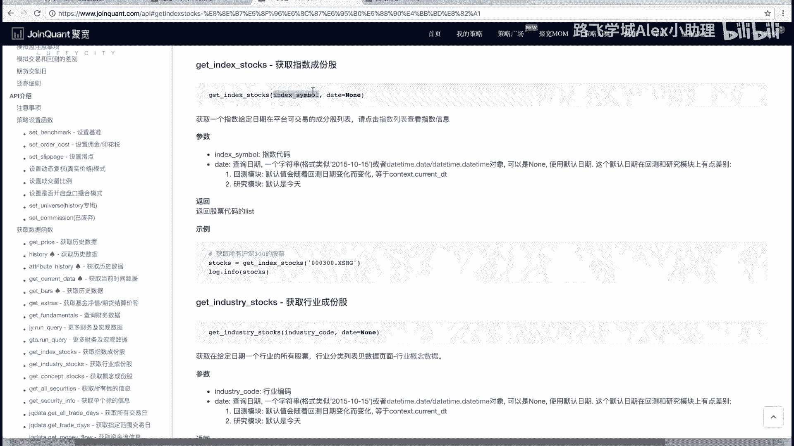

理解了策略逻辑后，我们开始动手编写代码。量化平台通常要求我们编写两个主要函数。第一个是初始化函数 `initialize`，它在回测开始前执行一次，用于进行全局设置。

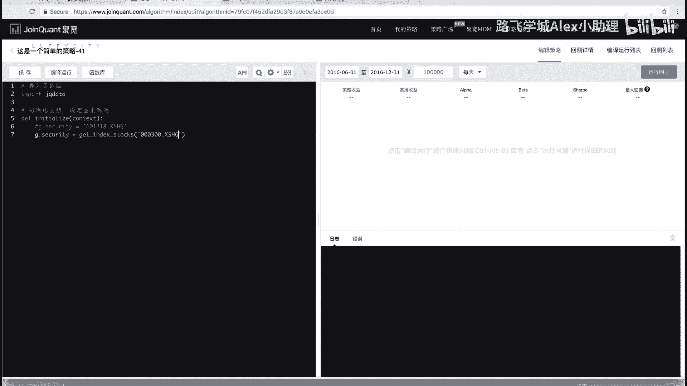

以下是初始化函数中需要完成的关键步骤：

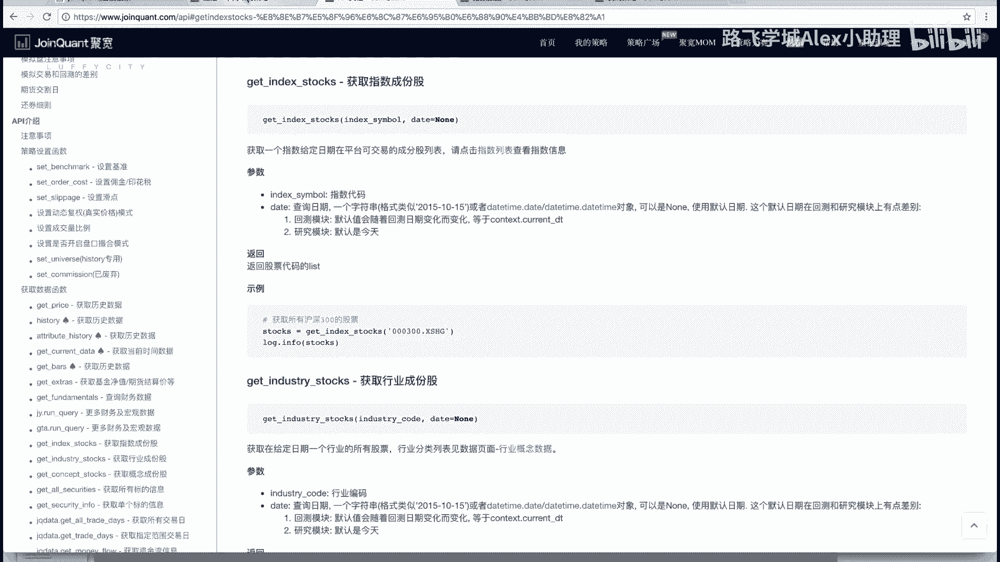

### 1. 获取并存储股票池
我们需要获取沪深300指数的成分股列表，并将其存储起来，以便在后续的每日交易中调用。平台提供了一个全局上下文对象 `g` 来存储这类跨函数使用的数据。

```python
# 获取沪深300指数成分股代码列表
g.security = get_index_stocks('000300.XSHG')
# 打印股票池，查看结果（输出在日志中）
log.info(g.security)
```
*   `get_index_stocks(‘000300.XSHG’)`：这是一个API函数，用于获取指定指数代码的成分股列表。`000300.XSHG` 是沪深300指数的代码。
*   `g.security`：我们将获取到的股票列表赋值给全局对象 `g` 的一个自定义属性 `security`。这样在策略的其他部分就能访问到这个列表。
*   `log.info()`：用于打印日志，帮助调试和查看数据。

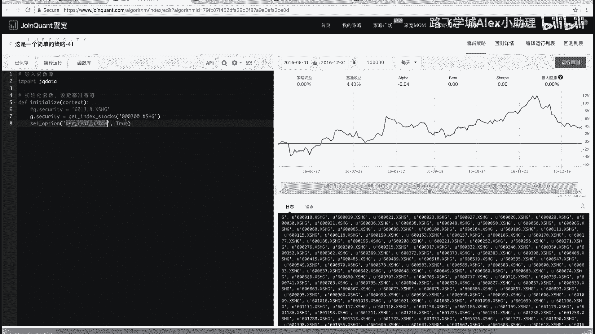

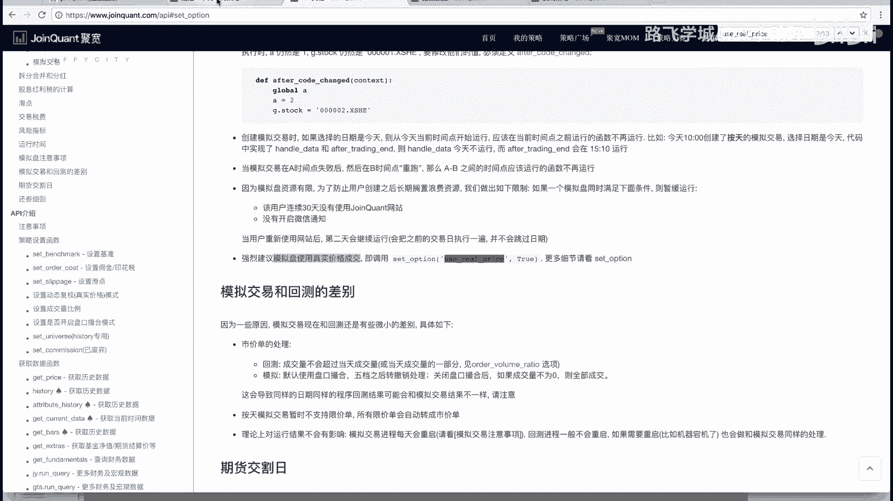

### 2. 设置交易选项
接下来，我们需要设置一些影响回测行为的全局选项。

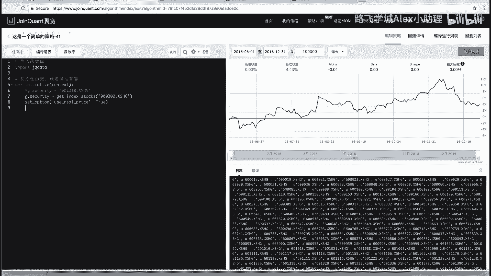

```python
# 使用真实价格进行回测（涉及复权处理，保证价格连续性）
set_option('use_real_price', True)
```
这行代码设置了使用真实价格进行回测计算，它通常会自动处理股票除权除息带来的价格跳空问题，对于初学者，记住加上这一行即可。

### 3. 设置交易成本
真实的股票交易会产生手续费，在回测中必须考虑这一点，结果才更贴近现实。

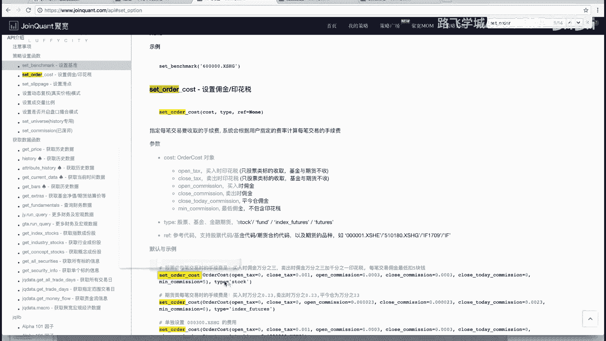

```python
# 设置股票交易的手续费和印花税
set_order_cost(OrderCost(open_tax=0, close_tax=0.001, open_commission=0.0003, close_commission=0.0003, close_today_commission=0, min_commission=5), type='stock')
```
以下是各项参数的含义：
*   `open_tax=0`：买入时印花税为0。
*   `close_tax=0.001`：卖出时印花税为0.1%（千分之一）。
*   `open_commission=0.0003`：买入时佣金为0.03%（万分之三）。
*   `close_commission=0.0003`：卖出时佣金为0.03%（万分之三）。
*   `min_commission=5`：每笔交易佣金最低为5元。
*   `type=’stock’`：交易类型为股票。

这些设置模拟了A股市场常见的费用结构。对于这个策略，我们直接使用这段固定代码即可。

## 总结
本节课中我们一起学习了量化策略的起步工作。我们首先定义了策略的股票池（沪深300成分股）和简单的“低买高卖，设好止损止盈”的交易逻辑。然后，我们重点讲解了初始化函数 `initialize` 的编写，包括：
1.  使用 `get_index_stocks` API获取股票池。
2.  使用全局对象 `g` 存储策略数据。
3.  通过 `set_option` 设置回测选项。
4.  通过 `set_order_cost` 设置交易成本，使回测更真实。

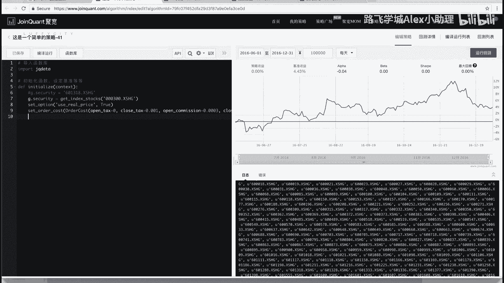

至此，策略的初始化设置已经完成。在下一个视频中，我们将进入核心部分：编写每日执行的交易逻辑函数，实现具体的买入和卖出操作。